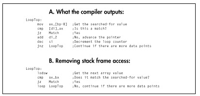

  ------------------------ --------------------------------- --------------------
  [Previous](08-01.html)   [Table of Contents](index.html)   [Next](08-03.html)
  ------------------------ --------------------------------- --------------------

### Stack Frames Slow So Much {#Heading5}

C compilers work within the stack frame model, whereby variables reside
in a block of stack memory and are accessed via offsets from BP.
Compilers may store a couple of variables in registers and may briefly
keep other variables in registers when they're used repeatedly, but the
stack frame is the underlying architecture. It's a nice architecture;
it's flexible, convenient, easy to program, and makes for fairly compact
code. However, stack frames have a few drawbacks. They must be
constructed and destroyed, which takes both time and code. They are so
easy to use that they tend to bias the assembly language programmer in
favor of accessing memory variables more often than might be necessary.
Finally, you cannot use BP as a general-purpose register if you intend
to access a stack frame, and having that seventh register available is
sometimes useful indeed.

That doesn't mean you shouldn't use stack frames, which are useful and
often necessary. Just don't fall victim to their undeniable charms.

### Torn Between Two Segments {#Heading6}

C compilers are not terrific at handling segments. Some compilers can
efficiently handle a single far pointer used in a loop by leaving ES set
for the duration of the loop. But two far pointers used in the same loop
confuse every compiler I've seen, causing the full segment:offset
address to be reloaded each time either pointer is used.

  ------------------- ------------------------------------------------------------------------------------------------------------------------------------------------------------------------------------------------------------------------------------
     *This particularly affects performance in 286 protected mode (under OS/2 1.X or the Rational DOS Extender, for example) because segment loads in protected mode take a minimum of 17 cycles, versus a mere 2 cycles in real mode.*
  ------------------- ------------------------------------------------------------------------------------------------------------------------------------------------------------------------------------------------------------------------------------

In assembly language you have full control over segments. Use it, and,
if necessary, reorganize your code to minimize segment loading.

#### Why Speeding Up Is Hard to Do {#Heading7}

You might think that the most obvious advantage assembly language has
over C is that it allows the use of all forms of instructions and all
registers in all ways, whereas C compilers tend to use a subset of
registers and instructions in a limited number of ways. Yes and no. It's
true that C compilers typically don't generate instructions such as
**XLAT,** rotates, or the string instructions. On the other hand,
**XLAT** and rotates are useful in a limited set of circumstances, and
string instructions *are* used in the C library functions. In fact, C
library code is likely to be carefully optimized by experts, and may be
much better than equivalent code you'd produce yourself.

Am I saying that C compilers produce better code than you do? No, I'm
saying that they *can,* unless you use assembly language properly.
Writing code in assembly language rather than C guarantees nothing.

  ------------------- ----------------------------------------------------------------------------------------------------------------------------------------------------------------------------------------------------------------------------------------
     *You can write good assembly, bad assembly, or assembly that is virtually indistinguishable from compiled code; you are more likely than not to write the latter if you think that optimization consists of tweaking compiled C code.*
  ------------------- ----------------------------------------------------------------------------------------------------------------------------------------------------------------------------------------------------------------------------------------

Sure, you can probably use the registers more efficiently and take
advantage of an instruction or two that the compiler missed, but the
code isn't going to get a whole lot faster that way.

True optimization requires rethinking your code to take advantage of
assembly language. A C loop that searches through an integer array for
matches might compile

\
 **Figure 8.1**  *Tweaked compiler output for a loop.*

to something like Figure 8.1A. You might look at that and tweak it to
the code shown in Figure 8.1B.

Congratulations! You've successfully eliminated all stack frame access,
you've used **LOOP** (although **DEC SI/JNZ** is actually faster on 386
and later machines, as I explained in the last chapter), and you've used
a string instruction. Unfortunately, the new code isn't going to run
very much faster. Maybe 25 percent faster, maybe a little more. Big
deal. You've eliminated the trappings of the compiler—the stack frame
and the restricted register usage—but you're still *thinking* like the
compiler. Try this:

    repnz scasw
    jz    Match

It's a simple example—but, I hope, a convincing one. Stretch your brain
when you optimize.

### Taking It to the Limit {#Heading8}

The ultimate in assembly language optimization comes when you change the
rules; that is, when you reorganize the entire program to allow the use
of better assembly language code in the small section of code that most
affects overall performance. For example, consider that the data
searched in the last example is stored in an array of structures, with
each structure in the array containing other information as well. In
this situation, **REP SCASW** couldn't be used because the data searched
through wouldn't be contiguous.

However, if the need for performance in searching the array is urgent
enough, there's no reason why you can't reorganize the data. This might
mean removing the array elements from the structures and storing them in
their own array so that **REP SCASW** *could* be used.

  ------------------- ----------------------------------------------------------------------------------------------------------------------------------------------------------------------------------------------------------------------------------------------------------------------------------------------------------------------------------------------------------
     *Organizing a program's data so that the performance of the critical sections can be optimized is a key part of design, and one that's easily shortchanged unless, during the design stage, you thoroughly understand and work to bring together your data needs, the critical sections of your program, and potential assembly language optimizations.*
  ------------------- ----------------------------------------------------------------------------------------------------------------------------------------------------------------------------------------------------------------------------------------------------------------------------------------------------------------------------------------------------------

More on this shortly.

To recap, here are some things to look for when striving to convert C
code into optimized assembly language:

-   Move the entire performance-critical section into a single assembly
    language function.
-   Don't use calls or stack frame accesses inside the critical code, if
    possible, and avoid unnecessary memory accesses of any kind.
-   Change segments as infrequently as possible.
-   Optimize in terms of what assembly does well, *not* in terms of
    fine-tuning compiled C code.
-   Change the rules to the benefit of assembly, if necessary; for
    example, reorganize data structto allow efficient assembly language
    processing.

That said, let me show some of these precepts in action.

#### A C-to-Assembly Case Study {#Heading9}

Listing 8.1 is the sample C application I'm going to use to examine
optimization in action. Listing 8.1 isn't really complete—it doesn't
handle the "no-matches" case well, and it assumes that the sum of all
matches will fit into an **int—**but it will do just fine as an
optimization example.

  ------------------------ --------------------------------- --------------------
  [Previous](08-01.html)   [Table of Contents](index.html)   [Next](08-03.html)
  ------------------------ --------------------------------- --------------------

* * * * *

Graphics Programming Black Book © 2001 Michael Abrash
