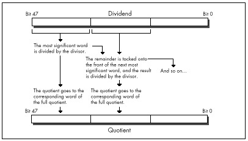

You'll notice that in Listing 9.2 I didn't use a table of character
frequencies in English text to determine the character for which to
scan, but rather let the caller make that choice. Each buffer of bytes
has unique characteristics, and English-letter frequency could well be
inappropriate. What if the buffer is filled with French text? Cyrillic?
What if it isn't text that's being searched? It might be worthwhile for
an application to build a dynamic frequency table for each buffer so
that the best scan character could be chosen for each search. Or perhaps
not, if the search isn't time-critical or the buffer is small.

The point is that you can improve performance dramatically by
understanding the nature of the data with which you work. (This is
equally true for high-level language programming, by the way.) Listing
9.2 is very similar to and only slightly more complex than Listing 9.1;
the difference lies not in elbow grease or cycle counting but in the
organic integrating optimizer technology we all carry around in our
heads.

#### Short Sorts {#Heading7}

David Stafford (recently of Borland and Borland Japan) who happens to be
one of the best assembly language programmers I've ever met, has written
a C-callable routine that sorts an array of integers in ascending order.
That wouldn't be particularly noteworthy, except that David's routine,
shown in Listing 9.4, is exactly *25 bytes* long. Look at the code;
you'll keep saying to yourself, "But this doesn't work...oh, yes, I
guess it does." As they say in the Prego spaghetti sauce ads, *it's in
there*—and what a job of packing. Anyway, David says that a 24-byte sort
routine eludes him, and he'd like to know if anyone can come up with
one.

**LISTING 9.4 L9-4.ASM**

    .
    ;--------------------------------------------------------------------------
    ; Sorts an array of ints.  C callable (small model).  25 bytes.
    ; void sort( int num, int a[] );
    ;
    ; Courtesy of David Stafford.
    ;--------------------------------------------------------------------------

          .model small
          .code
            public _sort

    top:    mov     dx,[bx]         ;swap two adjacent integers
            xchg    dx,[bx+2]
            xchg    dx,[bx]
            cmp     dx,[bx]         ;did we put them in the right order?
            jl      top             ;no, swap them back
            inc     bx              ;go to next integer
            inc     bx
            loop    top
    _sort:  pop     dx              ;get return address (entry point)
            pop     cx              ;get count
            pop     bx              ;get pointer
            push    bx              ;restore pointer
            dec     cx              ;decrement count
            push    cx              ;save count
            push    dx              ;restore return address
            jg      top             ;if cx > 0

            ret

          end

#### Full 32-Bit Division {#Heading8}

One of the most annoying limitations of the x86 is that while the
dividend operand to the **DIV** instruction can be 32 bits in size, both
the divisor and the result must be 16 bits. That's particularly annoying
in regards to the result because sometimes you just don't know whether
the ratio of the dividend to the divisor is greater than 64K-1 or
not—and if you guess wrong, you get that godawful Divide By Zero
interrupt. So, what is one to do when the result might not fit in 16
bits, or when the dividend is larger than 32 bits? Fall back to a
software division approach? That will work—but oh so slowly.

There's another technique that's much faster than a pure software
approach, albeit not so flexible. This technique allows arbitrarily
large dividends and results, but the divisor is still limited to16 bits.
That's not perfect, but it does solve a number of problems, in
particular eliminating the possibility of a Divide By Zero interrupt
from a too-large result.

This technique involves nothing more complicated than breaking up the
division into word-sized chunks, starting with the most significant word
of the dividend. The most significant word is divided by the divisor
(with no chance of overflow because there are only 16 bits in each);
then the remainder is prepended to the next 16 bits of dividend, and the
process is repeated, as shown in Figure 9.3. This process is equivalent
to dividing by hand, except that here we stop to carry the remainder
manually only after each word of the dividend; the hardware divide takes
care of the rest. Listing 9.5 shows a function to divide an arbitrarily
large dividend by a 16-bit divisor, and Listing 9.6 shows a sample
division of a large dividend. Note that the same principle can be
applied to handling arbitrarily large dividends in 386 native mode code,
but in that case the operation can proceed a dword, rather than a word,
at a time.

\
 **Figure 9.3**  *Fast multiword division on the 386.*

As for handling signed division with arbitrarily large dividends, that
can be done easily enough by remembering the signs of the dividend and
divisor, dividing the absolute value of the dividend by the absolute
value of the divisor, and applying the stored signs to set the proper
signs for the quotient and remainder. There may be more clever ways to
produce the same result, by using **IDIV**, for example; if you know of
one, drop me a line c/o Coriolis Group Books.