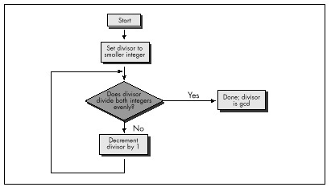

Not so nowadays, though. Computers love boring work; they're very
patient and disciplined, and, besides, one human year = seven dog years
= two zillion computer years. So when we're faced with a problem that
has an obvious but exceedingly lengthy solution, we're apt to say, "Ah,
let the computer do that, it's fast," and go back to making paper
airplanes. Unfortunately, brute-force solutions tend to be slow even
when performed by modern-day microcomputers, which are capable of
several MIPS except when I'm late for an appointment and want to finish
a compile and run just one more test before I leave, in which case the
crystal in my computer is apparently designed to automatically revert to
1 Hz.)

The solution that I instantly came up with to finding the GCD is about
as brute- force as you can get: Divide both the larger integer (iL) and
the smaller integer (iS) by every integer equal to or less than the
smaller integer, until a number is found that divides both evenly, as
shown in Figure 10.1. This works, but it's a lousy solution, requiring
as many as iS\*2 divisions; *very* expensive, especially for large
values of iS. For example, finding the GCD of 30,001 and 30,002 would
require 60,002 divisions, which alone, disregarding tests and branches,
would take about 2 seconds on an 8088, and more than 50 milliseconds
even on a 25 MHz 486—a *very* long time in computer years, and not
insignificant in human years either.

Listing 10.1 is an implementation of the brute-force approach to GCD
calculation. Table 10.1 shows how long it takes this approach to find
the GCD for several integer pairs. As expected, performance is extremely
poor when iS is large.

\
 **Figure 10.1**  *Using a brute-force algorithm to find a GCD.*

* * * * *

Integer pairs for which to find GCD

90 & 27

42 & 998

453 & 121

27432 & 165

27432 & 17550

* * * * *

**Listing 10.1**\
 (Brute force)

60µs\
 (100%)

110µs\
 (100%)

311ms\
 (100%)

426µs\
 (100%)

43580µs\
 (100%)

**Listing 10.2**\
 (Subtraction)

25\
 (42%)

72\
 (65%)

67\
 (22%)

280\
 (66%)

72\
 (0.16%)

**Listing 10.3**\
 (Division: code recursive\
 Euclid's algorithm)

20\
 (33%)

33\
 (30%)

48\
 (15%)

32\
 (8%)

53\
 (0.12%)

**Listing 10.4**\
 (C version of data recursive Euclid's algorithm; normal optimization)

12\
 (20%)

17\
 (15%)

25\
 (8%)

16\
 (4%)

26\
 (0.06%)

**Listing 10.4**\
 (/Ox = maximumoptimization)

12\
 (20%)

16\
 (15)

20\
 (6%)

15\
 (4%)

23\
 (0.05%)

**Listing 10.5**\
 (Assembly version of data recursive Euclid's algorithm)

10\
 (17%)

10\
 (9%)

15\
 (5%)

10\
 (2%)

17\
 (0.04%)

**Note:** Performance of Listings 10.1 through 10.5 in finding the
greatest common divisors of various pairs of integers. Times are in
microseconds. Percentages represent execution time as a percentage of
the execution time of Listing 10.1 for the same integer pair. Listings
10.1-10.4 were compiled with Microsoft C /C++ except as noted, the
default optimization was used. All times measured with the Zen timer
(from Chapter 3) on a 20 MHz cached 386.

* * * * *

Table 10.1 Performance of GCD algorithm implementations.

* * * * *

**LISTING 10.1 L10-1.C**

    /* Finds and returns the greatest common divisor of two positive
       integers. Works by trying every integral divisor between the
       smaller of the two integers and 1, until a divisor that divides
       both integers evenly is found. All C code tested with Microsoft
       and Borland compilers.*/

    unsigned int gcd(unsigned int int1, unsigned int int2) {
       unsigned int temp, trial_divisor;
       /* Swap if necessary to make sure that int1 >= int2 */
       if (int1 < int2) {
          temp = int1;
          int1 = int2;
          int2 = temp;
       }
       /* Now just try every divisor from int2 on down, until a common
          divisor is found. This can never be an infinite loop because
          1 divides everything evenly */
       for (trial_divisor = int2; ((int1 % trial_divisor) != 0) ||
             ((int2 % trial_divisor) != 0); trial_divisor—)
          ;
       return(trial_divisor);
    }

#### Wasted Breakthroughs {#Heading5}

Sedgewick's first solution to the GCD problem was pretty much the one I
came up with. He then pointed out that the GCD of iL and iS is the same
as the GCD of iL-iS and iS. This was obvious (once Sedgewick pointed it
out); by the very nature of division, any number that divides iL evenly
nL times and iS evenly nS times must divide iL-iS evenly nL-nS times.
Given that insight, I immediately designed a new, faster approach, shown
in Listing 10.2.

**LISTING 10.2 L10-2.C**

    /* Finds and returns the greatest common divisor of two positive
       integers. Works by subtracting the smaller integer from the
       larger integer until either the values match (in which case
       that's the gcd), or the larger integer becomes the smaller of
       the two, in which case the two integers swap roles and the
       subtraction process continues. */

    unsigned int gcd(unsigned int int1, unsigned int int2) {
       unsigned int temp;
       /* If the two integers are the same, that's the gcd and we're
          done */
       if (int1 == int2) {
          return(int1);
       }
       /* Swap if necessary to make sure that int1 >= int2 */
       if (int1 < int2) {
          temp = int1;
          int1 = int2;
          int2 = temp;
       }

       /* Subtract int2 from int1 until int1 is no longer the larger of
          the two */
       do {
          int1 -= int2;
       } while (int1 > int2);
       /* Now recursively call this function to continue the process */
       return(gcd(int1, int2));
    }
