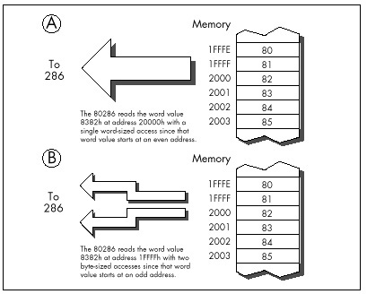

In short, a close relative of our old friend the 8-bit bus
cycle-eater—the system memory wait state cycle-eater—haunts us still on
all but zero-wait-state 286 and 386 computers, and that means that the
prefetch queue cycle-eater is alive and well. (The system memory wait
state cycle-eater isn't really a new cycle-eater, but rather a variant
of the general wait state cycle-eater, of which the display adapter
cycle-eater is yet another variant.) While the 286 in the AT can fetch
instructions much faster than can the 8088 in the PC, it can execute
those instructions faster still.

The picture is less clear in the 386 world since there are so many
different memory architectures, but similar problems can occur in any
computer built around a 286 or 386. The prefetch queue cycle-eater is
even a factor—albeit a lesser one—on zero-wait-state machines, both
because branching empties the queue and because some instructions can
outrun even zero—5 cycles longer than the official execution time.)

To summarize:

  * Memory-accessing instructions don't run at their official speeds on
    non-zero-wait-state 286/386 computers.
  * The prefetch queue cycle-eater reduces performance on 286/386
    computers, particularly when non-zero-wait-state memory is used.
  * Branches often execute at less than their rated speeds on the 286
    and 386 since the prefetch queue is emptied.
  * The extent to which the prefetch queue and wait states affect
    performance varies from one 286/386 computer to another, making
    precise optimization impossible.

What's to be learned from all this? Several things:

  * Keep your instructions short.
  * Keep it in the registers; avoid memory, since memory generally can't
    keep up with the processor.
  * Don't jump.

Of course, those are exactly the rules that apply to 8088 optimization
as well. Isn't it convenient that the same general rules apply across
the board?

#### Data Alignment {#Heading7 align="center"}

Thanks to its 16-bit bus, the 286 can access word-sized memory variables
just as fast as byte-sized variables. There's a catch, however: That's
only true for word-sized variables that start at even addresses. When
the 286 is asked to perform a word-sized access starting at an odd
address, it actually performs two separate accesses, each of which
fetches 1 byte, just as the 8088 does for all word-sized accesses.

Figure 11.1 illustrates this phenomenon. The conversion of word-sized
accesses to odd addresses into double byte-sized accesses is transparent
to memory-accessing instructions; all any instruction knows is that the
requested word has been accessed, no matter whether 1 word-sized access
or 2 byte-sized accesses were required to accomplish it.

The penalty for performing a word-sized access starting at an odd
address is easy to calculate: Two accesses take twice as long as one
access.

> 
> In other words, the effective capacity of the 286's external data bus
> is *halved* when a word-sized access to an odd address is performed.

That, in a nutshell, is the data alignment cycle-eater, the one new
cycle-eater of the 286 and 386. (The data alignment cycle-eater is a
close relative of the 8088's 8-bit bus cycle-eater, but since it behaves
differently—occurring only at odd addresses—and is avoided with a
different workaround, we'll consider it to be a new cycle-eater.)



The way to deal with the data alignment cycle-eater is straightforward:
*Don't perform word-sized accesses to odd addresses on the 286 if you
can help it*. The easiest way to avoid the data alignment cycle-eater is
to place the directive `EVEN` before each of your word-sized
variables. `EVEN` forces the offset of the next byte assembled to be
even by inserting a `NOP` if the current offset is odd; consequently,
you can ensure that any word-sized variable can be accessed efficiently
by the 286 simply by preceding it with `EVEN`.

Listing 11.2, which accesses memory a word at a time with each word
starting at an odd address, runs on a 10 MHz AT clone in 1.27 ms per
repetition of `MOVSW`, or 0.64 ms per word-sized memory access. That's
6-plus cycles per word-sized access, which breaks down to two separate
memory accesses—3 cycles to access the high byte of each word and 3
cycles to access the low byte of each word, the inevitable result of
non-word-aligned word-sized memory accesses—plus a bit extra for DRAM
refresh.

**LISTING 11.2 L11-2.ASM**

```nasm
;
; *** Listing 11.2 ***
;
; Measures the performance of accesses to word-sized
; variables that start at odd addresses (are not
; word-aligned).
;
Skip:
        push    ds
        pop     es
        mov     si,1    ;source and destination are the same
        mov     di,si   ; and both are not word-aligned
        mov     cx,1000 ;move 1000 words
        cld
        call    ZTimerOn
        rep     movsw
        call    ZTimerOff
```

On the other hand, Listing 11.3, which is exactly the same as Listing
11.2 save that the memory accesses are word-aligned (start at even
addresses), runs in 0.64 ms per repetition of `MOVSW`, or 0.32 µs per
word-sized memory access. That's 3 cycles per word-sized access—exactly
twice as fast as the non-word-aligned accesses of Listing 11.2, just as
we predicted.

**LISTING 11.3 L11-3.ASM**

```nasm
;
; *** Listing 11.3 ***
;
; Measures the performance of accesses to word-sized
; variables that start at even addresses (are word-aligned).
;
Skip:
        push    ds
        pop     es
        sub     si,si   ;source and destination are the same
        mov     di,si   ; and both are word-aligned
        mov     cx,1000 ;move 1000 words
        cld
        call    ZTimerOn
        rep     movsw
        call    ZTimerOff
```

The data alignment cycle-eater has intriguing implications for speeding
up 286/386 code. The expenditure of a little care and a few bytes to
make sure that word-sized variables and memory blocks are word-aligned
can literally double the performance of certain code running on the 286.
Even if it doesn't double performance, word alignment usually helps and
never hurts.

#### Code Alignment {#Heading8}

Lack of word alignment can also interfere with instruction fetching on
the 286, although not to the extent that it interferes with access to
word-sized memory variables. The 286 prefetches instructions a word at a
time; even if a given instruction doesn't begin at an even address, the
286 simply fetches the first byte of that instruction at the same time
that it fetches the last byte of the previous instruction, as shown in
Figure 11.2, then separates the bytes internally. That means that in
most cases, instructions run just as fast whether they're word-aligned
or not.

There is, however, a non-word-alignment penalty on *branches* to odd
addresses. On a branch to an odd address, the 286 is only able to fetch
1 useful byte with the first instruction fetch following the branch, as
shown in Figure 11.3. In other words, lack of word alignment of the
target instruction for any branch effectively cuts the
instruction-fetching power of the 286 in half for the first instruction
fetch after that branch. While that may not sound like much, you'd be
surprised at what it can do to tight loops; in fact, a brief story is in
order.