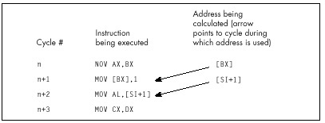
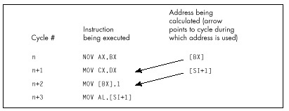

which calculates the same sum and leaves the registers in the same state
as the first example, but avoids indexed addressing.

In protected mode, the definition of indexed addressing is a tad more
complex. The use of two registers to address memory, as in `MOV EAX,
[EDX+EDI]`, still qualifies for the one-cycle penalty. In addition, the
use of 386/486 scaled addressing, as in `MOV [ECX*2],EAX`, also
constitutes indexed addressing, even if only one register is used to
point to memory.

All this fuss over one cycle! You might well wonder how much difference
one cycle could make. After all, on the 8088, effective address
calculations take a *minimum* of 5 cycles. On the 486, however, 1 cycle
is a big deal because many instructions, including most register-only
instructions (`MOV`, `ADD`, `CMP`, and so on) execute in just 1
cycle. In particular, `MOV`s to and from memory execute in 1 cycle—if
they're not hampered by something like indexed addressing, in which case
they slow to half speed (or worse, as we will see shortly).

For example, consider the summing example shown earlier. The version
that uses base+index ([BX+SI]) addressing executes in eight cycles per
loop. As expected, the version that uses base ([SI]) addressing runs one
cycle faster, at seven cycles per loop. However, the loop code executes
so fast on the 486 that the single cycle saved by using base addressing
makes the *whole loop* more than 14 percent faster.

In a key loop on the 486, 1 cycle can indeed matter.

#### Calculate Memory Pointers Ahead of Time {#Heading6}

Rule \#2: Don't use a register as a memory pointer during the next two
cycles after loading it.

Intel states that if the destination of one instruction is used as the
base addressing component of the next instruction, then a one-cycle
penalty is imposed. This rule, unlike anything ever before seen in the
x86 family, reflects the heavily pipelined nature of the 486.
Apparently, the 486 starts each effective address calculation before the
start of the instruction that will need it, as shown in Figure 12.1;
this effectively makes the address calculation time vanish, because it
happens while the preceding instruction executes.

Of course, the 486 *can't* perform an effective address calculation for
a target instruction ahead of time if one of the address components
isn't known until the instruction starts, and that's exactly the case
when the preceding instruction modifies one of the target instruction's
addressing registers. For example, in the code

```nasm
MOV  BX,OFFSET MemVar
MOV  AX,[BX]
```

there's no way that the 486 can calculate the address referenced by
`MOV AX,[BX]` until `MOV BX,OFFSET MemVar` finishes, so pipelining
that calculation ahead of time is not possible. A good workaround is
rearranging your code so that at least one instruction lies between the
loading of the memory pointer and its use. For example,
postdecrementing, as in the following

```nasm
LoopTop:
    add    ax,[si]
    add    si,2
    dec    cx
    jnz    LoopTop
```

is faster than preincrementing, as in:

```nasm
LoopTop:
    add    si,2
    add    ax,[SI]
    dec    cx
    jnz    LoopTop
```

Now that we understand what Intel means by this rule, let me make a very
important comment: My observations indicate that for real-mode code, the
documentation understates the extent of the penalty for interrupting the
address calculation pipeline by loading a memory pointer just before
it's used.

> 
> The truth of the matter appears to be that if a register is the
> destination of one instruction and is then used by the next instruction
> to address memory in real mode, not one but two cycles are lost!

In 32-bit protected mode, however, the penalty is, in fact, the 1 cycle
that Intel .

Considering that `MOV` normally takes only one cycle total, that's
quite a loss. For example, the postdecrement loop shown above is 2 full
cycles faster than the preincrement loop, resulting in a 29 percent
improvement in the performance of the entire loop. But wait, there's
more. If a register is loaded 2 cycles (which generally means 2
instructions, but, because some 486 instructions take more than 1 cycle,



the 2 are not always equivalent) before it's used to point to memory, 1
cycle is lost. Therefore, whereas this code

```nasm
mov    bx,offset MemVar
mov    ax,[bx]
inc    dx
dec    cx
jnz    LoopTop
```

loses two cycles from interrupting the address calculation pipeline,
this code

```nasm
mov    bx,offset MemVar
inc    dx
mov    ax,[bx]
dec    cx
jnz    LoopTop
```

loses only one cycle, and this code

```nasm
mov    bx,offset MemVar
inc    dx
dec    cx
mov    ax,[bx]
jnz    LoopTop
```

loses no cycles at all. Apparently, the 486's addressing calculation
pipeline actually starts 2 cycles ahead, as shown in Figure 12.2. (In
truth, my best guess at the moment is that the addressing pipeline
really does start only 1 cycle ahead; the additional cycle crops up when
the addressing pipeline has to wait for a register to be written into
the register file before it can read it out for use in addressing
calculations. However, I'm guessing here, and the 2-cycle-ahead model in
Figure 12.2 will do just fine for optimization purposes.)

Clearly, there's considerable optimization potential in careful
rearrangement of 486 code.



### Caveat Programmor {#Heading7}

A caution: I'm quite certain that the 2-cycle-ahead addressing pipeline
interruption penalty I've described exists in the two 486s I've tested.
However, there's no guarantee that Intel won't change this aspect of the
486 in the future, especially given that the documentation indicates
otherwise. Perhaps the 2-cycle penalty is the result of a bug in the
initial steps of the 486, and will revert to the documented 1-cycle
penalty someday; likewise for the undocumented optimizations I'll
describe below. Nonetheless, none of the optimizations I suggest would
hurt performance even if the undocumented performance characteristics of
the 486 were to vanish, and they certainly will help performance on at
least some 486s right now, so I feel they're well worth using.