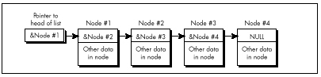

Chapter 15\
 Linked Lists and plain Unintended Challenges {#Heading1}
---------------------------------------------

### Unfamiliar Problems with Familiar Data Structures {#Heading2}

After 21 years, this story still makes me wince. Oh, the humiliations I
suffer for your enlightenment....

It wasn't until ninth grade that I had my first real girlfriend. Okay,
maybe I was a little socially challenged as a kid, but hey, show me a
good programmer who wasn't; it goes with the territory. Her name was
Jeannie Schweigert, and she was about four feet tall, pretty enough, and
female—and willing to go out with me, which made her approximately as
attractive as Cheryl Tiegs, in my book.

Jeannie and I hung out together at school, and went to basketball games
and a few parties together, but somehow the two of us were never alone.
Being 14, neither of us could drive, so her parents tended to end up
chauffeuring us. That's a next-to-ideal arrangement, I now realize,
having a daughter of my own (ideal being exiling all males between the
ages of 12 and 18 to Tasmania), but at the time, it drove me nuts. You
see...ahem...I had never actually kissed Jeannie—or anyone, for that
matter, unless you count maiden aunts and the like—and I was dying to.
At the same time, I was terrified at the prospect. What if I turned out
to be no good at it? It wasn't as if I could go to Kisses ‘R' Us and
take lessons.

My long-awaited opportunity finally came after a basketball game. For a
change, *my* father was driving, and when we dropped her off at her
house, I walked her to the door. This was my big chance. I put my arms
around her, bent over with my eyes closed, just like in the movies....

And whacked her on the top of the head with my chin. (As I said, she was
only about four feet tall.) And I do mean whacked. Jeannie burst into
hysterical laughter, tried to calm herself down, said goodnight, and
went inside, still giggling. No kiss.

I was a pretty mature teenager, so this was only slightly more traumatic
than leading the Tournament of Roses parade in my underwear. On the next
try, though, I did manage to get the hang of this kissing business, and
eventually even went on to have a child. (Not with Jeannie, I might add;
the mind boggles at the mess I could have made of *that* with her.) As
it turns out, none of that stuff is particularly difficult; in fact,
it's kind of enjoyable, wink, wink, say no more.

When you're dealing with something new, a little knowledge goes a long
way. When it comes to kissing, we have to fumble along the learning
curve on our own, but there are all sorts of resources to help speed up
the learning process when it comes to programming. The basic mechanisms
of programming—searches, sorts, parsing, and the like—are
well-understood and superbly well-documented. Treat yourself to a book
like *Algorithms,* by Robert Sedgewick (Addison Wesley), or Knuth's *The
Art of Computer Programming* series (also from Addison Wesley; and where
was Knuth with *The Art of Kissing* when I needed him?), or practically
anything by Jon Bentley, and when you tackle a new area, give yourself a
head start. There's still plenty of room for inventiveness and
creativity on your part, but why not apply that energy on top of the
knowledge that's already been gained, instead of reinventing the wheel?
I know, reinventing the wheel is just the kind of challenge programmers
love—but can you really afford to waste the time? And do you honestly
think that you're so smart that you can out-think Knuth, who's spent a
lifetime at this stuff and happens to be a genius?

Maybe you can—but I sure can't. For example, consider the evolution of
my understanding of linked lists.

### Linked Lists {#Heading3}

Linked lists are data structures composed of discrete elements, or
nodes, joined together with links. In C, the links are typically
pointers. Like all data structures, linked lists have their strengths
and their weaknesses. Primary among the strengths are: simplicity;
speedy sequential processing; ease and speed of insertion and deletion;
the ability to mix nodes of various sizes and types; and the ability to
handle variable amounts of data, especially when the total amount of
data changes dynamically or is not always known beforehand. Weaknesses
include: greater memory requirements than arrays (the pointers take up
space); slow non-sequential processing, including finding arbitrary
nodes; and an inability to backtrack, unless doubly-linked lists are
used. Unfortunately, doubly linked lists need more memory, as well as
processing time to maintain the backward links.

Linked lists aren't very good for most types of sorts. Insertion and
bubble sorts work fine, but more sophisticated sorts depend on efficient
random access, which linked lists don't provide. Likewise, you wouldn't
want to do a binary search on a linked list. On the other hand, linked
lists are ideal for applications where nothing more than sequential
access is needed to data that's always sorted or nearly sorted.

Consider a polygon fill function, for example. Polygon edges are added
to the active edge list in x-sorted order, and tend to stay pretty
nearly x-sorted, so sophisticated sorting is never needed. Edges are
read out of the list in sorted order, just the way linked lists work
best. Moreover, linked lists are straightforward to implement, and with
linked lists an arbitrary number of polygon edges can be handled with no
fuss. All in all, linked lists work beautifully for filling polygons.
For an example of the use of linked lists in polygon filling, see my
column in the May 1991 issue of *Dr. Dobb's Journal.* Be warned, though,
that none of the following optimizations are to be found in that column.

You see, that column was my first heavy-duty use of linked lists, and
they seemed so simple that I didn't even open Sedgewick or Knuth. For
hashing or Boyer-Moore searching, sure, I'd have done my homework first;
but linked lists seemed too obvious to bother. I was much more concerned
with the polygon-related aspects of the implementation, and, in truth, I
gave the linked list implementation not a moment's thought before I
began coding. Heck, I had handled *much* tougher programming problems in
the past; surely it would be faster to figure this one out on my own
than to look it up.

Not!

The basic concept of a linked list—the one I came up with for that *DDJ*
column—is straightforward, as shown in Figure 15.1. A head pointer
points to the first node in the list, which points to the next node,
which points to the next, and so on, until the last node in the list is
reached (typically denoted by a **NULL** next-node pointer).
Conceptually, nothing could be simpler. From an implementation
perspective, however, there are serious flaws with this model.

The fundamental problem is that the model of Figure 15.1 unnecessarily
complicates link manipulation. In order to delete a node, for example,
you must change the preceding node's **NextNode** pointer to point to
the following node, as shown in Listing 15.1. (Listing 15.2 is the
header file LLIST.H, which is **\#include**d by all the linked list
listings in this chapter.) Easy enough—unless the preceding node happens
to be the head pointer, which doesn't *have* a **NextNode** field,
because it's not a node, so Listing 15.1 won't work. Cumbersome special
code and extra information (a pointer to the head of the list) are
required to handle the head-pointer case, as shown in Listing 15.3.
(I'll grant you that if you make the next-node pointer the first field
in the **LinkNode** structure, at offset 0, then you could successfully
point to the head pointer and pretend it was a **LinkNode**
structure—but that's an ugly and potentially dangerous trick, and we'll
see a better approach next.)

\
 **Figure 15.1**  *The basic concept of a linked list.*