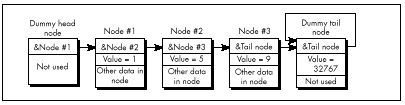
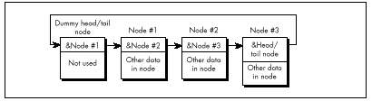

  ------------------------ --------------------------------- --------------------
  [Previous](15-02.html)   [Table of Contents](index.html)   [Next](15-04.html)
  ------------------------ --------------------------------- --------------------

**LISTING 15.5 L15-5.C**

    /* Finds the first node in a value-sorted linked list that
       has a Value field greater than or equal to a key value, and
       returns a pointer to the node preceding that node (to facilitate
       insertion and deletion), or a NULL pointer if no such value was
       found. Assumes the list is terminated with a sentinel tail node
       containing the largest possible Value field setting and pointing
       to itself as the next node. */
    #include <stdio.h>
    #include “llist.h”
    struct LinkNode *FindNodeBeforeValueNotLess(
       struct LinkNode *HeadOfListNode, int SearchValue)
    {
       struct LinkNode *NodePtr = HeadOfListNode;
       while (NodePtr->NextNode->Value < SearchValue)
          NodePtr = NodePtr->NextNode;
       if (NodePtr->NextNode->NextNode == NodePtr->NextNode)
          return(NULL);     /* we found the sentinel; failed search */
       else
          return(NodePtr);  /* success; return pointer to node preceding
                               node that was >= */
    }

\
 **Figure 15.4**  *List terminated by a sentinel.*

### Circular Lists {#Heading5}

One minor but elegant refinement yet remains: Use a single node as both
the head *and* the tail of the list. We can do this by connecting the
last node back to the first through the head/tail node in a circular
fashion, as shown in Figure 15.5. This head/tail node can also, of
course, be a sentinel; when it’s necessary to check for the end of the
list explicitly, that can be done by comparing the current node pointer
to the head pointer. If they’re equal, you’re at the head/tail node.

Why am I so fond of this circular list architecture? For one thing, it
saves a node, and most of my linked list programming has been done in
severely memory-constrained environments. Mostly, though, it’s just so
*neat;* with this setup, there’s not a single node or inner-loop
instruction wasted. Perfect economy of programming, if you ask me.

I must admit that I racked my brains for quite a while to come up with
the circular list, simple as it may seem. Shortly after coming up with
it, I happened to look in Sedgewick’s book, only to find my nifty
optimization described plain as day; and a little while after *that,* I
came across a thread in the algorithms/computer.sci topic on BIX that
described it in considerable detail. Folks, the information is out
there. Look it up *before* turning on your optimizer afterburners!

Listings 15.1 and 15.6 together form a suite of C functions for
maintaining a circular linked list sorted by ascending value. (Listing
15.5 requires modification before it will work with circular lists.)
Listing 15.7 is an assembly language version of **InsertNodeSorted()**;
note the tremendous efficiency of the scanning loop in
**InsertNodeSorted()—**four instructions per node!—thanks to the dummy
head/tail/sentinel node. Listing 15.8 is a simple application that
illustrates the use of the linked-list functions in Listings 15.1 and
15.6.

Contrast Figure 15.5 with Figure 15.1, and Listings 15.1, 15.5, 15.6,
and 15.7 with Listings 15.3 and 15.4. Yes, linked lists are simple, but
not so simple that a little knowledge doesn’t make a substantial
difference. Make it a habit to read Knuth or Sedgewick or the like
before you write a single line of code.

\
 **Figure 15.5**  *Representing a circular list.*

**LISTING 15.6 L15-6.C**

    /*  Suite of functions for maintaining a linked list sorted by
        ascending order of the Value field. The list is circular; that
        is,it has a dummy node as both the head and the tail of the list.
        The dummy node is a sentinel, containing the largest possible
        Value field setting. Tested with Borland C++ in C mode. */
    #include <stdlib.h>
    #include <stdio.h>
    #include <string.h>
    #include “llist.h”
    /* Initializes an empty linked list of LinkNode structures,
       consisting of a single head/tail/sentinel node, and returns a
       pointer to the list. Returns NULL for failure. */
    struct LinkNode *InitLinkedList()
    {
       struct LinkNode *Sentinel;

       if ((Sentinel = malloc(sizeof(struct LinkNode))) == NULL)
          return(NULL);
       Sentinel->NextNode = Sentinel;
       Sentinel->Value = SENTINEL;
       strcpy(Sentinel->Text, “*** sentinel ***”);
       return(Sentinel);
    }

    /* Finds the first node in a value-sorted linked list with a value
       field equal to a key value, and returns a pointer to the node
       preceding that node (to facilitate insertion and deletion), or a
       NULL pointer if no value was found. Assumes list is terminated
       with a sentinel node containing the largest possible value. */

    struct LinkNode *FindNodeBeforeValue(struct LinkNode *HeadOfListNode,
    int SearchValue)
    {
       struct LinkNode *NodePtr = HeadOfListNode;

       while (NodePtr->NextNode->Value < SearchValue)
          NodePtr = NodePtr->NextNode;
       if (NodePtr->NextNode->Value == SearchValue) {
          /* Found the search value; success unless we found the
             sentinel (can happen only if SearchValue == SENTINEL) */
          if (NodePtr->NextNode == HeadOfListNode) {
             return(NULL);     /* failure; we found the sentinel */
          } else {
             return(NodePtr);  /* success; return pointer to node
                                  preceding the node that was equal */
          }
       } else {
           return(NULL);       /* No match; return failure status */
       }
    }

    /* Inserts the specified node into a value-sorted linked list, such
       that value-sorting is maintained. Returns a pointer to the node
       after which the new node is inserted. */
    struct LinkNode *InsertNodeSorted(struct LinkNode *HeadOfListNode,
       struct LinkNode *NodeToInsert)
    {
       struct LinkNode *NodePtr = HeadOfListNode;
       int SearchValue = NodeToInsert->Value;
       while (NodePtr->NextNode->Value < SearchValue)
          NodePtr = NodePtr->NextNode;
       NodeToInsert->NextNode = NodePtr->NextNode;
       NodePtr->NextNode = NodeToInsert;
       return(NodePtr);
    }

  ------------------------ --------------------------------- --------------------
  [Previous](15-02.html)   [Table of Contents](index.html)   [Next](15-04.html)
  ------------------------ --------------------------------- --------------------

* * * * *

Graphics Programming Black Book © 2001 Michael Abrash
