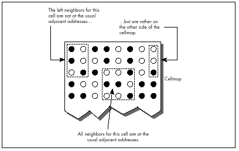
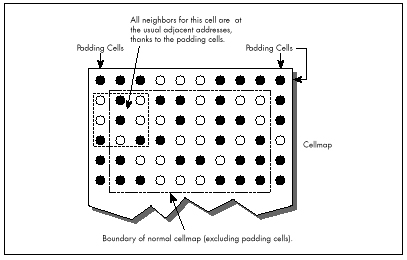
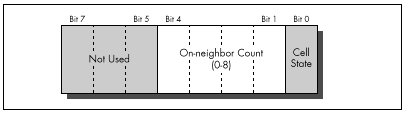

## Chapter 17\
 The Game of Life {#Heading1}

### The Triumph of Algorithmic Optimization in a Cellular Automata Game {#Heading2}

I've spent a lot of my life discussing assembly language optimization,
which I consider to be an important and underappreciated topic. However,
I'd like to take this opportunity to point out that there is much, much
more to optimization than assembly language. Assembly is essential for
absolute maximum performance, but it's not the only ingredient;
necessary but not sufficient, if you catch my drift—and not even
necessary, if you're looking for improved but not maximum performance.
You've heard it a thousand times: Optimize your algorithm first. Devise
new approaches. Or, as Knuth said, *Premature optimization is the root
of all evil.*

This is, of course, old hat, stuff you know like the back of your hand.
Or is it? As Jeff Duntemann pointed out to me the other day, performance
programmers are made, not born. While I'm merrily gallivanting around in
this book optimizing 486 pipelining and turning simple tasks into
horribly complicated and terrifyingly fast state machines, many of you
are still developing your basic optimization skills. I don't want to
shortchange those of you in the latter category, so in this chapter,
we'll discuss some high-level language optimizations that can be applied
by mere mortals within a reasonable period of time. We're going to
examine a complete optimization process, from start to finish, and what
we will find is that it's possible to get a 50-times speed-up without
using *one byte of assembly!* It's all a matter of perspective—how you
look at your code and data.

### Conway's Game {#Heading3}

The program that we're going to optimize is Conway's famous Game of
Life, long-ago favorite of the hackers at MIT's AI Lab. If you've never
seen it, let me assure you: Life is *neat,* and more than a little
hypnotic. Fractals have been the hot graphics topic in recent years, but
for eye-catching dazzle, Life is hard to beat.

Of course, eye-catching dazzle requires real-time performance—lots of
pixels help too—and there's the rub. When there are, say, 40,000 cells
to process and display, a simple, straightforward implementation just
doesn't cut it, even on a 33 MHz 486. Happily, though, there are many,
many ways to speed up Life, and they illustrate a variety of important
optimization principles, as this chapter will show.

First, I'll describe the ground rules of Life, implement a very
straightforward version in C++, and then speed that version up by about
eight times without using any drastically different approaches or any
assembly. This may be a little tame for some of you, but be patient; for
after that, we'll haul out the big guns and move into the 30 to 40 times
speed-up range. Then in the next chapter, I'll show you how several
programmers *really* floored it in taking me up on my second
Optimization Challenge, which involved the Game of Life.

#### The Rules of the Game {#Heading4}

The Game of Life is ridiculously simple. There is a cellmap, consisting
of a rectangular matrix of cells, each of which may initially be either
on or off. Each cell has eight neighbors: two horizontally, two
vertically, and four diagonally. For each succeeding generation of
cells, the game logic determines whether each cell will be on or off
according to the following rules:

  * If a cell is on and has either two or three neighbors that are on in
    the current generation, it stays on; otherwise, the cell turns off.
  * If a cell is off and has exactly three "on" neighbors in the current
    generation, it turns on; otherwise, it stays off. That's all the
    rules there are—but they give rise to an astonishing variety of
    forms, including patterns that spin, march across the screen, and
    explode.

It's only a little more complicated to implement the Game of Life than
it is to describe it. Listing 17.1, together with the display functions
in Listing 17.2, is a C++ implementation of the Game of Life, and it's
very straightforward. A cellmap is an object that's accessible through
member functions to set, clear, and test cell states, and through a
member function to calculate the next generation. Calculating the next
generation involves nothing more than using the other member functions
to set each cell to the appropriate state, given the number of
neighboring on-cells and the cell's current state. The only complication
is that it's necessary to place the next generation's cells in another
cellmap, and then copy the final result back to the original cellmap.
This keeps us from corrupting the current generation's cellmap before
we're done using it to calculate the next generation.

All in all, Listing 17.1 is a clean, compact, and elegant implementation
of the Game of Life. Were it not that the code is as slow as molasses,
we could stop right here.

**LISTING 17.1 L17-1.CPP**

```cpp
/* C++ Game of Life implementation for any mode for which mode set
   and draw pixel functions can be provided.
   Tested with Borland C++ in the small model. */
#include <stdlib.h>
#include <stdio.h>
#include <iostream.h>
#include <conio.h>
#include <time.h>
#include <dos.h>
#include <bios.h>
#include <mem.h>

#define ON_COLOR  15       // on-cell pixel color
#define OFF_COLOR 0        // off-cell pixel color
#define MSG_LINE  10       // row for text messages
#define GENERATION_LINE 12 // row for generation # display
#define LIMIT_18_HZ  1     // set 1 for maximum frame rate = 18Hz
#define WRAP_EDGES   1     // set to 0 to disable wrapping around
                           // at cell map edges
class cellmap {
private:
   unsigned char *cells;
   unsigned int width;
   unsigned int width_in_bytes;
   unsigned int height;
   unsigned int length_in_bytes;
public:
   cellmap(unsigned int h, unsigned int v);
   ~cellmap(void);
   void copy_cells(cellmap &sourcemap);
   void set_cell(unsigned int x, unsigned int y);
   void clear_cell(unsigned int x, unsigned int y);
   int cell_state(int x, int y);
   void next_generation(cellmap& dest_map);
};

extern void enter_display_mode(void);
extern void exit_display_mode(void);
extern void draw_pixel(unsigned int X, unsigned int Y,
   unsigned int Color);
extern void show_text(int x, int y, char *text);

/* Controls the size of the cell map. Must be within the capabilities
   of the display mode, and must be limited to leave room for text
   display at right. */
unsigned int cellmap_width = 96;
unsigned int cellmap_height = 96;
/* Width & height in pixels of each cell as displayed on screen. */
unsigned int magnifier = 2;

void main()
{
   unsigned int init_length, x, y, seed;
   unsigned long generation = 0;
   char gen_text[80];
   long bios_time, start_bios_time;

   cellmap current_map(cellmap_height, cellmap_width);
   cellmap next_map(cellmap_height, cellmap_width);

   // Get the seed; seed randomly if 0 entered
   cout << "Seed (0 for random seed): ";
   cin >> seed;
   if (seed == 0) seed = (unsigned) time(NULL);

   // Randomly initialize the initial cell map
   cout << "Initializing...";
   srand(seed);
   init_length = (cellmap_height * cellmap_width) / 2;
   do {
      x = random(cellmap_width);
      y = random(cellmap_height);
      next_map.set_cell(x, y);
   } while (—init_length);
   current_map.copy_cells(next_map); // put init map in current_map

   enter_display_mode();

   // Keep recalculating and redisplaying generations until a key
   // is pressed
   show_text(0, MSG_LINE, "Generation: ");
   start_bios_time = _bios_timeofday(_TIME_GETCLOCK, &bios_time);
   do {
      generation++;
      sprintf(gen_text, "%10lu", generation);
      show_text(1, GENERATION_LINE, gen_text);
      // Recalculate and draw the next generation
      current_map.next_generation(next_map);
      // Make current_map current again
      current_map.copy_cells(next_map);
#if LIMIT_18_HZ
      // Limit to a maximum of 18.2 frames per second,for visibility
      do {
         _bios_timeofday(_TIME_GETCLOCK, &bios_time);
      } while (start_bios_time == bios_time);
      start_bios_time = bios_time;
#endif
   } while (!kbhit());
   getch();    // clear keypress
   exit_display_mode();
   cout << "Total generations: " << generation << "\nSeed: " <<
         seed << "\n";
}

/* cellmap constructor. */
cellmap::cellmap(unsigned int h, unsigned int w)
{
   width = w;
   width_in_bytes = (w + 7) / 8;
   height = h;
   length_in_bytes = width_in_bytes * h;
   cells = new unsigned char[length_in_bytes];  // cell storage
   memset(cells, 0, length_in_bytes);  // clear all cells, to start
}

/* cellmap destructor. */
cellmap::~cellmap(void)
{
   delete[] cells;
}

/* Copies one cellmap's cells to another cellmap. Both cellmaps are
   assumed to be the same size.  */
void cellmap::copy_cells(cellmap &sourcemap)
{
   memcpy(cells, sourcemap.cells, length_in_bytes);
}

/* Turns cell on. */
void cellmap::set_cell(unsigned int x, unsigned int y)
{
   unsigned char *cell_ptr =
         cells + (y * width_in_bytes) + (x / 8);

   *(cell_ptr) |= 0x80 >> (x & 0x07);
}

/* Turns cell off. */
void cellmap::clear_cell(unsigned int x, unsigned int y)
{
   unsigned char *cell_ptr =
         cells + (y * width_in_bytes) + (x / 8);

   *(cell_ptr) &= ~(0x80 >> (x & 0x07));
}

/* Returns cell state (1=on or 0=off), optionally wrapping at the
   borders around to the opposite edge. */
int cellmap::cell_state(int x, int y)
{
   unsigned char *cell_ptr;

#if WRAP_EDGES
   while (x < 0) x += width;     // wrap, if necessary
   while (x >= width) x -= width;
   while (y < 0) y += height;
   while (y >= height) y -= height;
#else
   if ((x < 0) || (x >= width) || (y < 0) || (y >= height))
      return 0;   // return 0 for off edges if no wrapping
#endif
   cell_ptr = cells + (y * width_in_bytes) + (x / 8);
   return (*cell_ptr & (0x80 >> (x & 0x07))) ? 1 : 0;
}

/* Calculates the next generation of a cellmap and stores it in
   next_map. */
void cellmap::next_generation(cellmap& next_map)
{
   unsigned int x, y, neighbor_count;

   for (y=0; y<height; y++) {
      for (x=0; x<width; x++) {
         // Figure out how many neighbors this cell has
         neighbor_count = cell_state(x-1, y-1) + cell_state(x, y-1) +
               cell_state(x+1, y-1) + cell_state(x-1, y) +
               cell_state(x+1, y) + cell_state(x-1, y+1) +
               cell_state(x, y+1) + cell_state(x+1, y+1);
         if (cell_state(x, y) == 1) {
            // The cell is on; does it stay on?
            if ((neighbor_count != 2) && (neighbor_count != 3)) {
               next_map.clear_cell(x, y);    // turn it off
               draw_pixel(x, y, OFF_COLOR);
            }
         } else {
            // The cell is off; does it turn on?
            if (neighbor_count == 3) {
               next_map.set_cell(x, y);      // turn it on
               draw_pixel(x, y, ON_COLOR);
            }
         }
      }
   }
}
```

**LISTING 17.2 L17-2.CPP**

```cpp
/* VGA mode 13h functions for Game of Life.
   Tested with Borland C++. */
#include <stdio.h>
#include <conio.h>
#include <dos.h>

#define TEXT_X_OFFSET   27
#define SCREEN_WIDTH_IN_BYTES 320

/* Width & height in pixels of each cell. */
extern unsigned int magnifier;

/* Mode 13h draw pixel function. Pixels are of width & height
   specified by magnifier. */
void draw_pixel(unsigned int x, unsigned int y, unsigned int color)
{
#define SCREEN_SEGMENT  0xA000
   unsigned char far *screen_ptr;
   int i, j;

   FP_SEG(screen_ptr) = SCREEN_SEGMENT;
   FP_OFF(screen_ptr) =
         y * magnifier * SCREEN_WIDTH_IN_BYTES + x * magnifier;
   for (i=0; i<magnifier; i++) {
      for (j=0; j<magnifier; j++) {
         *(screen_ptr+j) = color;
      }
      screen_ptr += SCREEN_WIDTH_IN_BYTES;
   }
}

/* Mode 13h mode-set function. */
void enter_display_mode()
{
   union REGS regset;

   regset.x.ax = 0x0013;
   int86(0x10, &regset, &regset);
}

/* Text mode mode-set function. */
void exit_display_mode()
{
   union REGS regset;

   regset.x.ax = 0x0003;
   int86(0x10, &regset, &regset);
}

/* Text display function. Offsets text to non-graphics area of
   screen. */
void show_text(int x, int y, char *text)
{
   gotoxy(TEXT_X_OFFSET + x, y);
   puts(text);
}
```

### Where Does the Time Go? {#Heading5}

How slow is Listing 17.1? Table 17.1 shows that even on a 486, Listing
17.1 does fewer than three 96x96 generations per second. (The times in
Table 17.1 are for 1,000 generations of a 96x96 cell map with `seed=1,
LIMIT_18_HZ=0, WRAP_EDGES=1`, and `magnifier=2`, running on a 33
MHz 486.) Since my target is 18 generations per second with a 200x200
cellmap on a 20 MHz 386, Listing 17.1 is too slow by a rather wide
margin—75 times too slow, in fact. You might say we have a little
optimizing to do.

The first rule of optimization is: Only optimize where it matters. Use a
profiler, or risk making a fool of yourself. Consider Listings 17.1 and
17.2. Where do you think the potential for significant speed-up lies?
I'll tell you one place where I thought there was considerable
potential—in `draw_pixel()`. As a programmer of high-speed graphics,
I figured any drawing function that was not only written in C/C++ but
also recalculated the target address from scratch for each pixel would
be among the first optimization targets. I also expected to get major
gains out of going to a Ping-Pong arrangement so that I didn't have to
copy the new cellmap back to `current_map` after calculating the next
generation.

|                          | Listing 17.1 | Listing 17.3 | Listing 17.4 |
|--------------------------|--------------|--------------|--------------|
| **Total execution time** | 340 secs     | 94 secs      | 45 secs      |
| `cell_state()`        | 275          | 21           | —            |
| `next_generation()`   | 60           | 14           | 40           |
| `count_neighbors()`   | —            | 54           | —            |
| `draw_pixel()`        | 2            | 2            | 2            |
| `set_cell()`          | <1           | <1           | <1           |
| `clear_cell()`        | <1           | <1           | <1           |
| `copy_cells()`        | <1           | <1           | <1           |

Table: Table 17.1 Execution times for the game of life.

I was wrong. Wrong, wrong, wrong. (But at least I was smart enough to
use a profiler before actually writing any new code.) Table 17.1 shows
where the time actually goes in Listings 17.1 and 17.2. As you can see,
the time taken by `draw_pixel()`, `copy_cells()`, and *everything*
other than calculating the next generation is nothing more than noise.
We could optimize these routines right down to executing
*instantaneously,* and you know what? It wouldn't make the slightest
perceptible difference in how fast the program runs. Given the present
state of our Game of Life implementation, the only areas worth looking
at for possible optimizations are `cell_state()` and
`next_generation().`

> 
> It's worth noting, though, that one reason `draw_pixel()` doesn't
> much affect performance is that in Listing 17.1, we're smart enough to
> redraw pixels only when their states change, rather than during every
> generation. Detecting and eliminating redundant operations is part of
> knowing the nature of your data, and is a potent optimization technique
> that will be extremely useful a little later in this chapter.

### The Hazards and Advantages of Abstraction {#Heading6}

How can we speed up `cell_state()` and `next_generation()`? I'll
tell you how *not* to do it: By writing those member functions in
assembly. It's tempting to say that `cell_state()` is taking all the
time, so we need to speed it up with assembly, but what we really need
to do is figure out *why* `cell_state()` is taking all the time, then
address that aspect of the program directly.

Once you know where you need to optimize, the one word to keep in mind
isn't assembly, it's...plastics. No, actually, it's *abstraction.*
Well-written C and especially C++ programs are highly abstract models.
For example, Listing 17.1 essentially creates a new programming language
in which cells are tangible things, with built-in manipulation
instructions. Given the cellmap member functions, you don't even need to
know the cell storage format! This is a wonderful thing, in general; it
saves programming time and bugs, and frees you to work on the
application's needs, rather than implementation details.

> 
> However, if you never look beneath the surface of the abstract model at
> the implementation details, you have no idea of what the true performance
> cost of various operations is, and, without that, you have largely
> surrendered control over performance.

Having said that, let me hasten to add that algorithmic improvements can
make a big difference even when working at a purely abstract level. For
a large unordered data set, a high-level Quicksort will beat the pants
off the best-implemented insertion sort you can imagine. Still, you can
optimize your algorithm from here 'til doomsday, and if you have a fast
algorithm running on top of a highly abstract programming model, you'll
almost certainly end up with a slow program. In Listing 17.1, the
abstraction that's killing us is that of looking at the eight neighbors
with eight completely independent operations, requiring eight calls to
`cell_state()` and eight calculations of cell address and cell mask.
In fact, given the nature of cell storage, the eight neighbors are in a
fixed relationship to one another, and the addresses and masks of all
eight can generally be found very easily via hard-wired offsets and
shifts once the address and mask of any one is known.

There's a kicker here, though, and that's the counting of neighbors for
cells at the edge of the cellmap. When cellmap wrapping is enabled (so
that the cellmap becomes essentially a toroid, with each edge joined
seamlessly to the opposite edge, as opposed to having a border of
off-cells), neighbors that reside on the other edge of the cellmap can't
be accessed by the standard fixed offset, as shown in Figure 17.1. So,
in general, we could improve performance by hard-wiring our
neighbor-counting for the bit-per-cell cellmap format, but it seems we'd
need a lot of conditional code to handle wrapping, and that would slow
things back down again.



When a problem doesn't lend itself well to optimization, make it a
practice to see if you can change the problem definition to one that
allows for greater efficiency. In this case, we'll change the problem by
putting padding bytes around the edge of the cellmap, and duplicating
each edge of the cellmap in the padding bytes at the opposite side, as
shown in Figure 17.2. That way, a hard-wired neighbor count will find
exactly what it should—the opposite edge—without any special code at
all.

But doesn't that extra copying of the edges take time? Sure, but only a
little; we can build it into the cellmap copying function, and then
frankly we won't even notice it. Avoiding tens or hundreds of thousands
of calls to `cell_state()`, on the other hand, will be *very*
noticeable. Listing 17.3 shows the alterations to Listing 17.1 required
to implement a hard-wired neighbor-counting function. This is a minor
change, in truth, implemented in about half an hour and not making the
code significantly larger—but Listing 17.3 is 3.6 times faster than
Listing 17.1, as shown in Table 17.1. We're up to about 10 generations
per second on a 486; not where we want to be, but it is a vast
improvement.



**LISTING 17.3 L17-3.CPP**

```cpp
/* cellmap class definition, constructor, copy_cells(), set_cell(),
   clear_cell(), cell_state(), count_neighbors(), and
   next_generation() for fast, hard-wired neighbor count approach.
   Otherwise, the same as Listing 17.1 */

class cellmap {
private:
   unsigned char *cells;
   unsigned int width;
   unsigned int width_in_bytes;
   unsigned int height;
   unsigned int length_in_bytes;
public:
   cellmap(unsigned int h, unsigned int v);
   ~cellmap(void);
   void copy_cells(cellmap &sourcemap);
   void set_cell(unsigned int x, unsigned int y);
   void clear_cell(unsigned int x, unsigned int y);
   int cell_state(int x, int y);
   int count_neighbors(int x, int y);
   void next_generation(cellmap& dest_map);
};

/* cellmap constructor. Pads around cell storage area with 1 extra
   byte, used for handling edge wrapping. */
cellmap::cellmap(unsigned int h, unsigned int w)
{
   width = w;
   width_in_bytes = ((w + 7) / 8) + 2; // pad each side with
                                      // 1 extra byte
   height = h;
   length_in_bytes = width_in_bytes * (h + 2);     // pad top/bottom
                                                   // with 1 extra byte
   cells = new unsigned char[length_in_bytes];     // cell storage
   memset(cells, 0, length_in_bytes);              // clear all cells, to start
}

/* Copies one cellmap's cells to another cellmap. If wrapping is
   enabled, copies edge (wrap) bytes into opposite padding bytes in
   source first, so that the padding bytes off each edge have the
   same values as would be found by wrapping around to the opposite
   edge. Both cellmaps are assumed to be the same size. */
void cellmap::copy_cells(cellmap &sourcemap)
{
   unsigned char *cell_ptr;
   int i;

#if WRAP_EDGES
// Copy left and right edges into padding bytes on right and left
   cell_ptr = sourcemap.cells + width_in_bytes;
   for (i=0; i<height; i++) {
      *cell_ptr = *(cell_ptr + width_in_bytes - 2);
      *(cell_ptr + width_in_bytes - 1) = *(cell_ptr + 1);
      cell_ptr += width_in_bytes;
   }
// Copy top and bottom edges into padding bytes on bottom and top
   memcpy(sourcemap.cells, sourcemap.cells + length_in_bytes -
         (width_in_bytes * 2), width_in_bytes);
   memcpy(sourcemap.cells + length_in_bytes - width_in_bytes,
         sourcemap.cells + width_in_bytes, width_in_bytes);
#endif
   // Copy all cells to the destination
   memcpy(cells, sourcemap.cells, length_in_bytes);
}

/* Turns cell on. x and y are offset by 1 byte down and to the right, to compensate for the
padding bytes around the cellmap. */
void cellmap::set_cell(unsigned int x, unsigned int y)
{
   unsigned char *cell_ptr =
         cells + ((y + 1) * width_in_bytes) + ((x / 8) + 1);

   *(cell_ptr) |= 0x80 >> (x & 0x07);
}

/* Turns cell off. x and y are offset by 1 byte down and to the right,
to compensate for the padding bytes around the cell map. */
void cellmap::clear_cell(unsigned int x, unsigned int y)
{
   unsigned char *cell_ptr =
         cells + ((y + 1) * width_in_bytes) + ((x / 8) + 1);

   *(cell_ptr) &= ~(0x80 >> (x & 0x07));
}

/* Returns cell state (1=on or 0=off). x and y are offset by 1 byte
   down and to the right, to
compensate for the padding bytes around
   the cell map. */
int cellmap::cell_state(int x, int y)
{
   unsigned char *cell_ptr =
         cells + ((y + 1) * width_in_bytes) + ((x / 8) + 1);

   return (*cell_ptr & (0x80 >> (x & 0x07))) ? 1 : 0;
}

/* Counts the number of neighboring on-cells for specified cell. */
int cellmap::count_neighbors(int x, int y)
{
   unsigned char *cell_ptr, mask;
   unsigned int neighbor_count;

   // Point to upper left neighbor
   cell_ptr = cells + ((y * width_in_bytes) + ((x + 7) / 8));
   mask = 0x80 >> ((x - 1) & 0x07);
   // Count upper left neighbor
   neighbor_count = (*cell_ptr & mask) ? 1 : 0;
   // Count left neighbor
   if ((*(cell_ptr + width_in_bytes) & mask)) neighbor_count++;
   // Count lower left neighbor
   if ((*(cell_ptr + (width_in_bytes * 2)) & mask)) neighbor_count++;

   // Point to upper neighbor
   if ((mask >>= 1) == 0) {
      mask = 0x80;
      cell_ptr++;
   }
   // Count upper neighbor
   if ((*cell_ptr & mask)) neighbor_count++;
   // Count lower neighbor
   if ((*(cell_ptr + (width_in_bytes * 2)) & mask))  neighbor_count++;

   // Point to upper right neighbor
   if ((mask >>= 1) == 0) {
      mask = 0x80;
      cell_ptr++;
   }
   // Count upper right neighbor
   if ((*cell_ptr & mask)) neighbor_count++;
   // Count right neighbor
   if ((*(cell_ptr + width_in_bytes) & mask)) neighbor_count++;
   // Count lower right neighbor
   if ((*(cell_ptr + (width_in_bytes * 2)) & mask))  neighbor_count++;

   return neighbor_count;
}

/* Calculates the next generation of current_map and stores it in
   next_map. */
void cellmap::next_generation(cellmap& next_map)
{
   unsigned int x, y, neighbor_count;

   for (y=0; y<height; y++) {
      for (x=0; x<width; x++) {
         neighbor_count = count_neighbors(x, y);
         if (cell_state(x, y) == 1) {
            if ((neighbor_count != 2) && (neighbor_count != 3)) {
               next_map.clear_cell(x, y);    // turn it off
               draw_pixel(x, y, OFF_COLOR);
            }
         } else {
            if (neighbor_count == 3) {
               next_map.set_cell(x, y);      // turn it on
               draw_pixel(x, y, ON_COLOR);
            }
         }
      }
   }
}
```

In Listing 17.3, note the padded cellmap edges, and the alteration of
the member functions to compensate for the padding. Also note that the
width now has to be a multiple of eight, to facilitate the process of
copying the edges to the opposite padding bytes. We have decreased the
generality of our Game of Life implementation in exchange for better
performance. That's a very common trade-off, as common as trading memory
for performance. As a rule, the more general a program is, the slower it
is. A corollary is that often (not always, but often), the more heavily
optimized a program is, the more complex and the more difficult to
implement it is. You can often improve performance a good deal by
implementing only the level of generality you need, but at the same time
decreased generality makes it more difficult to change or port the
program at some later date. A Game of Life implementation, such as
Listing 17.1, that's built on `set_cell()`, `clear_cell()`, and
`get_cell()` is completely general; you can change the cell storage
format simply by changing the constructor and those three functions.
Listing 17.3 is harder to change because `count_neighbors()` would
also have to be altered, and it's more complex than any of the other
functions.

So, in Listing 17.3, we've gotten under the hood and changed the cellmap
format a little, and gotten impressive results. But now
`count_neighbors()` is hard-wired for optimized counting, and it's
still taking up more than half the time. Maybe now it's time to go to
assembly?

Not hardly.

### Heavy-Duty C++ Optimization {#Heading7}

Before we get to assembly, we still have to perform C++ optimization,
then see if we can find an alternative approach that better fits the
application. It would actually have made much more sense if we had
looked for a new approach as our first optimization step, but I decided
it would be better to cover straightforward C++ optimizations at this
point, and the mind-bending stuff a little later. Right now, let's look
at some C++ optimizations; Listing 17.4 is a C++-optimized version of
Listing 17.3.

**LISTING 17.4 L17-4.CPP**

```cpp
/* next_generation(), implemented using fast, all-in-one hard-wired
   neighbor count/update/draw function. Otherwise, the same as
   Listing 17.3. */

/* Calculates the next generation of current_map and stores it in
   next_map. */
void cellmap::next_generation(cellmap& next_map)
{
   unsigned int x, y, neighbor_count;
   unsigned int width_in_bytesX2 = width_in_bytes << 1;
   unsigned char *cell_ptr, *current_cell_ptr, mask, current_mask;
   unsigned char *base_cell_ptr, *row_cell_ptr, base_mask;
   unsigned char *dest_cell_ptr = next_map.cells;

   // Process all cells in the current cellmap
   row_cell_ptr = cells;      // point to upper left neighbor of
                              // first cell in cell map
   for (y=0; y<height; y++) { // repeat for each row of cells
      // Cell pointer and cell bit mask for first cell in row
      base_cell_ptr = row_cell_ptr; // to access upper left neighbor
      base_mask = 0x01;             // of first cell in row
      for (x=0; x<width; x++) {     // repeat for each cell in row
         // First, count neighbors
         // Point to upper left neighbor of current cell
         cell_ptr = base_cell_ptr;  // pointer and bit mask for
         mask = base_mask;          // upper left neighbor
         // Count upper left neighbor
         neighbor_count = (*cell_ptr & mask) ? 1 : 0;
         // Count left neighbor
         if ((*(cell_ptr + width_in_bytes) & mask)) neighbor_count++;
         // Count lower left neighbor
         if ((*(cell_ptr + width_in_bytesX2) & mask))
neighbor_count++;
         // Point to upper neighbor
         if ((mask >>= 1) == 0) {
            mask = 0x80;
            cell_ptr++;
         }
         // Remember where to find the current cell
         current_cell_ptr = cell_ptr + width_in_bytes;
         current_mask = mask;
         // Count upper neighbor
         if ((*cell_ptr & mask)) neighbor_count++;
         // Count lower neighbor
         if ((*(cell_ptr + width_in_bytesX2) & mask))
               neighbor_count++;
         // Point to upper right neighbor
         if ((mask >>= 1) == 0) {
            mask = 0x80;
            cell_ptr++;
         }
         // Count upper right neighbor
         if ((*cell_ptr & mask)) neighbor_count++;
         // Count right neighbor
         if ((*(cell_ptr + width_in_bytes) & mask))  neighbor_count++;
         // Count lower right neighbor
         if ((*(cell_ptr + width_in_bytesX2) & mask))
               neighbor_count++;
         if (*current_cell_ptr & current_mask) {
            if ((neighbor_count != 2) && (neighbor_count != 3)) {
               *(dest_cell_ptr + (current_cell_ptr - cells)) &=
                     ~current_mask;    // turn off cell
               draw_pixel(x, y, OFF_COLOR);
            }
         } else {
            if (neighbor_count == 3) {
               *(dest_cell_ptr + (current_cell_ptr - cells)) |=
                     current_mask;     // turn on cell
               draw_pixel(x, y, ON_COLOR);
            }
         }
         // Advance to the next cell on row
         if ((base_mask >>= 1) == 0) {
            base_mask = 0x80;
            base_cell_ptr++;  // advance to the next cell byte
         }
      }
      row_cell_ptr += width_in_bytes;  // point to start of next row
   }
}
```

Listing 17.4 and Listing 17.3 are functionally the same; the only
difference lies in how `next_generation()` is implemented. (Only
`next_generation()` is shown in Listing 17.4; the program is
otherwise identical to Listing 17.3.) Listing 17.4 applies the following
optimizations to `next_generation()`:

The neighbor-counting code is brought into `next_generation`,
eliminating many function calls and from-scratch address/mask
calculations; all multiplies are eliminated by using pointers and
addition; and all cells are accessed directly via pointers and masks,
eliminating all remaining function calls and from-scratch address/mask
calculations.

The net effect of these optimizations is that Listing 17.4 is more than
twice as fast as Listing 17.3; we've achieved the desired 18 generations
per second, albeit only on a 486, and only at 96x96. (The `#define`
that enables code limiting the speed to 18 Hz, which seemed ridiculous
in Listing 17.1, is actually useful for keeping the generations from
iterating too quickly when Listing 17.4 is running on a 486, especially
with a small cellmap like 48x48.) We've sped things up by about eight
times so far; we need to increase our speed another ten times to reach
our goal of 200x200 at 18 generations per second on a 20 MHz 386.

It's undoubtedly possible to improve the performance of Listing 17.4
further by fine-tuning the code, but no tremendous improvement is
possible that way.

> 
> Once you've reached the point of fine-tuning pointer usage and register
> variables and the like in C or C++, you've become compiler-dependent;
> you therefore might as well go to assembly and get the real McCoy.

We're still not ready for assembly, though; what we need is a new
perspective that lends itself to vastly better performance in C++. The
Life program in the next section is *three to seven times* faster than
Listing 17.4—and it's still in C++.

How is this possible? Here are some hints:

  * After a few dozen generations, most of the cellmap consists of cells
    in the off state.
  * There are many possible cellmap representations other than one
    bit-per-pixel.
  * Cells change state relatively infrequently.

### Bringing In the Right Brain {#Heading8}

In the previous section, we saw how a C++ program could be sped up about
eight times simply by rearranging the data and code in straightforward
ways. Now we're going to see how right-brain non-linear optimization can
speed things up by another four times—and make the code *simpler.*

Now *that's* Zen code optimization.

I have two objectives to achieve in the remainder of this chapter.
First, I want to show that optimization consists of many levels, from
assembly language up to conceptual design, and that assembly language
kicks in pretty late in the optimization process. Second, I want to
encourage you to saturate your brain with everything you know about any
particular optimization problem, then make space for your right brain to
solve the problem.

#### Re-Examining the Task {#Heading9}

Earlier in this chapter, we looked at a straightforward Game of Life
implementation, then increased performance considerably by making the
implementation a little less abstract and a little less general. We made
a small change to the cellmap format, adding padding bytes off the edges
so that pointer arithmetic would always work, but the major
optimizations were moving the critical code into a single loop and using
pointers rather than member functions whenever possible. In other words,
we took what we already knew and made it more efficient.

Now it's time to re-examine the nature of this programming task from the
ground up, looking for things that we *don't* yet know. Let's take a
moment to review what the Game of Life consists of. The basic task is
evolving a new generation, and that's done by looking at the number of
"on" neighbors a cell has and the cell's own state. If a cell is on, and
two or three neighbors are on, then the cell stays on; otherwise, an
on-cell is turned off. If a cell is off and exactly three neighbors are
on, then the cell is turned on; otherwise, an off-cell stays off. That's
all there is to it. As any fool can see, the trick is to arrange things
so that we can count neighbors and check the cell state as quickly as
possible. Large lookup tables, oddly encoded cellmaps, and lots of
bit-twiddling assembly code spring to mind as possible approaches. Can't
you just feel your adrenaline start to pump?

> 
> Relax. Step back. Try to divine the true nature of the problem. The
> object is not to count neighbors and check cell states as quickly as
> possible; that's just one possible implementation. The object is to
> determine when a cell's state must be changed and to change it
> appropriately, and that's what we need to do as quickly as possible.

What difference does that new perspective make? Let's approach it this
way. What does a typical cellmap look like? As it happens, after a few
generations, the vast majority of cells are off. In fact, the vast
majority of cells are not only off but are entirely surrounded by
off-cells. Also, cells change state infrequently; in any given
generation after the first few, most cells remain in the same state as
in the previous generation.

Do you see where I'm heading? Do you hear a whisper of inspiration from
your right brain? The original implementation stored cell states as
1-bits (on), or 0-bits (off). For each generation and for each cell, it
counted the states of the eight neighbors, for an average of eight
operations per cell per generation. Suppose, now, that on average 10
percent of cells change state from one generation to the next. (The
actual percentage is even lower, but this will do for illustration.)
Suppose also that we change the cell map format to store a byte rather
than a bit for each cell, with the byte storing not only the cell state
but also the count of neighboring on-cells for that cell. Figure 17.3
shows this format. Then, rather than counting neighbors each time, we
could just look at the neighbor count in the cell and operate directly
from that.

But what about the overhead needed to maintain the neighbor counts?
Well, each time a cell changes state, eight operations would be needed
to update the counts in the eight neighboring cells. But this happens
only once every ten cells, on average—so the cost of this approach is
only one-tenth that of the original approach!

*Know your data.*



#### Acting on What We Know {#Heading10}

Once we've changed the cellmap format to store neighbor counts as well
as states, with a byte for each cell, we can get another performance
boost by again examining what we know about our data. I said earlier
that most cells are off during any given generation. This means that
most cells have no neighbors that are on. Since the cell map
representation for an off-cell that has no neighbors is a zero byte, we
can skip over scads of unchanged cells at a pop simply by scanning for
non-zero bytes. This is much faster than explicitly testing cell states
and neighbor counts, and lends itself beautifully to assembly language
implementation as `REPZ SCASB` or (with a little cleverness) `REPZ
SCASW`. (Unfortunately, there's no C library function that can scan
memory for the next byte that's non-zero.)

Listing 17.5 is a Game of Life implementation that uses the
neighbor-count cell map format and scans for non-zero bytes. On a 20 MHz
386, Listing 17.5 is about 4.5 times faster at calculating generations
(that is, the generation engine is 4.5 times faster; I'm ignoring the
time consumed by drawing and text display) than Listing 17.4, which is
no slouch. On a 33 MHz 486, Listing 17.5 is about 3.5 times faster than
Listing 17.4. This is true even though Listing 17.5 must be compiled
using the large model. Imagine that—getting a four times speed-up while
switching from the small model to the large model!

**LISTING 17.5 L17-5.CPP**

```cpp
/* C++ Game of Life implementation for any mode for which mode set
   and draw pixel functions can be provided. The cellmap stores the
   neighbor count for each cell as well as the state of each cell;
   this allows very fast next-state determination. Edges always wrap
   in this implementation.
   Tested with Borland C++. To run, link with Listing 17.2
   in the large model. */
#include <stdlib.h>
#include <stdio.h>
#include <iostream.h>
#include <conio.h>
#include <time.h>
#include <dos.h>
#include <bios.h>
#include <mem.h>

#define ON_COLOR  15       // on-cell pixel color
#define OFF_COLOR 0        // off-cell pixel color
#define MSG_LINE  10       // row for text messages
#define GENERATION_LINE 12 // row for generation # display
#define LIMIT_18_HZ  0     // set 1 to to maximum frame rate = 18Hz

class cellmap {
private:
   unsigned char *cells;
   unsigned char *temp_cells;
   unsigned int width;
   unsigned int height;
   unsigned int length_in_bytes;
public:
   cellmap(unsigned int h, unsigned int v);
   ~cellmap(void);
   void set_cell(unsigned int x, unsigned int y);
   void clear_cell(unsigned int x, unsigned int y);
   int cell_state(int x, int y);
   int count_neighbors(int x, int y);
   void next_generation(void);
   void init(void);
};

extern void enter_display_mode(void);
extern void exit_display_mode(void);
extern void draw_pixel(unsigned int X, unsigned int Y,
   unsigned int Color);
extern void show_text(int x, int y, char *text);

/* Controls the size of the cell map. Must be within the capabilities
   of the display mode, and must be limited to leave room for text
   display at right. */
unsigned int cellmap_width = 96;
unsigned int cellmap_height = 96;

/* Width & height in pixels of each cell. */
unsigned int magnifier = 2;

/* Randomizing seed */
unsigned int seed;

void main()
{
   unsigned long generation = 0;
   char gen_text[80];
   long bios_time, start_bios_time;

   cellmap current_map(cellmap_height, cellmap_width);

   current_map.init();  // randomly initialize cell map

   enter_display_mode();

   // Keep recalculating and redisplaying generations until any key
   // is pressed
   show_text(0, MSG_LINE, "Generation: ");
   start_bios_time = _bios_timeofday(_TIME_GETCLOCK, &bios_time);
   do {
      generation++;
      sprintf(gen_text, "%10lu", generation);
      show_text(1, GENERATION_LINE, gen_text);
      // Recalculate and draw the next generation
      current_map.next_generation();
#if LIMIT_18_HZ
      // Limit to a maximum of 18.2 frames per second, for visibility
      do {
         _bios_timeofday(_TIME_GETCLOCK, &bios_time);
      } while (start_bios_time == bios_time);
      start_bios_time = bios_time;
#endif
   } while (!kbhit());

   getch();    // clear keypress
   exit_display_mode();
   cout << "Total generations: " << generation << "\nSeed: " <<
         seed << "\n";
}

/* cellmap constructor. */
cellmap::cellmap(unsigned int h, unsigned int w)
{
   width = w;
   height = h;
   length_in_bytes = w * h;
   cells = new unsigned char[length_in_bytes];  // cell storage
   temp_cells = new unsigned char[length_in_bytes]; // temp cell storage
   if ( (cells == NULL) || (temp_cells == NULL) ) {
      printf("Out of memory\n");
      exit(1);
   }
   memset(cells, 0, length_in_bytes);  // clear all cells, to start
}

/* cellmap destructor. */
cellmap::~cellmap(void)
{
   delete[] cells;
   delete[] temp_cells;
}

/* Turns an off-cell on, incrementing the on-neighbor count for the
   eight neighboring cells. */
void cellmap::set_cell(unsigned int x, unsigned int y)
{
   unsigned int w = width, h = height;
   int xoleft, xoright, yoabove, yobelow;
   unsigned char *cell_ptr = cells + (y * w) + x;

   // Calculate the offsets to the eight neighboring cells,
   // accounting for wrapping around at the edges of the cell map
   if (x == 0)
      xoleft = w - 1;
   else
      xoleft = -1;
   if (y == 0)
      yoabove = length_in_bytes - w;
   else
      yoabove = -w;
   if (x == (w - 1))
      xoright = -(w - 1);
   else
      xoright = 1;
   if (y == (h - 1))
      yobelow = -(length_in_bytes - w);
   else
      yobelow = w;

   *(cell_ptr) |= 0x01;
   *(cell_ptr + yoabove + xoleft) += 2;
   *(cell_ptr + yoabove) += 2;
   *(cell_ptr + yoabove + xoright) += 2;
   *(cell_ptr + xoleft) += 2;
   *(cell_ptr + xoright) += 2;
   *(cell_ptr + yobelow + xoleft) += 2;
   *(cell_ptr + yobelow) += 2;
   *(cell_ptr + yobelow + xoright) += 2;
}

/* Turns an on-cell off, decrementing the on-neighbor count for the
   eight neighboring cells. */
void cellmap::clear_cell(unsigned int x, unsigned int y)
{
   unsigned int w = width, h = height;
   int xoleft, xoright, yoabove, yobelow;
   unsigned char *cell_ptr = cells + (y * w) + x;

   // Calculate the offsets to the eight neighboring cells,
   // accounting for wrapping around at the edges of the cell map
   if (x == 0)
      xoleft = w - 1;
   else
      xoleft = -1;
   if (y == 0)
      yoabove = length_in_bytes - w;
   else
      yoabove = -w;
   if (x == (w - 1))
      xoright = -(w - 1);
   else
      xoright = 1;
   if (y == (h - 1))
      yobelow = -(length_in_bytes - w);
   else
      yobelow = w;

   *(cell_ptr) &= ~0x01;
   *(cell_ptr + yoabove + xoleft) -= 2;
   *(cell_ptr + yoabove ) -= 2;
   *(cell_ptr + yoabove + xoright) -= 2;
   *(cell_ptr + xoleft) -= 2;
   *(cell_ptr + xoright) -= 2;
   *(cell_ptr + yobelow + xoleft) -= 2;
   *(cell_ptr + yobelow) -= 2;
   *(cell_ptr + yobelow + xoright) -= 2;
}

/* Returns cell state (1=on or 0=off). */
int cellmap::cell_state(int x, int y)
{
   unsigned char *cell_ptr;

   cell_ptr = cells + (y * width) + x;
   return *cell_ptr & 0x01;
}

/* Calculates and displays the next generation of current_map */
void cellmap::next_generation()
{
   unsigned int x, y, count;
   unsigned int h = height, w = width;
   unsigned char *cell_ptr, *row_cell_ptr;

   // Copy to temp map, so we can have an unaltered version from
   // which to work
   memcpy(temp_cells, cells, length_in_bytes);

   // Process all cells in the current cell map
   cell_ptr = temp_cells;     // first cell in cell map
   for (y=0; y<h; y++) {      // repeat for each row of cells
   // Process all cells in the current row of the cell map
      x = 0;
      do {        // repeat for each cell in row
                  // Zip quickly through as many off-cells with no
                  // neighbors as possible
         while (*cell_ptr == 0) {
            cell_ptr++; // advance to the next cell
            if (++x >= w) goto RowDone;
         }
         // Found a cell that's either on or has on-neighbors,
         // so see if its state needs to be changed
         count = *cell_ptr >> 1; // # of neighboring on-cells
         if (*cell_ptr & 0x01) {
            // Cell is on; turn it off if it doesn't have
            // 2 or 3 neighbors
            if ((count != 2) && (count != 3)) {
               clear_cell(x, y);
               draw_pixel(x, y, OFF_COLOR);
            }
         } else {
            // Cell is off; turn it on if it has exactly 3 neighbors
            if (count == 3) {
               set_cell(x, y);
               draw_pixel(x, y, ON_COLOR);
            }
         }
         // Advance to the next cell
         cell_ptr++; // advance to the next cell byte
      } while (++x < w);
RowDone:
   }
}

/* Randomly initializes the cellmap to about 50% on-pixels. */
void cellmap::init()
{
   unsigned int x, y, init_length;

   // Get the seed; seed randomly if 0 entered
   cout << "Seed (0 for random seed): ";
   cin >> seed;
   if (seed == 0) seed = (unsigned) time(NULL);

   // Randomly initialize the initial cell map to 50% on-pixels
   // (actually generally fewer, because some coordinates will be
   // randomly selected more than once)
   cout << "Initializing...";
   srand(seed);
   init_length = (height * width) / 2;
   do {
      x = random(width);
      y = random(height);
      if (cell_state(x, y) == 0) {
         set_cell(x, y);
      }
   } while (—init_length);
}
```

The large model is actually not necessary for the 96x96 cellmap in
Listing 17.5. However, I was actually more interested in seeing a fast
200x200 cellmap, and two 200x200 cellmaps can't fit in a single segment.
(This can easily be worked around in assembly language for cellmaps up
to a segment in size; beyond that size, cellmap scanning becomes pretty
complex, although it can still be efficiently implemented with some
clever programming.)

Anyway, using the large model helps illustrate that it's the data
representation and the data processing approach you choose that matter
most. Optimization details like memory models and segments and in-line
functions and assembly language are important but secondary. Let your
mind roam creatively before you start coding. Otherwise, you may find
you're writing well-tuned slow code, which is by no means the same thing
as fast code.

Take a close look at Listing 17.5. You will see that it's quite a bit
simpler than Listing 17.4. To some extent, that's because I decided to
hard-wire the program to wrap around from one edge of the cellmap to the
other (it's much more interesting that way), but the main reason is that
it's a lot easier to work with the neighbor-count model. There's no
complex mask and pointer management, and the only thing that *really*
needs to be optimized is scanning for zero bytes. (And, in fact, I
haven't optimized even that because it's done in a C++ loop; it should
really be `REPZ SCASB`.)

In truth, none of the code in Listing 17.5 is particularly
well-optimized, and, as I noted, the program must be compiled with the
large model for large cellmaps. Also, of course, the entire program is
still in C++; note well that there's not a whit of assembly here.

> 
> We've gotten more than a 30-times speedup simply by removing a little of
> the abstraction that C++ encourages, and by storing and processing the
> data in a manner appropriate for the typical nature of the data itself.
> In other words, we've done some linear, left-brained optimization (using
> pointers and reducing calls) and some non-linear, right-brained
> optimization (understanding the real problem and listening for the
> creative whisper of non-obvious solutions).

No doubt we could get another two to five times improvement with good
assembly code—but that's dwarfed by a 30-times improvement, so
optimization at a conceptual level *must* come first.

#### The Challenge That Ate My Life {#Heading11}

The most recent optimization challenge I laid my community of readers
was to write the fastest possible Game of Life generation engine. By
"engine" I meant that I didn't care about time spent in input or output,
only time consumed by the call to **next-generation.** The time spent
updating the cellmap was what I wanted people to concentrate on.

Here are the rules I laid down for the challenge:

  * Readers could modify any code in Listing 17.5, except the main loop,
    as well as change the cell map representation any way they liked.
    However, the code had to produce exactly the same output as Listing
    17.5 under all circumstances in order to be eligible to win.
  * Engine code had to be less than 400 lines long *in total,* excluding
    the video-related code shown in Listing 17.2.
  * Submissions had to compile/assemble with Borland C++ (in either C++
    or C mode, as desired) and/or TASM.
  * All submissions had to handle cellmaps at least 200x200 in size.
  * Assembly language could of course be used to speed up any part of
    the program. C rather than C++ was legal as well, so long as entered
    implementations produced the same results as Listing 17.5 and 17.2
    together and were less than 400 lines long.
  * All entries would be timed on the same 33 MHz 486 with a 256K
    external cache.

That was the challenge I put to the readers. Little did I realize the
challenge it would lay on *me:* Entries poured in from the four corners
of the globe. Some were plain, some were brilliant, some were, well,
berserk. Many didn't even work. But all had to be gone through, examined
for adherence to the rules, read, compiled, linked, run, and judged. I
learned a lot—about a lot of things, not the least of which was the
process (or maybe the wisdom) of laying down challenges to readers.

Who won? What did I learn? To find out, read on.
