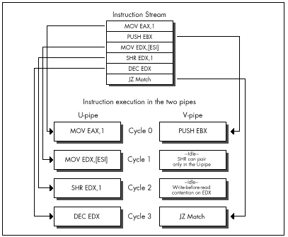

## Chapter 20\
 Pentium Rules {#Heading1}

### How Your Carbon-Based Optimizer Can Put the "Super" in Superscalar {#Heading2}

At the 1983 West Coast Computer Faire, my friend Dan Illowsky, Andy
Greenberg (co-author of Wizardry, at that time the best-selling computer
game ever), and I had an animated discussion about starting a company in
the then-budding world of microcomputer software. One hot new software
category at the time was educational software, and one of the hottest
new educational software companies was Spinnaker Software. Andy used
Spinnaker as an example of a company that had been aimed at a good
market and started up properly, and was succeeding as a result. Dan
didn't buy this; his point was that Spinnaker had been given a bundle of
money to get off the ground, and was growing only by spending a lot of
that money in order to move its products. "Heck," said Dan, "I could get
that kind of market share too if I gave away a fifty-dollar bill with
each of my games."

Remember, this was a time when a program, two diskette drives (for
duplicating disks), and a couple of ads were enough to start a company,
and, in fact, Dan built a very successful game company out of not much
more than that. (I'll never forget coming to visit one day and finding
his apartment stuffed literally to the walls and ceiling with boxes of
diskettes and game packages; he had left a narrow path to the computer
so his wife and his mother could get in there to duplicate disks.) Back
then, the field was wide open, with just about every competent
programmer thinking of striking out on his or her own to try to make
their fortune, and Dan and Andy and I were no exceptions. In short, we
were having a perfectly normal conversation, and Dan's comment was both
appropriate, and, in retrospect, accurate.

Appropriate, save for one thing: We were having this conversation while
walking through a low-rent section of Market Street in San Francisco at
night. A bum sitting against a nearby building overheard Dan, and rose
up, shouting in a quavering voice loud enough to wake the dead,
"Fifty-dollar bill! Fifty-dollar bill! He's giving away fifty-dollar
bills!" We ignored him; undaunted, he followed us for a good half mile,
stopping every few feet to bellow "fifty-dollar bill!" No one else
seemed to notice, and no one hassled us, but I was mighty happy to get
to the sanctuary of the Fairmont Hotel and slip inside.

The point is, most actions aren't inherently good or bad; it's all a
matter of context. If Dan had uttered the words "fifty-dollar bill" on
the West Coast Faire's show floor, no one would have batted an eye. If
he had said it in a slightly worse part of town than he did, we might
have learned just how fast the three of us could run.

Similarly, there's no such thing as inherently fast code, only fast code
in context. At the moment, the context is the Pentium, and the truth is
that a sizable number of the x86 optimization tricks that you and I have
learned over the past ten years are obsolete on the Pentium. True, the
Pentium contains what amounts to about one-and-a-half 486s, but, as
we'll see shortly, that doesn't mean that optimized Pentium code looks
much like optimized 486 code, or that fast 486 code runs particularly
well on a Pentium. (Fast Pentium code, on the other hand, does tend to
run well on the 486; the only major downsides are that it's larger, and
that the `FXCH` instruction, which is largely free on the Pentium, is
expensive on the 486.) So discard your x86 preconceptions as we delve
into superscalar optimization for this one-of-a-kind processor.

### An Instruction in Every Pipe {#Heading3}

In the last chapter, we took a quick tour of the Pentium's architecture,
and started to look into the Pentium's optimization rules. Now we're
ready to get to the key rules, those having to do with the Pentium's
most unique and powerful feature, the ability to execute more than one
instruction per cycle. This is known as *superscalar execution*, and has
heretofore been the sole province of fast RISC CPUs. The Pentium has two
integer execution units, called the *U-pipe* and the *V-pipe*, which can
execute two separate instructions simultaneously, potentially doubling
performance—but only under the proper conditions. (There is also a
separate floating-point execution unit that I won't have the space to
cover in this book.) Your job, as a performance programmer, is to
understand the conditions needed for superscalar performance and make
sure they're met, and that's what this and the next chapters are all
about.

The two pipes are not independent processors housed in a single chip;
that is, the Pentium is not like having two 486s in a single computer.
Rather, the two pipes are integral, parallel parts of the same
processor. They operate on the same instruction stream, with the V-pipe
simply executing the next instruction that the U-pipe would have
handled, as shown in Figure 20.1. What the Pentium does, pure and
simple, is execute a single instruction stream and, whenever possible,
take the next two waiting instructions and execute both at once, rather
than one after the other.

The U-pipe is the more capable of the two pipes, able to execute any
instruction in the Pentium's instruction set. (A number of instructions
actually use both pipes at once. Logically, though, you can think of
such instructions as U-pipe instructions, and of the Pentium
optimization model as one in which the U-pipe is able to execute all
instructions and is always active, with the objective being to keep the
V-pipe also working as much of the time as possible.) The U-pipe is
generally similar to a full 486 in terms of both capabilities and
instruction cycle counts. The V-pipe is a 486 subset, able to execute
simple instructions such as `MOV` and `ADD`, but unable to handle
`MUL, DIV`, string instructions, any sort of rotation or shift, or
even `ADC` or `SBB`.

Getting two instructions executing simultaneously in the two pipes is
trickier than it sounds, not only because the V-pipe can handle only a
relatively small subset of the Pentium's instruction set, but also
because those instructions that the V-pipe can handle are able to pair
only with certain U-pipe instructions. For example, `MOVSD` uses both
pipes, so no instruction can be executed in parallel with `MOVSD`.

> 
> The use of both pipes does make `MOVSD` nearly twice as fast on the
> Pentium as on the 486, but it's nonetheless slower than using equivalent
> simpler instructions that allow for superscalar execution. Stick to the
> Pentium's RISC-like instructions—the pairable instructions I'll discuss
> next—when you're seeking maximum performance, with just a few exceptions
> such as `REP MOVS` and `REP STOS`.

Trickier yet, register contention can shut down the V-pipe on any given
cycle, and Address Generation Interlocks (AGIs) can stall either pipe at
any time, as we'll see in the next chapter.

The key to Pentium optimization is to view execution as a stream of
instructions going through the U- and V-pipes, and to eliminate, as much
as possible, instruction mixes that take the V-pipe out of action. In
practice, this is not too difficult. The only hard part is keeping in
mind the long list of rules governing instruction pairing. The place to
begin is with the set of instructions that can go through the V-pipe.
