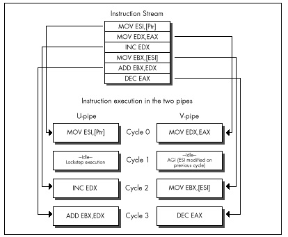
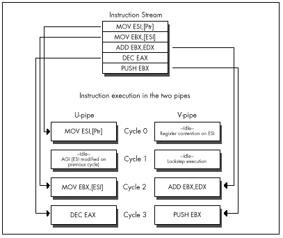

  ------------------------ --------------------------------- --------------------
  [Previous](20-04.html)   [Table of Contents](index.html)   [Next](21-02.html)
  ------------------------ --------------------------------- --------------------

Chapter 21\
 Unleashing the Pentium’s V-Pipe {#Heading1}
--------------------------------

### Focusing on Keeping Both Pentium Pipes Full {#Heading2}

The other day, my daughter suggested that we each draw the prettiest
picture we could, then see whose was prettier. I won’t comment on who
won, except to note that apparently a bolt of lightning zipping toward a
moose with antlers that bear an unfortunate resemblance to a propeller
beanie isn’t going to win me any scholarships to art school, if you
catch my drift. Anyway, my drawing happened to feature the word
“chartreuse” (because it rhymed with “moose” and “Zeus”—hence the
lightning; more than that I am not at liberty to divulge), and she
wanted to know if the moose was actually chartreuse. I had to admit that
I didn’t know, so we went to the dictionary, whereupon we learned that
chartreuse is a pale apple-green color. Then she brought up the Windows
Control Panel, pointed to the selection of predefined colors, and asked,
“Which of those is chartreuse?”—and I realized that I *still* didn’t
know.

Some things can be described perfectly with words, but others just have
to be experienced. Color is one such category, and Pentium optimization
is another. I’ve spent the last two chapters detailing the rules for
Pentium optimization, and I’ll spend half of this one doing so, as well.
That’s good; without understanding the fundamentals, we have no chance
of optimizing well. It’s not enough, though. We also need to look at a
real-world example of Pentium optimization in action, and we’ll do that
later in this chapter; after which, you should go out and do some
Pentium optimization on your own. Optimization is one of those things
that you can learn a lot about from reading, but ultimately it has to
sink into your pores as you do it—especially Pentium optimization
because the Pentium is perhaps the most complex (and rewarding) chip to
optimize for that I’ve ever seen.

In the last chapter, we explored the dual-execution-pipe nature of the
Pentium, and learned which instructions could pair (execute
simultaneously) in which pipes. Now we’re ready to look at AGIs and
register contention—two hazards that can prevent otherwise properly
written code from taking full advantage of the Pentium’s two pipes, and
can thereby keep your code from pushing the Pentium to maximum
performance.

### Address Generation Interlocks {#Heading3}

The Pentium is advertised as having a five-stage pipeline for each of
its execution units. All this means is that at any given time, up to
five instructions are in various stages of execution in each pipe; this
overlapping of execution is done for speed, so each instruction doesn’t
have to wait until the previous one has finished. The only way that the
Pentium’s pipelining directly affects the way you program is in the
areas of AGIs and register dependencies.

AGIs are *Address Generation Interlocks*, a fancy way of saying that if
a register is used to address memory, as is EBX in this instruction

    mov [ebx],eax

and the value of the register is not set far enough ahead for the
Pentium to perform the addressing calculations before the instruction
needs the address, then the Pentium will stall the pipe in which the
instruction is executing until the value becomes available and the
addressing calculations have been performed. Remember, also, that
instructions execute in lockstep on the Pentium, so if one pipe stalls
for a cycle, making its instruction take one cycle longer, that extends
by one cycle the time until the other pipe can begin its next
instruction, as well.

The rule for AGIs is simple: If you modify any part of a register during
a cycle, you cannot use that register to address memory during either
that cycle or the next cycle. If you try to do this, the Pentium will
simply stall the instruction that tries to use that register to address
memory until two cycles after the register was modified. This was true
on the 486 as well, but the Pentium’s new twist is that since more than
one instruction can execute in a single cycle, an AGI can stall an
instruction that’s as many as three instructions away from the changing
of the addressing register, as shown in Figure 21.1, and an AGI can also
cause a stall that costs as many as three instructions, as shown in
Figure 21.2. This means that AGIs are both much easier to cause and
potentially more expensive than on the 486, and you must keep a sharp
eye out for them. It also means that it’s often worth calculating a
memory pointer several instructions ahead of its actual use.
Unfortunately, this tends to extend the lifetimes of pointer registers
to span a greater number of instructions, making the Pentium’s
relatively small register set seem even smaller.

\
 **Figure 21.1**  *An AGI can stall up to three instructions later.*

As an example of a sort of AGI that’s new to the Pentium, consider the
following test for a NULL pointer, followed by the use of the pointer if
it’s not NULL:

    push ebx          ;U-pipe cycle 1
    mov  ebx,[Ptr]    ;V-pipe cycle 1
    and  ebx,ebx      ;U-pipe cycle 2
    jz   short IsNull ;V-pipe cycle 2
    mov  eax,[ebx]    ;U-pipe cycle 3 AGI stall
    mov  edx,[ebp-8]  ;V-pipe cycle 3 lockstep idle
                      ;U-pipe cycle 4 mov eax,[ebx]
                      ;V-pipe cycle 4 mov edx,[ebp-8]

This commonplace code loses a U-pipe cycle to the AGI caused by **AND
EBX,EBX**, followed by the attempt two instructions later to use EBX to
point to memory. The code loses a V-pipe cycle as well, because lockstep
execution won’t let the next V-pipe instruction execute until the paired
U-pipe instruction that suffered the AGI finishes. The solution is to
use **TEST EBX,EBX** instead of **AND; TEST** can’t modify EBX, so no
AGI occurs. Sure, **AND EBX,EBX** doesn’t modify EBX either, but the
Pentium doesn’t know that, so it has to insert the AGI.

\
 **Figure 21.2**  *An AGI can cost as many as 3 cycles.*

  ------------------------ --------------------------------- --------------------
  [Previous](20-04.html)   [Table of Contents](index.html)   [Next](21-02.html)
  ------------------------ --------------------------------- --------------------

* * * * *

Graphics Programming Black Book © 2001 Michael Abrash
