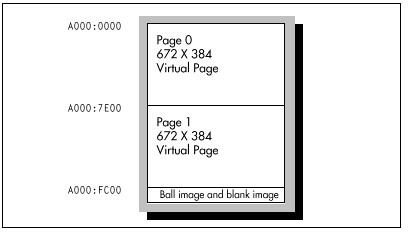

#### Smooth Panning {#Heading7}

The first thing you'll notice upon running the sample program is the
remarkable smoothness with which the display pans from side-to-side and
up-and-down. That the display can pan at all is made possible by two VGA
features: 256K of display memory and the virtual screen capability. Even
the most memory-hungry of the VGA modes, mode 12H (640x480), uses only
37.5K per plane, for a total of 150K out of the total 256K of VGA
memory. The medium-resolution mode, mode 10H (640x350), requires only
28K per plane, for a total of 112K. Consequently, there is room in VGA
memory to store more than two full screens of video data in mode 10H
(which the sample program uses), and there is room in all modes to store
a larger virtual screen than is actually displayed. In the sample
program, memory is organized as two virtual screens, each with a
resolution of 672x384, as shown in Figure 23.2. The area of the virtual
screen actually displayed at any given time is selected by setting the
display memory address at which to begin fetching video data; this is
set by way of the start address registers (Start Address High, CRTC
register 0CH, and Start Address Low, CRTC register 0DH). Together these
registers make up a 16-bit display memory address at which the CRTC
begins fetching data at the beginning of each video frame. Increasing
the start address causes higher-memory areas of the virtual screen to be
displayed. For example, the Start Address High register could be set to
80H and the Start Address Low register could be set to 00H in order to
cause the display screen to reflect memory starting at offset 8000H in
each plane, rather than at the default offset of 0.

The logical height of the virtual screen is defined by the amount of VGA
memory available. As the VGA scans display memory for video data, it
progresses from the start address toward higher memory one scan line at
a time, until the frame is completed. Consequently, if the start address
is increased, lines farther toward the bottom of the virtual screen are
displayed; in effect, the virtual screen appears to scroll up on the
physical screen.

The logical width of the virtual screen is defined by the Offset
register (CRTC register 13H), which allows redefinition of the number of
words of display memory considered to make up one scan line. Normally,
40 words of display memory constitute a scan line; after the CRTC scans
these 40 words for 640 pixels worth of data, it advances 40 words from
the start of that scan line to find the start of the next scan line in
memory. This means that displayed scan lines are contiguous in memory.
However, the Offset register can be set so that scan lines are logically
wider (or narrower, for that matter) than their displayed width. The
sample program sets the Offset register to 2AH, making the logical width
of the virtual screen 42 words, or 42 \* 2 \* 8 = 672 pixels, as
contrasted with the actual width of the mode 10h screen, 40 words or 640
pixels. The logical height of the virtual screen in the sample program
is 384; this is accomplished simply by reserving 84 \* 384 contiguous
bytes of VGA memory for the virtual screen, where 84 is the virtual
screen width in bytes and 384 is the virtual screen height in scan
lines.

The start address is the key to panning around the virtual screen. The
start address registers select the row of the virtual screen that maps
to the top of the display; panning down a scan line requires only that
the start address be increased by the logical scan line width in bytes,
which is equal to the Offset register times two. The start address
registers select the column that maps to the left edge of the display as
well, allowing horizontal panning, although in this case only relatively
coarse byte-sized adjustments—panning by eight pixels at a time—are
supported.

Smooth horizontal panning is provided by the Horizontal Pel Panning
register, AC register 13H, working in conjunction with the start
address. Up to 7 pixels worth of single pixel panning of the displayed
image to the left is performed by increasing the Horizontal Pel Panning
register from 0 to 7. This exhausts the range of motion possible via the
Horizontal Pel Panning register; the next pixel's worth of smooth
panning is accomplished by incrementing the start address by one and
resetting the Horizontal Pel Panning register to 0. Smooth horizontal
panning should be viewed as a series of fine adjustments in the 8-pixel
range between coarse byte-sized adjustments.

A horizontal panning oddity: Alone among VGA modes, text mode (in most
cases) has 9 dots per character clock. Smooth panning in this mode
requires cycling the Horizontal Pel Panning register through the values
8, 0, 1, 2, 3, 4, 5, 6, and 7. 8 is the "no panning" setting.

There is one annoying quirk about programming the AC. When the AC Index
register is set, only the lower five bits are used as the internal
index. The next most significant bit, bit 5, controls the source of the
video data sent to the monitor by the VGA. When bit 5 is set to 1, the
output of the palette RAM, derived from display memory, controls the
displayed pixels; this is normal operation. When bit 5 is 0, video data
does not come from the palette RAM, and the screen becomes a solid
color. The only time bit 5 of the AC Index register should be 0 is
during the setting of a palette RAM register, since the CPU is only able
to write to palette RAM when bit 5 is 0. (Some VGAs do not enforce this,
but you should always set bit 5 to 0 before writing to the palette RAM
just to be safe.) Immediately after setting palette RAM, however, 20h
(or any other value with bit 5 set to 1) should be written to the AC
Index register to restore normal video, and at all other times bit 5
should be set to 1.

> 
> By the way, palette RAM can be set via the BIOS video interrupt
> (interrupt 10H), function 10H. Whenever an VGA function can be performed
> reasonably well through a BIOS function, as it can in the case of
> setting palette RAM, it should be, both because there is no point in
> reinventing the wheel and because the BIOS may well mask
> incompatibilities between the IBM VGA and VGA clones.