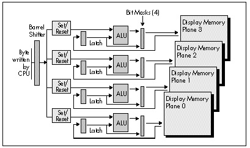

  ------------------------ --------------------------------- --------------------
  [Previous](25-02.html)   [Table of Contents](index.html)   [Next](25-04.html)
  ------------------------ --------------------------------- --------------------

It's worth pointing out again that the bit mask operates on the data in
the latches, not on the data in display memory. This makes the bit mask
a flexible resource that with a little imagination can be used for some
interesting purposes. For example, you could fill the latches with a
solid background color (by writing the color somewhere in display
memory, then reading that location to load the latches), and then use
the Bit Mask register (or write mode 3, as we'll see later) as a mask
through which to draw a foreground color stencilled into the background
color *without* reading display memory first. This only works for
writing whole bytes at a time (clipped bytes require the use of the bit
mask; unfortunately, we're already using it for stencilling in this
case), but it completely eliminates reading display memory and does
foreground-plus-background drawing in one blurry-fast pass.

  ------------------- --------------------------------------------------------------------------------------------------------------------------------------------------------------------------------------------------------------------------------------------------------------------------------------------------------------------------------------------------------------------------------------------------------------------------------------------------------------------------------------------------------------------------------------------------------------------------------------------------------------
     *This last-described example is a good illustration of how I'd suggest you approach the VGA: As a rich collection of hardware resources that can profitably be combined in some non-obvious ways. Don't let yourself be limited by the obvious applications for the latches, bit mask, write modes, read modes, map mask, ALUs, and set/reset circuitry. Instead, try to imagine how they could work together to perform whatever task you happen to need done at any given time. I've made my code as much as four times faster by doing this, as the discussion of Mode X in Chapters 47-49 demonstrates.*
  ------------------- --------------------------------------------------------------------------------------------------------------------------------------------------------------------------------------------------------------------------------------------------------------------------------------------------------------------------------------------------------------------------------------------------------------------------------------------------------------------------------------------------------------------------------------------------------------------------------------------------------------

The example code in Listing 25.1 is designed to illustrate the use of
the Data Rotate and Bit Mask registers, and is not as fast or as
complete as it might be. The case where text *is* byte-aligned could be
detected and performed much faster, without the use of the Bit Mask or
Data Rotate registers and with only one display memory access per font
byte (to write the font byte), rather than four (to read display memory
and write the font byte to each of the two bytes the character spans).
Likewise, non-aligned text drawing could be streamlined to one display
memory access per byte by having the CPU rotate and combine the font
data directly, rather than setting up the VGA's hardware to do it.
(Listing 25.1 was designed to illustrate VGA data rotation and bit
masking rather than the fastest way to draw text. We'll see faster
text-drawing code soon.) One excellent rule of thumb is to minimize
display memory accesses of all types, especially reads, which tend to be
considerably slower than writes. Also, in Listing 25.1 it would be
faster to use a table lookup to calculate the bit masks for the two
halves of each character rather than the shifts used in the example.

For another (and more complex) example of drawing bit-mapped text on the
VGA, see John Cockerham's article, "Pixel Alignment of EGA Fonts," *PC
Tech Journal*, January, 1987. Parenthetically, I'd like to pass along
John's comment about the VGA: "When programming the VGA, *everything* is
complex."

He's got a point there.

### The VGA's Set/Reset Circuitry {#Heading5}

At last we come to the final aspect of data flow through the GC on write
mode 0 writes: the set/reset circuitry. Figure 25.3 shows data flow on a
write mode 0 write. The only difference between this figure and Figure
25.1 is that on its way to each plane potentially the rotated CPU data
passes through the set/reset circuitry, which may or may not replace the
CPU data with set/reset data. Briefly put, the set/reset circuitry
enables the programmer to elect to independently replace the CPU data
for each plane with either 00 or 0FFH.

What is the use of such a feature? Well, the standard way to control
color is to set the Map Mask register to enable writes to only those
planes that need to be set to produce the desired color. For example,
the Map Mask register would be set to 09H to draw in high-intensity
blue; here, bits 0 and 3 are set to 1, so only the blue plane (plane 0)
and the intensity plane (plane 3) are written to.

\
 **Figure 25.3**  *Data flow during a write mode 0 write operation.*

Remember, though, that planes that are disabled by the Map Mask register
are not written to or modified in any way. This means that the above
approach works only if the memory being written to is zeroed; if,
however, the memory already contains non-zero data, that data will
remain in the planes disabled by the Map Mask, and the end result will
be that some planes contain the data just written and other planes
contain old data. In short, color control using the Map Mask does not
force all planes to contain the desired color. In particular, it is not
possible to force some planes to zero and other planes to one in a
single write with the Map Mask register.

The program in Listing 25.2 illustrates this problem. A green pattern
(plane 1 set to 1, planes 0, 2, and 3 set to 0) is first written to
display memory. Display memory is then filled with blue (only plane 0
set to 1), with a Map Mask setting of 01H. Where the blue crosses the
green, cyan is produced, rather than blue, because the Map Mask register
setting of 01H that produces blue leaves the green plane (plane 1)
unchanged. In order to generate blue unconditionally, it would be
necessary to set the Map Mask register to 0FH, clear memory, and then
set the Map Mask register to 01H and fill with blue.

  ------------------------ --------------------------------- --------------------
  [Previous](25-02.html)   [Table of Contents](index.html)   [Next](25-04.html)
  ------------------------ --------------------------------- --------------------

* * * * *

Graphics Programming Black Book © 2001 Michael Abrash
