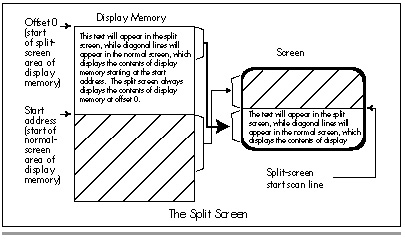

## Chapter 30\
 Video Est Omnis Divisa {#Heading1}

### The Joys and Galling Problems of Using Split Screens on the EGA and VGA {#Heading2}

The ability to split the screen into two largely independent portions
one—displayed above the other on the screen—is one of the more
intriguing capabilities of the VGA and EGA. The split screen feature can
be used for popups (including popups that slide smoothly onto the
screen), or simply to display two separate portions of display memory on
a single screen. While it's possible to accomplish the same effects
purely in software without using the split screen, software solutions
tend to be slow and hard to implement.

By contrast, the basic operation of the split screen is fairly simple,
once you grasp the various coding tricks required to pull it off, and
understand the limitations and pitfalls—like the fact that the EGA's
split screen implementation is a little buggy. Furthermore, panning with
the split screen enabled is not as simple as it might seem. All in all,
we do have some ground to cover.

Let's start with the basic operation of the split screen.

### How the Split Screen Works {#Heading3}

The *operation* of the split screen is simplicity itself. A split screen
start scan line value is programmed into two EGA registers or three VGA
registers. (More on exactly which registers in a moment.) At the
beginning of each frame, the video circuitry begins to scan display
memory for video data starting at the address specified by the start
address registers, just as it normally would. When the video circuitry
encounters the specified split screen start scan line in the course of
scanning video data onto the screen, it completes that scan line
normally, then resets the internal pointer which addresses the next byte
of display memory to be read for video data to zero. Display memory from
address zero onward is then scanned for video data in the usual way,
progressing toward the high end of memory. At the end of the frame, the
pointer to the next byte of display memory to scan is reloaded from the
start address registers, and the whole process starts over.

The net effect: The contents of display memory starting at offset zero
are displayed starting at the scan line following the specified split
screen start scan line, as shown in Figure 30.1. It's important to
understand that the scan line that matches the split screen scan line is
*not* part of the split screen; the split screen starts on the
*following* scan line. So, for example, if the split screen scan line is
set to zero, the split screen actually starts at scan line 1, the second
scan line from the top of the screen.

If both the start address and the split screen start scan line are set
to 0, the data at offset zero in display memory is displayed as both the
first scan line on the screen *and* the second scan line. There is no
way to make the split screen cover the entire screen—it always comes up
at least one scan line short.

\
 **Figure 30.1**  *Display memory and the split screen.*

So, where is the split screen start scan line stored? The answer varies
a bit, depending on whether you're talking about the EGA or the VGA. On
the EGA, the split screen start scan line is a 9-bit value, with bits
7-0 stored in the Line Compare register (CRTC register 18H) and bit 8
stored in bit 4 of the Overflow register (CRTC register 7). Other bits
in the Overflow register serve as the high bits of other values, such as
the vertical total and the vertical blanking start. Since EGA registers
are—alas!—not readable, you must know the correct settings for the other
bits in the Overflow registers to use the split screen on an EGA.
Fortunately, there are only two standard Overflow register settings on
the EGA: 11H for 200-scan-line modes and 1FH for 350-scan-line modes.

The VGA, of course, presents no such problem in setting the split screen
start scan line, for it has readable registers. However, the VGA
supports a 10-bit split screen start scan line value, with bits 8-0
stored just as with the EGA, and bit 9 stored in bit 6 of the Maximum
Scan Line register (CRTC register 9).

Turning the split screen on involves nothing more than setting all bits
of the split screen start scan line to the scan line after which you
want the split screen to start appearing. (Of course, you'll probably
want to change the start address before using the split screen;
otherwise, you'll just end up displaying the memory at offset zero
*twice:* once in the normal screen and once in the split screen.)
Turning off the split screen is a simple matter of setting the split
screen start scan line to a value equal to or greater than the last scan
line displayed; the safest such approach is to set all bits of the split
screen start scan line to 1. (That is, in fact, the split screen start
scan line value programmed by the BIOS during a mode set.)

#### The Split Screen in Action {#Heading4}

All of these points are illustrated by Listing 30.1. Listing 30.1 fills
display memory starting at offset zero (the split screen area of memory)
with text identifying the split screen, fills display memory starting at
offset 8000H with a graphics pattern, and sets the start address to
8000H. At this point, the normal screen is being displayed (the split
screen start scan line is still set to the BIOS default setting, with
all bits equal to 1, so the split screen is off), with the pixels based
on the contents of display memory at offset 8000H. The contents of
display memory between offset 0 and offset 7FFFH are not visible at all.

Listing 30.1 then slides the split screen up from the bottom of the
screen, one scan line at a time. The split screen slides halfway up the
screen, bounces down a quarter of the screen, advances another
half-screen, drops another quarter-screen, and finally slides all the
way up to the top. If you've never seen the split screen in action, you
should run Listing 30.1; the smooth overlapping of the split screen on
top of the normal display is a striking effect.

Listing 30.1 isn't done just yet, however. After a keypress, Listing
30.1 demonstrates how to turn the split screen off (by setting all bits
of the split screen start scan line to 1). After another keypress,
Listing 30.1 shows that the split screen can never cover the whole
screen, by setting the start address to 0 and then flipping back and
forth between the normal screen and the split screen with a split screen
start scan line setting of zero. Both the normal screen and the split
screen display the same text, but the split screen displays it one scan
line lower, because the split screen doesn't start until *after* the
first scan line, and that produces a jittering effect as the program
switches the split screen on and off. (On the EGA, the split screen may
display *two* scan lines lower, for reasons I'll discuss shortly.)
