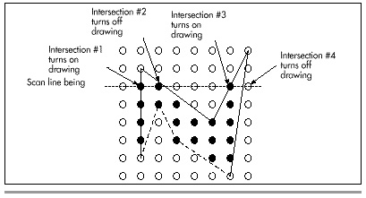
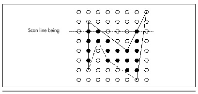

Chapter 40\
 Of Songs, Taxes, and the Simplicity of Complex Polygons {#Heading1}
--------------------------------------------------------

### Dealing with Irregular Polygonal Areas {#Heading2}

Every so often, my daughter asks me to sing her to sleep. (If you've
ever heard me sing, this may cause you concern about either her hearing
or her judgement, but love knows no bounds.) As any parent is well
aware, singing a young child to sleep can easily take several hours, or
until sunrise, whichever comes last. One night, running low on
children's songs, I switched to a Beatles medley, and at long last her
breathing became slow and regular. At the end, I softly sang "A Hard
Day's Night," then quietly stood up to leave. As I tiptoed out, she
said, in a voice not even faintly tinged with sleep, "Dad, what do they
mean, ‘working like a dog'? Chasing a stick? That doesn't make sense;
people don't chase sticks."

That led us into a discussion of idioms, which made about as much sense
to her as an explanation of quantum mechanics. Finally, I fell back on
my standard explanation of the Universe, which is that a lot of the time
it simply doesn't make sense.

As a general principle, that explanation holds up remarkably well. (In
fact, having just done my taxes, I think Earth is actually run by
blob-creatures from the planet Mrxx, who are helplessly doubled over
with laughter at the ridiculous things they can make us do. "Let's make
them get Social Security numbers for their pets next year!" they're
saying right now, gasping for breath.) Occasionally, however, one has
the rare pleasure of finding a corner of the Universe that makes sense,
where everything fits together as if preordained.

Filling arbitrary polygons is such a case.

### Filling Arbitrary Polygons {#Heading3}

In Chapter 38, I described three types of polygons: convex, nonconvex,
and complex. *The RenderMan Companion*, a terrific book by Steve Upstill
(Addison-Wesley, 1990) has an intuitive definition of *convex*: If a
rubber band stretched around a polygon touches all vertices in the order
they're defined, then the polygon is convex. If a polygon has
intersecting edges, it's complex. If a polygon doesn't have intersecting
edges but isn't convex, it's nonconvex. Nonconvex is a special case of
complex, and convex is a special case of nonconvex. (Which, I'm well
aware, makes nonconvex a lousy name—noncomplex would have been
better—but I'm following X Window System nomenclature here.)

The reason for distinguishing between these three types of polygons is
that the more specialized types can be filled with markedly faster
approaches. Complex polygons require the slowest approach; however, that
approach will serve to fill any polygon of any sort. Nonconvex polygons
require less sorting, because edges never cross. Convex polygons can be
filled fastest of all by simply scanning the two sides of the polygon,
as we saw in Chapter 39.

Before we dive into complex polygon filling, I'd like to point out that
the code in this chapter, like all polygon filling code I've ever seen,
requires that the caller describe the type of the polygon to be filled.
Often, however, the caller doesn't know what type of polygon it's
passing, or specifies complex for simplicity, because that will work for
all polygons; in such a case, the polygon filler will use the slow
complex-fill code even if the polygon is, in fact, a convex polygon. In
Chapter 41, I'll discuss one way to improve this situation.

#### Active Edges {#Heading4}

The basic premise of filling a complex polygon is that for a given scan
line, we determine all intersections between the polygon's edges and
that scan line and then fill the spans between the intersections, as
shown in Figure 40.1. (Section 3.6 of Foley and van Dam's *Computer
Graphics*, Second Edition provides an overview of this and other aspects
of polygon filling.) There are several rules that might be used to
determine which spans are drawn and which aren't; we'll use the odd/even
rule, which specifies that drawing turns on after odd-numbered
intersections (first, third, and so on) and off after even-numbered
intersections.

The question then becomes how can we most efficiently determine which
edges cross each scan line and where? As it happens, there is a great
deal of coherence from one scan line to the next in a polygon edge list,
because each edge starts at a given Y coordinate and continues unbroken
until it ends. In other words, edges don't leap about and stop and start
randomly; the X coordinate of an edge at one scan line is a consistent
delta from that edge's X coordinate at the last scan line, and that is
consistent for the length of the line.

\
 **Figure 40.1**  *Filling one scan line by finding intersecting edges.*

This allows us to reduce the number of edges that must be checked for
intersection; on any given scan line, we only need to check for
intersections with the currently active edges—edges that start on that
scan line, plus all edges that start on earlier (above) scan lines and
haven't ended yet—as shown in Figure 40.2. This suggests that we can
proceed from the top scan line of the polygon to the bottom, keeping a
running list of currently active edges—called the *active edge table*
(AET)—with the edges sorted in order of ascending X coordinate of
intersection with the current scan line. Then, we can simply fill each
scan line in turn according to the list of active edges at that line.

\
 **Figure 40.2**  *Checking currently active edges (solid lines).*

Maintaining the AET from one scan line to the next involves three steps:
First, we must add to the AET any edges that start on the current scan
line, making sure to keep the AET X-sorted for efficient odd/even
scanning. Second, we must remove edges that end on the current scan
line. Third, we must advance the X coordinates of active edges with the
same sort of error term-based, Bresenham's-like approach we used for
convex polygons, again ensuring that the AET is X-sorted after advancing
the edges.
