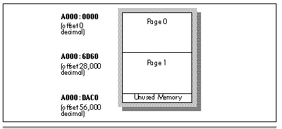

  ------------------------ --------------------------------- --------------------
  [Previous](44-04.html)   [Table of Contents](index.html)   [Next](44-06.html)
  ------------------------ --------------------------------- --------------------

Given the above assumptions, drawing text is easy; we simply copy each
byte of each character to the appropriate location in display memory,
and *voila*, we're done. Text copying is done in write mode 0, in which
the byte written to display memory is copied to all four planes at once;
hence, 1-bits turn into white (color value 0FH, with 1-bits in all four
planes), and 0-bits turn into black (color value 0). This is faster than
using write mode 3 because write mode 3 requires a read/write of display
memory (or at least preloading the latches with the background color),
while the write mode 0 approach requires only a write to display memory.

  ------------------- ----------------------------------------------------------------------------------------------------------------------------------------------------------------------------------------------------------------------------------------------------------------------------------------------------------------------------------------------------------------------------------------------------------------------------------------------------------------------------------------------------------------------------------------------------------------------------------------------------------------------------------------------------------------------------------------------------------------------------------------------------------------------------------------------------------------------------------------------------------------------------------------------------------------------------------------------------------
     *Is write mode 0 always the best way to do text? Not at all. The write mode 0 approach described above draws both foreground and background pixels within the character box, forcing the background pixels to black at the same time that it forces the foreground pixels to white. If you want to draw transparent text (that is, draw only the character pixels, not the surrounding background box), write mode 3 is ideal. Also, matters get far more complicated if characters that aren't 8 pixels wide are drawn, or if characters are drawn starting at arbitrary pixel locations, without the multiple-of-8 column restriction, so that rotation and masking are required. Lastly, the Map Mask register can be used to draw text in colors other than white—but only if the background is black. Otherwise, the data remaining in the planes protected by the Map Mask will remain and can interfere with the colors of the text being drawn.*
  ------------------- ----------------------------------------------------------------------------------------------------------------------------------------------------------------------------------------------------------------------------------------------------------------------------------------------------------------------------------------------------------------------------------------------------------------------------------------------------------------------------------------------------------------------------------------------------------------------------------------------------------------------------------------------------------------------------------------------------------------------------------------------------------------------------------------------------------------------------------------------------------------------------------------------------------------------------------------------------------

I'm not going to delve any deeper into the considerable issues of
drawing VGA text; I just want to sensitize you to the existence of
approaches other than the ones used in Listings 44.1 and 44.2. On the
VGA, the rule is: If there's something you want to do, there probably
are 10 ways to do it, each with unique strengths and weaknesses. Your
mission, should you decide to accept it, is to figure out which one is
best for your particular application.

#### Page Flipping {#Heading7 align="center"}

Now that we know how to update the screen reasonably quickly, it's time
to get on to the fun stuff. Page flipping answers the second requirement
for animation, by keeping bitmap changes off the screen until they're
complete. In other words, page flipping guarantees that partially
updated bitmaps are never seen.

How is it possible to update a bitmap without seeing the changes as
they're made? Easy—with page flipping, there are *two* bitmaps; the
program shows you one bitmap while it updates the other. Conceptually,
it's that simple. In practice, unfortunately, it's not so simple,
because of the design of the VGA. To understand why that is, we must
look at how the VGA turns bytes in display memory into pixels on the
screen.

The VGA bitmap is a linear 64 K block of memory. (True, most adapters
nowadays are SuperVGAs with more than 256 K of display memory, but every
make of SuperVGA has its own way of letting you access that extra
memory, so going beyond standard VGA is a daunting and difficult task.
Also, it's hard to manipulate the large frame buffers of SuperVGA modes
fast enough for real-time animation.) Normally, the VGA picks up the
first byte of memory (the byte at offset 0) and displays the
corresponding 8 pixels on the screen, then picks up the byte at offset 1
and displays the next 8 pixels, and so on to the end of the screen.
However, the offset of the first byte of display memory picked up during
each frame is not fixed at 0, but is rather programmable by way of the
Start Address High and Low registers, which together store the 16-bit
offset in display memory at which the bitmap to be displayed during the
next frame starts. So, for example, in mode 10H (640x350, 16 colors), a
large enough bitmap to store a complete screen of information can be
stored at display memory offsets 0 through 27,999, and *another* full
bitmap could be stored at offsets 28,000 through 55,999, as shown in
Figure 44.1. (I'm discussing 640x350 mode at the moment for good reason;
we'll get to 640x480 shortly.) When the Start Address registers are set
to 0, the first bitmap (or page) is displayed; when they are set to
28,000, the second bitmap is displayed. Page flipped animation can be
performed by displaying page 0 and drawing to page 1, then setting the
start address to page 1 to display that page and drawing to page 0, and
so on *ad infinitum.*

\
 **Figure 44.1**  *Memory allocation for mode 10h page flipping.*

  ------------------------ --------------------------------- --------------------
  [Previous](44-04.html)   [Table of Contents](index.html)   [Next](44-06.html)
  ------------------------ --------------------------------- --------------------

* * * * *

Graphics Programming Black Book © 2001 Michael Abrash
