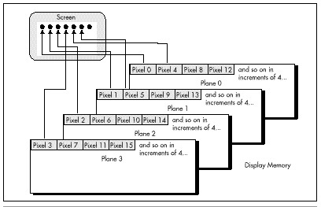

  ------------------------ --------------------------------- --------------------
  [Previous](47-02.html)   [Table of Contents](index.html)   [Next](47-04.html)
  ------------------------ --------------------------------- --------------------

After setting up mode 13H, Listing 47.1 alters the vertical counts and
timings to select 480 visible scan lines. (There's no need to alter any
horizontal values, because mode 13H and Mode X both have 320-pixel
horizontal resolutions.) The Maximum Scan Line register is programmed to
double scan each line (that is, repeat each scan line twice), however,
so we get an effective vertical resolution of 240 scan lines. It is, in
fact, possible to get 400 or 480 independent scan lines in 256-color
mode, as discussed in Chapter 31 and 32; however, 400-scan-line modes
lack square pixels and can't support simultaneous off-screen memory and
page flipping. Furthermore, 480-scan-line modes lack page flipping
altogether, due to memory constraints.

At the same time, Listing 47.1 programs the VGA's bitmap to a planar
organization that is similar to that used by the 16-color modes, and
utterly different from the linear bitmap of mode 13H. The bizarre bitmap
organization of Mode X is shown in Figure 47.1. The first pixel (the
pixel at the upper left corner of the screen) is controlled by the byte
at offset 0 in plane 0. (The one thing that Mode X blessedly has in
common with mode 13H is that each pixel is controlled by a single byte,
eliminating the need to mask out individual bits of display memory.) The
second pixel, immediately to the right of the first pixel, is controlled
by the byte at offset 0 in plane 1. The third pixel comes from offset 0
in plane 2, and the fourth pixel from offset 0 in plane 3. Then, the
fifth pixel is controlled by the byte at offset 1 in plane 0, and that
cycle continues, with each group of four pixels spread across the four
planes at the same address. The offset M of pixel N in display memory is
M = N/4, and the plane P of pixel N is P = N mod 4. For display memory
writes, the plane is selected by setting bit P of the Map Mask register
(Sequence Controller register 2) to 1 and all other bits to 0; for
display memory reads, the plane is selected by setting the Read Map
register (Graphics Controller register 4) to P.

It goes without saying that this is one ugly bitmap organization,
requiring a lot of overhead to manipulate a single pixel. The write
pixel code shown in Listing 47.2 must determine the appropriate plane
and perform a 16-bit **OUT** to select that plane for each pixel
written, and likewise for the read pixel code shown in Listing 47.3.
Calculating and mapping in a plane once for each pixel written is
scarcely a recipe for performance.

That's all right, though, because most graphics software spends little
time drawing individual pixels. I've provided the write and read pixel
routines as basic primitives, and so you'll understand how the bitmap is
organized, but the building blocks of high-performance graphics software
are fills, copies, and bitblts, and it's there that Mode X shines.

\
 **Figure 47.1**  *Mode X display memory organization.*

**LISTING 47.2 L47-2.ASM**

    ; Mode X (320x240, 256 colors) write pixel routine. Works on all VGAs.
    ; No clipping is performed.
    ; C near-callable as:
    ;
    ;    void WritePixelX(int X, int Y, unsigned int PageBase, int Color);

    SC_INDEX      equ    03c4h              ;Sequence Controller Index
    MAP_MASK      equ    02h                ;index in SC of Map Mask register
    SCREEN_SEG    equ    0a000h             ;segment of display memory in mode X
    SCREEN_WIDTH  equ    80                 ;width of screen in bytes from one scan line
                                            ; to the next

    parms   struc
            dw      2 dup (?)               ;pushed BP and return address
    X       dw      ?                       ;X coordinate of pixel to draw
    Y       dw      ?                       ;Y coordinate of pixel to draw
    PageBase dw     ?                       ;base offset in display memory of page in
                                            ; which to draw pixel
    Color   dw      ?                       ;color in which to draw pixel
    parms   ends

            .model  small
            .code
            public  _WritePixelX
    _WritePixelX    proc    near
            push    bp                      ;preserve caller's stack frame
            mov     bp,sp                   ;point to local stack frame

            mov     ax,SCREEN_WIDTH
            mul     [bp+Y]                  ;offset of pixel's scan line in page
            mov     bx,[bp+X]
            shr     bx,1
            shr     bx,1                    ;X/4 = offset of pixel in scan line
            add     bx,ax                   ;offset of pixel in page
            add     bx,[bp+PageBase]        ;offset of pixel in display memory
            mov     ax,SCREEN_SEG
            mov     es,ax                   ;point ES:BX to the pixel's address

            mov     cl,byte ptr [bp+X]
            and     cl,011b                 ;CL = pixel's plane
            mov     ax,0100h + MAP_MASK     ;AL = index in SC of Map Mask reg
            shl     ah,cl                   ;set only the bit for the pixel's plane to 1
            mov     dx,SC_INDEX             ;set the Map Mask to enable only the
            out     dx,ax                   ; pixel's plane

            mov     al,byte ptr [bp+Color]
            mov     es:[bx],al              ;draw the pixel in the desired color

            pop     bp                      ;restore caller's stack frame
            ret
    _WritePixelX    endp
            end

**LISTING 47.3 L47-3.ASM**

    ; Mode X (320x240, 256 colors) read pixel routine. Works on all VGAs.
    ; No clipping is performed.
    ; C near-callable as:
    ;
    ;    unsigned int ReadPixelX(int X, int Y, unsigned int PageBase);

    GC_INDEX     equ    03ceh               ;Graphics Controller Index
    READ_MAP     equ    04h                 ;index in GC of the Read Map register
    SCREEN_SEG   equ    0a000h              ;segment of display memory in mode X
    SCREEN_WIDTH equ    80                  ;width of screen in bytes from one scan line
                                            ; to the next
    parms   struc
            dw      2 dup (?)               ;pushed BP and return address
    X       dw      ?                       ;X coordinate of pixel to read
    Y       dw      ?                       ;Y coordinate of pixel to read
    PageBase dw     ?                       ;base offset in display memory of page from
                                            ; which to read pixel
    parms   ends

            .model  small
            .code
            public  _ReadPixelX
    _ReadPixelX     proc    near
            push    bp                      ;preserve caller's stack frame
            mov     bp,sp                   ;point to local stack frame

            mov     ax,SCREEN_WIDTH
            mul     [bp+Y]                  ;offset of pixel's scan line in page
            mov     bx,[bp+X]
            shr     bx,1
            shr     bx,1                    ;X/4 = offset of pixel in scan line
            add     bx,ax                   ;offset of pixel in page
            add     bx,[bp+PageBase]        ;offset of pixel in display memory
            mov     ax,SCREEN_SEG
            mov     es,ax                   ;point ES:BX to the pixel's address

            mov     ah,byte ptr [bp+X]
            and     ah,011b ;AH = pixel's plane
            mov     al,READ_MAP             ;AL = index in GC of the Read Map reg
            mov     dx,GC_INDEX             ;set the Read Map to read the pixel's
            out     dx,ax                   ; plane

            mov     al,es:[bx]              ;read the pixel's color
            sub     ah,ah                   ;convert it to an unsigned int

            pop     bp                      ;restore caller's stack frame
            ret
    _ReadPixelX     endp
            end

  ------------------------ --------------------------------- --------------------
  [Previous](47-02.html)   [Table of Contents](index.html)   [Next](47-04.html)
  ------------------------ --------------------------------- --------------------

* * * * *

Graphics Programming Black Book © 2001 Michael Abrash
