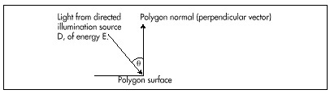
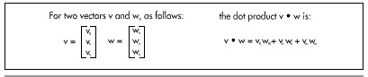

#### Shading {#Heading4}

So far, the polygons out of which our animated objects have been built
have had colors of fixed intensities. For example, a face of a cube
might be blue, or green, or white, but whatever color it is, that color
never brightens or dims. Fixed colors are easy to implement, but they
don't make for very realistic animation. In the real world, the
intensity of the color of a surface varies depending on how brightly it
is illuminated. The ability to simulate the illumination of a surface,
or shading, is the next feature we'll add to X-Sharp.

The overall shading of an object is the sum of several types of shading
components. *Ambient shading* is illumination by what you might think of
as background light, light that's coming from all directions; all
surfaces are equally illuminated by ambient light, regardless of their
orientation. *Directed lighting*, producing diffuse shading, is
illumination from one or more specific light sources. Directed light has
a specific direction, and the angle at which it strikes a surface
determines how brightly it lights that surface. *Specular reflection* is
the tendency of a surface to reflect light in a mirrorlike fashion.
There are other sorts of shading components, including transparency and
atmospheric effects, but the ambient and diffuse-shading components are
all we're going to deal with in X-Sharp.

#### Ambient Shading {#Heading5 align="center"}

The basic model for both ambient and diffuse shading is a simple one.
Each surface has a reflectivity between 0 and 1, where 0 means all light
is absorbed and 1 means all light is reflected. A certain amount of
light energy strikes each surface. The energy (intensity) of the light
is expressed such that if light of intensity 1 strikes a surface with
reflectivity 1, then the brightest possible shading is displayed for
that surface. Complicating this somewhat is the need to support color;
we do this by separating reflectance and shading into three components
each—red, green, and blue—and calculating the shading for each color
component separately for each surface.

Given an ambient-light red intensity of IA~red~ and a surface red
reflectance R~red~, the displayed red ambient shading for that surface,
as a fraction of the maximum red intensity, is simply min(IA~red~x
R~red~, 1). The green and blue color components are handled similarly.
That's really all there is to ambient shading, although of course we
must design some way to map displayed color components into the
available palette of colors; I'll do that in the next chapter. Ambient
shading isn't the whole shading picture, though. In fact, scenes tend to
look pretty bland without diffuse shading.

#### Diffuse Shading {#Heading6 align="center"}

Diffuse shading is more complicated than ambient shading, because the
effective intensity of directed light falling on a surface depends on
the angle at which it strikes the surface. According to Lambert's law,
the light energy from a directed light source striking a surface is
proportional to the cosine of the angle at which it strikes the surface,
with the angle measured relative to a vector perpendicular to the
polygon (a polygon normal), as shown in Figure 54.1. If the red
intensity of directed light is ID~red~, the red reflectance of the
surface is R~red~, and the angle between the incoming directed light and
the surface's normal is theta, then the displayed red diffuse shading
for that surface, as a fraction of the largest possible red intensity,
is min (ID~red~xR~red~xcos(θ), 1).

That's easy enough to calculate—but seemingly slow. Determining the
cosine of an angle can be sped up with a table lookup, but there's also
the task of figuring out the angle, and, all in all, it doesn't seem
that diffuse shading is going to be speedy enough for our purposes.
Consider this, however: According to the properties of the dot product
(denoted by the operator "•", as shown in Figure 54.2), cos(q)=(v•w)/
|v| x |w| ), where v and w are vectors, q is the angle between v and w,
and |v| is the length of v. Suppose, now, that v and w are unit vectors;
that is, vectors exactly one unit long. Then the above equation reduces
to cos(q)=v•w. In other words, we can calculate the cosine between N,
the unit-normal vector (one-unit-long perpendicular vector) of a
polygon, and L', the reverse of a unit vector describing the direction
of a light source, with just three multiplies and two adds. (I'll
explain why the light-direction vector must be reversed later.) Once we
have that, we can easily calculate the red diffuse shading from a
directed light source as min(ID~red~xR~red~x(L'• N), 1) and likewise for
the green and blue color components.

\
 **Figure 54.1**  *Illumination by a directed light source*

\
 **Figure 54.2**  *The dot product of two vectors.*

The overall red shading for each polygon can be calculated by summing
the ambient-shading red component with the diffuse-shading component
from each light source, as in min((IA~red~xR~red~) +
(ID~red0~xR~red~x(L~0~' • N)) + (ID~red1~xR~red~x(L~1~' • N)) +..., 1)
where ID~red0~ and L~0~' are the red intensity and the reversed
unit-direction vector, respectively, for spotlight 0. Listing 54.2 shows
the X-Sharp module DRAWPOBJ.C, which performs ambient and diffuse
shading. Toward the end, you will find the code that performs shading
exactly as described by the above equation, first calculating the
ambient red, green, and blue shadings, then summing that with the
diffuse red, green, and blue shadings generated by each directed light
source.
