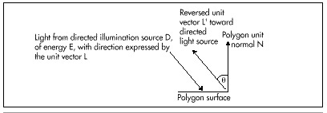

  ------------------------ --------------------------------- --------------------
  [Previous](54-04.html)   [Table of Contents](index.html)   [Next](55-01.html)
  ------------------------ --------------------------------- --------------------

#### Shading: Implementation Details {#Heading7}

In order to calculate the cosine of the angle between an incoming light
source and a polygon's unit normal, we must first have the polygon's
unit normal. This could be calculated by generating a cross-product on
two polygon edges to generate a normal, then calculating the normal's
length and scaling to produce a unit normal. Unfortunately, that would
require taking a square root, so it's not a desirable course of action.
Instead, I've made a change to X-Sharp's polygon format. Now, the first
vertex in a shaded polygon's vertex list is the end-point of a unit
normal that starts at the second point in the polygon's vertex list, as
shown in Figure 54.3. The first point isn't one of the polygon's
vertices, but is used only to generate a unit normal. The second point,
however, is a polygon vertex. Calculating the difference vector between
the first and second points yields the polygon's unit normal. Adding a
unit-normal endpoint to each polygon isn't free; each of those
end-points has to be transformed, along with the rest of the vertices,
and that takes time. Still, it's faster than calculating a unit normal
for each polygon from scratch.

\
 **Figure 54.3**  *The unit normal in the polygon data structure.*

\
 **Figure 54.4**  *The reversed light source vector.*

We also need a unit vector for each directed light source. The directed
light sources I've implemented in X-Sharp are spotlights; that is,
they're considered to be point light sources that are infinitely far
away. This allows the simplifying assumption that all light rays from a
spotlight are parallel and of equal intensity throughout the displayed
universe, so each spotlight can be represented with a single unit vector
and a single intensity. The only trick is that in order to calculate the
desired cos(theta) between the polygon unit normal and a spotlight's
unit vector, the direction of the spotlight's unit vector must be
reversed, as shown in Figure 54.4. This is necessary because the dot
product implicitly places vectors with their start points at the same
location when it's used to calculate the cosine of the angle between two
vectors. The light vector is incoming to the polygon surface, and the
unit normal is outbound, so only by reversing one vector or the other
will we get the cosine of the desired angle.

Given the two unit vectors, it's a piece of cake to calculate
intensities, as shown in Listing 54.2. The sample program DEMO1, in the
X-Sharp archive on the listings disk (built by running K1.BAT), puts the
shading code to work displaying a rotating ball with ambient lighting
and three spot lighting sources that the user can turn on and off. What
you'll see when you run DEMO1 is that the shading is very good—face
colors change very smoothly indeed—so long as only green lighting
sources are on. However, if you combine spotlight two, which is blue,
with any other light source, polygon colors will start to shift abruptly
and unevenly. As configured in the demo, the palette supports a wide
range of shading intensities for a pure version of any one of the three
primary colors, but a very limited number of intensity steps (four, in
this case) for each color component when two or more primary colors are
mixed. While this situation can be improved, it is fundamentally a
result of the restricted capabilities of the 256-color palette, and
there is only so much that can be done without a larger color set. In
the next chapter, I'll talk about some ways to improve the quality of
256-color shading.

  ------------------------ --------------------------------- --------------------
  [Previous](54-04.html)   [Table of Contents](index.html)   [Next](55-01.html)
  ------------------------ --------------------------------- --------------------

* * * * *

Graphics Programming Black Book © 2001 Michael Abrash
