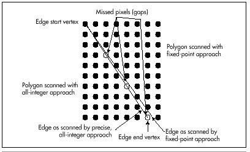

#### Texture Mapping: Orientation Independence {#Heading5}

The double-DDA texture-mapping code presented in the previous chapter
worked adequately, but there were two things about it that left me less
than satisfied. One flaw was performance; I'll address that shortly. The
other flaw was the way textures shifted noticeably as the orientations
of the polygons onto which they were mapped changed.

The previous chapter's code followed the standard polygon inside/outside
rule for determining which pixels in the source texture map were to be
mapped: Pixels that mapped exactly to the left and top destination edges
were considered to be inside, and pixels that mapped exactly to the
right and bottom destination edges were considered to be outside. That's
fine for filling polygons, but when copying texture maps, it causes
different edges of the texture map to be omitted, depending on the
destination orientation, because different edges of the texture map
correspond to the right and bottom destination edges, depending on the
current rotation. Also, the previous chapter's code truncated to get
integer source coordinates. This, together with the orientation problem,
meant that when a texture turned upside down, it slowed one new row and
one new column of pixels from the next row and column of the texture
map. This asymmetry was quite visible, and not at all the desired
effect.

\
 **Figure 57.1**  *Gaps caused by mixing fixed-point and all-integer
math.*

Listing 57.1 is one solution to these problems. This code, which
replaces the equivalently named function presented in the previous
chapter (and, of course, is present in the X-Sharp archive in this
chapter's subdirectory of the listings disk), makes no attempt to follow
the standard polygon inside/outside rules when mapping the source.
Instead, it advances a half-step into the texture map before drawing the
first pixel, so pixels along all edges are half included. Rounding
rather than truncation to texture-map coordinates is also performed. The
result is that the texture map stays pretty much centered within the
destination polygon as the destination rotates, with a much-reduced
level of orientation-dependent asymmetry.

**LISTING 57.1 L57-1.C**

    /* Texture-map-draw the scan line between two edges. Uses approach of
       pre-stepping 1/2 pixel into the source image and rounding to the nearest
       source pixel at each step, so that texture maps will appear
       reasonably similar at all angles. */

    void ScanOutLine(EdgeScan * LeftEdge, EdgeScan * RightEdge)
    {
       Fixedpoint SourceX;
       Fixedpoint SourceY;
       int DestX = LeftEdge->DestX;
       int DestXMax = RightEdge->DestX;
       Fixedpoint DestWidth;
       Fixedpoint SourceStepX, SourceStepY;

       /* Nothing to do if fully X clipped */
       if ((DestXMax <= ClipMinX) || (DestX >= ClipMaxX)) {
          return;
       }

       if ((DestXMax - DestX) <= 0) {
          return;  /* nothing to draw */
       }
       SourceX = LeftEdge->SourceX;
       SourceY = LeftEdge->SourceY;

       /* Width of destination scan line, for scaling. Note: because this is an
          integer-based scaling, it can have a total error of as much as nearly
          one pixel. For more precise scaling, also maintain a fixed-point DestX
          in each edge, and use it for scaling. If this is done, it will also
          be necessary to nudge the source start coordinates to the right by an
          amount corresponding to the distance from the the real (fixed-point)
          DestX and the first pixel (at an integer X) to be drawn). */
       DestWidth = INT-TO-FIXED(DestXMax - DestX);

       /* Calculate source steps that correspond to each dest X step (across
          the scan line) */
       SourceStepX = FixedDiv(RightEdge->SourceX - SourceX, DestWidth);
       SourceStepY = FixedDiv(RightEdge->SourceY - SourceY, DestWidth);

       /* Advance 1/2 step in the stepping direction, to space scanned pixels
          evenly between the left and right edges. (There's a slight inaccuracy
          in dividing negative numbers by 2 by shifting rather than dividing,
          but the inaccuracy is in the least significant bit, and we'll just
          live with it.) */
       SourceX += SourceStepX >> 1;
       SourceY += SourceStepY >> 1;

       /* Clip right edge if necssary */
       if (DestXMax > ClipMaxX)
          DestXMax = ClipMaxX;

       /* Clip left edge if necssary */
       if (DestX < ClipMinX) {
          SourceX += FixedMul(SourceStepX, INT-TO-FIXED(ClipMinX - DestX));
          SourceY += FixedMul(SourceStepY, INT-TO-FIXED(ClipMinX - DestX));
          DestX = ClipMinX;
       }
       /* Scan across the destination scan line, updating the source image
          position accordingly */
       for (; DestX<DestXMax; DestX++) {
          /* Get the currently mapped pixel out of the image and draw it to
             the screen */
          WritePixelX(DestX, DestY,
                GET-IMAGE-PIXEL(TexMapBits, TexMapWidth,
                ROUND-FIXED-TO-INT(SourceX), ROUND-FIXED-TO-INT(SourceY)) );
          /* Point to the next source pixel */
          SourceX += SourceStepX;
          SourceY += SourceStepY;
       }
    }

#### Mapping Textures across Multiple Polygons {#Heading6}

One of the truly nifty things about double-DDA texture mapping is that
it is not limited to mapping a texture onto a single polygon. A single
texture can be mapped across any number of adjacent polygons simply by
having polygons that share vertices in 3-space also share vertices in
the texture map. In fact, the demonstration program DEMO1 in the X-Sharp
archive maps a single texture across two polygons; this is the
blue-on-green pattern that stretches across two panels of the spinning
ball. This capability makes it easy to produce polygon-based objects
with complex surfaces (such as banding and insignia on spaceships, or
even human figures). Just map the desired texture onto the underlying
polygonal framework of an object, and let double-DDA texture mapping do
the rest.

#### Fast Texture Mapping {#Heading7 align="center"}

Of course, there's a problem with mapping a texture across many
polygons: Texture mapping is slow. If you run DEMO1 and move the ball up
close to the screen, you'll see that the ball slows considerably
whenever a texture swings around into view. To some extent that can't be
helped, because each pixel of a texture-mapped polygon has to be
calculated and drawn independently. Nonetheless, we can certainly
improve the performance of texture mapping a good deal over what I
presented in the previous chapter.

By and large, there are two keys to improving PC graphics performance.
The first—no surprise—is assembly language. The second, without which
assembly language is far less effective, is understanding exactly where
the cycles go in inner loops. In our case, that means understanding
where the bottlenecks are in Listing 57.1.

Listing 57.2 is a high-performance assembly language implementation of
Listing 57.1. Apart from the conversion to assembly language, this
implementation improves performance by focusing on reducing inner loop
bottlenecks. In fact, the whole of Listing 57.2 is nothing more than the
inner loop for texture-mapped polygon drawing; Listing 57.2 is only the
code to draw a single scan line. Most of the work in drawing a
texture-mapped polygon comes in scanning out individual lines, though,
so this is the appropriate place to optimize.
