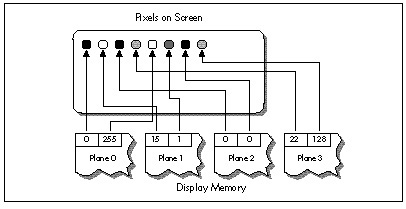

**LISTING 58.1 L58-1.ASM**

```nasm
; Inner loop to draw a single texture-mapped horizontal scanline in
; Mode X, the VGA's page-flipped 256-color mode. Because adjacent
; pixels lie in different planes in Mode X, an OUT must be performed
; to select the proper plane before drawing each pixel.
;
; At this point:
;       AL = initial pixel's plane mask
;       DS:BX = initial source texture pointer
;       DX = pointer to VGA's Sequencer Data register
;       SI = # of pixels to fill
;       ES:DI = pointer to initial destination pixel

TexScanLoop:

; Set the Map Mask for this pixel's plane, then draw the pixel.

        out     dx,al
        mov     ah,[bx]         ;get texture pixel
        mov     es:[di],ah      ;set screen pixel

; Point to the next source pixel.

        add     bx,[bp].lXBaseAdvance     ;advance the minimum # of pixels in X
        mov     cx,word ptr [bp].lSourceStepX
        add     word ptr [bp].lSourceX,cx ;step the source X fractional part
        jnc     NoExtraXAdvance           ;didn't turn over; no extra advance
        add     bx,[bp].lXAdvanceByOne    ;did turn over; advance X one extra
NoExtraXAdvance:

        add     bx,[bp].lYBaseAdvance     ;advance the minimum # of pixels in Y
        mov     cx,word ptr [bp].lSourceStepY
        add     word ptr [bp].lSourceY,cx ;step the source Y fractional part
        jnc     NoExtraYAdvance           ;didn't turn over; no extra advance
        add     bx,[bp].lYAdvanceByOne    ;did turn over; advance Y one extra
NoExtraYAdvance:

; Point to the next destination pixel, by cycling to the next plane, and
; advancing to the next address if the plane wraps from 3 to 0.

        rol     al,1
        adc     di,0

; Continue if there are any more dest pixels to draw.

        dec     si
        jnz     TexScanLoop
```

Figure 58.2 shows why this cycling is necessary. In Mode X, the
page-flipped 256-color mode of the VGA, each successive pixel across a
scanline is stored in a different hardware plane, and an `OUT` to the
VGA's hardware is needed to select the plane being drawn to. (See
Chapters 47, 48, and 49 for details.) An `OUT` instruction *by itself*
takes 16 cycles (and in the neighborhood of 30 cycles in virtual-86 or
non-privileged protected mode), and an `ROL` takes 2 more, for a total
of 18 cycles, double John's 9 cycles, just to handle plane management.
Clearly, getting plane control out of the inner loop was absolutely
necessary.



I must confess, with some embarrassment, that at this point I threw
myself into designing a solution that involved executing the texture
mapping code up to four times per scanline, once for the pixels in each
plane. It's hard to overstate the complexity of this approach, which
involves quadrupling the normal pixel-to-pixel increments, adjusting the
start value for each of the passes, and dealing with some nasty boundary
cases. Make no mistake, the code was perfectly doable, and would in fact
have gotten plane control out of the inner loop, but would have been
very difficult to get exactly right, and would have suffered from
substantial overhead.

Fortunately, in the last sentence I was able to say "would have," not
"was," because my friend Chris Hecker (checker@bix.com) came along to
toss a figurative bucket of cold water on my right brain, which was
evidently asleep. (Or possibly stolen by scantily-clad, attractive
aliens; remember "Spock's Brain"?) Chris is the author of the WinG
Windows game graphics package, available from Microsoft via FTP,
CompuServe, or MSDN Level 2; if, like me, you were at the Game
Developers Conference in April 1994, you, along with everyone else, were
stunned to see Id's megahit DOOM running at full speed in a window,
thanks to WinG. If you write games for a living, run, don't walk, to
check WinG out!

Chris listened to my proposed design for all of maybe 30 seconds,
growing visibly more horrified by the moment, before he said, "But why
don't you just draw vertical rather than horizontal scanlines?"

Why indeed?

#### A 90-Degree Shift in Perspective {#Heading5}

As I said earlier, how you look at an optimization problem defines how
you'll be able to solve it. In order to boost performance, sometimes
it's necessary to look at things from a different angle—and for texture
mapping this was literally as well as figuratively true. Chris suggested
nothing more nor less than scanning out polygons at a 90-degree angle to
normal, starting, say, at the left edge of the polygon, and
texture-mapping vertically along each column of pixels, as shown in
Figure 58.3. That way, all the pixels in each texture-mapped column
would be in the same plane, and I would need to change planes only
between columns—outside the inner loop. A trivial change, not
fundamental in any sense—and yet just that one change, plus unrolling
the loop, reduced the inner loop to the 22-cycles-per-pixel version
shown in Listing 58.2. That's exactly twice as fast as Listing 58.1—and
given how incredibly slow most VGAs are at completing `OUT`s, the
real-world speedup should be considerably greater still. (The fastest
byte `OUT` I've ever measured for a VGA is 29 cycles, the slowest more
than 60 cycles; in the latter case, Listing 58.2 would be on the order
of *four* times faster than Listing 58.1.)

**LISTING 58.2 L58-2.ASM**

```nasm
; Inner loop to draw a single texture-mapped vertical column, rather
; than a horizontal scanline. This allows all pixels handled
; by this code to reside in the same plane, so the time-consuming
; plane switching can be moved out of the inner loop.
;
; At this point:
;       DS:BX = initial source texture pointer
;       DX = offset to advance to the next pixel in the dest column
;            (either positive or negative scanline width)
;       SI = # of pixels to fill
;       ES:DI = pointer to initial destination pixel
;       VGA set up to draw to the correct plane for this column

     REPTLOOP_UNROLL

; Set the Map Mask for this pixel's plane, then draw the pixel.

        mov     ah,[bx]         ;get texture pixel
        mov     es:[di],ah      ;set screen pixel

; Point to the next source pixel.

        add     bx,[bp].lXBaseAdvance     ;advance the minimum # of pixels in X
        mov     cx,word ptr [bp].lSourceStepX
        add     word ptr [bp].lSourceX,cx ;step the source X fractional part
        jnc     NoExtraXAdvance           ;didn't turn over; no extra advance
        add     bx,[bp].lXAdvanceByOne    ;did turn over; advance X one extra
NoExtraXAdvance:

        add     bx,[bp].lYBaseAdvance     ;advance the minimum # of pixels in Y
        mov     cx,word ptr [bp].lSourceStepY
        add     word ptr [bp].lSourceY,cx ;step the source Y fractional part
        jnc     NoExtraYAdvance           ;didn't turn over; no extra advance
        add     bx,[bp].lYAdvanceByOne    ;did turn over; advance Y one extra
NoExtraYAdvance:

; Point to the next destination pixel, which is on the next scan line.

        adc     di,dx

ENDM
```
