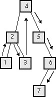

### Inorder Walks of BSP Trees {#Heading8}

It was implementing BSP trees that got me to thinking about inorder tree
traversal. In inorder traversal, the left subtree of each node gets
visited first, then the node, and then the right subtree. You apply this
sequence recursively to each node and its children until the entire tree
has been visited, as shown in Figure 59.9. Walking a BSP tree is
basically an inorder tree walk; the only difference is that with a BSP
tree a decision is made before each descent as to which subtree to visit
first, rather than simply visiting whatever's pointed to by the
left-subtree pointer. Conceptually, however, an inorder walk is what's
used to traverse a BSP tree; from now on I'll discuss normal inorder
walking, with the understanding that the same principles apply to BSP
trees.

As I've said again and again in my printed works over the years, you
have to dig deep below the surface to *really* understand something if
you want to get it right, and inorder walking turns out to be an
excellent example of this. In fact, it's such a good example that I
routinely use it as an interview question for programmer candidates,
and, to my astonishment, not one interviewee has done a good job with
this one yet. I ask the question in two stages, and I get remarkably
consistent results.

First, I ask for an implementation of a function `WalkTree()` that
visits each node in a passed-in tree in inorder sequence. Each candidate
unhesitatingly writes something like the perfectly good code in Listings
59.2 and 59.3 shown next.



**Listing 59.2 L59\_2.C**

```c
// Function to inorder walk a tree, using code recursion.
// Tested with 32-bit Visual C++ 1.10.
#include <stdlib.h>
#include "tree.h"
extern void Visit(NODE *pNode);
void WalkTree(NODE *pNode)
{
   // Make sure the tree isn't empty
   if (pNode != NULL)
   {
      // Traverse the left subtree, if there is one
      if (pNode->pLeftChild != NULL)
      {
         WalkTree(pNode->pLeftChild);
      }
      // Visit this node
      Visit(pNode);
      // Traverse the right subtree, if there is one
      if (pNode->pRightChild != NULL)
      {
         WalkTree(pNode->pRightChild);
      }
   }
}
```

**Listing 59.3 L59\_3.H**

```c
// Header file TREE.H for tree-walking code.
typedef struct _NODE {
  struct _NODE *pLeftChild;
  struct _NODE *pRightChild;
} NODE;
```

Then I ask if they have any idea how to make the code faster; some
don't, but most point out that function calls are pretty expensive.
Either way, I then ask them to rewrite the function without code
recursion.

And then I sit back and squirm for a minimum of 15 minutes.

I have never had *anyone* write a functional data-recursion inorder walk
function in less time than that, and several people have simply never
gotten the code to work at all. Even the best of them have fumbled their
way through the code, sticking in a push here or a pop there, then
working through sample scenarios in their head to see what's broken,
programming by trial and error until the errors seem to be gone. No one
is ever sure they have it right; instead, when they can't find any more
bugs, they look at me hopefully to see if it's thumbs-up or thumbs-down.

And yet, a data-recursive inorder walk implementation has exactly the
same flowchart and *exactly* the same functionality as the
code-recursive version they've already written. They already have a
fully functional model to follow, with all the problems solved, but they
can't make the connection between that model and the code they're trying
to implement. Why is this?

#### Know It *Cold* {#Heading9}

The problem is that these people don't understand inorder walking
through and through. They understand the concepts of visiting left and
right subtrees, and they have a general picture of how traversal moves
about the tree, but they do not understand exactly what the
code-recursive version does. If they really comprehended everything that
happens in each iteration of `WalkTree()`—how each call saves the
state, and what that implies for the order in which operations are
performed—they would simply and without fuss implement code like that in
Listing 59.4, working with the code-recursive version as a model.

**Listing 59.4 L59\_4.C**

```c
// Function to inorder walk a tree, using data recursion.
// No stack overflow testing is performed.
// Tested with 32-bit Visual C++ 1.10.
#include <stdlib.h>
#include "tree.h"
#define MAX_PUSHED_NODES   100
extern void Visit(NODE *pNode);
void WalkTree(NODE *pNode)
{
   NODE *NodeStack[MAX_PUSHED_NODES];
   NODE **pNodeStack;
   // Make sure the tree isn't empty
   if (pNode != NULL)
   {
      NodeStack[0] = NULL;  // push "stack empty" value
      pNodeStack = NodeStack + 1;
      for (;;)
      {
         // If the current node has a left child, push
         // the current node and descend to the left
         // child to start traversing the left subtree.
         // Keep doing this until we come to a node
         // with no left child; that's the next node to
         // visit in inorder sequence
         while (pNode->pLeftChild != NULL)
         {
            *pNodeStack++ = pNode;
            pNode = pNode->pLeftChild;
         }
         // We're at a node that has no left child, so
         // visit the node, then visit the right
         // subtree if there is one, or the last-
         // pushed node otherwise; repeat for each
         // popped node until one with a right
         // subtree is found or we run out of pushed
         // nodes (note that the left subtrees of
         // pushed nodes have already been visited, so
         // they're equivalent at this point to nodes
         // with no left children)
         for (;;)
         {
            Visit(pNode);
            // If the node has a right child, make
            // the child the current node and start
            // traversing that subtree; otherwise, pop
            // back up the tree, visiting nodes we
            // passed on the way down, until we find a
            // node with a right subtree to traverse
            // or run out of pushed nodes and are done
            if (pNode->pRightChild != NULL)
            {
               // Current node has a right child;
               // traverse the right subtree
               pNode = pNode->pRightChild;
               break;
            }
            // Pop the next node from the stack so
            // we can visit it and see if it has a
            // right subtree to be traversed
            if ((pNode = *—pNodeStack) == NULL)
            {
               // Stack is empty and the current node
               // has no right child; we're done
               return;
            }
         }
      }
   }
}
```
