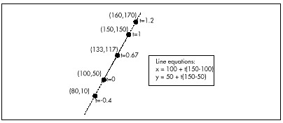
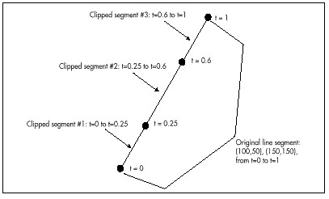
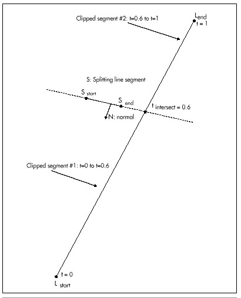

## Chapter 60\
 Compiling BSP Trees {#Heading1}

### Taking BSP Trees from Concept to Reality {#Heading2}

As long-time readers of my columns know, I tend to move my family around
the country quite a bit. Change doesn't come out of the blue, so there's
some interesting history to every move, but the roots of the latest move
go back even farther than usual. To wit:

In 1986, just after we moved from Pennsylvania to California, I started
writing a column for *Programmer's Journal*. I was paid peanuts for
writing it, and I doubt if even 5,000 people saw some of the first
issues the columns appeared in, but I had a lot of fun exploring fast
graphics for the EGA and VGA.

By 1991, we were in Vermont, and I was writing the *Graphics
Programming* column for *Dr. Dobb's Journal* (and having a great time
doing it, even though it took all my spare nights and weekends to stay
ahead of the deadlines). In those days I received a lot of unsolicited
evaluation software, including a PC shareware game called Commander
Keen, a side-scrolling game that was every bit as good as the hot
Nintendo games of the day. I loved the way the game looked, and actually
drafted a column opening about how for years I'd been claiming that the
PC could be a great game machine in the hands of great programmers, and
here, finally, was the proof, in the form of Commander Keen. In the end,
though, I decided that would be too close to a product review, an area
that I've observed inflames passions in nonconstructive ways, so I went
with a different opening.

In 1992, I did a series of columns about my X-Sharp 3-D library, and
hung out on *DDJ*'s bulletin board. There was another guy who hung out
there who knew a lot about 3-D, a fellow named John Carmack who was
surely the only game programmer I'd ever heard of who developed under
NEXTSTEP. When we moved to Redmond, I didn't have time for BBSs anymore,
though.

In early 1993, I hired Chris Hecker. Later that year, Chris showed me an
alpha copy of DOOM, and I nearly fell out of my chair. About a year
later, Chris forwarded me a newsgroup post about NEXTSTEP, and said,
"Isn't this the guy you used to know on the *DDJ* bulletin board?"
Indeed it was John Carmack; what's more, it turned out that John was the
guy who had written DOOM. I sent him a congratulatory piece of mail, and
he sent back some thoughts about what he was working on, and somewhere
in there I asked if he ever came up my way. It turned out he had family
in Seattle, so he stopped in and visited, and we had a great time.

Over the next year, we exchanged some fascinating mail, and I became
steadily more impressed with John's company, id Software. Eventually,
John asked if I'd be interested in joining id, and after a good bit of
consideration I couldn't think of anything else that would be as much
fun or teach me as much. The upshot is that here we all are in Dallas,
our fourth move of 2,000 miles or more since I've starting writing in
the computer field, and now I'm writing some seriously cool 3-D
software.

Now that I'm here, it's an eye-opener to look back and see how events
fit together over the last decade. You see, when John started doing PC
game programming he learned fast graphics programming from those early
*Programmer's Journal* articles of mine. The copy of Commander Keen that
validated my faith in the PC as a game machine was the fruit of those
articles, for that was an id game (although I didn't know that then).
When John was hanging out on the *DDJ* BBS, he had just done Castle
Wolfenstein 3-D, the first great indoor 3-D game, and was thinking about
how to do DOOM. (If only I'd known that then!) And had I not hired
Chris, or had he not somehow remembered me talking about that guy who
used NEXTSTEP, I'd never have gotten back in touch with John, and things
would surely be different. (At the very least, I wouldn't be hearing
jokes about how my daughter's going to grow up saying "y'all".)

I think there's a worthwhile lesson to be learned from all this, a
lesson that I've seen hold true for many other people, as well. If you
do what you love, and do it as well as you can, good things will
eventually come of it. Not necessarily quickly or easily, but if you
stick with it, they will come. There are threads that run through our
lives, and by the time we've been adults for a while, practically
everything that happens has roots that run far back in time. The
implication should be clear: If you want good things to happen in your
future, stretch yourself and put in the extra effort now at whatever you
care passionately about, so those roots will have plenty to work with
down the road.

All this is surprisingly closely related to this chapter's topic, BSP
trees, because John is the fellow who brought BSP trees into the
spotlight by building DOOM around them. He also got me started with BSP
trees by explaining how DOOM worked and getting me interested enough to
want to experiment; the BSP compiler in this article is the direct
result. Finally, John has been an invaluable help to me as I've learned
about BSP trees, as will become evident when we discuss BSP
optimization.

Onward to compiling BSP trees.

### Compiling BSP Trees {#Heading3}

As you'll recall from the previous chapter, a BSP tree is nothing more
than a series of binary subdivisions that partion space into
ever-smaller pieces. That's a simple data structure, and a BSP compiler
is a correspondingly simple tool. First, it groups all the surfaces
(lines in 2-D, or polygons in 3-D) together into a single subspace that
encompasses the entire world of the database. Then, it chooses one of
the surfaces as the root node, and uses its line or plane to divide the
remaining surfaces into two subspaces, splitting surfaces into two parts
if they cross the line or plane of the root. Each of the two resultant
subspaces is then processed in the same fashion, and so on, recursively,
until the point is reached where all surfaces have been assigned to
nodes, and each leaf surface subdivides a subspace that is empty except
for that surface. Put another way, the root node carves space into two
parts, and the root's children carve each of those parts into two more
parts, and so on, with each surface carving ever smaller subspaces,
until all surfaces have been used. (Actually, there are many other lines
or planes that a BSP tree can use to carve up space, but this is the
approach we'll use in the current discussion.)

If you find any of the above confusing (and it would be understandable
if that were the case; BSP trees are not easy to get the hang of), you
might want to refer back to the previous chapter. It would also be a
good idea to get hold of the visual BSP compiler I'll discuss shortly;
when it comes to understanding BSP trees, there's nothing quite like
seeing one being built.

So there are really only two interesting operations in building a BSP
tree: choosing a root node for the current subspace (a "splitter") and
assigning surfaces to one side or another of the current root node,
splitting any that straddle the splitter. We'll get to the issue of
choosing splitters shortly, but first let's look at the process of
splitting and assigning. To do that, we need to understand parametric
lines.

#### Parametric Lines {#Heading4}

We're all familiar with lines described in slope-intercept form, with y
as a function of x

y = mx + b

but there's another sort of line description that's very useful for
clipping (and for a variety of 3-D purposes, such as curved surfaces and
texture mapping): *parametric lines*. In parametric lines, x and y are
decoupled from one another, and are instead described as a function of
the parameter t:

x = x~start~ + t(x~end~ - x~start~)\
 y = y~start~ + t(y~end~ - y~start~)

This can be summarized as

L = L~start~ + t(L~end~ - L~start~)

where L = (x, y).

Figure 60.1 shows how a parametric line works. The t parameter describes
how far along a line segment the current x and y coordinates are. Note
that this description is valid not only for the line segment, but also
for the entire infinite line; however, only points with t values between
0 and 1 are actually on the line segment.

In our 2-D BSP compiler (as you'll recall from the previous chapter,
we're working with 2-D trees for simplicity, but the principles
generalize to 3-D), we'll represent our walls (all vertical) as line
segments viewed from above. The segments will be stored in parametric
form, with the endpoints of the original line segment and two t values
describing the endpoints of the current (possibly clipped) segment
providing a complete specification for each segment, as shown in Figure
60.2.

What does that do for us? For one thing, it keeps clipping errors from
creeping in, because clipped line segments are always based on the
original line segment, not derived from clipped versions. Also, it's
potentially a more compact format, because we need to store the
endpoints only for the original line segments; for clipped line
segments, we can just store pairs of t values, along with a pointer to
the original line segment. The biggest win, however, is that it allows
us to use parametric line clipping, a very clean form of clipping,
indeed.





#### Parametric Line Clipping {#Heading5}

In order to assign a line segment to one subspace or the other of a
splitter, we must somehow figure out whether the line segment straddles
the splitter or falls on one side or the other. In order to determine
that, we first plug the line segment and splitter into the following
parametric line intersection equation

number = N (L~start~ - S~start~) (Equation 1)\
 denom = -N (L~end~ - L~start~) (Equation 2)\
 t~intersect~ = number / denom (Equation 3)

where N is the normal of the splitter, S~start~ is the start point of
the splitting line segment in standard (x,y) form, and L~start~ and
L~end~ are the endpoints of the line segment being split, again in (x,y)
form. Figure 60.3 illustrates the intersection calculation. Due to lack
of space, I'm just going to present this equation and its implications
as fact, rather than deriving them; if you want to know more, there's an
excellent explanation on page 117 of *Computer Graphics: Principles and
Practice,* by Foley and van Dam (Addison Wesley, ISBN 0-201-12110-7), a
book that you should certainly have in your library.

If the denominator is zero, we know that the lines are parallel and
don't intersect, so we don't divide, but rather check the sign of the
numerator, which tells us which side of the splitter the line segment is
on. Otherwise, we do the division, and the result is the t value for the
intersection point, as shown in Figure 60.3. We then simply compare the
t value to the t values of the endpoints of the line segment being
split. If it's between them, that's where we split the line segment,
otherwise, we can tell which side of the splitter the line segment is on
by which side of the line segment's t range it's on. Simple comparisons
do all the work, and there's no need to do the work of generating actual
x and y values. If you look closely at Listing 60.1, the core of the BSP
compiler, you'll see that the parametric clipping code itself is
exceedingly short and simple.



One interesting point about Listing 60.1 is that it generates normals to
splitting surfaces simply by exchanging the x and y lengths of the
splitting line segment and negating the resultant y value, thereby
rotating the line 90 degrees. In 3-D, it's not that simple to come by a
normal; you could calculate the normal as the cross-product of two of
the polygon's edges, or precalculate it when you build the world
database.

#### The BSP Compiler {#Heading6}

Listing 60.1 shows the core of a BSP compiler—the code that actually
builds the BSP tree. (Note that Listing 60.1 is excerpted from a C++
.CPP file, but in fact what I show here is very close to straight C. It
may even compile as a .C file, though I haven't checked.) The compiler
begins by setting up an empty tree, then passes that tree and the
complete set of line segments from which a BSP tree is to be generated
to `SelectBSPTree()`, which chooses a root node and calls
`BuildBSPTree()` to add that node to the tree and generate child trees
for each of the node's two subspaces. `BuildBSPTree()` calls
`SelectBSPTree()` recursively to select a root node for each of those
child trees, and this continues until all lines have been assigned
nodes. `SelectBSP()` uses parametric clipping to decide on the
splitter, as described below, and `BuildBSPTree()` uses parametric
clipping to decide which subspace of the splitter each line belongs in,
and to split lines, if necessary.

**Listing 60.1 L60\_1.CPP**

```cpp
#define MAX_NUM_LINESEGS 1000
#define MAX_INT          0x7FFFFFFF
#define MATCH_TOLERANCE  0.00001
// A vertex
typedef struct _VERTEX
{
   double x;
   double y;
} VERTEX;
// A potentially split piece of a line segment, as processed from the
// base line in the original list
typedef struct _LINESEG
{
   _LINESEG *pnextlineseg;
    int startvertex;
    int endvertex;
    double walltop;
    double wallbottom;
    double tstart;
    double tend;
    int color;
    _LINESEG *pfronttree;
    _LINESEG *pbacktree;
} LINESEG, *PLINESEG;
static VERTEX *pvertexlist;
static int NumCompiledLinesegs = 0;
static LINESEG *pCompiledLinesegs;
// Builds a BSP tree from the specified line list. List must contain
// at least one entry. If pCurrentTree is NULL, then this is the root
// node, otherwise pCurrentTree is the tree that's been build so far.
// Returns NULL for errors.
LINESEG * SelectBSPTree(LINESEG * plineseghead,
    LINESEG * pCurrentTree, LINESEG ** pParentsChildPointer)
{
    LINESEG *pminsplit;
    int minsplits;
    int tempsplitcount;
    LINESEG *prootline;
    LINESEG *pcurrentline;
    double nx, ny, numer, denom, t;
    // Pick a line as the root, and remove it from the list of lines
    // to be categorized. The line we'll select is the one of those in
    // the list that splits the fewest of the other lines in the list
    minsplits = MAX_INT;
    prootline = plineseghead;
    while (prootline != NULL) {
        pcurrentline = plineseghead;
        tempsplitcount = 0;
        while (pcurrentline != NULL) {
            // See how many other lines the current line splits
            nx = pvertexlist[prootline->startvertex].y -
                    pvertexlist[prootline->endvertex].y;
            ny = -(pvertexlist[prootline->startvertex].x -
                    pvertexlist[prootline->endvertex].x);
            // Calculate the dot products we'll need for line
            // intersection and spatial relationship
            numer = (nx * (pvertexlist[pcurrentline->startvertex].x -
                    pvertexlist[prootline->startvertex].x)) +
                    (ny * (pvertexlist[pcurrentline->startvertex].y -
                    pvertexlist[prootline->startvertex].y));
            denom = ((-nx) * (pvertexlist[pcurrentline->endvertex].x -
                    pvertexlist[pcurrentline->startvertex].x)) +
                    ((-ny) * (pvertexlist[pcurrentline->endvertex].y -
                    pvertexlist[pcurrentline->startvertex].y));
            // Figure out if the infinite lines of the current line
            // and the root intersect; if so, figure out if the
            // current line segment is actually split, split if so,
            // and add front/back polygons as appropriate
            if (denom == 0.0) {
                // No intersection, because lines are parallel; no
                // split, so nothing to do
            } else {
                // Infinite lines intersect; figure out whether the
                // actual line segment intersects the infinite line
                // of the root, and split if so
                t =  numer / denom;
                if ((t > pcurrentline->tstart) &&
                        (t < pcurrentline->tend)) {
                    // The root splits the current line
                    tempsplitcount++;
                } else {
                    // Intersection outside segment limits, so no
                    // split, nothing to do
                }
            }
            pcurrentline = pcurrentline->pnextlineseg;
        }
        if (tempsplitcount < minsplits) {
            pminsplit = prootline;
            minsplits = tempsplitcount;
        }
        prootline = prootline->pnextlineseg;
    }
    // For now, make this a leaf node so we can traverse the tree
    // as it is at this point. BuildBSPTree() will add children as
    // appropriate
    pminsplit->pfronttree = NULL;
    pminsplit->pbacktree = NULL;
    // Point the parent's child pointer to this node, so we can
    // track the currently-build tree
    *pParentsChildPointer = pminsplit;
    return BuildBSPTree(plineseghead, pminsplit, pCurrentTree);
}
// Builds a BSP tree given the specified root, by creating front and
// back lists from the remaining lines, and calling itself recursively
LINESEG * BuildBSPTree(LINESEG * plineseghead, LINESEG * prootline,
    LINESEG * pCurrentTree)
{
    LINESEG *pfrontlines;
    LINESEG *pbacklines;
    LINESEG *pcurrentline;
    LINESEG *pnextlineseg;
    LINESEG *psplitline;
    double nx, ny, numer, denom, t;
    int Done;
    // Categorize all non-root lines as either in front of the root's
    // infinite line, behind the root's infinite line, or split by the
    // root's infinite line, in which case we split it into two lines
    pfrontlines = NULL;
    pbacklines = NULL;
    pcurrentline = plineseghead;
    while (pcurrentline != NULL)
    {
      // Skip the root line when encountered
      if (pcurrentline == prootline) {
        pcurrentline = pcurrentline->pnextlineseg;
      } else  {
        nx = pvertexlist[prootline->startvertex].y -
                pvertexlist[prootline->endvertex].y;
        ny = -(pvertexlist[prootline->startvertex].x -
                pvertexlist[prootline->endvertex].x);
        // Calculate the dot products we'll need for line intersection
        // and spatial relationship
        numer = (nx * (pvertexlist[pcurrentline->startvertex].x -
                 pvertexlist[prootline->startvertex].x)) +
                (ny * (pvertexlist[pcurrentline->startvertex].y -
                 pvertexlist[prootline->startvertex].y));
        denom = ((-nx) * (pvertexlist[pcurrentline->endvertex].x -
                 pvertexlist[pcurrentline->startvertex].x)) +
                (-(ny) * (pvertexlist[pcurrentline->endvertex].y -
                 pvertexlist[pcurrentline->startvertex].y));
        // Figure out if the infinite lines of the current line and
        // the root intersect; if so, figure out if the current line
        // segment is actually split, split if so, and add front/back
        // polygons as appropriate
        if (denom == 0.0) {
            // No intersection, because lines are parallel; just add
            // to appropriate list
            pnextlineseg = pcurrentline->pnextlineseg;
            if (numer < 0.0) {
                // Current line is in front of root line; link into
                // front list
                pcurrentline->pnextlineseg = pfrontlines;
                pfrontlines = pcurrentline;
            } else {
                // Current line behind root line; link into back list
                pcurrentline->pnextlineseg = pbacklines;
                pbacklines = pcurrentline;
            }
            pcurrentline = pnextlineseg;
        } else {
            // Infinite lines intersect; figure out whether the actual
            // line segment intersects the infinite line of the root,
            // and split if so
            t =  numer / denom;
            if ((t > pcurrentline->tstart) &&
                    (t < pcurrentline->tend)) {
                // The line segment must be split; add one split
                // segment to each list
                if (NumCompiledLinesegs > (MAX_NUM_LINESEGS - 1)) {
                    DisplayMessageBox("Out of space for line segs;"
                                 "increase MAX_NUM_LINESEGS");
                    return NULL;
                }
                // Make a new line entry for the split part of line
                psplitline = &pCompiledLinesegs[NumCompiledLinesegs];
                NumCompiledLinesegs++;
                *psplitline = *pcurrentline;
                psplitline->tstart = t;
                pcurrentline->tend = t;

                pnextlineseg = pcurrentline->pnextlineseg;
                if (numer < 0.0) {
                    // Presplit part is in front of root line; link
                    // into front list and put postsplit part in back
                    // list
                    pcurrentline->pnextlineseg = pfrontlines;
                    pfrontlines = pcurrentline;
                    psplitline->pnextlineseg = pbacklines;
                    pbacklines = psplitline;
                } else {
                    // Presplit part is in back of root line; link
                    // into back list and put postsplit part in front
                    // list
                    psplitline->pnextlineseg = pfrontlines;
                    pfrontlines = psplitline;
                    pcurrentline->pnextlineseg = pbacklines;
                    pbacklines = pcurrentline;
                }
                pcurrentline = pnextlineseg;
            } else {
                // Intersection outside segment limits, so no need to
                // split; just add to proper list
                pnextlineseg = pcurrentline->pnextlineseg;
                Done = 0;
                while (!Done) {
                    if (numer < -MATCH_TOLERANCE) {
                        // Current line is in front of root line;
                        // link into front list
                        pcurrentline->pnextlineseg = pfrontlines;
                        pfrontlines = pcurrentline;
                        Done = 1;
                    } else if (numer > MATCH_TOLERANCE) {
                        // Current line is behind root line; link
                        // into back list
                        pcurrentline->pnextlineseg = pbacklines;
                        pbacklines = pcurrentline;
                        Done = 1;
                    } else {
                        // The point on the current line we picked to
                        // do front/back evaluation happens to be
                        // collinear with the root, so use the other
                        // end of the current line and try again
                        numer =
                            (nx *
                             (pvertexlist[pcurrentline->endvertex].x -
                              pvertexlist[prootline->startvertex].x))+
                            (ny *
                             (pvertexlist[pcurrentline->endvertex].y -
                              pvertexlist[prootline->startvertex].y));
                    }
                }
                pcurrentline = pnextlineseg;
            }
        }
      }
    }
    // Make a node out of the root line, with the front and back trees
    // attached
    if (pfrontlines == NULL) {
        prootline->pfronttree = NULL;
    } else {
        if (!SelectBSPTree(pfrontlines, pCurrentTree,
                          &prootline->pfronttree)) {
            return NULL;
        }
    }
    if (pbacklines == NULL) {
        prootline->pbacktree = NULL;
    } else {
        if (!SelectBSPTree(pbacklines, pCurrentTree,
                          &prootline->pbacktree)) {
            return NULL;
        }
    }
    return(prootline);
}
```

Listing 60.1 isn't very long or complex, but it's somewhat more
complicated than it could be because it's structured to allow visual
display of the ongoing compilation process. That's because Listing 60.1
is actually just a part of a BSP compiler for Win32 that visually
depicts the progressive subdivision of space as the BSP tree is built.
(Note that Listing 60.1 might not compile as printed; I may have missed
copying some global variables that it uses.) The complete code is too
large to print here in its entirety, but it's on the CD-ROM in file
DDJBSP.ZIP.

### Optimizing the BSP Tree {#Heading7}

In the previous chapter, I promised that I'd discuss how to go about
deciding which wall to use as the splitter at each node in constructing
a BSP tree. That turns out to be a far more difficult problem than one
might think, but we can't ignore it, because the choice of splitter can
make a huge difference.

Consider, for example, a BSP in which the line or plane of the splitter
at the root node splits every single other surface in the world,
doubling the total number of surfaces to be dealt with. Contrast that
with a BSP built from the same surface set in which the initial splitter
doesn't split anything. Both trees provide a valid ordering, but one
tree is much larger than the other, with twice as many polygons after
the selection of just one node. Apply the same difference again to each
node, and the relative difference in size (and, correspondingly, in
traversal and rendering time) soon balloons astronomically. So we need
to do *something* to optimize the BSP tree—but what? Before we can try
to answer that, we need to know exactly what we'd like to optimize.

There are several possible optimization objectives in BSP compilation.
We might choose to balance the tree as evenly as possible, thereby
reducing the average depth to which the tree must be traversed.
Alternatively, we might try to approximately balance the area or volume
on either side of each splitter. That way we don't end up with huge
chunks of space in some tree branches and tiny slivers in others, and
the overall processing time will be more consistent. Or, we might choose
to select planes aligned with the major axes, because such planes can
help speed up our BSP traversal.

The BSP metric that seems most useful to me, however, is the number of
polygons that are split into two polygons in the course of building a
BSP tree. Fewer splits is better; the tree is smaller with fewer
polygons, and drawing will go faster with fewer polygons to draw, due to
per-polygon overhead. There's a problem with the fewest-splits metric,
though: There's no sure way to achieve it.

The obvious approach to minimizing polygon splits would be to try all
possible trees to find the best one. Unfortunately, the order of that
particular problem is N!, as I found to my dismay when I implemented
brute-force optimization in the first version of my BSP compiler. Take a
moment to calculate the number of operations for the 20-polygon set I
originally tried brute-force optimization on. I'll give you a hint:
There are 19 digits in 20!, and if each operation takes only one
microsecond, that's over 70,000 years (or, if you prefer, over 500,000
dog years). Now consider that a single game level might have 5,000 to
10,000 polygons; there aren't anywhere near enough dog years in the
lifetime of the universe to handle that. We're going to have to give up
on optimal compilation and come up with a decent heuristic approach, no
matter what optimization objective we select.

In Listing 60.1, I've applied the popular heuristic of choosing as the
splitter at each node the surface that splits the fewest of the other
surfaces that are being considered for that node. In other words, I
choose the wall that splits the fewest of the walls in the subspace it's
subdividing.

### BSP Optimization: an Undiscovered Country {#Heading8}

Although BSP trees have been around for at least 15 years now, they're
still only partially understood and are a ripe area for applied research
and general ingenuity. You might want to try your hand at inventing new
BSP optimization approaches; it's an interesting problem, and you might
strike paydirt. There are many things that BSP trees can't do well,
because it takes so long to build them—but what they do, they do
exceedingly well, so a better compilation approach that allowed BSP
trees to be used for more purposes would be valuable, indeed.
