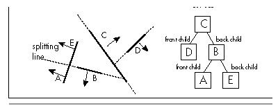

  ------------------------ --------------------------------- --------------------
  [Previous](61-04.html)   [Table of Contents](index.html)   [Next](62-02.html)
  ------------------------ --------------------------------- --------------------

Chapter 62\
 One Story, Two Rules, and a BSP Renderer {#Heading1}
-----------------------------------------

### Taking a Compiled BSP Tree from Logical to Visual Reality {#Heading2}

As I’ve noted before, I’m working on Quake, id Software’s follow-up to
DOOM. A month or so back, we added page flipping to Quake, and made the
startling discovery that the program ran nearly twice as fast with page
flipping as it did with the alternative method of drawing the whole
frame to system memory, then copying it to the screen. We were delighted
by this, but baffled. I did a few tests and came up with several
possible explanations, including slow writes through the external cache,
poor main memory performance, and cache misses when copying the frame
from system memory to video memory. Although each of these can indeed
affect performance, none seemed to account for the magnitude of the
speedup, so I assumed there was some hidden hardware interaction at
work. Anyway, “why” was secondary; what really mattered was that we had
a way to double performance, which meant I had a lot of work to do to
support page flipping as widely as possible.

A few days ago, I was using the Pentium’s built-in performance counters
to seek out areas for improvement in Quake and, for no particular
reason, checked the number of writes performed while copying the frame
to the screen in non-page-flipped mode. The answer was 64,000. That
seemed odd, since there were 64,000 byte-sized pixels to copy, and I was
calling **memcpy()**, which of course performs copies a dword at a time
whenever possible. I thought maybe the Pentium counters report the
number of bytes written rather than the number of writes performed, but
fortunately, this time I tested my assumptions by writing an ASM routine
to copy the frame a dword at a time, without the help of **memcpy()**.
This time the Pentium counters reported 16,000 writes.

Whoops.

As it turns out, the **memcpy()** routine in the DOS version of our
compiler (gcc) inexplicably copies memory a byte at a time. With my new
routine, the non-page-flipped approach suddenly became slightly *faster*
than page flipping.

The first relevant rule is pretty obvious: *Assume nothing*. Measure
early and often. Know what’s really going on when your program runs, if
you catch my drift. To do otherwise is to risk looking mighty foolish.

The second rule: When you do look foolish (and trust me, it *will*
happen if you do challenging work) have a good laugh at yourself, and
use it as a reminder of Rule \#1. I hadn’t done any extra page-flipping
work yet, so I didn’t waste any time due to my faulty assumption that
**memcpy()** performed a maximum-speed copy, but that was just luck. I
should have done experiments until I was sure I knew what was going on
before drawing any conclusions and acting on them.

  ------------------- ------------------------------------------------------------------------------------------------------------------------------------------------------------------------------------------------------------------------------------------------------------------------------------------------------------------------------------------------------------------------------------------------------------------------------------------------------------------------------------------------------------------------------------------------------------
     *In general, make it a point not to fall into a tightly focused rut; stay loose and think of alternative possibilities and new approaches, and always, always, always keep asking questions. It’ll pay off big in the long run. If I hadn’t indulged my curiosity by running the Pentium counter test on the copy to the screen, even though there was no specific reason to do so, I would never have discovered the **memcpy()** problem—and by so doing I doubled the performance of the entire program in five minutes, a rare accomplishment indeed.*
  ------------------- ------------------------------------------------------------------------------------------------------------------------------------------------------------------------------------------------------------------------------------------------------------------------------------------------------------------------------------------------------------------------------------------------------------------------------------------------------------------------------------------------------------------------------------------------------------

By the way, I have found the Pentium’s performance counters to be very
useful in of information on the performance counters and other aspects
of the Pentium is Mike Schmit’s book, *Pentium Processor Optimization
Tools*, AP Professional, ISBN 0-12-627230-1.

Onward to rendering from a BSP tree.

#### BSP-based Rendering {#Heading3}

For the last several chapters I’ve been discussing the nature of BSP
(Binary Space Partitioning) trees, and in Chapter 60 I presented a
compiler for 2-D BSP trees. Now we’re ready to use those compiled BSP
trees to do realtime rendering.

As you’ll recall, the BSP compiler took a list of vertical walls and
built a 2-D BSP tree from the walls, as viewed from above. The result is
shown in Figure 62.1. The world is split into two pieces by the line of
the root wall, and each half of the world is then split again by the
root’s children, and so on, until the world is carved into subspaces
along the lines of all the walls.

\
 **Figure 62.1**  *Vertical walls and a BSP tree to represent them.*

Our objective is to draw the world so that whenever walls overlap we see
the nearer wall at each overlapped pixel. The simplest way to do that is
with the painter’s algorithm; that is, drawing the walls in
back-to-front order, assuming no polygons interpenetrate or form cycles.
BSP trees guarantee that no polygons interpenetrate (such polygons are
automatically split), and make it easy to walk the polygons in
back-to-front (or front-to-back) order.

Given a BSP tree, in order to render a view of that tree, all we have to
do is descend the tree, deciding at each node whether we’re seeing the
front or back of the wall at that node from the current viewpoint. We
use that knowledge to first recursively descend and draw the farther
subtree of that node, then draw that node, and finally draw the nearer
subtree of that node. Applied recursively from the root of our BSP
trees, this approach guarantees that overlapping polygons will always be
drawn in back-to-front order. Listing 62.1 draws a BSP-based world in
this fashion. (Because of the constraints of the printed page, Listing
62.1 is only the core of the BSP renderer, without the program
framework, some math routines, and the polygon rasterizer; but, the
entire program is on the CD-ROM as DDJBSP2.ZIP. Listing 62.1 is in a
compressed format, with relatively little whitespace; the full version
on the CD-ROM is formatted normally.)

  ------------------------ --------------------------------- --------------------
  [Previous](61-04.html)   [Table of Contents](index.html)   [Next](62-02.html)
  ------------------------ --------------------------------- --------------------

* * * * *

Graphics Programming Black Book © 2001 Michael Abrash
