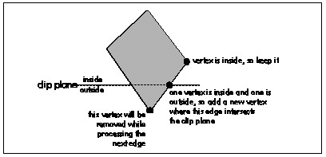

  ------------------------ --------------------------------- --------------------
  [Previous](65-02.html)   [Table of Contents](index.html)   [Next](65-04.html)
  ------------------------ --------------------------------- --------------------

**LISTING 65.2 L65\_2.c**

    int ClipToPlane(polygon_t *pin, plane_t *pplane, polygon_t *pout)
    {
        int     i, j, nextvert, curin, nextin;
        double  curdot, nextdot, scale;
        point_t *pinvert, *poutvert;

        pinvert = pin->verts;
        poutvert = pout->verts;

        curdot = DotProduct(pinvert, &pplane->normal);
        curin = (curdot >= pplane->distance);

        for (i=0 ; i<pin->numverts ; i++)
        {
            nextvert = (i + 1) % pin->numverts;

            // Keep the current vertex if it’s inside the plane
            if (curin)
                *poutvert++ = *pinvert;

            nextdot = DotProduct(&pin->verts[nextvert], &pplane->normal);
            nextin = (nextdot >= pplane->distance);

            // Add a clipped vertex if one end of the current edge is
            // inside the plane and the other is outside
            if (curin != nextin)
            {
                scale = (pplane->distance - curdot) /
                        (nextdot - curdot);
                for (j=0 ; j<3 ; j++)
                {
                    poutvert->v[j] = pinvert->v[j] +
                        ((pin->verts[nextvert].v[j] - pinvert->v[j]) *
                         scale);
                }
                poutvert++;
            }

            curdot = nextdot;
            curin = nextin;
            pinvert++;
        }

        pout->numverts = poutvert - pout->verts;
        if (pout->numverts < 3)
            return 0;

        pout->color = pin->color;
        return 1;
    }

Believe it or not, this technique, applied in turn to each edge, is all
that’s needed to clip a polygon to a plane. Better yet, a polygon can be
clipped to multiple planes by repeating the above process once for each
clip plane, with each interation trimming away any part of the polygon
that’s clipped by that particular plane.

One particularly useful aspect of 3-D clipping is that if you’re drawing
texture mapped polygons, texture coordinates can be clipped in exactly
the same way as (x,y,z) coordinates. In fact, the very same fraction
that’s used to advance x, y, and z from the inside point to the point of
intersection with the clip plane can be used to advance the texture
coordinates as well, so only one extra multiply and one extra add are
required for each texture coordinate.

#### Clipping to the Frustum {#Heading6}

Given a polygon-clipping function, it’s easy to clip to the frustum: set
up the four planes for the sides of the frustum, with another one or two
planes for near and far clipping, if desired; next, clip each
potentially visible polygon to each plane in turn; then draw whatever
polygons emerge from the clipping process. Listing 65.3 is the core code
for a simple 3-D clipping example that allows you to move around and
look at polygonal models from any angle. The full code for this program
is available on the CD-ROM in the file DDJCLIP.ZIP.

\
 **Figure 65.3**  *Clipping a polygon edge.*

**LISTING 65.3 L65\_3.c**

    int DIBWidth, DIBHeight;
    int DIBPitch;
    double  roll, pitch, yaw;
    double  currentspeed;
    point_t currentpos;
    double  fieldofview, xcenter, ycenter;
    double  xscreenscale, yscreenscale, maxscale;
    int     numobjects;
    double  speedscale = 1.0;
    plane_t frustumplanes[NUM_FRUSTUM_PLANES];
    double  mroll[3][3] = {{1, 0, 0}, {0, 1, 0}, {0, 0, 1}};
    double  mpitch[3][3] = {{1, 0, 0}, {0, 1, 0}, {0, 0, 1}};
    double  myaw[3][3] =  {{1, 0, 0}, {0, 1, 0}, {0, 0, 1}};
    point_t vpn, vright, vup;
    point_t xaxis = {1, 0, 0};
    point_t zaxis = {0, 0, 1};
    convexobject_t objecthead = {NULL, {0,0,0}, -999999.0};

    // Project viewspace polygon vertices into screen coordinates.
    // Note that the y axis goes up in worldspace and viewspace, but
    // goes down in screenspace.
    void ProjectPolygon (polygon_t *ppoly, polygon2D_t *ppoly2D)
    {
        int     i;
        double  zrecip;

        for (i=0 ; i<ppoly->numverts ; i++)
        {
            zrecip = 1.0 / ppoly->verts[i].v[2];
            ppoly2D->verts[i].x =
                   ppoly->verts[i].v[0] * zrecip * maxscale + xcenter;
            ppoly2D->verts[i].y = DIBHeight -
                 (ppoly->verts[i].v[1] * zrecip * maxscale + ycenter);
        }
        ppoly2D->color = ppoly->color;
        ppoly2D->numverts = ppoly->numverts;
    }

    // Sort the objects according to z distance from viewpoint.
    void ZSortObjects(void)
    {
        int             i, j;
        double          vdist;
        convexobject_t  *pobject;
        point_t         dist;

        objecthead.pnext = &objecthead;
        for (i=0 ; i<numobjects ; i++)
        {
            for (j=0 ; j<3 ; j++)
                dist.v[j] = objects[i].center.v[j] - currentpos.v[j];
            objects[i].vdist = sqrt(dist.v[0] * dist.v[0] +
                                    dist.v[1] * dist.v[1] +
                                    dist.v[2] * dist.v[2]);
            pobject = &objecthead;
            vdist = objects[i].vdist;
            // Viewspace-distance-sort this object into the others.
            // Guaranteed to terminate because of sentinel
            while (vdist < pobject->pnext->vdist)
                pobject = pobject->pnext;
            objects[i].pnext = pobject->pnext;
            pobject->pnext = &objects[i];
        }
    }

    // Move the view position and set the world->view transform.
    void UpdateViewPos()
    {
        int     i;
        point_t motionvec;
        double  s, c, mtemp1[3][3], mtemp2[3][3];

        // Move in the view direction, across the x-y plane, as if
        // walking. This approach moves slower when looking up or
        // down at more of an angle
        motionvec.v[0] = DotProduct(&vpn, &xaxis);
        motionvec.v[1] = 0.0;
        motionvec.v[2] = DotProduct(&vpn, &zaxis);
        for (i=0 ; i<3 ; i++)
        {
            currentpos.v[i] += motionvec.v[i] * currentspeed;
            if (currentpos.v[i] > MAX_COORD)
                currentpos.v[i] = MAX_COORD;
            if (currentpos.v[i] < -MAX_COORD)
                currentpos.v[i] = -MAX_COORD;
        }
        // Set up the world-to-view rotation.
        // Note: much of the work done in concatenating these matrices
        // can be factored out, since it contributes nothing to the
        // final result; multiply the three matrices together on paper
        // to generate a minimum equation for each of the 9 final elements
        s = sin(roll);
        c = cos(roll);
        mroll[0][0] = c;
        mroll[0][1] = s;
        mroll[1][0] = -s;
        mroll[1][1] = c;
        s = sin(pitch);
        c = cos(pitch);
        mpitch[1][1] = c;
        mpitch[1][2] = s;
        mpitch[2][1] = -s;
        mpitch[2][2] = c;
        s = sin(yaw);
        c = cos(yaw);
        myaw[0][0] = c;
        myaw[0][2] = -s;
        myaw[2][0] = s;
        myaw[2][2] = c;
        MConcat(mroll, myaw, mtemp1);
        MConcat(mpitch, mtemp1, mtemp2);
        // Break out the rotation matrix into vright, vup, and vpn.
        // We could work directly with the matrix; breaking it out
        // into three vectors is just to make things clearer
        for (i=0 ; i<3 ; i++)
        {
            vright.v[i] = mtemp2[0][i];
            vup.v[i] = mtemp2[1][i];
            vpn.v[i] = mtemp2[2][i];
        }
        // Simulate crude friction
        if (currentspeed > (MOVEMENT_SPEED * speedscale / 2.0))
            currentspeed -= MOVEMENT_SPEED * speedscale / 2.0;
        else if (currentspeed < -(MOVEMENT_SPEED * speedscale / 2.0))
            currentspeed += MOVEMENT_SPEED * speedscale / 2.0;
        else
            currentspeed = 0.0;
    }

    // Rotate a vector from viewspace to worldspace.
    void BackRotateVector(point_t *pin, point_t *pout)
    {
        int     i;

        // Rotate into the world orientation
        for (i=0 ; i<3 ; i++)
            pout->v[i] = pin->v[0] * vright.v[i] +
                         pin->v[1] * vup.v[i] +
                         pin->v[2] * vpn.v[i];
    }

    // Transform a point from worldspace to viewspace.
    void TransformPoint(point_t *pin, point_t *pout)
    {
        int     i;
        point_t tvert;

        // Translate into a viewpoint-relative coordinate
        for (i=0 ; i<3 ; i++)
            tvert.v[i] = pin->v[i] - currentpos.v[i];
        // Rotate into the view orientation
        pout->v[0] = DotProduct(&tvert, &vright);
        pout->v[1] = DotProduct(&tvert, &vup);
        pout->v[2] = DotProduct(&tvert, &vpn);
    }

    // Transform a polygon from worldspace to viewspace.
    void TransformPolygon(polygon_t *pinpoly, polygon_t *poutpoly)
    {
        int         i;

        for (i=0 ; i<pinpoly->numverts ; i++)
            TransformPoint(&pinpoly->verts[i], &poutpoly->verts[i]);
        poutpoly->color = pinpoly->color;
        poutpoly->numverts = pinpoly->numverts;
    }

    // Returns true if polygon faces the viewpoint, assuming a clockwise
    // winding of vertices as seen from the front.
    int PolyFacesViewer(polygon_t *ppoly)
    {
        int     i;
        point_t viewvec, edge1, edge2, normal;

        for (i=0 ; i<3 ; i++)
        {
            viewvec.v[i] = ppoly->verts[0].v[i] - currentpos.v[i];
            edge1.v[i] = ppoly->verts[0].v[i] - ppoly->verts[1].v[i];
            edge2.v[i] = ppoly->verts[2].v[i] - ppoly->verts[1].v[i];
        }
        CrossProduct(&edge1, &edge2, &normal);
        if (DotProduct(&viewvec, &normal) > 0)
            return 1;
        else
            return 0;
    }

    // Set up a clip plane with the specified normal.
    void SetWorldspaceClipPlane(point_t *normal, plane_t *plane)
    {

        // Rotate the plane normal into worldspace
        BackRotateVector(normal, &plane->normal);
        plane->distance = DotProduct(&currentpos, &plane->normal) +
                CLIP_PLANE_EPSILON;
    }

    // Set up the planes of the frustum, in worldspace coordinates.
    void SetUpFrustum(void)
    {
        double  angle, s, c;
        point_t normal;

        angle = atan(2.0 / fieldofview * maxscale / xscreenscale);
        s = sin(angle);
        c = cos(angle);
        // Left clip plane
        normal.v[0] = s;
        normal.v[1] = 0;
        normal.v[2] = c;
        SetWorldspaceClipPlane(&normal, &frustumplanes[0]);
        // Right clip plane
        normal.v[0] = -s;
        SetWorldspaceClipPlane(&normal, &frustumplanes[1]);
        angle = atan(2.0 / fieldofview * maxscale / yscreenscale);
        s = sin(angle);
        c = cos(angle);
        // Bottom clip plane
        normal.v[0] = 0;
        normal.v[1] = s;
        normal.v[2] = c;
        SetWorldspaceClipPlane(&normal, &frustumplanes[2]);
        // Top clip plane
        normal.v[1] = -s;
        SetWorldspaceClipPlane(&normal, &frustumplanes[3]);
    }

    // Clip a polygon to the frustum.
    int ClipToFrustum(polygon_t *pin, polygon_t *pout)
    {
        int         i, curpoly;
        polygon_t   tpoly[2], *ppoly;

        curpoly = 0;
        ppoly = pin;
        for (i=0 ; i<(NUM_FRUSTUM_PLANES-1); i++)
        {
            if (!ClipToPlane(ppoly,
                             &frustumplanes[i],
                             &tpoly[curpoly]))
                return 0;
            ppoly = &tpoly[curpoly];
            curpoly ^= 1;
        }
        return ClipToPlane(ppoly,
                           &frustumplanes[NUM_FRUSTUM_PLANES-1],
                           pout);
    }

    // Render the current state of the world to the screen.
    void UpdateWorld()
    {
        HPALETTE        holdpal;
        HDC             hdcScreen, hdcDIBSection;
        HBITMAP         holdbitmap;
        polygon2D_t     screenpoly;
        polygon_t       *ppoly, tpoly0, tpoly1, tpoly2;
        convexobject_t  *pobject;
        int             i, j, k;

        UpdateViewPos();
        memset(pDIBBase, 0, DIBWidth*DIBHeight);    // clear frame
        SetUpFrustum();
        ZSortObjects();
        // Draw all visible faces in all objects
        pobject = objecthead.pnext;
        while (pobject != &objecthead)
        {
            ppoly = pobject->ppoly;
            for (i=0 ; i<pobject->numpolys ; i++)
            {
                // Move the polygon relative to the object center
                tpoly0.color = ppoly->color;
                tpoly0.numverts = ppoly->numverts;
                for (j=0 ; j<tpoly0.numverts ; j++)
                {
                    for (k=0 ; k<3 ; k++)
                        tpoly0.verts[j].v[k] = ppoly->verts[j].v[k] +
                                pobject->center.v[k];
                }
                if (PolyFacesViewer(&tpoly0))
                {
                    if (ClipToFrustum(&tpoly0, &tpoly1))
                    {
                        TransformPolygon (&tpoly1, &tpoly2);
                        ProjectPolygon (&tpoly2, &screenpoly);
                        FillPolygon2D (&screenpoly);
                    }
                }
                ppoly++;
            }
            pobject = pobject->pnext;
        }
        // We’ve drawn the frame; copy it to the screen
        hdcScreen = GetDC(hwndOutput);
        holdpal = SelectPalette(hdcScreen, hpalDIB, FALSE);
        RealizePalette(hdcScreen);
        hdcDIBSection = CreateCompatibleDC(hdcScreen);
        holdbitmap = SelectObject(hdcDIBSection, hDIBSection);
        BitBlt(hdcScreen, 0, 0, DIBWidth, DIBHeight, hdcDIBSection,
               0, 0, SRCCOPY);
        SelectPalette(hdcScreen, holdpal, FALSE);
        ReleaseDC(hwndOutput, hdcScreen);
        SelectObject(hdcDIBSection, holdbitmap);
        ReleaseDC(hwndOutput, hdcDIBSection);
    }

  ------------------------ --------------------------------- --------------------
  [Previous](65-02.html)   [Table of Contents](index.html)   [Next](65-04.html)
  ------------------------ --------------------------------- --------------------

* * * * *

Graphics Programming Black Book © 2001 Michael Abrash
