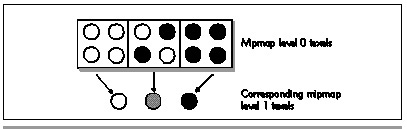

The amount of memory required for surface caching looked forbidding at
first. Surfaces are large relative to texture tiles, because every texel
of every surface is unique. Also, a surface can contain many texels
relative to the number of pixels actually drawn on the screen, because
due to perspective foreshortening, distant polygons have only a few
pixels relative to the surface size in texels. Surfaces associated with
partly hidden polygons must be fully built, even though only part of the
polygon is visible, and if polygons are drawn back to front with
overdraw, some polygons won't even be visible, but will still require
surface building and caching. What all this meant was that the surface
cache initially looked to be very large, on the order of several
megabytes, even at 320x200—too much for a game intended to run on an 8
MB machine.

#### Mipmapping To The Rescue {#Heading11}

Two factors combined to solve this problem. First, polygons are drawn
through an edge list with no overdraw, as I discussed a few chapters
back, so no surface is ever built unless at least part of it is visible.
Second, surfaces are built at four mipmap levels, depending on distance,
with each mipmap level having one-quarter as many texels as the
preceding level, as shown in Figure 68.4.

For those whose heads haven't been basted in 3-D technology for the past
several years, *mipmapping* is 3-D graphics jargon for a process that
normalizes the number of texels in a surface to be approximately equal
to the number of pixels, reducing calculation time for distant surfaces
containing only a few pixels. The mipmap level for a given surface is
selected to result in a texel:pixel ratio approximately between 1:1 and
1:2, so texels map roughly to pixels, and more distant surfaces are
correspondingly smaller. As a result, the number of surface texels
required to draw a scene at 320x200 is on the rough order of 64,000; the
number is actually somewhat higher, because of portions of surfaces that
are obscured and viewspace-tilted polygons, which have high
texel-to-pixel ratios along one axis, but not a whole lot higher. Thanks
to mipmapping and the edge list, 600K has proven to be plenty for the
surface cache at 320x200, even in the most complex scenes, and at
640x480, a little more than 1 MB suffices.

\
 **Figure 68.4**  *How mipmapping reduces surface caching requirements.*

All mipmapped texture tiles are generated as a preprocessing step, and
loaded from disk at runtime. One interesting point is that a key to
making mipmapping look good turned out to be box-filtering down from one
level to the next by averaging four adjacent pixels, then using error
diffusion dithering to generate the mipmapped texels.

Also, mipmapping is done on a per-surface basis; the mipmap level for a
whole surface is selected based on the distance from the viewer of the
nearest vertex. This led us to limit surface size to a maximum of
256x256. Otherwise, surfaces such as floors would extend for thousands
of texels, all at the mipmap level of the nearest vertex, and would
require huge amounts of surface cache space while displaying a great
deal of aliasing in distant regions due to a high texel:pixel ratio.

#### Two Final Notes on Surface Caching {#Heading12}

Dynamic lighting has a significant impact on the performance of surface
caching, because whenever the lighting on a surface changes, the surface
has to be rebuilt. In the worst case, where the lighting changes on
every visible surface, the surface cache provides no benefit, and
rendering runs at the combined speed of surface building and texture
mapping. This worst-case slowdown is tolerable but certainly noticeable,
so it's best to design games that use surface caching so only some of
the surfaces change lighting at any one time. If necessary, you could
alternate surface relighting so that half of the surfaces change on even
frames, and half on odd frames, but large-scale, constant relighting is
not surface caching's strongest suit.

Finally, Quake barely begins to tap surface caching's potential. All
sorts of procedural texturing and post-processing effects are possible.
If a wall is shot, a sprite of pockmarks could be attached to the wall's
data structure, and the sprite could be drawn into the surface each time
the surface is rebuilt. The same could be done for splatters, or
graffiti, with translucency easily supported. These effects would then
be cached and drawn as part of the surface, so the performance cost
would be much less than effects done by on-screen overdraw every frame.
Basically, the surface is a handy repository for all sorts of effects,
because multiple techniques can be composited, because it caches the
results for reuse without rebuilding, and because the texels constructed
in a surface are automatically drawn in perspective.
