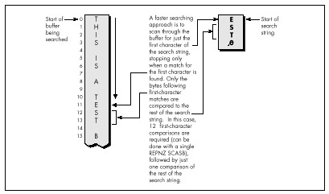

## Chapter 5\
 Crossing the Border

### Searching Files with Restartable Blocks

*We just moved.* Those three little words should strike terror into the
heart of anyone who owns more than a sleeping bag and a toothbrush. Our
last move was the usual zoo—and then some. Because the distance from the
old house to the new was only five miles, we used cars to move
everything smaller than a washing machine. We have a sizable
household—cats, dogs, kids, com, you name it—so the moving process took
a number of car trips. A *large* number—33, to be exact. I personally
spent about 15 hours just driving back and forth between the two houses.
The move took days to complete.

*Never again*.

You're probably wondering two things: What does this have to do with
high-performance programming, and why on earth didn't I rent a truck and
get the move over in one or two trips, saving hours of driving? As it
happens, the second question answers the first. I didn't rent a truck
because it *seemed* easier and cheaper to use cars—no big truck to
drive, no rentals, spread the work out more manageably, and so on.

It wasn't easier, and wasn't even much cheaper. (It costs quite a bit to
drive a car 330 miles, to say nothing of the value of 15 hours of my
time.) But, at the time, it seemed as though my approach would be easier
and cheaper. In fact, I didn't realize just how much time I had wasted
driving back and forth until I sat down to write this chapter.

In Chapter 1, I briefly discussed using *restartable blocks*. This, you
might remember, is the process of handling in chunks data sets too large
to fit in memory so that they can be processed just about as fast as if
they did fit in memory. The restartable block approach is very fast but
is relatively difficult to program.

At the opposite end of the spectrum lies byte-by-byte processing,
whereby DOS (or, in less extreme cases, a group of library functions) is
allowed to do all the hard work, so that you only have to deal with one
byte at a time. Byte-by-byte processing is easy to program but can be
extremely slow, due to the vast overhead that results from invoking DOS
each time a byte must be processed.

Sound familiar? It should. I moved via the byte-by-byte approach, and
the overhead of driving back and forth made for miserable performance.
Renting a truck (the restartable block approach) would have required
more effort and forethought, but would have paid off handsomely.

> 
> The easy, familiar approach often has nothing in its favor except that
> it requires less thinking; not a great virtue when writing
> high-performance code—or when moving.

And with that, let's look at a fairly complex application of restartable
blocks.

#### Searching for Text

The application we're going to examine searches a file for a specified
string. We'll develop a program that will search the file specified on
the command line for a string (also specified on the comline), then
report whether the string was found or not. (Because the searched-for
string is obtained via `argv`, it can't contain any whitespace
characters.)

This is a *very* limited subset of what search utilities such as grep
can do, and isn't really intended to be a generally useful application;
the purpose is to provide insight into restartable blocks in particular
and optimization in general in the course of developing a search engine.
That search engine will, however, be easy to plug into any program, and
there's nothing preventing you from using it in a more fruitful context,
like searching through a user-selectable file set.

The first point to address in designing our program involves the
appropriate text-search approach to use. Literally dozens of workable
ways exist to search a file. We can immediately discard all approaches
that involve reading any byte of the file more than once, because disk
access time is orders of magnitude slower than any data handling
performed by our own code. Based on our experience in Chapter 1, we can
also discard all approaches that get bytes either one at a time or in
small sets from DOS. We want to read big "buffers-full" of bytes at a
pop from the searched file, and the bigger the buffer the better—in
order to minimize DOS's overhead. A good rough cut is a buffer that will
be between 16K and 64K, depending on the exact search approach, 64K
being the maximum size because near pointers make for superior
performance.

So we know we want to work with a large buffer, filling it as
infrequently as possible. Now we have to figure out how to search
through a file by loading it into that large buffer in chunks. To
accomplish this, we have to know how we want to do our searching, and
that's not immediately obvious. Where do we begin?

Well, it might be instructive to consider how we would search if our
search involved only one buffer, already resident in memory. In other
words, suppose we don't have to bother with file handling at all, and
further suppose that we don't have to deal with searching through
multiple blocks. After all, that's a good description of the
all-important inner loop of our searching program, where the program
will spend virtually all of its time (aside from the unavoidable disk
access overhead).

### Avoiding the String Trap

The easiest approach would be to use a C/C++ library function. The
closest match to what we need is `strstr()`, which searches one string
for the first occurrence of a second string. However, while `strstr()`
would work, it isn't ideal for our purposes. The problem is this: Where
we want to search a fixed-length buffer for the first occurrence of a
string, `strstr()` searches a *string* for the first occurrence of
another string.

We could put a zero byte at the end of our buffer to allow `strstr()`
to work, but why bother? The `strstr()` function must spend time
either checking for the end of the string being searched or determining
the length of that string—wasted effort given that we already know
exactly how long our search buffer is. Even if a given `strstr()`
implementation is well-written, its performance will suffer, at least
for our application, from unnecessary overhead.

> 
> This illustrates why you shouldn't think of C/C++ library functions as
> black boxes; understand what they do and try to figure out how they do
> it, and relate that to their performance in the context you're
> interested in.

### Brute-Force Techniques

Given that no C/C++ library function meets our needs precisely, an
obvious alternative approach is the brute-force technique that uses
`memcmp()` to compare *every* potential matching location in the
buffer to the string we're searching for, as illustrated in Figure 5.1.

By the way, we could, of course, use our own code, working with pointers
in a loop, to perform the comparison in place of `memcmp()`. But
`memcmp()` will almost certainly use the very fast `REPZ CMPS`
instruction. However, *never assume!* It wouldn't hurt to use a debugger
to check out the actual machine-code implementation of `memcmp()` from
your compiler. If necessary, you could always write your own assembly
language implementation of `memcmp()`.


Invoking `memcmp()` for each potential match location works, but
entails considerable overhead. Each comparison requires that parameters
be pushed and that a call to and return from `memcmp()` be performed,
along with a pass through the comparison loop. Surely there's a better
way!

Indeed there is. We can eliminate most calls to `memcmp()` by
performing a simple test on each potential match location that will
reject most such locations right off the bat. We'll just check whether
the first character of the potentially matching buffer location matches
the first character of the string we're searching for. We could make
this check by using a pointer in a loop to scan the buffer for the next
match for the first character, stopping to check for a match with the
rest of the string *only* when the first character matches, as shown in
Figure 5.2.

### Using memchr()

There's yet a better way to implement this approach, however. Use the
`memchr()` function, which does nothing more or less than find the
next occurrence of a specified character in a fixed-length buffer
(presumably by using the extremely efficient `REPNZ SCASB`
instruction, although again it wouldn't hurt to check). By using
`memchr()` to scan for potential matches that can then be fully tested
with `memcmp()`, we can build a highly efficient search engine that
takes good advantage of the information we have about the buffer being
searched and the string we're searching for. Our engine also relies
heavily on repeated string instructions, assuming that the `memchr()`
and `memcmp()` library functions are properly coded.



We're going to go with the this approach in our file-searching program;
the only trick lies in deciding how to integrate this approach with
restartable blocks in order to search through files larger than our
buffer. This certainly isn't the fastest-possible searching algorithm;
as one example, the Boyer-Moore algorithm, which cleverly eliminates
many buffer locations as potential matches in the process of checking
preceding locations, can be considerably faster. However, the
Boyer-Moore algorithm is quite complex to understand and implement, and
would distract us from our main focus, restartable blocks, so we'll save
it for a later chapter (Chapter 14, to be precise). Besides, I suspect
you'll find the approach we'll use to be fast enough for most purposes.

Now that we've selected a searching approach, let's integrate it with
file handling and searching through multiple blocks. In other words,
let's make it restartable.

#### Making a Search Restartable

As it happens, there's no great trick to putting the pieces of this
search program together. Basically, we'll read in a buffer of data
(we'll work with 16K at a time to avoid signed overflow problems with
integers), search it for a match with the `memchr()`/`memcmp()` engine
described, and exit with a "string found" response if the desired string
is found.

Otherwise, we'll load in another buffer full of data from the file,
search it, and so on. The only trick lies in handling potentially
matching sequences in the file that start in one buffer and end in the
next—that is, sequences that span buffers. We'll handle this by copying
the unchecked bytes at the end of one buffer to the start of the next
and reading that many fewer bytes the next time we fill the buffer.

The exact number of bytes to be copied from the end of one buffer to the
start of the next is the length of the searched-for string minus 1,
since that's how many bytes at the end of the buffer can't be checked as
possible matches (because the check would run off the end of the
buffer).

That's really all there is to it. Listing 5.1 shows the file-searching
program. As you can see, it's not particularly complex, although a few
fairly opaque lines of code are required to handle merging the end of
one block with the start of the next. The code that searches a single
block—the function `SearchForString()`—is simple and compact (as it
should be, given that it's by far the most heavily-executed code in the
listing).

Listing 5.1 nicely illustrates the core concept of restartable blocks:
Organize your program so that you can do your processing within each
block as fast as you could if there were only one block—which is to say
at top speed—and make your blocks as large as possible in order to
minimize the overhead associated with going from one block to the next.

**LISTING 5.1 SEARCH.C**

```c
/* Program to search the file specified by the first command-line
 * argument for the string specified by the second command-line
 * argument. Performs the search by reading and searching blocks
 * of size BLOCK_SIZE. */

#include <stdio.h>
#include <fcntl.h>
#include <string.h>
#include <alloc.h>   /* alloc.h for Borland compilers,
                        malloc.h for Microsoft compilers */

#define BLOCK_SIZE  0x4000   /* we'll process the file in 16K blocks */

/* Searches the specified number of sequences in the specified
   buffer for matches to SearchString of SearchStringLength. Note
   that the calling code should already have shortened SearchLength
   if necessary to compensate for the distance from the end of the
   buffer to the last possible start of a matching sequence in the
   buffer.
*/

int SearchForString(unsigned char *Buffer, int SearchLength,
   unsigned char *SearchString, int SearchStringLength)
{
   unsigned char *PotentialMatch;

   /* Search so long as there are potential-match locations
      remaining */
   while ( SearchLength ) {
     /* See if the first character of SearchString can be found */
     if ( (PotentialMatch =
           memchr(Buffer, *SearchString, SearchLength)) == NULL ) {
        break;   /* No matches in this buffer */
     }
      /* The first character matches; see if the rest of the string
         also matches */
      if ( SearchStringLength == 1 ) {
         return(1);  /* That one matching character was the whole
                        search string, so we've got a match */
      }
      else {
         /* Check whether the remaining characters match */
         if ( !memcmp(PotentialMatch + 1, SearchString + 1,
               SearchStringLength - 1) ) {
            return(1);  /* We've got a match */
         }
      }
      /* The string doesn't match; keep going by pointing past the
         potential match location we just rejected */
      SearchLength -= PotentialMatch - Buffer + 1;
      Buffer = PotentialMatch + 1;
   }

   return(0);  /* No match found */
}

main(int argc, char *argv[]) {
   int Done;               /* Indicates whether search is done */
   int Handle;             /* Handle of file being searched */
   int WorkingLength;      /* Length of current block */
   int SearchStringLength; /* Length of string to search for */
   int BlockSearchLength;  /* Length to search in current block */
   int Found;              /* Indicates final search completion
                              status */
   int NextLoadCount;      /* # of bytes to read into next block,
                              accounting for bytes copied from the
                              last block */
   unsigned char *WorkingBlock; /* Block storage buffer */
   unsigned char *SearchString; /* Pointer to the string to search for */
   unsigned char *NextLoadPtr;  /* Offset at which to start loading
                                   the next block, accounting for
                                   bytes copied from the last block */

   /* Check for the proper number of arguments */
   if ( argc != 3 ) {
      printf("usage: search filename search-string\n");
      exit(1);
   }

   /* Try to open the file to be searched */
   if ( (Handle = open(argv[1], O_RDONLY | O_BINARY)) == -1 ) {
      printf("Can't open file: %s\n", argv[1]);
      exit(1);
   }
   /* Calculate the length of text to search for */
   SearchString = argv[2];
   SearchStringLength = strlen(SearchString);
   /* Try to get memory in which to buffer the data */
   if ( (WorkingBlock = malloc(BLOCK_SIZE)) == NULL ) {
      printf("Can't get enough memory\n");
      exit(1);
   }

   /* Load the first block at the start of the buffer, and try to
      fill the entire buffer */
   NextLoadPtr = WorkingBlock;
   NextLoadCount = BLOCK_SIZE;
   Done = 0;      /* Not done with search yet */
   Found = 0;     /* Assume we won't find a match */
   /* Search the file in BLOCK_SIZE chunks */
   do {
      /* Read in however many bytes are needed to fill out the block
         (accounting for bytes copied over from the last block), or
         the rest of the bytes in the file, whichever is less */
      if ( (WorkingLength = read(Handle, NextLoadPtr,
            NextLoadCount)) == -1 ) {
         printf("Error reading file %s\n", argv[1]);
         exit(1);
      }
      /* If we didn't read all the bytes we requested, we're done
         after this block, whether we find a match or not */
      if ( WorkingLength != NextLoadCount ) {
         Done = 1;
      }

      /* Account for any bytes we copied from the end of the last
         block in the total length of this block */
      WorkingLength += NextLoadPtr - WorkingBlock;
      /* Calculate the number of bytes in this block that could
         possibly be the start of a matching sequence that lies
         entirely in this block (sequences that run off the end of
         the block will be transferred to the next block and found
         when that block is searched)
      */
      if ( (BlockSearchLength =
               WorkingLength - SearchStringLength + 1) <= 0 ) {
            Done = 1;  /* Too few characters in this block for
                          there to be any possible matches, so this
                          is the final block and we're done without
                          finding a match
                       */
      }
      else {
         /* Search this block */
         if ( SearchForString(WorkingBlock, BlockSearchLength,
               SearchString, SearchStringLength) ) {
            Found = 1;     /* We've found a match */
            Done = 1;
         }
         else {
            /* Copy any bytes from the end of the block that start
               potentially-matching sequences that would run off
               the end of the block over to the next block */
            if ( SearchStringLength > 1 ) {
               memcpy(WorkingBlock,
                  WorkingBlock+BLOCK_SIZE - SearchStringLength + 1,
                  SearchStringLength - 1);
            }
            /* Set up to load the next bytes from the file after the
               bytes copied from the end of the current block */
            NextLoadPtr = WorkingBlock + SearchStringLength - 1;
            NextLoadCount = BLOCK_SIZE - SearchStringLength + 1;
         }
      }
   } while ( !Done );

   /* Report the results */
   if ( Found ) {
      printf("String found\n");
   } else {
      printf("String not found\n");
   }
   exit(Found);   /* Return the found/not found status as the
                     DOS errorlevel */
}
```

### Interpreting Where the Cycles Go

To boost the overall performance of Listing 5.1, I would normally
convert `SearchForString()` to assembly language at this point.
However, I'm not going to do that, and the reason is as important a
lesson as any discussion of optimized assembly code is likely to be.
Take a moment to examine some interesting performance aspects of the C
implementation, and all should become much clearer.

As you'll recall from Chapter 1, one of the important rules for
optimization involves knowing when optimization is worth bothering with
at all. Another rule involves understanding where most of a program's
execution time is going. That's more true for Listing 5.1 than you might
think.

When Listing 5.1 is run on a 1 MB assembly source file, it takes about
three seconds to find the string "xxxend" (which is at the end of the
file) on a 20 MHz 386 machine, with the entire file in a disk cache. If
`BLOCK_SIZE` is trimmed from 16K to 4K, *execution time does not
increase perceptibly!* At 2K, the program slows slightly; it's not until
the block size shrinks to 64 bytes that execution time becomes
approximately double that of the 16K buffer.

So the first thing we've discovered is that, while bigger blocks do make
for the best performance, the increment in performance may not be very
large, and might not justify the extra memory required for those larger
blocks. Our next discovery is that, even though we read the file in
large chunks, most of the execution time of Listing 5.1 is nonetheless
spent in executing the `read()` function.

When I replaced the `read()` function call in Listing 5.1 with code
that simply fools the program into thinking that a 1 MB file is being
read, the program ran almost instantaneously—in less than 1/2 second,
even when the searched-for string wasn't anywhere to be found. By
contrast, Listing 5.1 requires three seconds to run even when searching
for a single character that isn't found anywhere in the file, the case
in which a single call to `memchr()` (and thus a single `REPNZ
SCASB`) can eliminate an entire block at a time.

All in all, the time required for DOS disk access calls is taking up at
least 80 percent of execution time, and search time is less than 20
percent of overall execution time. In fact, search time is probably a
good deal less than 20 percent of the total, given that the overhead of
loading the program, running through the C startup code, opening the
file, executing `printf()`, and exiting the program and returning to
the DOS shell are also included in my timings. Given which, it should be
apparent why converting to assembly language isn't worth the trouble—the
best we could do by speeding up the search is a 10 percent or so
improvement, and that would require more than doubling the performance
of code that already uses repeated string instructions to do most of the
work.

Not likely.

#### Knowing When Assembly Is Pointless

So that's why we're not going to go to assembly language in this
example—which is not to say it would never be worth converting the
search engine in Listing 5.1 to assembly.

If, for example, your application will typically search buffers in which
the first character of the search string occurs frequently as might be
the case when searching a text buffer for a string starting with the
space character an assembly implementation might be several times
faster. Why? Because assembly code can switch from `REPNZ SCASB` to
match the first character to `REPZ CMPS` to check the remaining
characters in just a few instructions.

In contrast, Listing 5.1 must return from `memchr()`, set up
parameters, and call `memcmp()` in order to do the same thing.
Likewise, assembly can switch back to `REPNZ SCASB` after a non-match
much more quickly than Listing 5.1. The switching overhead is high; when
searching a file completely filled with the character z for the string
"zy," Listing 5.1 takes almost 1/2 minute, or nearly an order of
magnitude longer than when searching a file filled with normal text.

It might also be worth converting the search engine to assembly for
searches performed entirely in memory; with the overhead of file access
eliminated, improvements in search-engine performance would translate
directly into significantly faster overall performance. One such
application that would have much the same structure as Listing 5.1 would
be searching through expanded memory buffers, and another would be
searching through huge (segment-spanning) buffers.

And so we find, as we so often will, that optimization is definitely not
a cut-and-dried matter, and that there is no such thing as a single
"best" approach.

> 
> You must know what your application will typically do, and you must know
> whether you're more concerned with average or worst-case performance
> before you can decide how best to speed up your program—and, indeed,
> whether speeding it up is worth doing at all.

By the way, don't think that just because very large block sizes don't
much improve performance, it wasn't worth using restartable blocks in
Listing 5.1. Listing 5.1 runs more than three times more slowly with a
block size of 32 bytes than with a block size of 4K, and any
byte-by-byte approach would surely be slower still, due to the overhead
of repeated calls to DOS and/or the C stream I/O library.

Restartable blocks do minimize the overhead of DOS file-access calls in
Listing 5.1; it's just that there's no way to reduce that overhead to
the point where it becomes worth attempting to further improve the
performance of our relatively efficient search engine. Although the
search engine is by no means fully optimized, it's nonetheless as fast
as there's any reason for it to be, given the balance of performance
among the components of this program.

### Always Look Where Execution Is Going

I've explained two important lessons: Know when it's worth optimizing
further, and use restartable blocks to process large data sets as a
series of blocks, with each block handled at high speed. The first
lesson is less obvious than it seems.

When I set out to write this chapter, I fully intended to write an
assembly language version of Listing 5.1, and I expected the assembly
version to be much faster. When I actually looked at where execution
time was going (which I did by modifying the program to remove the calls
to the `read()` function, but a code profiler could be used to do the
same thing much more easily), I found that the best code in the world
wouldn't make much difference.

> 
> When you try to speed up code, take a moment to identify the hot spots
> in your program so that you know where optimization is needed and
> whether it will make a significant difference before you invest your
> time.

As for restartable blocks: Here we tackled a considerably more complex
application of restartable blocks than we did in Chapter 1—which turned
out not to be so difficult after all. Don't let irregularities in the
programming tasks you tackle, such as strings that span blocks, fluster
you into settling for easy, general—and slow—solutions. Focus on making
the inner loop—the code that handles each block—as efficient as
possible, then structure the rest of your code to support the inner
loop.

Programming with restartable blocks isn't easy, but when speed is an
issue, using restartable blocks in the right places more than pays for
itself with greatly improved performance. And when speed is *not* an
issue, of course, or in code that's not time-critical, you wouldn't
dream of wasting your time on optimization.

Would you?
