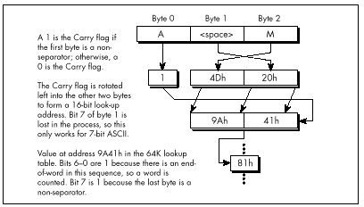

## Chapter 16 -- There Ain't No Such Thing as the Fastest Code

### Lessons Learned in the Pursuit of the Ultimate Word Counter

I remember reading an overview of C++ development tools for Windows in a
past issue of *PC Week*. In the lower left corner was the familiar box
listing the 10 leading concerns of corporate buyers when it comes to
C++. Boiled down, the list looked like this, in order of descending
importance to buyers:

  1. Debugging
  
  2. Documentation
  
  3. Windows development tools
  
  4. High-level Windows support
  
  5. Class library
  
  6. Development cycle efficiency
  
  7. Object-oriented development aids
  
  8. Programming management aids
  
  9. Online help
  
  10. Windows development cycle automation

Is something missing here? You bet your maximum *gluteus* something's
missing—nowhere on that list is there so much as one word about how fast
the compiled code runs! I'm not saying that performance is everything,
but optimization isn't even down there at number 10, below online help!
Ye gods and little fishes! We are talking here about people who would
take a bus from LA to New York instead of a plane because it had a
cleaner bathroom; who would choose a painting from a Holiday Inn over a
Matisse because it had a fancier frame; who would buy a Yugo instead
of—well, hell, anything—because it had a nice owner's manual and
particularly attractive keys. We are talking about people who are
focusing on means, and have forgotten about ends. We are talking about
people with no programming souls.

### Counting Words in a Hurry

What are we to make of this? At the very least, we can safely guess that
very few corporate buyers ever enter optimization contests. Most of my
readers do, however; in fact, far more than I thought ever would, but
that gladdens me to no end. I issued my first optimization challenge in
a "Pushing the Envelope" column in *PC TECHNIQUES* back in 1991, and was
deluged by respondents who, one might also gather, do not live by *PC
Week*.

That initial challenge was sparked by a column David Gerrold wrote (also
in *PC TECHNIQUES* ) concerning the matter of counting the number of
words in a document; David turned up some pretty interesting
optimization issues along the way. David did all his coding in Pascal,
pointing out that while an assembly language version would probably be
faster, his Pascal utility worked properly and was fast enough for him.

It wasn't, however, fast enough for me. The logical starting place for
speeding up word counting would be David's original Pascal code, but I'm
much more comfortable with C, so Listing 16.1 is a loose approximation
of David's word count program, translated to C. I left out a few
details, such as handling comment blocks, partly because I don't use
such blocks myself, and partly so we can focus on optimizing the core
word-counting code. As Table 16.1 indicates, Listing 16.1 counts the
words in a 104,448-word file in 4.6 seconds. The file was stored on a
RAM disk, and Listing 16.1 was compiled with Borland C++ with all
optimization enabled. A RAM disk was used partly because it returns
consistent times—no seek times, rotational latency, or cache to muddy
the waters—and partly to highlight word-counting speed rather than disk
access speed.

| Listing                      | Time to Count Words |
|------------------------------|---------------------|
| 16.1 (C)                     | 4.6 seconds         |
| 16.2 & 16.3 (C+ASM)          | 2.4 seconds         |
| 16.2 & 16.4 (C+ASM w/lookup) | 1.6 seconds         |

Table: Table 16.1 Word count timings.

These are the times taken to search a file containing 104,448 words,
timed from a RAM disk on a 20 MHz 386.

**LISTING 16.1 L16-1.C**

```c
 /* Word-counting program. Tested with Borland C++ in C
    compilation mode and the small model. */
 
 #include <stdio.h>
 #include <fcntl.h>
 #include <sys\stat.h>
 #include <stdlib.h>
 #include <io.h>
 
 #define  B UFFER_SIZE  0x8000   /* largest chunk of file worked 
                                  with at any one time */
 int main(int, char **);
 
 int main(int argc, char **argv) {
    int Handle;
    unsigned int BlockSize;
    long FileSize;
    unsigned long WordCount = 0;
    char *Buffer, CharFlag = 0, PredCharFlag, *BufferPtr, Ch;
 
    if (argc != 2) {
       printf("usage: wc <filename>\n");
       exit(1);
    }
 
    if ((Buffer = malloc(BUFFER_SIZE)) == NULL) {
       printf("Can't allocate adequate memory\n");
       exit(1);
    }
 
    if ((Handle = open(argv[1], O_RDONLY | O_BINARY)) == -1) {
       printf("Can't open file %s\n", argv[1]);
       exit(1);
    }
 
    if ((FileSize = filelength(Handle)) == -1) {
       printf("Error sizing file %s\n", argv[1]);
       exit(1);
    }
 
    /* Process the file in chunks */
    while (FileSize > 0) {
       /* Get the next chunk */
       FileSize -= (BlockSize = min(FileSize, BUFFER_SIZE));
       if (read(Handle, Buffer, BlockSize) == -1) {
          printf("Error reading file %s\n", argv[1]);
          exit(1);
       }
       /* Count words in the chunk */
       BufferPtr = Buffer;
       do {
          PredCharFlag = CharFlag;
          Ch = *BufferPtr++ & 0x7F; /* strip high bit, which some
                                       word processors set as an
                                       internal flag */
          CharFlag = ((Ch >= ‘a') && (Ch <= ‘z')) ||
                     ((Ch >= ‘A') && (Ch <= ‘Z')) ||
                     ((Ch >= ‘0') && (Ch <= ‘9')) ||
                     (Ch == ‘\'');
          if ((!CharFlag) && PredCharFlag) {
             WordCo u nt++; 
          }
       } while (—BlockSize);
    }
 
    /*  Catch the last word, if any */ 
    if (CharFlag) {
       WordCount++;
    }
    printf("\nTotal words in file: %lu\n", WordCount);
    return(0);
 }
```

Listing 16.2 is Listing 16.1 modified to call a function that scans each
block for words, and Listing 16.3 contains an assembly function that
counts words. Used together, Listings 16.2 and 16.3 are just about twice
as fast as Listing 16.1, a good return for a little assembly language.
Listing 16.3 is a pretty straightforward translation from C to assembly;
the new code makes good use of registers, but the key code—determining
whether each byte is a character or not—is still done with the same
multiple-sequential-tests approach used by the code that the C compiler
generates.

**LISTING 16.2 L16-2.C**

```c
/* Word-counting program incorporating assembly language. Tested
   with Borland C++ in C compilation mode & the small model. */

#include <stdio.h>
#include <fcntl.h>
#include <sys\stat.h>
#include <stdlib.h>
#include <io.h>

#define BUFFER_SIZE  0x8000   /* largest chunk of file worked
                                 with at any one time */
int main(int, char **);
void ScanBuffer(char *, unsigned int, char *, unsigned long *);

int main(int argc, char **argv) {
   int Handle;
   unsigned int BlockSize;
   long FileSize;
   unsigned long WordCount = 0;
   char *Buffer, CharFlag = 0;

   if (argc != 2) {
      printf("usage: wc <filename>\n");
      exit(1);
   }

   if ((Buffer = malloc(BUFFER_SIZE)) == NULL) {
      printf("Can't allocate adequate memory\n");
      exit(1);
   }

   if ((Handle = open(argv[1], O_RDONLY | O_BINARY)) == -1) {
      printf("Can't open file %s\n", argv[1]);
      exit(1);
   }

   if ((FileSize = filelength(Handle)) == -1) {
      printf("Error sizing file %s\n", argv[1]);
      exit(1);
   }

   CharFlag = 0;
   while (FileSize > 0) {
      FileSize -= (BlockSize = min(FileSize, BUFFER_SIZE));
      if (read(Handle, Buffer, BlockSize) == -1) {
         printf("Error reading file %s\n", argv[1]);
         exit(1);
      }
      ScanBuffer(Buffer, BlockSize, &CharFlag, &WordCount);
   }

   /* Catch the last word, if any */
   if (CharFlag) {
      WordCount++;
   }
   printf("\nTotal words in file: %lu\n", WordCount);
   return(0);
}
```

**LISTING 16.3 L16-3.ASM**

```nasm
; Assembly subroutine for Listing 16.2. Scans through Buffer, of
; length BufferLength, counting words and updating WordCount as
; appropriate. BufferLength must be > 0. *CharFlag and *WordCount
; should equal 0 on the first call. Tested with TASM.
; C near-callable as:
; void ScanBuffer(char *Buffer, unsigned int BufferLength,
; char *CharFlag, unsigned long *WordCount);

parms   struc
        dw      2 dup(?)        ;pushed return address & BP
Buffer  dw      ?               ;buffer to scan
BufferLength dw ?               ;length of buffer to scan
CharFlag dw     ?               ;pointer to flag for state of last
                                ; char processed on entry (0 on
                                ; initial call). Updated on exit
WordCount dw    ?               ;pointer to 32-bit count of words
                                ; found (0 on initial call)
parms   ends

        .model  small
        .code
        public  _ScanBuffer
_ScanBuffer     proc    near
        push    bp              ;preserve caller's stack frame
        mov     bp,sp           ;set up local stack frame
        push    si              ;preserve caller's register vars
        push    di

        mov     si,[bp+Buffer]  ;point to buffer to scan
        mov     bx,[bp+WordCount]
        mov     cx,[bx]         ;get current 32-bit word count
        mov     dx,[bx+2]
        mov     bx,[bp+CharFlag]
        mov     bl,[bx]            ;get current CharFlag
        mov     di,[bp+BufferLength];get # of bytes to scan
ScanLoop:
        mov     bh,bl           ;PredCharFlag = CharFlag;
        lodsb                   ;Ch = *BufferPtr++ & 0x7F;
        and     al,7fh          ;strip high bit for word processors
                                ; that set it as an internal flag
        mov     bl,1            ;assume this is a char; CharFlag = 1;
        cmp     al,‘a'          ;it is a char if between a and z
        jb      CheckAZ
        cmp     al,‘z'
        jna     IsAChar
CheckAZ:
        cmp     al,‘A'          ;it is a char if between A and Z
        jb      Check09
        cmp     al,‘Z'
        jna     IsAChar
Check09:
        cmp     al,‘0'          ;it is a char if between 0 and 9
        jb      CheckApostrophe
        cmp     al,‘9'
        jna     IsAChar
CheckApostrophe:
        cmp      al,27h           ;it is a char if an apostrophe 
        jz      IsAChar
        sub     bl,bl           ;not a char; CharFlag = 0;
        and     bh,bh
        jz      ScanLoopBottom  ;if ((!CharFlag) && PredCharFlag) {
        add     cx,1            ;    (WordCount)++;
        adc     dx,0            ;}
IsAChar:
ScanLoopBottom:
        dec     di              ;} while (—BufferLength);
        jnz     ScanLoop

        mov     si,[bp+CharFlag]
        mov     [si],bl         ;set new CharFlag
        mov     bx,[bp+WordCount]
        mov     [bx],cx         ;set new word count
        mov     [bx+2],dx

        pop     di              ;restore caller's register vars
        pop     si
        pop     bp              ;restore caller's stack frame
        ret
_ScanBuffer     endp
        end
```

#### Which Way to Go from Here?

We could rearrange the tests in light of the nature of the data being
scanned; for example, we could perform the tests more efficiently by
taking advantage of the knowledge that if a byte is less than ‘0,' it's
either an apostrophe or not a character at all. However, that sort of
fine-tuning is typically good for speedups of only 10 to 20 percent, and
I've intentionally refrained from implementing this in Listing 16.3 to
avoid pointing you down the wrong path; what we need is a different tack
altogether. Ponder this. What we *really* want to know is nothing more
than whether a byte is a character, not what sort of character it is.
For each byte value, we want a yes/no status, and nothing else—and that
description practically begs for a lookup table. Listing 16.4 uses a
lookup table approach to boost performance another 50 percent, to three
times the performance of the original C code. On a 20 MHz 386, this
represents a change from 4.6 to 1.6 seconds, which could be
significant—who likes to wait? On an 8088, the improvement in
word-counting a large file could easily be 10 or 20 seconds, which is
*definitely* significant.

**LISTING 16.4 L16-4.ASM**

```nasm
; Assembly subroutine for Listing 16.2. Scans through Buffer, of
; length BufferLength, counting words and updating WordCount as
; appropriate, using a lookup table-based approach. BufferLength
; must be > 0. *CharFlag and *WordCount should equal 0 on the
; first call. Tested with TASM.
; C near-callable as:
; void ScanBuffer(char *Buffer, unsigned int BufferLength,
; char *CharFlag, unsigned long *WordCount);

parms   struc
        dw      2 dup(?)        ;pushed return address & BP
Buffer  dw      ?               ;buffer to scan
BufferLength dw ?               ;length of buffer to scan
CharFlag dw     ?               ;pointer to flag for state of last
                                ;char processed on entry (0 on
                                ;initial call). Updated on exit
WordCount dw    ?               ;pointer to 32-bit count of words
                                ; found (0 on initial call)
parms   ends

        .model  small
        .data
; Table of char/not statuses for byte values 0-255 (128-255 are
; duplicates of 0-127 to effectively mask off bit 7, which some
; word processors set as an internal flag).
CharStatusTable label   byte
        REPT    2
        db      39 dup(0)
        db      1               ;apostrophe
        db      8 dup(0)
        db      10 dup(1)       ;0-9
        db      7 dup(0)
        db      26 dup(1)       ;A-Z
        db      6 dup(0)
        db      26 dup(1)       ;a-z
        db      5 dup(0)
        ENDM

        .code
        public  _ScanBuffer
_ScanBuffer     proc    near
        push    bp              ;preserve caller's stack frame
        mov     bp,sp           ;set up local stack frame
        push    si              ;preserve caller's register vars
        push    di

        mov     si,[bp+Buffer]  ;point to buffer to scan
        mov     bx,[bp+WordCount]
        mov     di,[bx]         ;get current 32-bit word count
        mov     dx,[bx+2]
        mov     bx,[bp+CharFlag]
        mov     al,[bx]         ;get current CharFlag
        mov     cx,[bp+BufferLength] ;get # of bytes to scan
        mov     bx,offset CharStatusTable
ScanLoop:
        and     al,al           ;ZF=0 if last byte was a char,
                                ; ZF=1 if not
        lodsb                   ;get the next byte
                                ;***doesn't change flags***
        xlat                    ;look up its char/not status
                                ;***doesn't change flags***
        jz      ScanLoopBottom  ;don't count a word if last byte was
                                ; not a character
        and     al,al           ;last byte was a character; is the
                                ; current byte a character?
        jz      CountWord       ;no, so count a word
ScanLoopBottom:
        dec     cx              ;count down buffer length
        jnz     ScanLoop
Done:
        mov     si,[bp+CharFlag]
        mov     [si],al         ;set new CharFlag
        mov     bx,[bp+WordCount]
        mov     [bx],di         ;set new word count
        mov     [bx+2],dx

        pop     di              ;restore caller's register vars
        pop     si
        pop     bp              ;restore caller's stack frame
        ret

        align   2
CountWord:
        add     di,1            ;increment the word count
        adc     dx,0
        dec     cx              ;count down buffer length
        jnz     ScanLoop
        jmp     Done
_ScanBuffer     endp
        end
```

Listing 16.4 features several interesting tricks. First, it uses
`LODSB` and `XLAT` in succession, a very neat way to get a
pointed-to byte, advance the pointer, and look up the value indexed by
the byte in a table, all with just two instruction bytes.
(Interestingly, Listing 16.4 would probably run quite a bit better still
on an 8088, where `LODSB` and `XLAT` have a greater advantage over
conventional instructions. On the 486 and Pentium, however, `LODSB`
and `XLAT` lose much of their appeal, and should be replaced with
`MOV` instructions.) Better yet, `LODSB` and `XLAT` don't alter
the flags, so the Zero flag status set before `LODSB` is still around
to be tested after `XLAT` .

Finally, if you look closely, you will see that Listing 16.4 jumps out
of the loop to increment the word count in the case where a word is
actually found, with a duplicate of the loop-bottom code placed after
the code that increments the word count, to avoid an extra branch back
into the loop; this replaces the more intuitive approach of jumping
around the incrementing code to the loop bottom when a word isn't found.
Although this incurs a branch every time a word is found, a word is
typically found only once every 5 or 6 bytes; on average, then, a branch
is saved about two-thirds of the time. This is an excellent example of
how understanding the nature of the data you're processing allows you to
optimize in ways the compiler can't. *Know your data!*

So, gosh, Listing 16.4 is the best word-counting code in the universe,
right? Not hardly. If there's one thing my years of toil in this vale of
silicon have taught me, it's that there's never a lack of potential for
further optimization. *Never!* Off the top of my head, I can think of at
least three ways to speed up Listing 16.4; and, since Turbo Profiler
reports that even in Listing 16.4, 88 percent of the time is spent
scanning the buffer (as opposed to reading the file), there's potential
for those further optimizations to improve performance significantly.
(However, it is true that when access is performed to a hard rather than
RAM disk, disk access jumps to about half of overall execution time.)
One possible optimization is unrolling the loop, although that is truly
a last resort because it tends to make further changes extremely
difficult.

> 
> Exhaust all other optimizations before unrolling loops.

### Challenges and Hazards

The challenge I put to the readers of *PC TECHNIQUES* was to write a
faster module to replace Listing 16.4. The author of the code that
counted the words in my secret test file fastest on my 20 MHz cached 386
would be the winner and receive Numerous Valuable Prizes.

No listings were to be longer than 200 lines. No complete programs were
to be accepted; submissions had to be plug-compatible with Listing 16.4.
(This was to encourage people not to waste time optimizing outside the
inner loop.) Finally, the code had to produce the same results as
Listing 16.4; I didn't want to see functions that approximated the word
count by dividing the number of characters by six instead of counting
actual words!

So how did the entrants in this particular challenge stack up? More than
one claimed a speed-up over my assembly word-counting code of more than
three times. On top of the three-times speedup over the original C code
that I had already realized, we're almost up to an order of magnitude
faster. You are, of course, entitled to your own opinion, but *I*
consider an order of magnitude to be significant.

Truth to tell, I didn't expect a three-times speedup; around two times
was what I had in mind. Which just goes to show that any code can be
made faster than you'd expect, if you think about it long enough and
from many different perspectives. (The most potent word-counting
technique seems to be a 64K lookup table that allows handling two bytes
simultaneously. This is not the sort of technique one comes up with by
brute-force optimization.) Thinking (or, worse yet, boasting) that your
code is the fastest possible is rollescating on a tightrope in a
hurricane; you're due for a fall, if you catch my drift. Case in point:
Terje Mathisen's word-counting program.

#### Blinding Yourself to a Better Approach

Not so long ago, Terje Mathisen, who I introduced earlier in this book,
wrote a very fast word-counting program, and posted it on Bix. When I
say it was fast, I mean *fast;* this code was optimized like nobody's
business. We're talking top-quality code here.

When the topic of optimizing came up in one of the Bix conferences,
Terje's program was mentioned, and he posted the following message: "I
challenge BIXens (and especially **mabrash!**) to speed it up
significantly. I would consider 5 percent a good result." The clear
implication was, "That code is as fast as it can possibly be."

Naturally, it wasn't; there ain't no such thing as the fastest code
(TANSTATFC? I agree, it doesn't have the ring of TANSTAAFL). I pored
over Terje's 386 native-mode code, and found the critical inner loop,
which was indeed as tight as one could imagine, consisting of just a few
386 native-mode instructions. However, one of the instructions was this:

```nasm
CMP   DH,[EBX+EAX]
```     

Harmless enough, save for two things. First, EBX happened to be zero at
this point (a leftover from an earlier version of the code, as it turned
out), so it was superfluous as a memory-addressing component; this made
it possible to use base-only addressing (`[EAX]`) rather than
base+index addressing (`[EBX+EAX]`), which saves a cycle on the 386.
Second: Changing the instruction to `CMP [EAX],DH` saved 2 cycles—just
enough, by good fortune, to speed up the whole program by 5 percent.

> 
> `CMP reg,[mem]` takes 6 cycles on the 386, but `CMP [ mem ],reg`
> takes only 5 cycles; you should always perform`CMP` with the memory
> operand on the left on the 386.

(Granted, `CMP [*mem*],*reg*` is 1 cycle slower than `CMP
*reg*,[*mem*]` on the 286, and they're both the same on the 8088; in
this case, though, the code was specific to the 386. In case you're
curious, both forms take 2 cycles on the 486; quite a lot faster, eh?)

#### Watch Out for Luggable Assumptions!

The first lesson to be learned here is not to lug assumptions that may
no longer be valid from the 8088/286 world into the wonderful new world
of 386 native-mode programming. The second lesson is that after you've
slaved over your code for a while, you're in no shape to see its flaws,
or to be able to get the new perspectives needed to speed it up. I'll
bet Terje looked at that `[EBX+EAX]` addressing a hundred times while
trying to speed up his code, but he didn't really see what it did;
instead, he saw what it was supposed to do. Mental shortcuts like this
are what enable us to deal with the complexities of assembly language
without overloading after about 20 instructions, but they can be a major
problem when looking over familiar code.

The third, and most interesting, lesson is that a far more fruitful
optimization came of all this, one that nicely illustrates that cycle
counting is not the key to happiness, riches, and wondrous performance.
After getting my 5 percent speedup, I mentioned to Terje the possibility
of using a 64K lookup table. (This predated the arrival of entries for
the optimization contest.) He said that he had considered it, but it
didn't seem to him to be worthwhile. He couldn't shake the thought,
though, and started to poke around, and one day, *voila,* he posted a
new version of his word count program, WC50, that was *much* faster than
the old version. I don't have exact numbers, but Terje's preliminary
estimate was 80 percent faster, and word counting—*including* disk cache
access time—proceeds at more than 3 MB per second on a 33 MHz 486. Even
allowing for the speed of the 486, those are very impressive numbers
indeed.

The point I want to make, though, is that the biggest optimization
barrier that Terje faced was that he *thought* he had the fastest code
possible. Once he opened up the possibility that there were faster
approaches, and looked beyond the specific approach that he had so
carefully optimized, he was able to come up with code that was a *lot*
faster. Consider the incongruity of Terje's willingness to consider a 5
percent speedup significant in light of his later near-doubling of
performance.

> 
> Don't get stuck in the rut of instruction-by-instruction optimization.
> It's useful in key loops, but very often, a change in approach will work
> far greater wonders than any amount of cycle counting can.

By the way, Terje's WC50 program is a full-fledged counting program; it
counts characters, words, and lines, can handle multiple files, and lets
you specify the characters that separate words, should you so desire.
Source code is provided as part of the archive WC50 comes in. All in
all, it's a nice piece of work, and you might want to take a look at it
if you're interested in really fast assembly code. I wouldn't call it
the *fastest* word-counting code, though, because I would of course
never be so foolish as to call *anything* the fastest.

### The Astonishment of Right-Brain Optimization

As it happened, the challenge I issued to my *PC TECHNIQUES* readers was
a smashing success, with dozens of good entries. I certainly enjoyed it,
even though I did have to look at a *lot* of tricky assembly code that I
didn't write—hard work under the best of circumstances. It was worth the
trouble, though. The winning entry was an astonishing example of what
assembly language can do in the right hands; on my 386, it was *four
times* faster at word counting than the nice, tight assembly code I
provided as a starting point—and about 13 times faster than the original
C implementation. Attention, high-level language chauvinists: Is the
speedup getting significant yet? Okay, maybe word counting isn't the
most critical application, but how would you like to have that kind of
improvement in your compression software, or in your real-time games—or
in Windows graphics?

The winner was David Stafford, who at the time was working for Borland
International; his entry is shown in Listing 16.5. Dave Methvin, whom
some of you may recall as a tech editor of the late, lamented *PC Tech
Journal,* was a close second, and Mick Brown, about whom I know nothing
more than that he is obviously an extremely good assembly language
programmer, was a close third, as shown in Table 16.2, which precedes
Listing 16.5. Those three were out ahead of the pack; the fourth-place
entry, good as it was (twice as fast as my original code), was twice as
slow as David's winning entry, so you can see that David, Dave, and Mick
attained a rarefied level of optimization indeed.

Table 16.2 has two times for each entry listed: the first value is the
overall counting time, including time spent in the main program, disk
I/O, and everything else; the second value is the time actually spent
counting words, the time spent in `ScanBuffer` . The first value is
the time perceived by the user, but the second value best reflects the
quality of the optimization in each entry, since the rest of the overall
execution time is fixed.

**Word-Counting Time**

| Name                                      | Overall time | (ScanBuffer only) |
|-------------------------------------------|--------------|-------------------|
| David Stafford Listing 16.5               | 0.61 seconds | 0.33 seconds      |
| Dave Methvin                              | 0.66         | 0.39              |
| Mick Brown                                | 0.70         | 0.41              |
| Wendell Neubert                           | 0.92         | 0.65              |
| **For Comparison:**                       |              |                   |
| Michael Abrash assembly code Listing 16.1 | 1.73         | 1.44              |
| Michael Abrash C code Listing 16.4        | 4.70         | 4.43              |

Table: Table 16.2 The top four word-counting entries.

**Note:** All times measured on a 20 MHz cached 386 DX.

**LISTING 16.5 QSCAN3.ASM**

```nasm
 ;  QSCAN3.ASM
 ;  David Stafford
 
 
         COMMENT $
  
How it works
——————
The idea is to go through the buffer fetching each letter-pair (words
rather than bytes).  The carry flag indicates whether we are
currently in a (text) word or not.  The letter-pair fetched from the
buffer is converted to a 16-bit address by shifting it left one bit
(losing the high bit of the second character) and putting the carry
flag in the low bit.  The high bit of the count register is set to
1.  Then the count register is added to the byte found at the given
address in a large (64K, naturally) table.  The byte at the given
address will contain a 1 in the high bit if the last character of the
letter-pair is a word-letter (alphanumeric or apostrophe).  This  will
set the carry flag since the high bit of the count register is also a
1. The low bit of the byte found at the given address will be one if
the second character of the previous letter-pair was a word-letter
and the first character of this letter-pair is not a word-letter. It
will also be 1 if the first character of this letter-pair is a
word-letter but the second character is not.  This process is
repeated.  Finally, the carry flag is saved to indicate the final
in-a-word/not-in-a-word status.  The count register is masked to
remove the high bit and the count of words remains in the count
register.
 Sound complicated?  You're right!  But it's fast!
  
The beauty of this method is that no jumps are required, the
operations are fast, it requires only one table and the process can
be repeated (unrolled) many times.  QSCAN3 can read 256 bytes without
jumping.
 
         COMMEND $
                 .model small
                 .code
  
 Test1           macro   x,y             ;9 or 10 bytes
 Addr&x:         mov     di,[bp+y]       ;3 or 4 bytes
                 adc     di,di
                 or      ax,si
                 add     al,[di]
                 endm
  
 Test2           macro   x,y              ;7 or 8 bytes
 Addr&x:         mov     di,[bp+y]        ;3 or 4 bytes
                 adc     di,di
                 add     ah,[di]
                 endm
  
 Scan            =       128           ;scan 256 bytes at a time 
 Buffer          =       4             ;parms
 BufferLength    =       6
 CharFlag        =       8
 WordCount       =       10
  
                 public _ScanBuffer
 _ScanBuffer     proc near
                 push    bp
                 mov     bp,sp
                 push    si
                 push    di
  
                 xor     cx,cx
                 mov     si,[bp+Buffer]       ;si = text buffer
                 mov     ax,[bp+BufferLength] ;dx = length in bytes
                 shr     ax,1                 ;dx = length in words
                 jnz     NormalBuf
 OneByteBuf:
                 mov     ax,seg WordTable
                 mov     es,ax
  
                 mov     di,[bp+CharFlag]
                 mov     bh,[di]             ;bh = old CharFlag
                 mov     bl,[si]             ;bl = character
                 add     bh,‘A'-1            ;make bh into character
                 add     bx,bx               ;prepare to index
                 mov     al,es:[bx]
                 cbw                         ;get hi bit in ah (then bh)
                 shr     al,1                ;get low bit
                 adc     cx,cx               ;cx = 0 or 1
                 xchg    ax,bx
                 jmp     CleanUp
 NormalBuf:
                 push    bp                  ;(1)
                 pushf                       ;(2)
  
                 cwd                         ;dx = 0
                 mov     cl,Scan
                 div     cx
                 or      dx,dx               ;remainder?
                 jz      StartAtTheTop       ;nope, do the whole banana 
                 sub     cx,dx
                 sub     si,cx               ;adjust buf pointer
                 sub     si,cx
                 inc     ax                  ;adjust for partial read
 
 StartAtTheTop:  mov     bx,dx               ;get index for start...
                 shl     bx,1
                 mov     di,LoopEntry[bx]    ;...address in di
                 xchg    dx,ax               ;dx is the loop counter
                 xor     cx,cx               ;total word count
                 mov     bx,[bp+CharFlag]
                 mov     bl,[bx]             ;bl = old CharFlag
                 mov     bp,seg WordTable
                 mov     ds,bp
                 mov     bp,si               ;scan buffer with bp
                 mov     si,8080h            ;hi bits
                 mov     ax,si               ;init local word counter
                 shr     bl,1                ;carry = old CharFlag
                 jmp     di
  
                 align   2
 Top:            add     bx,bx               ;restore carry
 n               =       0
                 rept    Scan/2
                 Test1   %n,%n*2
                 Test2   %n+1,%n*2+2
 n               =       n+2
                 endm
 EndCount:
                 sbb     bx,bx             ;save carry
  if             Scan ge 128               ;because al+ah may equal 128!
                 or      ax,si
                 add     al,ah
                 mov     ah,0
 else
                 add     al,ah
                 and     ax,7fh            ;mask
 endif
                 add     cx,ax             ;update word count
                 mov     ax,si
                 add     bp,Scan*2
                 dec     dx                ;any left?
                 jng     Quit
                 jmp     Top
  
 Quit:           popf                      ;(2) even or odd buffer?
                 jnc     ItsEven 
                 clc
                 Test1   Odd,-1
                 sbb     bx,bx             ;save carry
                 shr     ax,1
                 adc     cx,0
 ItsEven:
                 push    ss                ;restore ds
                 pop     ds
                 pop     bp                ;(1)
 CleanUp:
                 mov     si,[bp+WordCount]
                 add     [si],cx
                 adc     word ptr [si+2],0
                 and     bh,1              ;save only the carry flag
                 mov     si,[bp+CharFlag]
                 mov     [si],bh
                 pop     di
                 pop     si
                 pop     bp
                 ret
 _ScanBuffer     endp
  
                 .data
 Address         macro   X
                 dw      Addr&X
                 endm
  
 LoopEntry       label word
 n               =       Scan
                 REPT Scan
                 Address %n MOD Scan
 n               =       n - 1
                 ENDM
  
                 .fardata WordTable
 include         qscan3.inc                ;built by MAKETAB
                 end
```

### Levels of Optimization

Three levels of optimization were evident in the word-counting entries I
received in response to my challenge. I'd briefly describe them as
"fine-tuning," "new perspective," and "table-driven state machine." The
latter categories produce faster code, but, by the same token, they are
harder to design, harder to implement, and more difficult to understand,
so they're suitable for only the most demanding applications. (Heck, I
don't even guarantee that David Stafford's entry works perfectly,
although, knowing him, it probably does; the more complex and cryptic
the code, the greater the chance for obscure bugs.)

> 
> Remember, optimize only when needed, and stop when further optimization
> will not be noticed. Optimization that's not perceptible to the user is
> like buying Telly Savalas a comb; it's not going to do any harm, but
> it's nonetheless a waste of time.

#### Optimization Level 1: Good Code

The first level of optimization involves fine-tuning and clever use of
the instruction set. The basic framework is still the same as my code
(which in turn is basically the same as that of the original C code),
but that framework is implemented more efficiently.

One obvious level 1 optimization is using a `word` rather than
`dword` counter. `ScanBuffer` can never be called upon to handle
more than 64K bytes at a time, so no more than 32K words can ever be
found. Given that, it's a logical step to use `INC` rather than
`ADD/ADC` to keep count, adding the tally into the full 32-bit count
only upon exiting the function. Another useful optimization is aligning
loop tops and other branch destinations to `word` , or better yet
`dword` , boundaries.

Eliminating branches was very popular, as it should be on x86
processors. Branches were eliminated in a remarkable variety of ways.
Many of you unrolled the loop, a technique that does pay off nicely. A
word of caution: Some of you unrolled the loop by simply stacking
repetitions of the inner loop one after the other, with `DEC CX/JZ`
appearing after each repetition to detect the end of the buffer. Part of
the point of unrolling a loop is to reduce the number of times you have
to check for the end of the buffer! The trick to this is to set CX to
the number of repetitions of the *unrolled* loop and count down only
once each time through the unrolled loop. In order to handle repetition
counts that aren't exact multiples of the unrolling factor, you must
enter the loop by branching into the middle of it to perform whatever
fraction of the number of unrolled repetitions is required to make the
whole thing come out right. Listing 16.5 (QSCAN3.ASM) illustrates this
technique.

Another effective optimization is the use of `LODSW` rather than
`LODSB` , thereby processing two bytes per memory access. This has the
effect of unrolling the loop one time, since with `LODSW` , looping is
performed at most only once every two bytes.

Cutting down the branches used to loop is only part of the branching
story. More often than not, my original code also branched in the
process of checking whether it was time to count a word. There are many
ways to reduce this sort of branching; in fact, it is quite possible to
eliminate it entirely. The most straightforward way to reduce such
branching is to employ two loops. One loop is used to look for the end
of a word when the last byte was a non-separator, and one loop is used
to look for the start of a word when the last byte was a separator. This
way, it's no longer necessary to maintain a flag to indicate the state
of the last byte; that state is implied by whichever loop is currently
executing. This considerably simplifies and streamlines the inner loop
code.

Listing 16.6, contributed by Willem Clements, of Granada, Spain,
illustrates a variety of level 1 optimizations: the two-loop approach,
the use of a 16- rather than 32-bit counter, and the use of `LODSW` .
Together, these optimizations made Willem's code nearly twice as fast as
mine in Listing 16.4. A few details could stand improvement; for
example, `AND AX,AX` is a shorter way to test for zero than `CMP
AX,0` , and `ALIGN 2` could be used. Nonetheless, this is good code,
and it's also fairly compact and reasonably easy to understand. In
short, this is an excellent example of how an hour or so of
hand-optimization might accomplish significantly improved performance at
a reasonable cost in complexity and time. This level of optimization is
adequate for most purposes (and, in truth, is beyond the abilities of
most programmers).

**Listing 16.6 OPT2.ASM**

```nasm
;
;          Opt2         Final optimization word count
;          Written by   Michael Abrash
;          Modified by  Willem Clements
;                       C/ Moncayo 5,  Laurel de la Reina
;                       18140 La Zubia
;                       Granada, Spain
;                       Tel 34-58-890398
;                       Fax 34-58-224102
;
parms          struc
               dw         2 dup(?)
buffer         dw         ?
bufferlength   dw         ?
charflag       dw         ?
wordcount      dw         ?
parms          ends
               .model     small
               .data
charstatustable label byte
               rept       2
               db         39 dup(0)
               db         1
               db         8 dup(0)
               db         10 dup(1)
               db         7 dup(0)
               db         26 dup(1)
               db         6 dup(0)
               db         26 dup(1)
               db         5 dup(0)
               endm
               .code
               public     _ScanBuffer
_ScanBuffer    proc       near
               push       bp
               mov        bp,sp
               push       si
               push       di
               mov        si,[bp+buffer]
               mov        bx,[bp+charflag]
               mov        al,[bx]
               mov        cx,[bp+bufferlength]
               mov        bx,offset charstatustable
               xor        di,di      ; set wordcount to zero
               shr        cx,1       ; change count to wordcount
               jc         oddentry   ; odd number of bytes to process
               cmp        al,01h     ; check if last one is char
               jne        scanloop4  ; if not so, search for char
               jmp        scanloop1  ; if so, search for zero
oddentry:      xchg       al,ah      ; last one in ah
               lodsb                 ; get first byte
               inc        cx
               cmp        ah,01h     ; check if last one was char
               jne        scanloop5  ; if not so, search for char
               jmp        scanloop2  ; if so, search for zero
;
;              locate the end of a word
scanloop1:     lodsw                  ; get two chars
               xlat                   ; translate first
               xchg       al,ah       ; first in ah
scanloop2:     xlat                   ; translate second
               dec        cx          ; count down
               jz         done1       ; no more bytes left
               cmp        ax,0101h    ; check if two chars
               je         scanloop1   ; go for next two bytes
               inc        di          ; increase wordcount
               cmp        al,01h      ; check if new word started
               je         scanloop1   ; locate end of word
;
;              locate the begin of a word
scanloop4:     lodsw                     ; get two chars
               xlat                      ; translate first
               xchg       al,ah          ; first in ah
scanloop5:     xlat                      ; translate second
               dec        cx             ; count down
               jz         done2          ; no more bytes left
               cmp        ax,0           ; check if word started
               je         scanloop4      ; if not, locate begin
               cmp        al,01h         ; check one-letter word
               je         scanloop1      ; if not, locate end of word
               inc        di             ; increase wordcount
               jmp        scanloop4      ; locate begin of next word
done1:         cmp        ax,0101h       ; check if end-of-word
               je         done           ; if not, we have finished
               inc        di             ; increase wordcount
               jmp        done
done2:         cmp        ax,0100h       ; check for one-letter word
               jne        done           ; if not, we have finished
               inc        di             ; increase wordcount
done:          mov        si,[bp+charflag]
               mov        [si],al
               mov        bx,[bp+wordcount]
               mov        ax,[bx]
               mov        dx,[bx+2]
               add        di,ax
               adc        dx,0
               mov        [bx],di
               mov        [bx+2],dx
               pop        di
               pop        si
               pop        bp
               ret
_ScanBuffer    endp
               end
```

### Level 2: A New Perspective

The second level of optimization is one of breaking out of the mode of
thinking established by my original code. Some entrants clearly did
exactly that. They stepped back, thought about what the code actually
needed to do, rather than just improving how it already worked, and
implemented code that sprang from that new perspective.

You can see one example of this in Listing 16.6, where Willem uses `CMP
AX,0101H` to check two bytes at once. While you might think of this as
nothing more than a doubling up of tests, it's a little more than that,
especially when taken together with the use of two loops. This is a
break with the serial nature of the C code, a recognition that word
counting is really nothing more than a state machine that transitions
from the "in word" state to the "not in word" state and back, counting a
word on one but not both of those transitions. Willem says, in effect,
"We're in a word; if the next two bytes are non-separators, then we're
still in a word, else we're not in a word, so count and change to the
appropriate state." That's really quite different from saying, as I
originally did, "If the last byte was a non-separator, then if the
current byte is a separator, then count a word." Willem has moved away
from the all-in-one approach, splitting the code up into state-specific
chunks that are more efficient because each does only the work required
in a particular state.

Another example of coming at the code from a new perspective is counting
a word as soon as a non-separator follows a separator (at the start of
the word), rather than waiting for a separator following a non-separator
(at the end of the word). My friend Dan Illowsky describes the thought
process leading to this approach thusly:

*"I try to code as closely as possible to the real world nature of those
things my program models. It seems somehow wrong to me to count the end
of a word as you do when you look for a transition from a word to a
non-word. A word is not a transition, it is the presence of a group of
characters. Thought of this way, the code would have counted the word
when it first detected the group. Had you done this, your main program
would not have needed to look for the possible last transition or deal
with the semantics of the value in `CharValue`."*

John Richardson, of New York, contributed a good example of the benefits
of a different perspective (in this case, a hardware perspective). John
eliminated all branches used for detecting word edges; the inner loop of
his code is shown in Listing 16.7. As John explains it:

*"My next shot was to get rid of all the branches in the loop. To do
that, I reached back to my college hardware courses. I noticed that we
were really looking at an edge triggered device we want to count each
time the I'm a character state goes from one to zero. Remembering that
XOR on two single-bit values will always return whether the bits are
different or the same, I implemented a transition counter. The counter
triggers every time a word begins or ends."*

**Listing 16.7 L16-7.ASM**

```nasm
ScanLoop:
        lodsw           ;get the next 2 bytes (AL = first, AH = 2nd)
        xlat            ;look up first's char/not status
        xor     dl,al   ;see if there's a new char/not status
        add     di,dx   ;we add 1 for each char/not transition
        mov     dl,al
        mov     al,ah   ;look at the second byte
        xlat            ;look up its char/not status
        xor     dl,al   ;see if there's a new char/not status
        add     di,dx   ;we add 1 for each char/not transition
        mov     dl,al
        dec     dx
        jnz     ScanLoop
```

John later divides the transition count by two to get the word count.
(Food for thought: It's also possible to use `CMP` and `ADC` to
detect words without branching.)

John's approach makes it clear that word-counting is nothing more than a
fairly simple state machine. The interesting part, of course, is
building the fastest state machine.

#### Level 3: Breakthrough

The boundaries between the levels of optimization are not sharply
defined. In a sense, level 3 optimization is just like levels 1 and 2,
but more so. At level 3, one takes whatever level 2 perspective seems
most promising, and implements it as efficiently as possible on the x86.
Even more than at level 2, at level 3 this means breaking out of
familiar patterns of thinking.

In the case of word counting, level 3 means building a table-driven
state machine dedicated to processing a buffer of bytes into a count of
words with a minimum of branching. This level of optimization strips
away many of the abstractions we usually use in coding, such as loops,
tests, and named variables—look back to Listing 16.5, and you'll see
what I mean. Only a few people reached this level, and I don't think any
of them did it without long, hard thinking; David Stafford's final entry
(that is, the one I present as Listing 16.5) was *at least* the fifth
entry he sent me.

The key concept at level 3 is the use of a massive (64K) lookup table
that processes byte sequences directly into word-count actions. With
such a table, it's possible to look up the appropriate action for two
bytes simultaneously in just a few instructions; next, I'm going to look
at the inspired and highly unusual way that David's code, shown in
Listing 16.5, does exactly that. (Before assembling Listing 16.5, you
must run the C code in Listing 16.8, to generate an include file
defining the 64K lookup table. When you assemble Listing 16.5, TASM will
report a "location counter overflow" warning; ignore it.)

**LISTING 16.8 MAKETAB.C**

```c
//  MAKETAB.C — Build QSCAN3.INC for QSCAN3.ASM
 
#include <stdio.h>
#include <ctype.h>
 
#define ChType( c )  (((c) & 0x7f) == ‘\'' || isalnum((c) & 0x7f))
 
int NoCarry[ 4 ] = { 0, 0x80, 1, 0x80 };
int Carry[ 4 ]   = { 1, 0x81, 1, 0x80 };
 
void main( void )
  {
  int ahChar, alChar, i;
  FILE *t = fopen( "QSCAN3.INC", "wt" );
 
  printf( "Building table.  Please wait..." );
 
  for( ahChar = 0; ahChar < 128; ahChar++ )
    {
    for( alChar = 0; alChar < 256; alChar++ )
      {
      i = ChType( alChar ) * 2 + ChType( ahChar );
 
      if( alChar % 8 == 0 )  fprintf( t, "\ndb %02Xh", NoCarry[ i ] );
      else                   fprintf( t, ",%02Xh", NoCarry[ i ] );
 
      fprintf( t, ",%02Xh", Carry[ i ] );
      }
    }
 
  fclose( t );
  }
```

David's approach is simplicity itself, although his implementation
arguably is not. Consider any three sequential bytes in the buffer.
Those three bytes define two potential places where a word might be
counted, as shown in Figure 16.1. Given the separator/non-separator
states of the three bytes, you can instantly determine whether to count
a word or not; you count a word if and only if somewhere in the sequence
there is a non-separator followed by a separator. Note that a maximum of
one word can be counted per three-byte sequence.

The trick, then, is to identify the separator/not statuses of each set
of three bytes and turn them into a 1 (count word) or 0 (don't count
word), as quickly as possible. Assuming that the separator/not status
for the first byte is in the Carry flag, this is easily accomplished by
a lookup in a 64K table, based on the Carry flag and the other two
bytes, as shown in Figure 16.2. (Remember that we're counting 7-bit
ASCII here, so the high bit is ignored.) Thus, David is able to add the
word/not status for each pair of bytes to the main word count simply by
getting the two bytes, working in the carry status from the last byte,
and using the resulting value to index into the 64K table, adding in the
1 or 0 value found in that table. A sequence of `MOV/ADC/ADD` suffices
to perform all word-counting tasks for a pair of bytes. Three
instructions, no branches—pretty nearly perfect code.


One detail remains to be attended to: setting the Carry flag for next
time if the last byte was a non-separator. David does this in a bizarre
and incredibly effective way: He presets the high bit of the count, and
sets the high bit in the lookup table for those entries looked up by
non-separators. When a non-separator's lookup entry is added to the
count, it will produce a carry, as desired. The high bit of the count is
masked off before being added to the total count, so David is
essentially using different parts of the count variables for different
purposes (counting, and setting the Carry flag).



There are a number of other interesting details in David's code,
including the unrolling of the loop 64 times, so that 256 bytes in a row
are processed without a single branch. Unfortunately, I lack the space
to discuss Listing 16.5 any further. Perhaps that's not so unfortunate,
after all; I'd hate to deny you the pleasure of discovering the wonders
of this rather remarkable code yourself. I will say one more thing,
though. The cycle count for David's inner loop is 6.5 cycles per byte
processed, and the actual measured time for his routine, overhead and
all, is 7.9 cycles/byte. The original C code clocked in at around 100
cycles/byte.

Enough said, I trust.

#### Enough Word Counting Already!

Before I finish up this chapter, I'd like to mention that Terje
Mathisen's WC word-counting program, which I've mentioned previously and
which is available, with source, on Bix, is in the ballpark with David's
code for performance. What's more, Terje's program handles 8-bit ASCII,
counts lines as well as words, and supports user-definable separator
sets. It's wonderful code, well worth a look; it also happens to be a
great word-counting utility. By the way, Terje builds his 64K table on
the fly, at program initialization; this allows for customized tables,
shrinks the size of the EXE, and, according to Terje's calculations,
takes less time than loading the table off disk as part of the EXE.

So, has David written the fastest possible word-counting code? Well,
maybe—but I have a letter from Terry Holmes, of San Rafael, California,
that calculates the theoretical maximum performance of native 386
word-counting code at 5.5 cycles/byte, which would be significantly
faster than David's code. Terry, alas, didn't bother to implement his
design, but maybe I'll take a shot at it someday. It'd be fun, for
sure—but jeez, I've got *real* work to do!
