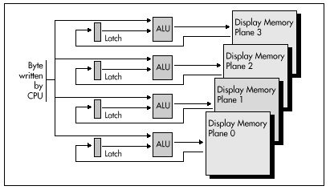

## Chapter 24 -- Parallel Processing with the VGA

### Taking on Graphics Memory Four Bytes at a Time

This heading refers to the ability of the VGA chip to manipulate up to
four bytes of display memory at once. In particular, the VGA provides
four ALUs (Arithmetic Logic Units) to assist the CPU during display
memory writes, and this hardware is a tremendous resource in the task of
manipulating the VGA's sizable frame buffer. The ALUs are actually only
one part of the surprisingly complex data flow architecture of the VGA,
but since they're involved in almost all memory access operations,
they're a good place to begin.

### VGA Programming: ALUs and Latches

I'm going to begin our detailed tour of the VGA at the heart of the flow
of data through the VGA: the four ALUs built into the VGA's Graphics
Controller (GC) circuitry. The ALUs (one for each display memory plane)
are capable of ORing, ANDing, and XORing CPU data and display memory
data together, as well as masking off some or all of the bits in the
data from affecting the final result. All the ALUs perform the same
logical operation at any given time, but each ALU operates on a
different display memory byte.

Recall that the VGA has four display memory planes, with one byte in
each plane at any given display memory address. All four display memory
bytes operated on are read from and written to the same address, but
each ALU operates on a byte that was read from a different plane and
writes the result to that plane. This arrangement allows four display
memory bytes to be modified by a single CPU write (which must often be
preceded by a single CPU read, as we will see). The benefit is vastly
improved performance; if the CPU had to select each of the four planes
in turn via `OUT`s and perform the four logical operations itself, VGA
performance would slow to a crawl.

Figure 24.1 is a simplified depiction of data flow around the ALUs. Each
ALU has a matching latch, which holds the byte read from the
corresponding plane during the last CPU read from display memory, even
if that particular plane wasn't the plane that the CPU actually read on
the last read access. (Only one byte can be read by the CPU with a
single display memory read; the plane supplying the byte is selected by
the Read Map register. However, the bytes at the specified address in
all four planes are always read when the CPU reads display memory, and
those four bytes are stored in their respective latches.)

Each ALU logically combines the byte written by the CPU and the byte
stored in the matching latch, according to the settings of bits 3 and 4
of the Data Rotate register (and the Bit Mask register as well, which
I'll cover next time), and then writes the result to display memory. It
is most important to understand that neither ALU operand comes directly
from display memory. The temptation is to think of the ALUs as combining
CPU data and the contents of the display memory address being written
to, but they actually combine CPU data and the contents of the last
display memory location read, which need not be the location being
modified. The most common application of the ALUs is indeed to modify a
given display memory location, but doing so requires a read from that
location to load the latches before the write that modifies it. Omission
of the read results in a write operation that logically combines CPU
data n with whatever data happens to be in the latches from the last
read, which is normally undesirable.



Occasionally, however, the independence of the latches from the display
memory location being written to can be used to great advantage. The
latches can be used to perform 4-byte-at-a-time (one byte from each
plane) block copying; in this application, the latches are loaded with a
read from the source area and written unmodified to the destination
area. The latches can be written unmodified in one of two ways: By
selecting write mode 1 (for an example of this, see the last chapter),
or by setting the Bit Mask register to 0 so only the latched bits are
written.

The latches can also be used to draw a fairly complex area fill pattern,
with a different bit pattern used to fill each plane. The mechanism for
this is as follows: First, generate the desired pattern across all
planes at any display memory address. Generating the pattern requires a
separate write operation for each plane, so that each plane's byte will
be unique. Next, read that memory address to store the pattern in the
latches. The contents of the latches can now be written to memory any
number of times by using either write mode 1 or the bit mask, since they
will not change until a read is performed. If the fill pattern does not
require a different bit pattern for each plane—that is, if the pattern
is black and white—filling can be performed more easily by simply
fanning the CPU byte out to all four planes with write mode 0. The
set/reset registers can be used in conjunction with fanning out the data
to support a variety of two-color patterns. More on this in Chapter 25.

The sample program in Listing 24.1 fills the screen with horizontal
bars, then illustrates the operation of each of the four ALU logical
functions by writing a vertical 80-pixel-wide box filled with solid,
empty, and vertical and horizontal bar patterns over that background
using each of the functions in turn. When observing the output of the
sample program, it is important to remember that all four vertical boxes
are drawn with *exactly* the same code—only the logical function that is
in effect differs from box to box.

All graphics in the sample program are done in black-and-white by
writing to all planes, in order to show the operation of the ALUs most
clearly. Selective enabling of planes via the Map Mask register and/or
set/reset would produce color effects; in that case, the operation of
the logical functions must be evaluated on a plane-by-plane basis, since
only the enabled planes would be affected by each operation.

**LISTING 24.1 L24-1.ASM**

```nasm
; Program to illustrate operation of ALUs and latches of the VGA's
;  Graphics Controller.  Draws a variety of patterns against
;  a horizontally striped background, using each of the 4 available
;  logical functions (data unmodified, AND, OR, XOR) in turn to combine
;  the images with the background.
; By Michael Abrash.
;
stack   segment para stack ‘STACK'
        db      512 dup(?)
stack   ends
;
VGA_VIDEO_SEGMENT       equ     0a000h  ;VGA display memory segment
SCREEN_HEIGHT           equ     350
SCREEN_WIDTH_IN_BYTES   equ     80
DEMO_AREA_HEIGHT        equ     336     ;# of scan lines in area
                                        ; logical function operation
                                        ; is demonstrated in
DEMO_AREA_WIDTH_IN_BYTES equ    40      ;width in bytes of area
                                        ; logical function operation
                                        ; is demonstrated in
VERTICAL_BOX_WIDTH_IN_BYTES equ 10      ;width in bytes of the box used to
                                        ; demonstrate each logical function
;
; VGA register equates.
;
GC_INDEX        equ     3ceh    ;GC index register
GC_ROTATE       equ     3       ;GC data rotate/logical function
                                ; register index
GC_MODE         equ     5       ;GC mode register index
;
dseg    segment para common ‘DATA'
;
; String used to label logical functions.
;
LabelString     label   byte
        db      ‘UNMODIFIED    AND       OR        XOR   '
LABEL_STRING_LENGTH     equ     $-LabelString
;
; Strings used to label fill patterns.
;
FillPatternFF   db      ‘Fill Pattern: 0FFh'
FILL_PATTERN_FF_LENGTH  equ     $ - FillPatternFF
FillPattern00   db      ‘Fill Pattern: 000h'
FILL_PATTERN_00_LENGTH  equ     $ - FillPattern00
FillPatternVert db      ‘Fill Pattern: Vertical Bar'
FILL_PATTERN_VERT_LENGTH        equ     $ - FillPatternVert
FillPatternHorz db      ‘Fill Pattern: Horizontal Bar'
FILL_PATTERN_HORZ_LENGTH equ    $ - FillPatternHorz
;
dseg    ends
;
; Macro to set indexed register INDEX of GC chip to SETTING.
;
SETGC   macro   INDEX, SETTING
        mov     dx,GC_INDEX
        mov     ax,(SETTING SHL 8) OR INDEX
        out     dx,ax
        endm
;
;
; Macro to call BIOS write string function to display text string
;  TEXT_STRING, of length TEXT_LENGTH, at location ROW,COLUMN.
;
TEXT_UP macro   TEXT_STRING, TEXT_LENGTH, ROW, COLUMN
        mov     ah,13h                  ;BIOS write string function
        mov     bp,offset TEXT_STRING   ;ES:BP points to string
        mov     cx,TEXT_LENGTH
        mov     dx,(ROW SHL 8) OR COLUMN        ;position
        sub     al,al           ;string is chars only, cursor not moved
        mov     bl,7            ;text attribute is white (light gray)
        int     10h
        endm
;
cseg    segment para public ‘CODE'
        assume  cs:cseg, ds:dseg
start   proc    near
        mov     ax,dseg
        mov     ds,ax
;
; Select 640x350 graphics mode.
;
        mov     ax,010h
        int     10h
;
; ES points to VGA memory.
;
        mov     ax,VGA_VIDEO_SEGMENT
        mov     es,ax
;
; Draw background of horizontal bars.
;
        mov     dx,SCREEN_HEIGHT/4
                                ;# of bars to draw (each 4 pixels high)
        sub     di,di           ;start at offset 0 in display memory
        mov     ax,0ffffh       ;fill pattern for light areas of bars
        mov     bx,DEMO_AREA_WIDTH_IN_BYTES / 2 ;length of each bar
        mov     si,SCREEN_WIDTH_IN_BYTES - DEMO_AREA_WIDTH_IN_BYTES
        mov     bp,(SCREEN_WIDTH_IN_BYTES * 3) - DEMO_AREA_WIDTH_IN_BYTES
BackgroundLoop:
        mov     cx,bx           ;length of bar
    rep stosw                   ;draw top half of bar
        add     di,si           ;point to start of bottom half of bar
        mov     cx,bx           ;length of bar
    rep stosw                   ;draw bottom half of bar
        add     di,bp           ;point to start of top of next bar
        dec     dx
        jnz     BackgroundLoop
;
; Draw vertical boxes filled with a variety of fill patterns
;  using each of the 4 logical functions in turn.
;
        SETGC   GC_ROTATE, 0            ;select data unmodified
                                        ; logical function...
        mov     di,0
        call    DrawVerticalBox         ;...and draw box
;
        SETGC   GC_ROTATE, 08h          ;select AND logical function...
        mov     di,10
        call    DrawVerticalBox         ;...and draw box
;
        SETGC   GC_ROTATE, 10h          ;select OR logical function...
        mov     di,20
        call    DrawVerticalBox         ;...and draw box
;
        SETGC   GC_ROTATE, 18h          ;select XOR logical function...
        mov     di,30
        call    DrawVerticalBox         ;...and draw box
;
; Reset the logical function to data unmodified, the default state.
;
        SETGC   GC_ROTATE, 0
;
; Label the screen.
;
        push    ds
        pop     es      ;strings we'll display are passed to BIOS
                        ; by pointing ES:BP to them
;
; Label the logical functions, using the VGA BIOS's
;  write string function.
;
        TEXT_UP LabelString, LABEL_STRING_LENGTH, 24, 0
;
; Label the fill patterns, using the VGA BIOS's
;  write string function.
;
        TEXT_UP FillPatternFF, FILL_PATTERN_FF_LENGTH, 3, 42
        TEXT_UP FillPattern00, FILL_PATTERN_00_LENGTH, 9, 42
        TEXT_UP FillPatternVert, FILL_PATTERN_VERT_LENGTH, 15, 42
        TEXT_UP FillPatternHorz, FILL_PATTERN_HORZ_LENGTH, 21, 42
;
; Wait until a key's been hit to reset screen mode & exit.
;
WaitForKey:
        mov     ah,1
        int     16h
        jz      WaitForKey
;
; Finished.  Clear key, reset screen mode and exit.
;
Done:
        mov     ah,0    ;clear key that we just detected
        int     16h
;
        mov     ax,3    ;reset to text mode
        int     10h
;
        mov     ah,4ch  ;exit to DOS
        int     21h
;
start   endp
;
; Subroutine to draw a box 80x336 in size, using currently selected
;  logical function, with upper left corner at the display memory offset
;  in DI.  Box is filled with four patterns.  Top quarter of area is
;  filled with 0FFh (solid) pattern, next quarter is filled with 00h
;  (empty) pattern, next quarter is filled with 33h (double pixel wide
;  vertical bar) pattern, and bottom quarter is filled with double pixel
;  high horizontal bar pattern.
;
; Macro to draw a column of the specified width in bytes, one-quarter
;  of the height of the box, with the specified fill pattern.
;
DRAW_BOX_QUARTER        macro   FILL, WIDTH
        local   RowLoop, ColumnLoop
        mov     al,FILL                 ;fill pattern
        mov     dx,DEMO_AREA_HEIGHT / 4 ;1/4 of the full box height
RowLoop:
        mov     cx,WIDTH
ColumnLoop:
        mov     ah,es:[di]      ;load display memory contents into
                                ; GC latches (we don't actually care
                                ; about value read into AH)
        stosb                   ;write pattern, which is logically
                                ; combined with latch contents for each
                                ; plane and then written to display
                                ; memory
        loop    ColumnLoop
        add     di,SCREEN_WIDTH_IN_BYTES - WIDTH
                                ;point to start of next line down in box
        dec     dx
        jnz     RowLoop
        endm
;
DrawVerticalBox proc    near
        DRAW_BOX_QUARTER        0ffh, VERTICAL_BOX_WIDTH_IN_BYTES
                                        ;first fill pattern: solid fill
        DRAW_BOX_QUARTER        0, VERTICAL_BOX_WIDTH_IN_BYTES
                                        ;second fill pattern: empty fill
        DRAW_BOX_QUARTER        033h, VERTICAL_BOX_WIDTH_IN_BYTES
                                        ;third fill pattern: double-pixel
                                        ; wide vertical bars
        mov     dx,DEMO_AREA_HEIGHT / 4 / 4
                                ;fourth fill pattern: horizontal bars in
                                ; sets of 4 scan lines
        sub     ax,ax
        mov     si,VERTICAL_BOX_WIDTH_IN_BYTES  ;width of fill area
HorzBarLoop:
        dec     ax              ;0ffh fill (smaller to do word than byte DEC)
        mov     cx,si           ;width to fill
HBLoop1:
        mov     bl,es:[di]      ;load latches (don't care about value)
        stosb                   ;write solid pattern, through ALUs
        loop    HBLoop1
        add     di,SCREEN_WIDTH_IN_BYTES - VERTICAL_BOX_WIDTH_IN_BYTES
        mov     cx,si           ;width to fill
HBLoop2:
        mov     bl,es:[di]      ;load latches
        stosb                   ;write solid pattern, through ALUs
        loop    HBLoop2
        add     di,SCREEN_WIDTH_IN_BYTES - VERTICAL_BOX_WIDTH_IN_BYTES
        inc     ax              ;0 fill (smaller to do word than byte DEC)
        mov     cx,si           ;width to fill
HBLoop3:
        mov     bl,es:[di]      ;load latches
        stosb                   ;write empty pattern, through ALUs
        loop    HBLoop3
        add     di,SCREEN_WIDTH_IN_BYTES - VERTICAL_BOX_WIDTH_IN_BYTES
        mov     cx,si           ;width to fill
HBLoop4:
        mov     bl,es:[di]      ;load latches
        stosb                   ;write empty pattern, through ALUs
        loop    HBLoop4
        add     di,SCREEN_WIDTH_IN_BYTES - VERTICAL_BOX_WIDTH_IN_BYTES
        dec     dx
        jnz     HorzBarLoop
;
        ret
DrawVerticalBox endp
cseg    ends
        end     start
```

Logical function 0, which writes the CPU data unmodified, is the
standard mode of operation of the ALUs. In this mode, the CPU data is
combined with the latched data by ignoring the latched data entirely.
Expressed as a logical function, this could be considered CPU data ANDed
with 1 (or ORed with 0). This is the mode to use whenever you want to
place CPU data into display memory, replacing the previous contents
entirely. It may occur to you that there is no need to latch display
memory at all when the data unmodified function is selected. In the
sample program, that is true, but if the bit mask is being used, the
latches must be loaded even for the data unmodified function, as I'll
discuss in the next chapter.

Logical functions 1 through 3 cause the CPU data to be ANDed, ORed, and
XORed with the latched data, respectively. Of these, XOR is the most
useful, since exclusive-ORing is a traditional way to perform animation.
The uses of the AND and OR logical functions are less obvious. AND can
be used to mask a blank area into display memory, or to mask off those
portions of a drawing operation that don't overlap an existing display
memory image. OR could conceivably be used to force an image into
display memory over an existing image. To be honest, I haven't
encountered any particularly valuable applications for AND and OR, but
they're the sort of building-block features that could come in handy in
just the right context, so keep them in mind.

### Notes on the ALU/Latch Demo Program

VGA settings such as the logical function select should be restored to
their default condition before the BIOS is called to output text or draw
pixels. The VGA BIOS does not guarantee that it will set most VGA
registers except on mode sets, and there are so many compatible BIOSes
around that the code of the IBM BIOS is not a reliable guide. For
instance, when the BIOS is called to draw text, it's likely that the
result will be illegible if the Bit Mask register is not in its default
state. Similarly, a mode set should generally be performed before
exiting a program that tinkers with VGA settings.

Along the same lines, the sample program does not explicitly set the Map
Mask register to ensure that all planes are enabled for writing. The
mode set for mode 10H leaves all planes enabled, so I did not bother to
program the Map Mask register, or any other register besides the Data
Rotate register, for that matter. However, the profusion of compatible
BIOSes means there is some small risk in relying on the BIOS to leave
registers set properly. For the highly safety-conscious, the best course
would be to program data control registers such as the Map Mask and Read
Mask explicitly before relying on their contents.

On the other hand, any function the BIOS provides explicitly—as part of
the interface specification—such as setting the palette RAM, should be
used in preference to programming the hardware directly whenever
possible, because the BIOS may mask hardware differences between VGA
implementations.

The code that draws each vertical box in the sample program reads from
display memory immediately before writing to display memory. The read
operation loads the VGA latches. The value that is read is irrelevant as
far as the sample program is concerned. The read operation is present
only because it is necessary to perform a read to load the latches, and
there is no way to read without placing a value in a register. This is a
bit of a nuisance, since it means that the value of some 8-bit register
must be destroyed. Under certain circumstances, a single logical
instruction such as `XOR` or `AND` can be used to perform both the
read to load the latches and then write to modify display memory without
affecting any CPU registers, as we'll see later on.

All text in the sample program is drawn by VGA BIOS function 13H, the
write string function. This function is also present in the AT's BIOS,
but not in the XT's or PC's, and as a result is rarely used; the
function is always available if a VGA is installed, however. Text drawn
with this function is relatively slow. If speed is important, a program
can draw text directly into display memory much faster in any given
display mode. The great virtue of the BIOS write string function in the
case of the VGA is that it provides an uncomplicated way to get text on
the screen reliably in any mode and color, over any background.

The expression used to load DX in the `TEXT_UP` macro in the sample
program may seem strange, but it's a convenient way to save a byte of
program code and a few cycles of execution time. DX is being loaded with
a word value that's composed of two independent immediate byte values.
The obvious way to implement this would be with

```nasm
MOV DL,VALUE1
MOV DH,VALUE2
```
which requires four instruction bytes. By shifting the value destined
for the high byte into the high byte with MASM's shift-left operator,
`SHL` (\*100H would work also), and then logically combining the
values with MASM's `OR` operator (or the `ADD` operator), both
halves of DX can be loaded with a single instruction, as in

```nasm
MOV DX,(VALUE2 SHL 8) OR VALUE1
```

which takes only three bytes and is faster, being a single instruction.
(Note, though, that in 32-bit protected mode, there's a size and
performance penalty for 16-bit instructions such as the `MOV` above;
see the first part of this book for details.) As shown, a macro is an
ideal place to use this technique; the macro invocation can refer to two
separate byte values, making matters easier for the programmer, while
the macro itself can combine the values into a single word-sized
constant.

> 
> A minor optimization tip illustrated in the listing is the use of `INC
> AX` and `DEC AX` in the `DrawVerticalBox` subroutine when only AL
> actually needs to be modified. Word-sized register increment and
> decrement instructions (or dword-sized instructions in 32-bit protected
> mode) are only one byte long, while byte-size register increment and
> decrement instructions are two bytes long. Consequently, when size
> counts, it is worth using a whole 16-bit (or 32-bit) register instead of
> the low 8 bits of that register for `INC` and `DEC`—if you don't
> need the upper portion of the register for any other purpose, or if you
> can be sure that the `INC` or `DEC` won't affect the upper part of
> the register.

The latches and ALUs are central to high-performance VGA code, since
they allow programs to process across all four memory planes without a
series of `OUT`s and read/write operations. It is not always easy to
arrange a program to exploit this power, however, because the ALUs are
far more limited than a CPU. In many instances, however, additional
hardware in the VGA, including the bit mask, the set/reset features, and
the barrel shifter, can assist the ALUs in controlling data, as we'll
see in the next few chapters.
