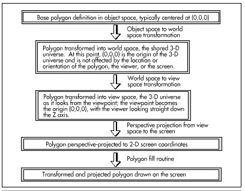
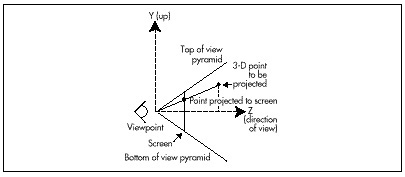
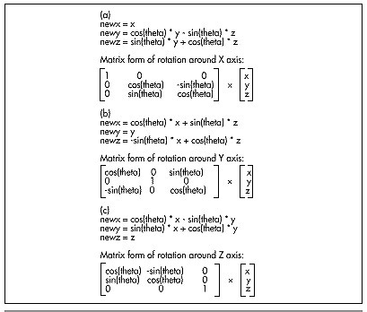
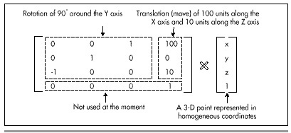

## Chapter 50\
 Adding a Dimension {#Heading1}

### 3-D Animation Using Mode X {#Heading2}

When I first started programming micros, more than 11 years ago now,
there wasn't much money in it, or visibility, or anything you could call
a promising career. Sometimes, it was a way to accomplish things that
would never have gotten done otherwise because minicomputer time cost
too much; other times, it paid the rent; mostly, though, it was just for
fun. Given free computer time for the first time in my life, I went
wild, writing versions of all sorts of software I had seen on
mainframes, in arcades, wherever. It was a wonderful way to learn how
computers work: Trial and error in an environment where nobody minded
the errors, with no meter ticking.

Many sorts of software demanded no particular skills other than a quick
mind and a willingness to experiment: Space Invaders, for instance, or
full-screen operating system shells. Others, such as compilers, required
a good deal of formal knowledge. Still others required not only
knowledge but also more horse-power than I had available. The latter I
filed away on my ever-growing wish list, and then forgot about for a
while.

Three-dimensional animation was the most alluring of the areas I passed
over long ago. The information needed to do rotation, projection,
rendering, and the like was neither so well developed nor widely so
available then as it is now, although, in truth, it seemed more
intimidating than it ultimately proved to be. Even had I possessed the
knowledge, though, it seems unlikely that I could have coaxed
satisfactory 3-D animation out of a 4 MHz Z80 system with 160x72
monochrome graphics. In those days, 3-D was pretty much limited to
outrageously expensive terminals attached to minis or mainframes.

Times change, and they seem to do so much faster in computer technology
than in other parts of the universe. A 486 is capable of decent 3-D
animation, owing to its integrated math coprocessor; not in the class
of, say, an i860, but pretty good nonetheless. A 386 is less
satisfactory, though; the 387 is no match for the 486's coprocessor, and
most 386 systems lack coprocessors. However, all is not lost; 32-bit
registers and built-in integer multiply and divide hardware make it
possible to do some very interesting 3-D animation on a 386 with
fixed-point arithmetic. Actually, it's possible to do a surprising
amount of 3-D animation in real mode, and even on lesser x86 processors;
in fact, the code in this article will perform real-time 3-D animation
(admittedly very simple, but nonetheless real-time and 3-D) on a 286
without a 287, even though the code is written in real-mode C and uses
floating-point arithmetic. In short, the potential for 3-D animation on
the x86 family is considerable.

With this chapter, we kick off an exploration of some of the sorts of
3-D animation that can be performed on the x86 family. Mind you, I'm
talking about real-time 3-D animation, with all calculations and drawing
performed on-the-fly. Generating frames ahead of time and playing them
back is an excellent technique, but I'm interested in seeing how far we
can push purely real-time animation. Granted, we're not going to make it
to the level of Terminator 2, but we should have some fun nonetheless.
The first few chapters in this final section of the book may seem pretty
basic to those of you experienced with 3-D programming, and, at the same
time, 3-D neophytes will inevitably be distressed at the amount of
material I skip or skim over. That can't be helped, but at least
there'll be working code, the references mentioned later, and some
explanation; that should be enough to start you on your way with 3-D.

Animating in three dimensions is a complex task, so this will be the
largest single section of the book, with later chapters building on
earlier ones; and even this first 3-D chapter will rely on polygon fill
and page-flip code from earlier chapters.

In a sense, I've saved the best for last, because, to my mind, real-time
3-D animation is one of the most exciting things of any stripe that can
be done with a computer—and because, with today's hardware, it can in
fact be done. Nay, it can be done amazingly well.

### References on 3-D Drawing {#Heading3}

There are several good sources for information about 3-D graphics. Foley
and van Dam's *Computer Graphics: Principles and Practice* (Second
Edition, Addison-Wesley, 1990) provides a lengthy discussion of the
topic and a great many references for further study. Unfortunately, this
book is heavy going at times; a more approachable discussion is provided
in *Principles of Interactive Computer Graphics*, by Newman and Sproull
(McGraw-Hill, 1979). Although the latter book lacks the last decade's
worth of graphics developments, it nonetheless provides a good overview
of basic 3-D techniques, including many of the approaches likely to work
well in realtime on a PC.

A source that you may or may not find useful is the series of six books
on C graphics by Lee Adams, as exemplified by *High-Performance CAD
Graphics in C* (Windcrest/Tab, 1986). (I don't know if all six books
discuss 3-D graphics, but the four I've seen do.) To be honest, this
book has a number of problems, including: Relatively little theory and
explanation; incomplete and sometimes erroneous discussions of graphics
hardware; use of nothing but global variables, with cryptic names like
"array3" and "B21;" and—well, you get the idea. On the other hand, the
book at least touches on a great many aspects of 3-D drawing, and
there's a lot of C code to back that up. A number of people have spoken
warmly to me of Adams' books as their introduction to 3-D graphics. I
wouldn't recommend these books as your only 3-D references, but if
you're just starting out, you might want to look at one and see if it
helps you bridge the gap between the theory and implementation of 3-D
graphics.

### The 3-D Drawing Pipeline {#Heading4}

Each 3-D object that we'll handle will be built out of polygons that
represent the surface of the object. Figure 50.1 shows the stages a
polygon goes through enroute to being drawn on the screen. (For the
present, we'll avoid complications such as clipping, lighting, and
shading.) First, the polygon is transformed from object space, the
coordinate system the object is defined in, to world space, the
coordinate system of the 3-D universe. Transformation may involve
rotating, scaling, and moving the polygon. Fortunately, applying the
desired transformation to each of the polygon vertices in an object is
equivalent to transforming the polygon; in other words, transformation
of a polygon is fully defined by transformation of its vertices, so it
is not necessary to transform every point in a polygon, just the
vertices. Likewise, transformation of all the polygon vertices in an
object fully transforms the object.

Once the polygon is in world space, it must again be transformed, this
time into view space, the space defined such that the viewpoint is at
(0,0,0), looking down the Z axis, with the Y axis straight up and the X
axis off to the right. Once in view space, the polygon can be
perspective-projected to the screen, with the projected X and Y
coordinates of the vertices finally being used to draw the polygon.

That's really all there is to basic 3-D drawing: transformation from
object space to world space to view space to the screen. Next, we'll
look at the mechanics of transformation.

One note: I'll use a purely *right-handed* convention for coordinate
systems. Right-handed means that if you hold your right hand with your
fingers curled and the thumb sticking out, the thumb points along the Z
axis and the fingers point in the direction of rotation from the X axis
to the Y axis, as shown in Figure 50.2. Rotations about an axis are
counter-clockwise, as viewed looking down an axis toward the origin. The
handedness of a coordinate system is just a convention, and left-handed
would do equally well; however, right-handed is generally used for
object and world space. Sometimes, the handedness is flipped for view
space, so that increasing Z equals increasing distance from the viewer
along the line of sight, but I have chosen not to do that here, to avoid
confusion. Therefore, Z decreases as distance along the line of sight
increases; a view space coordinate of (0,0,-1000) is directly ahead,
twice as far away as a coordinate of (0,0,-500).




#### Projection {#Heading5}

Working backward from the final image, we want to take the vertices of a
polygon, as transformed into view space, and project them to 2-D
coordinates on the screen, which, for projection purposes, is assumed to
be centered on and perpendicular to the Z axis in view space, at some
distance from the screen. We're after visual realism, so we'll want to
do a perspective projection, in order that farther objects look smaller
than nearer objects, and so that the field of view will widen with
distance. This is done by scaling the X and Y coordinates of each point
proportionately to the Z distance of the point from the viewer, a simple
matter of similar triangles, as shown in Figure 50.3. It doesn't really
matter how far down the Z axis the screen is assumed to be; what matters
is the ratio of the distance of the screen from the viewpoint to the
width of the screen. This ratio defines the rate of divergence of the
viewing pyramid—the full field of view—and is used for performing all
perspective projections. Once perspective projection has been performed,
all that remains before calling the polygon filler is to convert the
projected X and Y coordinates to integers, appropriately clipped and
adjusted as necessary to center the origin on the screen or otherwise
map the image into a window, if desired.

#### Translation {#Heading6}

*Translation* means adding X, Y, and Z offsets to a coordinate to move
it linearly through space. Translation is as simple as it seems; it
requires nothing more than an addition for each axis. Translation is,
for example, used to move objects from object space, in which the center
of the object is typically the origin (0,0,0), into world space, where
the object may be located anywhere.



#### Rotation {#Heading7}

*Rotation* is the process of circularly moving coordinates around the
origin. For our present purposes, it's necessary only to rotate objects
about their centers in object space, so as to turn them to the desired
attitude before translating them into world space.

Rotation of a point about an axis is accomplished by transforming it
according to the formulas shown in Figure 50.4. These formulas map into
the more generally useful matrix-multiplication forms also shown in
Figure 50.4. Matrix representation is more useful for two reasons:
First, it is possible to concatenate multiple rotations into a single
matrix by multiplying them together in the desired order; that single
matrix can then be used to perform the rotations more efficiently.



Second, 3x3 rotation matrices can become the upper-left-hand portions of
4x4 matrices that also perform translation (and scaling as well, but we
won't need scaling in the near future), as shown in Figure 50.5. A 4x4
matrix of this sort utilizes homogeneous coordinates; that's a topic way
beyond this book, but, basically, homogeneous coordinates allow you to
handle both rotations and translations with 4x4 matrices, thereby
allowing the same code to work with either, and making it possible to
concatenate a long series of rotations and translations into a single
matrix that performs the same transformation as the sequence of
rotations and transformations.

There's much more to be said about transformations and the supporting
matrix math, but, in the interests of getting to working code in this
chapter, I'll leave that to be discussed as the need arises.

### A Simple 3-D Example {#Heading8}

At this point, we know enough to be able to put together a simple
working 3-D animation example. The example will do nothing more
complicated than display a single polygon as it sits in 3-D space,
rotating around the Y axis. To make things a little more interesting,
we'll let the user move the polygon around in space with the arrow keys,
and with the "A" (away), and "T" (toward) keys. The sample program
requires two sorts of functionality: The ability to transform and
project the polygon from object space onto the screen (3-D
functionality), and the ability to draw the projected polygon (complete
with clipping) and handle the other details of animation (2-D
functionality).



Happily (and not coincidentally), we put together a nice 2-D animation
framework back in Chapters 47, 48, and 49, during our exploratory
discussion of Mode X, so we don't have much to worry about in terms of
non-3-D details. Basically, we'll use Mode X (320x240, 256 colors), and
we'll flip between two display pages, drawing to one while the other is
displayed. One new 2-D element that we need is the ability to clip
polygons; while we could avoid this for the moment by restricting the
range of motion of the polygon so that it stays fully on the screen,
certainly in the long run we'll want to be able to handle partially or
fully clipped polygons. Listing 50.1 is the low-level code for a Mode X
polygon filler that supports clipping. (The high-level polygon fill code
is mode independent, and is the same as that presented in Chapters 38,
39, and 40, as noted further on.) The clipping is implemented at the low
level, by trimming the Y extent of the scan line list up front, then
clipping the X coordinates of each scan line in turn. This is not a
particularly fast approach to clipping—ideally, the polygon would be
clipped before it was scanned into a line list, avoiding potentially
wasted scanning and eliminating the line-by-line X clipping—but it's
much simpler, and, as we shall see, polygon filling performance is the
least of our worries at the moment.

**LISTING 50.1 L50-1.ASM**

```nasm
; Draws all pixels in the list of horizontal lines passed in, in
; Mode X, the VGA's undocumented 320x240 256-color mode. Clips to
; the rectangle specified by (ClipMinX,ClipMinY),(ClipMaxX,ClipMaxY).
; Draws to the page specified by CurrentPageBase.
; C near-callable as:
;
;     void DrawHorizontalLineList(struct HLineList * HLineListPtr,
;          int Color);
;
; All assembly code tested with TASM and MASM

SCREEN_WIDTH    equ   320
SCREEN_SEGMENT  equ   0a000h
SC_INDEX        equ   03c4h        ;Sequence Controller Index
MAP_MASK        equ   2            ;Map Mask register index in SC

HLine   struc
XStart          dw      ?          ;X coordinate of leftmost pixel in line
XEnd            dw      ?          ;X coordinate of rightmost pixel in line
HLine   ends

HLineList struc
Lngth           dw      ?          ;# of horizontal lines
YStart          dw      ?          ;Y coordinate of topmost line
HLinePtr        dw      ?          ;pointer to list of horz lines
HLineList ends

Parms   struc
                dw      2 dup(?)   ;return address & pushed BP
HLineListPtr    dw      ?          ;pointer to HLineList structure
Color           dw      ?          ;color with which to fill
Parms   ends
        .model small
        .data
        extrn   _CurrentPageBase:word,_ClipMinX:word
        extrn   _ClipMinY:word,_ClipMaxX:word,_ClipMaxY:word
; Plane masks for clipping left and right edges of rectangle.
LeftClipPlaneMask       db      00fh,00eh,00ch,008h
RightClipPlaneMask      db      001h,003h,007h,00fh
        .code
        align   2
ToFillDone:
        jmp     FillDone
        public _DrawHorizontalLineList
        align   2
_DrawHorizontalLineList proc
        push    bp                 ;preserve caller's stack frame
        mov     bp,sp              ;point to our stack frame
        push    si                 ;preserve caller's register variables
        push    di
        cld                        ;make string instructions inc pointers
        mov     dx,SC_INDEX
        mov     al,MAP_MASK
        out     dx,al              ;point SC Index to the Map Mask
        mov     ax,SCREEN_SEGMENT
        mov     es,ax              ;point ES to display memory for REP STOS
        mov     si,[bp+HLineListPtr] ;point to the line list
        mov     bx,[si+HLinePtr]     ;point to the XStart/XEnd descriptor
                                   ; for the first (top) horizontal line
        mov     cx,[si+YStart] ;first scan line to draw
        mov     si,[si+Lngth]  ;# of scan lines to draw
        cmp     si,0               ;are there any lines to draw?
        jle     ToFillDone         ;no, so we're done
        cmp     cx,[_ClipMinY]     ;clipped at top?
        jge     MinYNotClipped     ;no
        neg     cx                 ;yes, discard however many lines are
        add     cx,[_ClipMinY]     ; clipped
        sub     si,cx              ;that many fewer lines to draw
        jle     ToFillDone         ;no lines left to draw
        shl     cx,1               ;lines to skip*2
        shl     cx,1               ;lines to skip*4
        add     bx,cx              ;advance through the line list
        mov     cx,[_ClipMinY]     ;start at the top clip line
MinYNotClipped:
        mov     dx,si
        add     dx,cx              ;bottom row to draw + 1
        cmp     dx,[_ClipMaxY]     ;clipped at bottom?
        jle     MaxYNotClipped     ;no
        sub     dx,[_ClipMaxY]     ;# of lines to clip off the bottom
        sub     si,dx              ;# of lines left to draw
        jle     ToFillDone         ;all lines are clipped
MaxYNotClipped:
        mov     ax,SCREEN_WIDTH/4  ;point to the start of the first
        mul     cx                 ; scan line on which to draw
        add     ax,[_CurrentPageBase] ;offset of first line
        mov     dx,ax              ;ES:DX points to first scan line to draw
        mov     ah,byte ptr [bp+Color] ;color with which to fill
FillLoop:
        push    bx                 ;remember line list location
        push    dx                 ;remember offset of start of line
        push    si                 ;remember # of lines to draw
        mov     di,[bx+XStart] ;left edge of fill on this line
        cmp     di,[_ClipMinX]     ;clipped to left edge?
        jge     MinXNotClipped     ;no
        mov     di,[_ClipMinX]     ;yes, clip to the left edge
MinXNotClipped:
        mov     si,di
        mov     cx,[bx+XEnd]   ;right edge of fill
        cmp     cx,[_ClipMaxX]     ;clipped to right edge?
        jl      MaxXNotClipped     ;no
        mov     cx,[_ClipMaxX]     ;yes, clip to the right edge
        dec     cx
MaxXNotClipped:
        cmp     cx,di
        jl      LineFillDone       ;skip if negative width
        shr     di,1    ;X/4 = offset of first rect pixel in scan
        shr     di,1    ; line
        add     di,dx   ;offset of first rect pixel in display mem
        mov     dx,si   ;XStart
        and     si,0003h    ;look up left-edge plane mask
        mov     bh,LeftClipPlaneMask[si] ; to clip & put in BH
        mov     si,cx
        and     si,0003h           ;look up right-edge plane
        mov     bl,RightClipPlaneMask[si] ; mask to clip & put in BL
        and     dx,not 011b        ;calculate # of addresses across rect
        sub     cx,dx
        shr     cx,1
        shr     cx,1               ;# of addresses across rectangle to fill - 1
        jnz     MasksSet           ;there's more than one byte to draw
        and     bh,bl              ;there's only one byte, so combine the left
                                   ; and right edge clip masks
MasksSet:
        mov     dx,SC_INDEX+1  ;already points to the Map Mask reg
FillRowsLoop:
        mov     al,bh              ;put left-edge clip mask in AL
        out     dx,al              ;set the left-edge plane (clip) mask
        mov     al,ah              ;put color in AL
        stosb                      ;draw the left edge
        dec     cx                 ;count off left edge byte
        js      FillLoopBottom     ;that's the only byte
        jz      DoRightEdge        ;there are only two bytes
        mov     al,00fh            ;middle addresses are drawn 4 pixels at a pop
        out     dx,al              ;set the middle pixel mask to no clip
        mov     al,ah              ;put color in AL
        rep     stosb              ;draw the middle addresses four pixels apiece
DoRightEdge:
        mov     al,bl              ;put right-edge clip mask in AL
        out     dx,al              ;set the right-edge plane (clip) mask
        mov     al,ah              ;put color in AL
        stosb                      ;draw the right edge
FillLoopBottom:
LineFillDone:
        pop     si                 ;retrieve # of lines to draw
        pop     dx                 ;retrieve offset of start of line
        pop     bx                 ;retrieve line list location
        add     dx,SCREEN_WIDTH/4  ;point to start of next line
        add     bx,size HLine      ;point to the next line descriptor
        dec     si                 ;count down lines
        jnz     FillLoop
FillDone:
        pop     di                 ;restore caller's register variables
        pop     si
        pop     bp                 ;restore caller's stack frame
        ret
_DrawHorizontalLineList endp
        end
```

The other 2-D element we need is some way to erase the polygon at its
old location before it's moved and redrawn. We'll do that by remembering
the bounding rectangle of the polygon each time it's drawn, then erasing
by clearing that area with a rectangle fill.

With the 2-D side of the picture well under control, we're ready to
concentrate on the good stuff. Listings 50.2 through 50.5 are the sample
3-D animation program. Listing 50.2 provides matrix multiplication
functions in a straightforward fashion. Listing 50.3 transforms,
projects, and draws polygons. Listing 50.4 is the general header file
for the program, and Listing 50.5 is the main animation program.

Other modules required are: Listings 47.1 and 47.6 from Chapter 47 (Mode
X mode set, rectangle fill); Listing 49.6 from Chapter 49; Listing 39.4
from Chapter 39 (polygon edge scan); and the `FillConvexPolygon()`
function from Listing 38.1 in Chapter 38. All necessary code modules,
along with a project file, are present in the subdirectory for this
chapter on the listings disk, whether they were presented in this
chapter or some earlier chapter. This will be the case for the next
several chapters as well, where listings from previous chapters are
referenced. This scheme may crowd the listings diskette a little bit,
but it will certainly reduce confusion!

**LISTING 50.2 L50-2.C**

```c
/* Matrix arithmetic functions.
   Tested with Borland C++ in the small model. */

/* Matrix multiplies Xform by SourceVec, and stores the result in
   DestVec. Multiplies a 4x4 matrix times a 4x1 matrix; the result
   is a 4x1 matrix, as follows:
   --     --     -- --     -- --
   |       |     | 4 |     | 4 |
   |  4x4  |  X  | x |  =  | x |
   |       |     | 1 |     | 1 |
   --     --     -- --     -- -- */
void XformVec(double Xform[4][4], double * SourceVec,
   double * DestVec)
{
   int i,j;

   for (i=0; i<4; i++) {
      DestVec[i] = 0;
      for (j=0; j<4; j++)
         DestVec[i] += Xform[i][j] * SourceVec[j];
   }
}

/* Matrix multiplies SourceXform1 by SourceXform2 and stores the
   result in DestXform. Multiplies a 4x4 matrix times a 4x4 matrix;
   the result is a 4x4 matrix, as follows:
   --     --     --     --     --     --
   |       |     |       |     |       |
   |  4x4  |  X  |  4x4  |  =  |  4x4  |
   |       |     |       |     |       |
   --     --     --     --     --     -- */
void ConcatXforms(double SourceXform1[4][4], double SourceXform2[4][4],
   double DestXform[4][4])
{
   int i,j,k;

   for (i=0; i<4; i++) {
      for (j=0; j<4; j++) {
         DestXform[i][j] = 0;
         for (k=0; k<4; k++)
            DestXform[i][j] += SourceXform1[i][k] * SourceXform2[k][j];
      }
   }
}
```

**LISTING 50.3 L50-3.C**

```c
/* Transforms convex polygon Poly (which has PolyLength vertices),
   performing the transformation according to Xform (which generally
   represents a transformation from object space through world space
   to view space), then projects the transformed polygon onto the
   screen and draws it in color ???Color. Also updates the extent of the
   rectangle (EraseRect) that's used to erase the screen later.
   Tested with Borland C++ in the small model. */
#include "polygon.h"

void XformAndProjectPoly(double Xform[4][4], struct Point3 * Poly,
   int PolyLength, int Color)
{
   int i;
   struct Point3 XformedPoly[MAX_POLY_LENGTH];
   struct Point ProjectedPoly[MAX_POLY_LENGTH];
   struct PointListHeader Polygon;

   /* Transform to view space, then project to the screen */
   for (i=0; i<PolyLength; i++) {
      /* Transform to view space */
      XformVec(Xform, (double *)&Poly[i], (double *)&XformedPoly[i]);
      /* Project the X & Y coordinates to the screen, rounding to the
         nearest integral coordinates. The Y coordinate is negated to
         flip from view space, where increasing Y is up, to screen
         space, where increasing Y is down. Add in half the screen
         width and height to center on the screen */
      ProjectedPoly[i].X = ((int) (XformedPoly[i].X/XformedPoly[i].Z *
            PROJECTION_RATIO*(SCREEN_WIDTH/2.0)+0.5))+SCREEN_WIDTH/2;
      ProjectedPoly[i].Y = ((int) (XformedPoly[i].Y/XformedPoly[i].Z *
            -1.0 * PROJECTION_RATIO * (SCREEN_WIDTH / 2.0) + 0.5)) +
            SCREEN_HEIGHT/2;
      /* Appropriately adjust the extent of the rectangle used to
         erase this page later */
         if (ProjectedPoly[i].X > EraseRect[NonDisplayedPage].Right)
          if (ProjectedPoly[i].X < SCREEN_WIDTH)
            EraseRect[NonDisplayedPage].Right = ProjectedPoly[i].X;
          else EraseRect[NonDisplayedPage].Right = SCREEN_WIDTH;
         if (ProjectedPoly[i].Y > EraseRect[NonDisplayedPage].Bottom)
          if (ProjectedPoly[i].Y < SCREEN_HEIGHT)
            EraseRect[NonDisplayedPage].Bottom = ProjectedPoly[i].Y;
          else EraseRect[NonDisplayedPage].Bottom = SCREEN_HEIGHT;
         if (ProjectedPoly[i].X < EraseRect[NonDisplayedPage].Left)
          if (ProjectedPoly[i].X > 0)
            EraseRect[NonDisplayedPage].Left = ProjectedPoly[i].X;
          else EraseRect[NonDisplayedPage].Left = 0;
         if (ProjectedPoly[i].Y < EraseRect[NonDisplayedPage].Top)
          if (ProjectedPoly[i].Y > 0)
            EraseRect[NonDisplayedPage].Top = ProjectedPoly[i].Y;
          else EraseRect[NonDisplayedPage].Top = 0;
   }
   /* Draw the polygon */
   DRAW_POLYGON(ProjectedPoly, PolyLength, Color, 0, 0);
}
```

**LISTING 50.4 POLYGON.H**

```c
/* POLYGON.H: Header file for polygon-filling code, also includes
   a number of useful items for 3-D animation. */

#define MAX_POLY_LENGTH 4  /* four vertices is the max per poly */
#define SCREEN_WIDTH 320
#define SCREEN_HEIGHT 240
#define PAGE0_START_OFFSET 0
#define PAGE1_START_OFFSET (((long)SCREEN_HEIGHT*SCREEN_WIDTH)/4)
/* Ratio: distance from viewpoint to projection plane / width of
   projection plane. Defines the width of the field of view. Lower
   absolute values = wider fields of view; higher values = narrower */
#define PROJECTION_RATIO   -2.0 /* negative because visible Z
                                   coordinates are negative */
/* Draws the polygon described by the point list PointList in color
   Color with all vertices offset by (X,Y) */
#define DRAW_POLYGON(PointList,NumPoints,Color,X,Y)         \
   Polygon.Length = NumPoints;                              \
   Polygon.PointPtr = PointList;                            \
   FillConvexPolygon(&Polygon, Color, X, Y);

/* Describes a single 2-D point */
struct Point {
   int X;   /* X coordinate */
   int Y;   /* Y coordinate */
};
/* Describes a single 3-D point in homogeneous coordinates */
struct Point3 {
   double X;   /* X coordinate */
   double Y;   /* Y coordinate */
   double Z;   /* Z coordinate */
   double W;
};
/* Describes a series of points (used to store a list of vertices that
   describe a polygon; each vertex is assumed to connect to the two
   adjacent vertices, and the last vertex is assumed to connect to the
   first) */
struct PointListHeader {
   int Length;                /* # of points */
   struct Point * PointPtr;   /* pointer to list of points */
};

/* Describes the beginning and ending X coordinates of a single
   horizontal line */
struct HLine {
   int XStart; /* X coordinate of leftmost pixel in line */
   int XEnd;   /* X coordinate of rightmost pixel in line */
};

/* Describes a Length-long series of horizontal lines, all assumed to
   be on contiguous scan lines starting at YStart and proceeding
   downward (used to describe a scan-converted polygon to the
   low-level hardware-dependent drawing code) */
struct HLineList {
   int Length;                /* # of horizontal lines */
   int YStart;                /* Y coordinate of topmost line */
   struct HLine * HLinePtr;   /* pointer to list of horz lines */
};
struct Rect { int Left, Top, Right, Bottom; };

extern void XformVec(double Xform[4][4], double * SourceVec,
   double * DestVec);
extern void ConcatXforms(double SourceXform1[4][4],
   double SourceXform2[4][4], double DestXform[4][4]);
extern void XformAndProjectPoly(double Xform[4][4],
   struct Point3 * Poly, int PolyLength, int Color);
extern int FillConvexPolygon(struct PointListHeader *, int, int, int);
extern void Set320x240Mode(void);
extern void ShowPage(unsigned int StartOffset);
extern void FillRectangleX(int StartX, int StartY, int EndX,
   int EndY, unsigned int PageBase, int Color);
extern int DisplayedPage, NonDisplayedPage;
extern struct Rect EraseRect[];
```

**LISTING 50.5 L50-5.C**

```c
/* Simple 3-D drawing program to view a polygon as it rotates in
   Mode X. View space is congruent with world space, with the
   viewpoint fixed at the origin (0,0,0) of world space, looking in
   the direction of increasingly negative Z. A right-handed
   coordinate system is used throughout.
   Tested with Borland C++ in the small model. */
#include <conio.h>
#include <stdio.h>
#include <dos.h>
#include <math.h>
#include "polygon.h"
void main(void);

/* Base offset of page to which to draw */
unsigned int CurrentPageBase = 0;
/* Clip rectangle; clips to the screen */
int ClipMinX=0, ClipMinY=0;
int ClipMaxX=SCREEN_WIDTH, ClipMaxY=SCREEN_HEIGHT;
/* Rectangle specifying extent to be erased in each page */
struct Rect EraseRect[2] = { {0, 0, SCREEN_WIDTH, SCREEN_HEIGHT},
   {0, 0, SCREEN_WIDTH, SCREEN_HEIGHT} };
/* Transformation from polygon's object space to world space.
   Initially set up to perform no rotation and to move the polygon
   into world space -140 units away from the origin down the Z axis.
   Given the viewing point, -140 down the Z axis means 140 units away
   straight ahead in the direction of view. The program dynamically
   changes the rotation and translation. */
static double PolyWorldXform[4][4] = {
   {1.0, 0.0, 0.0, 0.0},
   {0.0, 1.0, 0.0, 0.0},
   {0.0, 0.0, 1.0, -140.0},
   {0.0, 0.0, 0.0, 1.0} };
/* Transformation from world space into view space. In this program,
   the view point is fixed at the origin of world space, looking down
   the Z axis in the direction of increasingly negative Z, so view
   space is identical to world space; this is the identity matrix. */
static double WorldViewXform[4][4] = {
   {1.0, 0.0, 0.0, 0.0},
   {0.0, 1.0, 0.0, 0.0},
   {0.0, 0.0, 1.0, 0.0},
   {0.0, 0.0, 0.0, 1.0}
};
static unsigned int PageStartOffsets[2] =
   {PAGE0_START_OFFSET,PAGE1_START_OFFSET};
int DisplayedPage, NonDisplayedPage;

void main() {
   int Done = 0;
   double WorkingXform[4][4];
   static struct Point3 TestPoly[] =
         {{-30,-15,0,1},{0,15,0,1},{10,-5,0,1}};
#define TEST_POLY_LENGTH   (sizeof(TestPoly)/sizeof(struct Point3))
   double Rotation = M_PI / 60.0; /* initial rotation = 3 degrees */
   union REGS regset;

   Set320x240Mode();
   ShowPage(PageStartOffsets[DisplayedPage = 0]);
   /* Keep rotating the polygon, drawing it to the undisplayed page,
      and flipping the page to show it */
   do {
      CurrentPageBase =    /* select other page for drawing to */
            PageStartOffsets[NonDisplayedPage = DisplayedPage ^ 1];
      /* Modify the object space to world space transformation matrix
         for the current rotation around the Y axis */
      PolyWorldXform[0][0] = PolyWorldXform[2][2] = cos(Rotation);
      PolyWorldXform[2][0] = -(PolyWorldXform[0][2] = sin(Rotation));
      /* Concatenate the object-to-world and world-to-view
         transformations to make a transformation matrix that will
         convert vertices from object space to view space in a single
         operation */
      ConcatXforms(WorldViewXform, PolyWorldXform, WorkingXform);
      /* Clear the portion of the non-displayed page that was drawn
         to last time, then reset the erase extent */
      FillRectangleX(EraseRect[NonDisplayedPage].Left,
            EraseRect[NonDisplayedPage].Top,
            EraseRect[NonDisplayedPage].Right,
            EraseRect[NonDisplayedPage].Bottom, CurrentPageBase, 0);
      EraseRect[NonDisplayedPage].Left =
            EraseRect[NonDisplayedPage].Top = 0x7FFF;
      EraseRect[NonDisplayedPage].Right =
         EraseRect[NonDisplayedPage].Bottom = 0;
      /* Transform the polygon, project it on the screen, draw it */
      XformAndProjectPoly(WorkingXform, TestPoly, TEST_POLY_LENGTH,9);
      /* Flip to display the page into which we just drew */
      ShowPage(PageStartOffsets[DisplayedPage = NonDisplayedPage]);
      /* Rotate 6 degrees farther around the Y axis */
      if ((Rotation += (M_PI/30.0)) >= (M_PI*2)) Rotation -= M_PI*2;
      if (kbhit()) {
         switch (getch()) {
            case 0x1B:     /* Esc to exit */
               Done = 1; break;
            case ‘A': case ‘a':      /* away (-Z) */
               PolyWorldXform[2][3] -= 3.0; break;
            case ‘T':      /* towards (+Z). Don't allow to get too */
            case ‘t':      /* close, so Z clipping isn't needed */
               if (PolyWorldXform[2][3] < -40.0)
                     PolyWorldXform[2][3] += 3.0; break;
            case 0:     /* extended code */
               switch (getch()) {
                  case 0x4B:  /* left (-X) */
                     PolyWorldXform[0][3] -= 3.0; break;
                  case 0x4D:  /* right (+X) */
                     PolyWorldXform[0][3] += 3.0; break;
                  case 0x48:  /* up (+Y) */
                     PolyWorldXform[1][3] += 3.0; break;
                  case 0x50:  /* down (-Y) */
                     PolyWorldXform[1][3] -= 3.0; break;
                  default:
                     break;
               }
               break;
            default:       /* any other key to pause */
               getch(); break;
         }
      }
   } while (!Done);
   /* Return to text mode and exit */
   regset.x.ax = 0x0003;   /* AL = 3 selects 80x25 text mode */
   int86(0x10, &regset, &regset);
}
```

#### Notes on the 3-D Animation Example {#Heading9}

The sample program transforms the polygon's vertices from object space
to world space to view space to the screen, as described earlier. In
this case, world space and view space are congruent—we're looking right
down the negative Z axis of world space—so the transformation matrix
from world to view is the identity matrix; you might want to experiment
with changing this matrix to change the viewpoint. The sample program
uses 4x4 homogeneous coordinate matrices to perform transformations, as
described above. Floating-point arithmetic is used for all 3-D
calculations. Setting the translation from object space to world space
is a simple matter of changing the appropriate entry in the fourth
column of the object-to-world transformation matrix. Setting the
rotation around the Y axis is almost as simple, requiring only the
setting of the four matrix entries that control the Y rotation to the
sines and cosines of the desired rotation. However, rotations involving
more than one axis require multiple rotation matrices, one for each axis
rotated around; those matrices are then concatenated together to produce
the object-to-world transformation. This area is trickier than it might
initially appear to be; more in the near future.

The maximum translation along the Z axis is limited to -40; this keeps
the polygon from extending past the viewpoint to positive Z coordinates.
This would wreak havoc with the projection and 2-D clipping, and would
require 3-D clipping, which is far more complicated than 2-D. We'll get
to 3-D clipping at some point, but, for now, it's much simpler just to
limit all vertices to negative Z coordinates. The polygon does get
mighty close to the viewpoint, though; run the program and use the "T"
key to move the polygon as close as possible—the near vertex swinging
past provides a striking sense of perspective.

The performance of Listing 50.5 is, perhaps, surprisingly good, clocking
in at 16 frames per second on a 20 MHz 386 with a VGA of average speed
and no 387, although there is, of course, only one polygon being drawn,
rather than the hundreds or thousands we'd ultimately like. What's far
more interesting is where the execution time goes. Even though the
program is working with only one polygon, 73 percent of the time goes
for transformation and projection. An additional 7 percent is spent
waiting to flip the screen. Only 20 percent of the total time is spent
in all other activity—and only 2 percent is spent actually drawing
polygons. Clearly, we'll want to tackle transformation and projection
first when we look to speed things up. (Note, however, that a math
coprocessor would considerably decrease the time taken by floating-point
calculations.)

In Listing 50.3, when the extent of the bounding rectangle is calculated
for later erasure purposes, that extent is clipped to the screen. This
is due to the lack of clipping in the rectangle fill code from Listing
47.5 in Chapter 47; the problem would more appropriately be addressed by
putting clipping into the fill code, but, unfortunately, I lack the
space to do that here.

Finally, observe the jaggies crawling along the edges of the polygon as
it rotates. This is temporal aliasing at its finest! We won't address
antialiasing further, realtime antialiasing being decidedly nontrivial,
but this should give you an idea of why antialiasing is so desirable.

### An Ongoing Journey {#Heading10}

In the next chapter, we'll assign fronts and backs to polygons, and
start drawing only those that are facing the viewer. That will enable us
to handle convex polyhedrons, such as tetrahedrons and cubes. We'll also
look at interactively controllable rotation, and at more complex
rotations than the simple rotation around the Y axis that we did this
time. In time, we'll use fixed-point arithmetic to speed things up, and
do some shading and texture mapping. The journey has only begun; we'll
get to all that and more soon.
