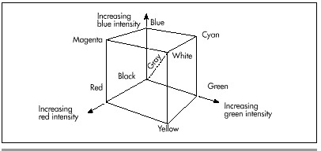
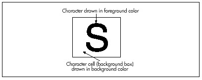

## Chapter 55 -- Color Modeling in 256-Color Mode

### Pondering X-Sharp's Color Model in an RGB State of Mind

Once she turned six, my daughter wanted some fairly sophisticated books
read to her*. Wind in the Willows.* *Little House on the Prairie.*
Pretty heady stuff for one so young, and sometimes I wondered how much
of it she really understood. As an experiment, during one reading I
stopped whenever I came to a word I thought she might not know, and
asked her what it meant. One such word was "mulling."

"Do you know what ‘mulling' means?" I asked.

She thought about it for a while, then said, "Pondering."

"Very good!" I said, more than a little surprised.

She smiled and said, "But, Dad, how do you know that I know what
‘pondering' means?"

"Okay," I said, "What does ‘pondering' mean?"

"Mulling," she said.

What does this anecdote tell us about the universe in which we live?
Well, it certainly indicates that this universe is inhabited by at least
one comedian and one good straight man. Beyond that, though, it can be
construed as a parable about the difficulty of defining things properly;
for example, consider the complications inherent in the definition of
color on a 256-color display adapter such as the VGA. Coincidentally,
VGA color modeling just happens to be this chapter's topic, and the
place to start is with color modeling in general.

#### A Color Model

We've been developing X-Sharp for several chapters now. In the previous
chapter, we added illumination sources and shading; that addition makes
it necessary for us to have a general-purpose color model, so that we
can display the gradations of color intensity necessary to render
illuminated surfaces properly. In other words, when a bright light is
shining straight at a green surface, we need to be able to display
bright green, and as that light dims or tilts to strike the surface at a
shallower angle, we need to be able to display progressively dimmer
shades of green.

The first thing to do is to select a color model in which to perform our
shading calculations. I'll use the dot product-based stuff I discussed
in the previous chapter. The approach we'll take is to select an ideal
representation of the full color space and do our calculations there, as
if we really could display every possible color; only as a final step
will we map each desired color into the limited 256-color set of the
VGA, or the color range of whatever adapter we happen to be working
with. There are a number of color models that we might choose to work
with, but I'm going to go with the one that's both most familiar and, in
my opinion, simplest: RGB (red, green, blue).

In the RGB model, a given color is modeled as the mix of specific
fractions of full intensities of each of the three color primaries. For
example, the brightest possible pure blue is 0.0\*R, 0.0\*G, 1.0\*B.
Half-bright cyan is 0.0\*R, 0.5\*G, 0.5\*B. Quarter-bright gray is
0.25\*R, 0.25\*G, 0.25\*B. You can think of RGB color space as being a
cube, as shown in Figure 55.1, with any particular color lying somewhere
inside or on the cube.



RGB is good for modeling colors generated by light sources, because red,
green, and blue are the additive primaries; that is, all other colors
can be generated by mixing red, green, and blue light sources. They're
also the primaries for color computer displays, and the RGB model maps
beautifully onto the display capabilities of 15- and 24-bpp display
adapters, which tend to represent pixels as RGB combinations in display
memory.

How, then, are RGB colors represented in X-Sharp? Each color is
represented as an RGB triplet, with eight bits each of red, green, and
blue resolution, using the structure shown in Listing 55.1.

**LISTING 55.1 L55-1.C**

```c
typedef struct -ModelColor {
  unsigned char Red;   /* 255 = max red, 0 = no red */
  unsigned char Green; /* 255 = max green, 0 = no green */
  unsigned char Blue;  /* 255 = max blue, 0 = no blue */
} ModelColor;
```

Here, each color is described by three color components—one each for
red, green, and blue—and each primary color component is represented by
eight bits. Zero intensity of a color component is represented by the
value 0, and full intensity is represented by the value 255. This gives
us 256 levels of each primary color component, and a total of 16,772,216
possible colors.

Holy cow! Isn't 16,000,000-plus colors a bit of overkill?

Actually, no, it isn't. At the eighth Annual Computer Graphics Show in
New York, Sheldon Linker, of Linker Systems, related an interesting tale
about color perception research at the Jet Propulsion Lab back in the
'70s. The JPL color research folks had the capability to print more than
50,000,000 distinct and very precise colors on paper. As a test, they
tried printing out words in various colors, with each word printed on a
background that differed by only one color index from the word's color.
No one expected the human eye to be able to differentiate between two
colors, out of 50,000,000-plus, that were so similar. It turned out,
though, that everyone could read the words with no trouble at all; the
human eye is surprisingly sensitive to color gradations, and also
happens to be wonderful at detecting edges.

When the JPL team went to test the eye's sensitivity to color on the
screen, they found that only about 16,000,000 colors could be
distinguished, because the color-sensing mechanism of the human eye is
more compatible with reflective sources such as paper and ink than with
emissive sources such as CRTs. Still, the human eye can distinguish
about 16,000,000 colors on the screen. That's not so hard to believe, if
you think about it; the eye senses each primary color separately, so
we're really only talking about detecting 256 levels of intensity per
primary here. It's the brain that does the amazing part; the
16,000,000-plus color capability actually comes not from extraordinary
sensitivity in the eye, but rather from the brain's ability to
distinguish between all the mixes of 256 levels of each of three
primaries.

So it's perfectly reasonable to maintain 24 bits of color resolution,
and X-Sharp represents colors internally as ideal, device-independent
24-bit RGB triplets. All shading calculations are performed on these
triplets, with 24-bit color precision. It's only after the final 24-bit
RGB drawing color is calculated that the display adapter's color
capabilities come into play, as the X-Sharp function
`ModelColorToColorIndex()` is called to map the desired RGB color to
the closest match the adapter is capable of displaying. Of course, that
mapping is adapter-dependent. On a 24-bpp device, it's pretty obvious
how the internal RGB color format maps to displayed pixel colors:
directly. On VGAs with 15-bpp Sierra Hicolor DACS, the mapping is
equally simple, with the five upper bits of each color component mapping
straight to display pixels. But how on earth do we map those
16,000,000-plus RGB colors into the 256-color space of a standard VGA?

This is the "color definition" problem I mentioned at the start of this
chapter. The VGA palette is arbitrarily programmable to any set of 256
colors, with each color defined by six bits each of red, green, and blue
intensity. In X-Sharp, the function `InitializePalette()` can be
customized to set up the palette however we wish; this gives us nearly
complete flexibility in defining the working color set. Even with
infinite flexibility, however, 256 out of 16,000,000 or so possible
colors is a pretty puny selection. It's easy to set up the palette to
give yourself a good selection of just blue intensities, or of just
greens; but for general color modeling there's simply not enough palette
to go around.

One way to deal with the limited simultaneous color capabilities of the
VGA is to build an application that uses only a subset of RGB space,
then bias the VGA's palette toward that subspace. This is the approach
used in the DEMO1 sample program in X-Sharp; Listings 55.2 and 55.3 show
the versions of `InitializePalette()` and `ModelColorToColorIndex()`
that set up and perform the color mapping for DEMO1.

**LISTING 55.2 L55-2.C**

```c
/* Sets up the palette in mode X, to a 2-2-2 general R-G-B organization, with
  64 separate levels each of pure red, green, and blue. This is very good
  for pure colors, but mediocre at best for mixes.

  ------------------------
  |0  0 | Red|Green| Blue |
  ------------------------
   7  6  5  4  3  2  1  0

  ------------------------
  |0  1 |      Red        |
  ------------------------
   7  6  5  4  3  2  1  0

  ------------------------
  |1  0 |     Green       |
  ------------------------
   7  6  5  4  3  2  1  0

  ------------------------
  |1  1 |      Blue       |
  ------------------------
   7  6  5  4  3  2  1  0

  Colors are gamma corrected for a gamma of 2.3 to provide approximately
  even intensity steps on the screen.
*/

#include <dos.h>
#include "polygon.h"

static unsigned char Gamma4Levels[] = { 0, 39, 53, 63 };
static unsigned char Gamma64Levels[] = {
   0, 10, 14, 17, 19, 21, 23, 24, 26, 27, 28, 29, 31, 32, 33, 34,
  35, 36, 37, 37, 38, 39, 40, 41, 41, 42, 43, 44, 44, 45, 46, 46,
  47, 48, 48, 49, 49, 50, 51, 51, 52, 52, 53, 53, 54, 54, 55, 55,
  56, 56, 57, 57, 58, 58, 59, 59, 60, 60, 61, 61, 62, 62, 63, 63,
};

static unsigned char PaletteBlock[256][3];   /* 256 RGB entries */

void InitializePalette()
{
  int Red, Green, Blue, Index;
  union REGS regset;
  struct SREGS sregset;

  for (Red=0; Red<4; Red++) {
     for (Green=0; Green<4; Green++) {
        for (Blue=0; Blue<4; Blue++) {
           Index = (Red<<4)+(Green<<2)+Blue;
           PaletteBlock[Index][0] = Gamma4Levels[Red];
           PaletteBlock[Index][1] = Gamma4Levels[Green];
           PaletteBlock[Index][2] = Gamma4Levels[Blue];
        }
     }
  }

  for (Red=0; Red<64; Red++) {
     PaletteBlock[64+Red][0] = Gamma64Levels[Red];
     PaletteBlock[64+Red][1] = 0;
     PaletteBlock[64+Red][2] = 0;
  }

  for (Green=0; Green<64; Green++) {
     PaletteBlock[128+Green][0] = 0;
     PaletteBlock[128+Green][1] = Gamma64Levels[Green];
     PaletteBlock[128+Green][2] = 0;
  }

  for (Blue=0; Blue<64; Blue++) {
     PaletteBlock[192+Blue][0] = 0;
     PaletteBlock[192+Blue][1] = 0;
     PaletteBlock[192+Blue][2] = Gamma64Levels[Blue];
  }

  /* Now set up the palette */
  regset.x.ax = 0x1012;   /* set block of DAC registers function */
  regset.x.bx = 0;        /* first DAC location to load */
  regset.x.cx = 256;      /* # of DAC locations to load */
  regset.x.dx = (unsigned int)PaletteBlock; /* offset of array from which
                                               to load RGB settings */
  sregset.es = DS; /* segment of array from which to load settings */
  int86x(0x10, &regset, &regset, &sregset); /* load the palette block */
}
```

**LISTING 55.3 L55-3.C**

```c
/* Converts a model color (a color in the RGB color cube, in the current
  color model) to a color index for mode X. Pure primary colors are
  special-cased, and everything else is handled by a 2-2-2 model. */
int ModelColorToColorIndex(ModelColor * Color)
{
  if (Color->Red == 0) {
     if (Color->Green == 0) {
        /* Pure blue */
        return(192+(Color->Blue >> 2));
     } else if (Color->Blue == 0) {
        /* Pure green */
        return(128+(Color->Green >> 2));
     }
  } else if ((Color->Green == 0) && (Color->Blue == 0)) {
     /* Pure red */
     return(64+(Color->Red >> 2));
  }
  /* Multi-color mix; look up the index with the two most significant bits
     of each color component */
  return(((Color->Red & 0xC0) >> 2) | ((Color->Green & 0xC0) >> 4) |
        ((Color->Blue & 0xC0) >> 6));
}
```

In DEMO1, three-quarters of the palette is set up with 64 intensity
levels of each of the three pure primary colors (red, green, and blue),
and then most drawing is done with only pure primary colors. The
resulting rendering quality is very good because there are so many
levels of each primary.

The downside is that this excellent quality is available for only three
colors: red, green, and blue. What about all the other colors that are
mixes of the primaries, like cyan or yellow, to say nothing of gray? In
the DEMO1 color model, any RGB color that is not a pure primary is
mapped into a 2-2-2 RGB space that the remaining quarter of the VGA's
palette is set up to display; that is, there are exactly two bits of
precision for each color component, or 64 general RGB colors in all.
This is genuinely lousy color resolution, being only 1/64th of the
resolution we really need for each color component. In this model, a
staggering 262,144 colors from the 24-bit RGB cube map to *each* color
in the 2-2-2 VGA palette. The results are not impressive; the colors of
mixed-primary surfaces jump abruptly, badly damaging the illusion of
real illumination. To see how poor a 2-2-2 RGB selection can look, run
DEMO1, and press the ‘2' key to turn on spotlight 2, the blue spotlight.
Because the ambient lighting is green, turning on the blue spotlight
causes mixed-primary colors to be displayed—and the result looks
terrible, because there just isn't enough color resolution.
Unfortunately, 2-2-2 RGB is close to the best general color resolution
the VGA can display; 3-3-2 is as good as it gets.

Another approach would be to set up the palette with reasonably good
mixes of two primaries but no mixes of three primaries, then use only
two-primary colors in your applications (no grays or whites or other
three-primary mixes). Or you could choose to shade only selected
objects, using part of the palette for a good range of the colors of
those objects, and reserving the rest of the palette for the fixed
colors of the other, nonshaded objects. Jim Kent, author of Autodesk
Animator, suggests dynamically adjusting the palette to the needs of
each frame, for example by allocating the colors for each frame on a
first-come, first-served basis. That wouldn't be trivial to do in real
time, but it would make for extremely efficient use of the palette.

Another widely used solution is to set up a 2-2-2, 3-3-2, or 2.6-2.6-2.6
(6 levels per primary) palette, and dither colors. Dithering is an
excellent solution, but outside the scope of this book. Take a look at
Chapter 13 of Foley and Van Dam (cited in "Further Readings") for an
introduction to color perception and approximation.

The sad truth is that the VGA's 256-color palette is an inadequate
resource for general RGB shading. The good news is that clever
workarounds can make VGA graphics look nearly as good as 24-bpp
graphics; but the burden falls on you, the programmer, to design your
applications and color mapping to compensate for the VGA's limitations.
To experiment with a different 256-color model in X-Sharp, just change
`InitializePalette()` to set up the desired palette and
`ModelColorToColorIndex()` to map 24-bit RGB triplets into the palette
you've set up. It's that simple, and the results can be striking indeed.

#### A Bonus from the BitMan

Finally, a note on fast VGA text, which came in from a correspondent who
asked to be referred to simply as the BitMan. The BitMan passed along a
nifty application of the VGA's under-appreciated write mode 3 that is,
under the proper circumstances, the fastest possible way to draw text in
any 16-color VGA mode.

The task at hand is illustrated by Figure 55.2. We want to draw what's
known as solid text, in which the effect is the same as if the cell
around each character was drawn in the background color, and then each
character was drawn on top of the background box. (This is in contrast
to transparent text, where each character is drawn in the foreground
color without disturbing the background.) Assume that each character
fits in an eight-wide cell (as is the case with the standard VGA fonts),
and that we're drawing text at byte-aligned locations in display memory.

Solid text is useful for drawing menus, text areas, and the like;
basically, it can be used whenever you want to display text on a
solid-color background. The obvious way to implement solid text is to
fill the rectangle representing the background box, then draw
transparent text on top of the background box. However, there are two
problems with doing solid text this way. First, there's some flicker,
because for a little while the box is there but the text hasn't yet
arrived. More important is that the background-followed-by-foreground
approach accesses display memory three times for each byte of font data:
once to draw the background box, once to read display memory to load the
latches, and once to actually draw the font pattern. Display memory is
incredibly slow, so we'd like to reduce the number of accesses as much
as possible. With the BitMan's approach, we can reduce the number of
accesses to just one per font byte, and eliminate flicker, too.



The keys to fast solid text are the latches and write mode 3. The
latches, as you may recall from earlier discussions in this book, are
four internal VGA registers that hold the last bytes read from the VGA's
four planes; every read from VGA memory loads the latches with the
values stored at that display memory address across the four planes.
Whenever a write is performed to VGA memory, the latches can provide
some, none, or all of the bits written to memory, depending on the bit
mask, which selects between the latched data and the drawing data on a
bit-by-bit basis. The latches solve half our problem; we can fill the
latches with the background color, then use them to draw the background
box. The trick now is drawing the text pixels in the foreground color at
the same time.

This is where it gets a little complicated. In write mode 3 (which
incidentally is not available on the EGA), each byte value that the CPU
writes to the VGA does not get written to display memory. Instead, it
turns into the bit mask. (Actually, it's ANDed with the Bit Mask
register, and the result becomes the bit mask, but we'll leave the Bit
Mask register set to 0xFF, so the CPU value will become the bit mask.)
The bit mask selects, on a bit-by-bit basis, between the data in the
latches for each plane (the previously loaded background color, in this
case) and the foreground color. Where does the foreground color come
from, if not from the CPU? From the Set/Reset register, as shown in
Figure 55.3. Thus, each byte written by the CPU (font data, presumably)
selects foreground or background color for each of eight pixels, all
done with a single write to display memory.


I know this sounds pretty esoteric, but think of it this way: The
latches hold the background color in a form suitable for writing eight
background pixels (one full byte) at a pop. Write mode 3 allows each CPU
byte to punch holes in the background color provided by the latches,
holes through which the foreground color from the Set/Reset register can
flow. The result is that a single write draws exactly the combination of
foreground and background pixels described by each font byte written by
the CPU. It may help to look at Listing 55.4, which shows The BitMan's
technique in action. And yes, this technique is absolutely worth the
trouble; it's about three times faster than the fill-then-draw approach
described above, and about twice as fast as transparent text. So far as
I know, there is no faster way to draw text on a VGA.

It's important to note that the BitMan's technique only works on full
bytes of display memory. There's no way to clip to finer precision; the
background color will inevitably flood all of the eight destination
pixels that aren't selected as foreground pixels. This makes The
BitMan's technique most suitable for monospaced fonts with characters
that are multiples of eight pixels in width, and for drawing to
byte-aligned addresses; the technique can be used in other situations,
but is considerably more difficult to apply.

**LISTING 55.4 L55-4.ASM**

```nasm
 ; Demonstrates drawing solid text on the VGA, using the BitMan's write mode
 ; 3-based, one-pass technique.

 CHAR_HEIGHT     equ 8                ;# of scan lines per character (must be <256)
 SCREEN_HEIGHT   equ 480              ;# of scan lines per screen
 SCREEN_SEGMENT  equ 0a000h           ;where screen memory is
 FG_COLOR        equ 14               ;text color
 BG_COLOR        equ 1                ;background box color
 GC_INDEX        equ 3ceh             ;Graphics Controller (GC) Index reg I/O port
 SET_RESET       equ 0                ;Set/Reset register index in GC
 G_MODE          equ 5                ;Graphics Mode register index in GC
 BIT_MASK        equ 8                ;Bit Mask register index in GC

       .model    small
       .stack    200h
       .data
 Line            dw ?                ;current line #
 CharHeight      dw ?                ;# of scan lines in each character (must be <256)
 MaxLines        dw ?                ;max # of scan lines of text that will fit on screen
 LineWidthBytes  dw ?                ;offset from one scan line to the next
 FontPtr         dd ?                ;pointer to font with which to draw
 SampleString    label              byte
       db  ‘ABCDEFGHIJKLMNOPQRSTUVWXYZ'
       db  ‘abcdefghijklmnopqrstuvwxyz'
       db  ‘0123456789!@#$%^&*(),<.>/?;:',0

      .code
 start:
        mov  ax,@data
        mov  ds,ax

        mov  ax,12h
        int  10h                        ;select 640x480 16-color mode

        mov  ah,11h                     ;BIOS character generator function
        mov  al,30h                     ;BIOS get font pointer subfunction
        mov  bh,3                       ;get 8x8 ROM font subsubfunction
        int  10h                        ;get the pointer to the BIOS 8x8 font
        mov  word ptr [FontPtr],bp
        mov  word ptr [FontPtr+2],es

        mov  bx,CHAR_HEIGHT
        mov  [CharHeight],bx            ;# of scan lines per character
        mov  ax,SCREEN_HEIGHT
        sub  dx,dx
        div  bx
        mul  bx                         ;max # of full scan lines of text that
        mov  [MaxLines],ax              ; will fit on the screen

        mov  ah,0fh                     ;BIOS video status function
        int  10h                        ;get # of columns (bytes) per row
        mov  al,ah                      ;convert byte columns variable in
        sub  ah,ah                      ; AH to word in AX
        mov  [LineWidthBytes],ax        ;width of scan line in bytes
                                        ;now draw the text
        sub  bx,bx
        mov  [Line],bx                  ;start at scan line 0
LineLoop:
        sub  ax,ax                      ;start at column 0; must be a multiple of 8
        mov  ch,FG_COLOR                ;color in which to draw text
        mov  cl,BG_COLOR                ;color in which to draw background box
        mov  si,offset SampleString     ;text to draw
        call DrawTextString             ;draw the sample text
        mov  bx,[Line]
        add  bx,[CharHeight]            ;# of next scan line to draw on
        mov  [Line],bx
        cmp  bx,[MaxLines]              ;done yet?
        jb   LineLoop                   ;not yet

        mov  ah,7
        int  21h                        ;wait for a key press, without echo

        mov  ax,03h
        int  10h                        ;back to text mode

        mov  ah,4ch
        int  21h                        ;exit to DOS

; Draws a text string.
; Input: AX = X coordinate at which to draw upper-left corner of first char
;    BX = Y coordinate at which to draw upper-left corner of first char
;    CH = foreground (text) color
;    CL = background (box) color
;    DS:SI = pointer to string to draw, zero terminated
;    CharHeight must be set to the height of each character
;    FontPtr must be set to the font with which to draw
;        LineWidthBytes must be set to the scan line width in bytes
; Don't count on any registers other than DS, SS, and SP being preserved.
; The X coordinate is truncated to a multiple of 8. Characters are
; assumed to be 8 pixels wide.
     align 2
    DrawTextString  proc    near
        cld
        shr  ax,1                 ;byte address of starting X within scan line
        shr  ax,1
        shr  ax,1
        mov  di,ax
        mov  ax,[LineWidthBytes]
        mul  bx                  ; start offset of initial scan line
        add  di,ax               ;start offset of initial byte
        mov  ax,SCREEN_SEGMENT
        mov  es,ax               ;ES:DI = offset of initial character's
                                 ; first scan line
                                 ;set up the VGA's hardware so that we can
                                 ; fill the latches with the background color
        mov  dx,GC_INDEX
        mov  ax,(0ffh SHL 8) + BIT_MASK
        out  dx,ax               ;set Bit Mask register to 0xFF (that's the
                                 ; default, but I'm doing this just to make sure
                                 ; you understand that Bit Mask register and
                                 ; CPU data are ANDed in write mode 3)
        mov  ax,(003h SHL 8) + G_MODE
        out  dx,ax               ;select write mode 3
        mov  ah,cl               ;background color
        mov  al,SET_RESET
        out  dx,ax               ;set the drawing color to background color
        mov  byte ptr es:[0ffffh],0ffh
                                 ;write 8 pixels of the background
                                 ; color to unused off-screen memory
        mov  cl,es:[0ffffh]      ;read the background color back into the
                                 ; latches; the latches are now filled with
                                 ; the background color. The value in CL
                                 ; doesn't matter, we just needed a target
                                 ; for the read, so we could load the latches
        mov  ah,ch               ;foreground color
        out  dx,ax               ;set the Set/Reset (drawing) color to the
                                 ; foreground color
                                 ;we're ready to draw!
DrawTextLoop:
        lodsb                    ;next character to draw
        and  al,al               ;end of string?
        jz   DrawTextDone                   ;yes
        push ds                  ;remember string's segment
        push si                  ;remember offset of next character in string
        push di                  ;remember drawing offset
                                 ;load these variables before we wipe out DS
        mov  dx,[LineWidthBytes] ;offset from one line to next
        dec  dx                  ;compensate for STOSB
        mov  cx,[CharHeight];
        mul  cl                  ;offset of character in font table
        lds  si,[FontPtr]        ;point to font table
        add  si,ax               ;point to start of character to draw
                                 ;the following loop should be unrolled for
                                 ; maximum performance!
DrawCharLoop:                    ;draw all lines of the character
        mov  sb                  ;getthe next byte of the character and draw
                                 ; character; data is ANDed with Bit Mask
                                 ; register to become bit mask, and selects
                                 ; between latch (containing the background
                                 ; color) and Set/Reset register (containing
                                 ; foreground color)
        add di,dx                ;point to next line of destination
        loop DrawCharLoop

        pop  di                  ;retrieve initial drawing offset
        inc  di                  ;drawing offset for next char
        pop  si                  ;retrieve offset of next character in string
        pop  ds                  ;retrieve string's segment
        jmp  DrawTextLoop        ;draw next character, if any

        align2
  DrawTextDone:                  ;restore the Graphics Mode register to its
                                 ; default state of write mode 0
        mov  dx,GC_INDEX
        mov  ax,(000h SHL 8) + G_MODE
        out  dx,ax               ;select write mode 0
        ret
DrawTextString   endp
        end   start
```
