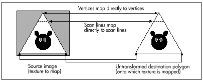

## Chapter 56\
 Pooh and the Space Station

### Using Fast Texture Mapping to Place Pooh on a Polygon

So, here's where Winnie the Pooh lives: in a space station orbiting
Saturn. No, really; I have it straight from my daughter, and an
eight-year-old wouldn't make up something that important, would she? One
day she wondered aloud, "Where is the Hundred Acre Wood, exactly?" and
before I could give one of those boring parental responses about how it
was imaginary—but A.A. Milne probably imagined it to be somewhere near
London—my daughter announced that the Hundred Acre Wood was in a space
station orbiting Saturn, and there you have it.

As it turns out, that's a very good location for the Hundred Acre Wood,
leading to many exciting adventures for Pooh and Piglet. Consider the
time they went down to the Jupiter gravity level (we're talking
centrifugal force here; the station is spinning, of course) and nearly
turned into pancakes of the Pooh and Piglet varieties, respectively. Or
the time they drifted out into the free-fall area at the core and had to
be rescued by humans with wings strapped on (a tip of the hat to Robert
Heinlein here). Or the time they were caught up by the current in the
river through the Wood and drifted for weeks around the circumference of
the station, meeting many cultures and finding many adventures along the
way. (Yes, Farmer's Riverworld; no one said the stories you tell your
children need to be purely original, just interesting.)

(If you think Pooh and Piglet in a space station is a tad peculiar, then
I won't even mention Karla, the woman who invented agriculture,
medicine, sanitation, reading and writing, peace, and just about
everything else while travelling the length of the Americas with her
mountain lion during the last Ice Age; or the Mars Cats and their trip
in suspended animation to the Lesser Magellenic Cloud and beyond; or
most assuredly Little Whale, the baby Universe Whale that is naughty
enough to eat inhabited universes. But I digress.)

Anyway, I bring up Pooh and the space station because the time has come
to discuss fast texture mapping. *Texture mapping* is the process of
mapping an image (in our case, a bitmap) onto the surface of a polygon
that's been transformed in the process of 3-D drawing. Up to this point,
each polygon we've drawn in X-Sharp has been a single, solid color. Over
the last couple of chapters we added the ability to shade polygons
according to lighting, but each polygon was still a single color. Thus,
in order to produce any sort of intricate design, a great many tiny
polygons would have to be drawn. That would be very slow, so we need
another approach. One such approach is texture mapping; that is, mapping
the bitmap containing the desired image onto the pixels contained within
the transformed polygon. Done properly, this should make it possible to
change X-Sharp's output from a bland collection of monocolor facets to a
lively, detailed, and much more realistic scene.

"What sort of scene?" you may well ask. This is where Pooh and the space
station came in. When I sat down to think of a sample texture-mapping
application, it occurred to me that the shaded ball demo we added to
X-Sharp recently looked at least a bit like a spinning, spherical space
station, and that the single unshaded, yellow polygon looked somewhat
like a window in the space station, and it might be a nice example if
someone were standing in the window....

The rest is history.

### Principles of Quick-and-Dirty Texture Mapping

The key to our texture-mapping approach will be to quickly determine
what pixel value to draw for each pixel in the transformed destination
polygon. These polygon pixel values will be determined by mapping each
destination pixel in the transformed polygon back to the image bitmap,
via a reverse transformation, and seeing what color resides at the
corresponding location in the image bitmap, as shown in Figure 56.1. It
might seem more intuitive to map pixels the other way, from the image
bitmap to the transformed polygon, but in fact it's crucial that the
mapping proceed backward from the destination to avoid gaps in the final
image. With the approach of finding the right value for each destination
pixel in turn, via a backward mapping, there's no way we can miss any
destination pixels. On the other hand, with the forward-mapping method,
some destination pixels may be skipped or double-drawn, because this is
not necessarily a one-to-one or one-to-many mapping. Although we're not
going to take advantage of it now, mapping back to the source makes it
possible to average several neighboring image pixels together to
calculate the value for each destination pixel; that is, to antialias
the image. This can greatly improve texture quality, although it is
slower.


#### Mapping Textures Made Easy

To understand how we're going to map textures, consider Figure 56.2,
which maps a bitmapped image directly onto an untransformed polygon.
Here, we simply map the origin of the polygon's untransformed coordinate
system somewhere within the image, then map the vertices to the
corresponding image pixels. (For simplicity, I'll assume in this
discussion that the polygon's coordinate system is in units of pixels,
but scaling images to polygons is eminently doable. This will become
clearer when we look at mapping images onto transformed polygons, next.)
Mapping the image to the polygon is then a simple matter of stepping one
scan line at a time in both the image and the polygon, each time
advancing the X coordinates of the edges according to the slopes of the
lines, just as is normally done when filling a polygon. Since the
polygon is untransformed, the stepping is identical in both the image
and the polygon, and the pixel mapping is one-to-one, so the appropriate
part of each scan line of the image can simply be block copied to the
destination.



Now, matters get more complicated. What if the destination polygon is
rotated in two dimensions? We no longer have a neat direct mapping from
image scan lines to destination polygon scan lines. We still want to
draw across each destination scan line, but the proper source pixels for
each destination scan line may now track across the source bitmap at an
angle, as shown in Figure 56.3. What can we do?

The solution is remarkably simple. We'll just map each transformed
vertex to the corresponding vertex in the bitmap; this is easy, because
the vertices are at the same indices in the original and transformed
vertex lists. Each time we select a new edge to scan for the destination
polygon, we'll select the corresponding edge in the source bitmap, as
well. Then—and this is crucial—each time we step a destination edge one
scan line, we'll step the corresponding source image edge an equivalent
amount.

Ah, but what is an "equivalent amount"? Think of it this way. If a
destination edge is 100 scan lines high, it will be stepped 100 times.
Then, we'll divide the `SourceXWidth` and `SourceYHeight` lengths of
the source edge by 100, and add those amounts to the source edge's
coordinates each time the destination is stepped one scan line. Put
another way, we have, as usual, arranged things so that in the
destination polygon we step `DestYHeight` times, where `DestYHeight`
is the height of the destination edge. The this approach arranges to
step the source image edge `DestYHeight` times also, to match what the
destination is doing.


Now we're able to track the coordinates of the polygon edges through the
source image in tandem with the destination edges. Stepping across each
destination scan line uses precisely the same technique, as shown in
Figure 56.4. In the destination, we step `DestXWidth` times across
each scan line of the polygon, once for each pixel on the scan line.
(`DestXWidth` is the horizontal distance between the two edges being
scanned on any given scan line.) To match this, we divide
`SourceXWidth` and `SourceYHeight` (the lengths of the scan line in
the source image, as determined by the source edge points we've been
tracking, as just described) by the width of the destination scan line,
`DestXWidth`, to produce `SourceXStep` and `SourceYStep`. Then, we
just step `DestXWidth` times, adding `SourceXStep` and
`SourceYStep` to `SourceX` and `SourceY` each time, and choose the
nearest image pixel to (`SourceX`,`SourceY`) to copy to (`DestX`,
`DestY`). (Note that the names used above, such as `SourceXWidth`,
are used for descriptive purposes, and don't necessarily correspond to
the actual variable names used in Listing 56.2.)

That's a workable approach for 2-D rotated polygons—but what about 3-D
rotated polygons, where the visible dimensions of the polygon can vary
with 3-D rotation and perspective projection? First, I'd like to make it
clear that texture mapping takes place from the source image to the
destination polygon after the destination polygon is projected to the
screen. That is, the image will be mapped after the destination polygon
is in its final, drawable form. Given that, it should be apparent that
the above approach automatically compensates for all changes in the
dimensions of a polygon. You see, this approach divides source edges and
scan lines into however many steps the destination polygon requires. If
the destination polygon is much narrower than the source polygon, as a
result of 3-D rotation and perspective projection, we just end up taking
bigger steps through the source image and skipping a lot of source image
pixels, as shown in Figure 56.5. The upshot is that the above approach
handles all transformations and projections effortlessly. It could also
be used to scale source images up to fit in larger polygons; all that's
needed is a list of where the polygon's vertices map into the source
image, and everything else happens automatically. In fact, mapping from
any polygonal area of a bitmap to any destination polygon will work,
given only that the two polygons have the same number of vertices.


#### Notes on DDA Texture Mapping

That's all there is to quick-and-dirty texture mapping. This technique
basically uses a two-stage digital differential analyzer (DDA) approach
to step through the appropriate part of the source image in tandem with
the normal scan-line stepping through the destination polygon, so I'll
call it "DDA texture mapping." It's worth noting that there is no need
for any trigonometric functions at all, and only two divides are
required per scan line.

This isn't a perfect approach, of course. For one thing, it isn't
anywhere near as fast as drawing solid polygons; the speed is more
comparable to drawing each polygon as a series of lines. Also, the DDA
approach results in far from perfect image quality, since source pixels
may be skipped or selected twice. I trust, however, that you can see how
easy it would be to improve image quality by antialiasing with the DDA
approach. For example, we could simply average the four surrounding
pixels as we did for simple, unweighted antialiasing in Chapters F,
G,Chapter K on the companion CD-ROM. Or, we could take a Wu antialiasing
approach (see Chapter 57) and average the two bracketing pixels along
each axis according to proximity. If we had cycles to waste (which,
given that this is real-time animation on a PC, we don't), we could
improve image quality by putting the source pixels through a low-pass
filter sized in X and Y according to the ratio of the source and
destination dimensions (that is, how much the destination is scaled up
or down from the source).

Even more important is that the sort of texture mapping I'll do in
X-Sharp doesn't correct for perspective. That doesn't much matter for
small polygons or polygons that are nearly parallel to the screen in
3-space, but it can produce very noticeable bowing of textures on large
polygons at an angle to the screen. Perspective texture mapping is a
complex subject that's outside the scope of this book, but you should be
aware of its existence, because perspective texture mapping is a key
element of many games these days.

Finally, I'd like to point out that this sort of DDA texture mapping is
display-hardware dependent, because the bitmap for each image must be
compatible with the number of bits per pixel in the destination. That's
actually a fairly serious issue. One of the nice things about X-Sharp's
polygon orientation is that, until now, the only display dependent part
of X-Sharp has been the transformation from RGB color space to the
adapter's color space. Compensation for aspect ratio, resolution, and
the like all happens automatically in the course of projection. Still,
we need the ability to display detailed surfaces, and it's hard to
conceive of a fast way to do so that's totally hardware independent. (If
you know of one, let me know care of the publisher.)

For now, all we need is fast texture mapping of adequate quality, which
the straightforward, non-antialiased DDA approach supplies. I'm sure
there are many other fast approaches, and, as I've said, there are more
accurate approaches, but DDA texture mapping works well, given the
constraints of the PC's horsepower. Next, we'll look at code that
performs DDA texture mapping. First, though, I'd like to take a moment
to thank Jim Kent, author of Autodesk Animator and a frequent
correspondent, for getting me started with the DDA approach.

### Fast Texture Mapping: An Implementation

As you might expect, I've implemented DDA texture mapping in X-Sharp,
and the changes are reflected in the X-Sharp archive in this chapter's
subdirectory on the listings disk. Listing 56.1 shows the new header
file entries, and Listing 56.2 shows the actual texture-mapped polygon
drawer. The set-pixel routine that Listing 56.2 calls is a slight
modification of the Mode X set-pixel routine from Chapter 47. In
addition, INITBALL.C has been modified to create three texture-mapped
polygons and define the texture bitmaps, and modifications have been
made to allow the user to flip the axis of rotation. You will of course
need the complete X-Sharp library to see texture mapping in action, but
Listings 56.1 and 56.2 are the actual texture mapping code in its
entirety.

> 
> Here's a major tip: DDA texture mapping looks best on fast-moving
> surfaces, where the eye doesn't have time to pick nits with the shearing
> and aliasing that's an inevi table by-product of such a crude approach.
> Compile DEMO1 from the X-Sharp archive in this chapter's subdirectory of
> the listings disk, and run it. The initial display looks okay, but
> certainly not great, because the rotational speed is so slow. Now press
> the S key a few times to speed up the rotation and flip between
> different rotation axes. I think you'll be amazed at how much better DDA
> texture mapping looks at high speed. This technique would be great for
> mapping textures onto hurtling asteroids or jets, but would come up
> short for slow, finely detailed movements.

**LISTING 56.1 L56-1.C**

```c
/* New header file entries related to texture-mapped polygons */

/* Draws the polygon described by the point list PointList with a bitmap
   texture mapped onto it */
#define DRAW_TEXTURED_POLYGON(PointList,NumPoints,TexVerts,TexMap) \
   Polygon.Length = NumPoints; Polygon.PointPtr = PointList;       \
   DrawTexturedPolygon(&Polygon, TexVerts, TexMap);
#define FIXED_TO_INT(FixedVal) ((int) (FixedVal >> 16))
#define ROUND_FIXED_TO_INT(FixedVal) \
   ((int) ((FixedVal + DOUBLE_TO_FIXED(0.5)) >> 16))
/* Retrieves specified pixel from specified image bitmap of specified width. */
#define GET_IMAGE_PIXEL(TexMapBits, TexMapWidth, X, Y) \
   TexMapBits[(Y * TexMapWidth) + X]
/* Masks to mark shading types in Face structure */
#define NO_SHADING      0x0000
#define AMBIENT_SHADING 0x0001
#define DIFFUSE_SHADING 0x0002
#define TEXTURE_MAPPED_SHADING 0x0004
/* Describes a texture map */
typedef struct {
   int TexMapWidth;  /* texture map width in bytes */
   char *TexMapBits; /* pointer to texture bitmap */
} TextureMap;

/* Structure describing one face of an object (one polygon) */
typedef struct {
   int * VertNums;   /* pointer to list of indexes of this polygon's vertices
                        in the object's vertex list. The first two indexes
                        must select end and start points, respectively, of this
                        polygon's unit normal vector. Second point should also
                        be an active polygon vertex */
   int NumVerts;     /* # of verts in face, not including the initial
                        vertex, which must be the end of a unit normal vector
                        that starts at the second index in VertNums */
   int ColorIndex;   /* direct palette index; used only for non-shaded faces */
   ModelColor FullColor; /* polygon's color */
   int ShadingType;  /* none, ambient, diffuse, texture mapped, etc. */
   TextureMap * TexMap; /* pointer to bitmap for texture mapping, if any */
   Point * TexVerts; /* pointer to list of this polygon's vertices, in
                        TextureMap coordinates. Index n must map to index
                        n + 1 in VertNums, (the + 1 is to skip over the unit
                        normal endpoint in VertNums) */
} Face;
extern void DrawTexturedPolygon(PointListHeader *, Point *, TextureMap *);
```

**LISTING 56.2 L56-2.C**

```c
/* Draws a bitmap, mapped to a convex polygon (draws a texture-mapped polygon).
   "Convex" means that every horizontal line drawn through the polygon at any
   point would cross exactly two active edges (neither horizontal lines nor 
   zero-length edges count as active edges; both are acceptable anywhere in 
   the polygon), and that the right & left edges never cross. Nonconvex 
   polygons won't be drawn properly. Can't fail. */
#include <stdio.h>
#include <math.h>
#include "polygon.h"
/* Describes the current location and stepping, in both the source and
   the destination, of an edge */
typedef struct {
   int Direction;         /* through edge list; 1 for a right edge (forward
                             through vertex list), -1 for a left edge (backward
                             through vertex list) */
   int RemainingScans;    /* height left to scan out in dest */
   int CurrentEnd;        /* vertex # of end of current edge */
   Fixedpoint SourceX;    /* current X location in source for this edge */
   Fixedpoint SourceY;    /* current Y location in source for this edge */
   Fixedpoint SourceStepX;/* X step in source for Y step in dest of 1 */
   Fixedpoint SourceStepY;/* Y step in source for Y step in dest of 1 */
                          /* variables used for all-integer Bresenham's-type
                             X stepping through the dest, needed for precise
                             pixel placement to avoid gaps */
   int DestX;             /* current X location in dest for this edge */
   int DestXIntStep;      /* whole part of dest X step per scan-line Y step */
   int DestXDirection;    /* -1 or 1 to indicate way X steps (left/right) */
   int DestXErrTerm;      /* current error term for dest X stepping */
   int DestXAdjUp;        /* amount to add to error term per scan line move */
   int DestXAdjDown;      /* amount to subtract from error term when the
                             error term turns over */
} EdgeScan;
int StepEdge(EdgeScan *);
int SetUpEdge(EdgeScan *, int);
void ScanOutLine(EdgeScan *, EdgeScan *);
int GetImagePixel(char *, int, int, int);
/* Statics to save time that would otherwise pass them to subroutines. */
static int MaxVert, NumVerts, DestY;
static Point * VertexPtr;
static Point * TexVertsPtr;
static char * TexMapBits;
static int TexMapWidth;
/* Draws a texture-mapped polygon, given a list of destination polygon
   vertices, a list of corresponding source texture polygon vertices, and a
   pointer to the source texture's descriptor. */
void DrawTexturedPolygon(PointListHeader * Polygon, Point * TexVerts,
   TextureMap * TexMap)
{
   int MinY, MaxY, MinVert, i;
   EdgeScan LeftEdge, RightEdge;
   NumVerts = Polygon->Length;
   VertexPtr = Polygon->PointPtr;
   TexVertsPtr = TexVerts;
   TexMapBits = TexMap->TexMapBits;
   TexMapWidth = TexMap->TexMapWidth;
   /* Nothing to draw if less than 3 vertices */
   if (NumVerts < 3) {
      return;
   }
   /* Scan through the destination polygon vertices and find the top of the
      left and right edges, taking advantage of our knowledge that vertices run
      in a clockwise direction (else this polygon wouldn't be visible due to 
      backface removal) */
   MinY = 32767;
   MaxY = -32768;
   for (i=0; i<NumVerts; i++) {
      if (VertexPtr[i].Y < MinY) {
         MinY = VertexPtr[i].Y;
         MinVert = i;
      }
      if (VertexPtr[i].Y > MaxY) {
         MaxY = VertexPtr[i].Y;
         MaxVert = i;
      }
   }
   /* Reject flat (0-pixel-high) polygons */
   if (MinY >= MaxY) {
      return;
   }
   /* The destination Y coordinate is not edge specific; it applies to
      both edges, since we always step Y by 1 */
   DestY = MinY;
   /* Set up to scan the initial left and right edges of the source and
      destination polygons. We always step the destination polygon edges
      by one in Y, so calculate the corresponding destination X step for
      each edge, and then the corresponding source image X and Y steps */
   LeftEdge.Direction = -1;   /* set up left edge first */
   SetUpEdge(&LeftEdge, MinVert);
   RightEdge.Direction = 1;   /* set up right edge */
   SetUpEdge(&RightEdge, MinVert);
   /* Step down destination edges one scan line at a time. At each scan
      line, find the corresponding edge points in the source image. Scan
      between the edge points in the source, drawing the corresponding
      pixels across the current scan line in the destination polygon. (We
      know which way the left and right edges run through the vertex list
      because visible (non-backface-culled) polygons always have the vertices
      in clockwise order as seen from the viewpoint) */
   for (;;) {
      /* Done if off bottom of clip rectangle */
      if (DestY >= ClipMaxY) {
         return;
      }
      /* Draw only if inside Y bounds of clip rectangle */
      if (DestY >= ClipMinY) {
         /* Draw the scan line between the two current edges */
         ScanOutLine(&LeftEdge, &RightEdge);
      }
      /* Advance the source and destination polygon edges, ending if we've
         scanned all the way to the bottom of the polygon */
      if (!StepEdge(&LeftEdge)) {
         break;
      }
      if (!StepEdge(&RightEdge)) {
         break;
      }
      DestY++;
   }
}
/* Steps an edge one scan line in the destination, and the corresponding
   distance in the source. If an edge runs out, starts a new edge if there
   is one. Returns 1 for success, or 0 if there are no more edges to scan. */
int StepEdge(EdgeScan * Edge)
{
   /* Count off the scan line we stepped last time; if this edge is
      finished, try to start another one */
   if (--Edge->RemainingScans == 0) {
      /* Set up the next edge; done if there is no next edge */
      if (SetUpEdge(Edge, Edge->CurrentEnd) == 0) {
         return(0);  /* no more edges; done drawing polygon */
      }
      return(1);     /* all set to draw the new edge */
   }
   /* Step the current source edge */
   Edge->SourceX += Edge->SourceStepX;
   Edge->SourceY += Edge->SourceStepY;
   /* Step dest X with Bresenham-style variables, to get precise dest pixel
      placement and avoid gaps */
   Edge->DestX += Edge->DestXIntStep;  /* whole pixel step */
   /* Do error term stuff for fractional pixel X step handling */
   if ((Edge->DestXErrTerm += Edge->DestXAdjUp) > 0) {
      Edge->DestX += Edge->DestXDirection;
      Edge->DestXErrTerm -= Edge->DestXAdjDown;
   }
   return(1);
}
/* Sets up an edge to be scanned; the edge starts at StartVert and proceeds
   in direction Edge->Direction through the vertex list. Edge->Direction must
   be set prior to call; -1 to scan a left edge (backward through the vertex
   list), 1 to scan a right edge (forward through the vertex list).
   Automatically skips over 0-height edges. Returns 1 for success, or 0 if
   there are no more edges to scan. */
int SetUpEdge(EdgeScan * Edge, int StartVert)
{
   int NextVert, DestXWidth;
   Fixedpoint DestYHeight;
   for (;;) {
      /* Done if this edge starts at the bottom vertex */
      if (StartVert == MaxVert) {
         return(0);
      }
      /* Advance to the next vertex, wrapping if we run off the start or end
         of the vertex list */
      NextVert = StartVert + Edge->Direction;
      if (NextVert >= NumVerts) {
         NextVert = 0;
      } else if (NextVert < 0) {
         NextVert = NumVerts - 1;
      }
      /* Calculate the variables for this edge and done if this is not a
         zero-height edge */
      if ((Edge->RemainingScans =
            VertexPtr[NextVert].Y - VertexPtr[StartVert].Y) != 0) {
         DestYHeight = INT_TO_FIXED(Edge->RemainingScans);
         Edge->CurrentEnd = NextVert;
         Edge->SourceX = INT_TO_FIXED(TexVertsPtr[StartVert].X);
         Edge->SourceY = INT_TO_FIXED(TexVertsPtr[StartVert].Y);
         Edge->SourceStepX = FixedDiv(INT_TO_FIXED(TexVertsPtr[NextVert].X) -
               Edge->SourceX, DestYHeight);
         Edge->SourceStepY = FixedDiv(INT_TO_FIXED(TexVertsPtr[NextVert].Y) -
               Edge->SourceY, DestYHeight);
         /* Set up Bresenham-style variables for dest X stepping */
         Edge->DestX = VertexPtr[StartVert].X;
         if ((DestXWidth =
               (VertexPtr[NextVert].X - VertexPtr[StartVert].X)) < 0) {
            /* Set up for drawing right to left */
            Edge->DestXDirection = -1;
            DestXWidth = -DestXWidth;
            Edge->DestXErrTerm = 1 - Edge->RemainingScans;
            Edge->DestXIntStep = -(DestXWidth / Edge->RemainingScans);
         } else {
            /* Set up for drawing left to right */
            Edge->DestXDirection = 1;
            Edge->DestXErrTerm = 0;
            Edge->DestXIntStep = DestXWidth / Edge->RemainingScans;
         }
         Edge->DestXAdjUp = DestXWidth % Edge->RemainingScans;
         Edge->DestXAdjDown = Edge->RemainingScans;
         return(1);  /* success */
      }
      StartVert = NextVert;   /* keep looking for a non-0-height edge */
   }
}
/* Texture-map-draw the scan line between two edges. */
void ScanOutLine(EdgeScan * LeftEdge, EdgeScan * RightEdge)
{
   Fixedpoint SourceX = LeftEdge->SourceX;
   Fixedpoint SourceY = LeftEdge->SourceY;
   int DestX = LeftEdge->DestX;
   int DestXMax = RightEdge->DestX;
   Fixedpoint DestWidth;
   Fixedpoint SourceXStep, SourceYStep;
   /* Nothing to do if fully X clipped */
   if ((DestXMax <= ClipMinX) || (DestX >= ClipMaxX)) {
      return;
   }
   if ((DestXMax - DestX) <= 0) {
      return;  /* nothing to draw */
   }
   /* Width of destination scan line, for scaling. Note: because this is an
      integer-based scaling, it can have a total error of as much as nearly
      one pixel. For more precise scaling, also maintain a fixed-point DestX
      in each edge, and use it for scaling. If this is done, it will also
      be necessary to nudge the source start coordinates to the right by an
      amount corresponding to the distance from the the real (fixed-point)
      DestX and the first pixel (at an integer X) to be drawn) */
   DestWidth = INT_TO_FIXED(DestXMax - DestX);
   /* Calculate source steps that correspond to each dest X step (across
      the scan line) */
   SourceXStep = FixedDiv(RightEdge->SourceX - SourceX, DestWidth);
   SourceYStep = FixedDiv(RightEdge->SourceY - SourceY, DestWidth);
   /* Clip right edge if necessary */
   if (DestXMax > ClipMaxX) {
      DestXMax = ClipMaxX;
   }
   /* Clip left edge if necssary */
   if (DestX < ClipMinX) {
      SourceX += SourceXStep * (ClipMinX - DestX);
      SourceY += SourceYStep * (ClipMinX - DestX);
      DestX = ClipMinX;
   }
   /* Scan across the destination scan line, updating the source image
      position accordingly */
   for (; DestX<DestXMax; DestX++) {
      /* Get currently mapped pixel out of image and draw it to screen */
      WritePixelX(DestX, DestY,
            GET_IMAGE_PIXEL(TexMapBits, TexMapWidth,
            FIXED_TO_INT(SourceX), FIXED_TO_INT(SourceY)) );
      /* Point to the next source pixel */
      SourceX += SourceXStep;
      SourceY += SourceYStep;
   }
}
```

No matter how you slice it, DDA texture mapping beats boring,
single-color polygons nine ways to Sunday. The big downside is that it's
much slower than a normal polygon fill; move the ball close to the
screen in DEMO1, and watch things slow down when one of those big
texture maps comes around. Of course, that's partly because the code is
all in C; some well-chosen optimizations would work wonders. In the next
chapter we'll discuss texture mapping further, crank up the speed of our
texture mapper, and attend to some rough spots that remain in the DDA
texture mapping implementation, most notably in the area of exactly
which texture pixels map to which destination pixels as a polygon
rotates.

And, in case you're curious, yes, there is a bear in DEMO1. I wouldn't
say he looks much like a Pooh-type bear, but he's a bear nonetheless. He
does tend to look a little startled when you flip the ball around so
that he's zipping by on his head, but, heck, you would too in the same
situation. And remember, when you buy the next VGA megahit, *Bears in
Space*, you saw it here first.
