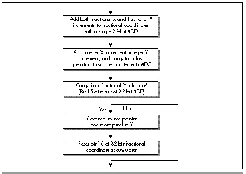

## Chapter 58\
 Heinlein's Crystal Ball, Spock's Brain, and the 9-Cycle Dare

### Using the Whole-Brain Approach to Accelerate Texture Mapping

I've had the pleasure recently of rereading several of the works of
Robert A. Heinlein, and I'm as impressed as I was as a teenager—but in a
different way. The first time around, I was wowed by the sheer romance
of technology married to powerful stories; this time, I'm struck most of
all by The Master's remarkable prescience. "Blowups Happen" is about the
risks of nuclear power, and their effects on human psychology—written
before a chain reaction had ever happened on this planet. "Solution
Unsatisfactory" is about the unsolvable dilemma—ultimate offense, no
defense—posed by atomic weapons; this in 1941. And in *Between Planets*
(1951), consider this minor bit of action:

> The doctor's phone regretted politely that Dr. Jefferson was not at
> home and requested him to leave a message. He was dictating it when a
> warm voice interrupted: ‘I'm at home to you, Donald. Where are you,
> lad?'

Predicting the widespread use of answering machines is perhaps not so
remarkable, but foreseeing that they would be used for call screening
is; technology is much easier to extrapolate than are social patterns.

Even so, Heinlein was no prophet; his crystal ball was just a little
less fuzzy than ours. The aforementioned call in *Between Planets* was
placed on a viewphone; while that technology has indeed come to pass,
its widespread use has not. The ultimate weapon in "Solution
Unsatisfactory" was radioactive dust, not nuclear bombs, and we have
somehow survived nearly 50 years of nuclear weapons without either
acquiring a world dictator or destroying ourselves. Slide rules are all
over the place in Heinlein's works, and in one story (the name now lost
to memory), an astronaut straps himself into a massive integral
calculator; computers are nowhere to be found.

Most telling, I think, is that in "Blowups Happen," the engineers
running the nuclear power plant—at considerable risk to both body and
sanity—are the best of the best, highly skilled in math and required to
ride the nuclear reaction on a second-to-second basis, with the risk of
an explosion that might end life on Earth, and would surely kill them,
if they slip. Contrast that with our present-day reality of nuclear
plants run by generally competent technicians, with the occasional
report of shoddy maintenance and bored power-plant employees using
drugs, playing games, and falling asleep while on duty. Heinlein's
universe makes for a better story, of course, but, more than that, it
shows the filters and biases through which he viewed the world. At least
in print, Heinlein was an unwavering believer in science, technology,
and rationality, and in his stories it is usually the engineers and
scientists who are the heroes and push civilization forward, often
kicking and screaming. In the real world, I have rarely observed that to
be the case.

But of course Heinlein was hardly the only person to have his or her
perceptions of the universe, past, present, or future, blurred by his
built-in assumptions; you and I, as programmers, are also on that
list—and probably pretty near the top, at that. Performance programming
is basically a process of going from the general to the specific,
special-casing the code so that it does just what it has to, and no
more. The greatest impediment to this process is seeing the problem in
terms of what the code currently does, or what you already know, thereby
ignoring many possible solutions. Put another way, how you look at an
optimization problem determines how you'll solve it; your assumptions
may speed and simplify the process, but they are also your limitations.
Consider, for example, how a seemingly intractable problem becomes
eminently tractable the instant you learn that someone else has solved
it.

As Exhibit \#1, I present my experience with speeding up the texture
mapper in X-Sharp.

### Texture Mapping Redux

We've spent the previous several chapters exploring the X Sharp graphics
library, something I built over time as a serious exercise in 3-D
graphics. When X-Sharp reached the point at which we left it at the end
of the previous chapter, I was rather pleased with it—with one
exception.

My last addition to X-Sharp was a *texture mapper,* a routine that
warped and rotated any desired bitmap to map onto an arbitrary convex
polygon. Texture mappers are critical to good 3-D games; just a few
texture-mapped polygons, backed with well-drawn bitmaps, can represent
more detail and look more realistic than dozens or even hundreds of
solid-color polygons. My X-Sharp texture mapper was in reasonable
assembly—pretty good code, by most standards!—and I felt comfortable
with my implementation; but then I got a letter from John Miles, who was
at the time getting seriously into 3-D and is now the author of a 3-D
game library. (Yes, you can license it from his company, Non-Linear
Arts, if you'd like; John can be reached at 70322.2457@compuserve.com.)
John wrote me as follows: "Hmm, so *that's* how texture-mapping works.
But 3 jumps *per pixel?* Hmph!"

It was the "Hmph" that really got to me.

#### Left-Brain Optimization

That was the first shot of juice for my optimizer (or at least blow to
my ego, which can be just as productive). John went on to say he had
gotten texture mapping down to 9 cycles per pixel and one jump per
*scanline* on a 486 (all cycle times will be for the 486 unless
otherwise noted); given that my code took, on average, about 44 cycles
and 2 taken jumps (plus 1 not taken) per pixel, I had a long way to go.

The inner loop of my original texture-mapping code is shown in Listing
58.1. All this code does is draw a single texture-mapped scanline, as
shown in Figure 58.1; an outer loop runs through all the scanlines in
whatever polygon is being drawn. I immediately saw that I could
eliminate nearly 10 percent of the cycles by unrolling the loop;
obviously, John had done that, else there's no way he could branch only
once per scanline. (By the way, branching only once per scanline via a
fully unrolled loop is not generally recommended. A branch every few
pixels costs relatively little, and the cache effects of fully unrolled
code are *not* good.) I quickly came up with several other ways to speed
up the code, but soon realized that all the clever coding in the world
wasn't going to get me within 100 percent of John's performance so long
as I had to cycle from one plane to the next for every pixel.


**LISTING 58.1 L58-1.ASM**

```nasm
; Inner loop to draw a single texture-mapped horizontal scanline in
; Mode X, the VGA's page-flipped 256-color mode. Because adjacent
; pixels lie in different planes in Mode X, an OUT must be performed
; to select the proper plane before drawing each pixel.
;
; At this point:
;       AL = initial pixel's plane mask
;       DS:BX = initial source texture pointer
;       DX = pointer to VGA's Sequencer Data register
;       SI = # of pixels to fill
;       ES:DI = pointer to initial destination pixel

TexScanLoop:

; Set the Map Mask for this pixel's plane, then draw the pixel.

        out     dx,al
        mov     ah,[bx]         ;get texture pixel
        mov     es:[di],ah      ;set screen pixel

; Point to the next source pixel.

        add     bx,[bp].lXBaseAdvance     ;advance the minimum # of pixels in X
        mov     cx,word ptr [bp].lSourceStepX
        add     word ptr [bp].lSourceX,cx ;step the source X fractional part
        jnc     NoExtraXAdvance           ;didn't turn over; no extra advance
        add     bx,[bp].lXAdvanceByOne    ;did turn over; advance X one extra
NoExtraXAdvance:

        add     bx,[bp].lYBaseAdvance     ;advance the minimum # of pixels in Y
        mov     cx,word ptr [bp].lSourceStepY
        add     word ptr [bp].lSourceY,cx ;step the source Y fractional part
        jnc     NoExtraYAdvance           ;didn't turn over; no extra advance
        add     bx,[bp].lYAdvanceByOne    ;did turn over; advance Y one extra
NoExtraYAdvance:

; Point to the next destination pixel, by cycling to the next plane, and
; advancing to the next address if the plane wraps from 3 to 0.

        rol     al,1
        adc     di,0

; Continue if there are any more dest pixels to draw.

        dec     si
        jnz     TexScanLoop
```

Figure 58.2 shows why this cycling is necessary. In Mode X, the
page-flipped 256-color mode of the VGA, each successive pixel across a
scanline is stored in a different hardware plane, and an `OUT` to the
VGA's hardware is needed to select the plane being drawn to. (See
Chapters 47, 48, and 49 for details.) An `OUT` instruction *by itself*
takes 16 cycles (and in the neighborhood of 30 cycles in virtual-86 or
non-privileged protected mode), and an `ROL` takes 2 more, for a total
of 18 cycles, double John's 9 cycles, just to handle plane management.
Clearly, getting plane control out of the inner loop was absolutely
necessary.


I must confess, with some embarrassment, that at this point I threw
myself into designing a solution that involved executing the texture
mapping code up to four times per scanline, once for the pixels in each
plane. It's hard to overstate the complexity of this approach, which
involves quadrupling the normal pixel-to-pixel increments, adjusting the
start value for each of the passes, and dealing with some nasty boundary
cases. Make no mistake, the code was perfectly doable, and would in fact
have gotten plane control out of the inner loop, but would have been
very difficult to get exactly right, and would have suffered from
substantial overhead.

Fortunately, in the last sentence I was able to say "would have," not
"was," because my friend Chris Hecker (checker@bix.com) came along to
toss a figurative bucket of cold water on my right brain, which was
evidently asleep. (Or possibly stolen by scantily-clad, attractive
aliens; remember "Spock's Brain"?) Chris is the author of the WinG
Windows game graphics package, available from Microsoft via FTP,
CompuServe, or MSDN Level 2; if, like me, you were at the Game
Developers Conference in April 1994, you, along with everyone else, were
stunned to see Id's megahit DOOM running at full speed in a window,
thanks to WinG. If you write games for a living, run, don't walk, to
check WinG out!

Chris listened to my proposed design for all of maybe 30 seconds,
growing visibly more horrified by the moment, before he said, "But why
don't you just draw vertical rather than horizontal scanlines?"

Why indeed?

#### A 90-Degree Shift in Perspective

As I said earlier, how you look at an optimization problem defines how
you'll be able to solve it. In order to boost performance, sometimes
it's necessary to look at things from a different angle—and for texture
mapping this was literally as well as figuratively true. Chris suggested
nothing more nor less than scanning out polygons at a 90-degree angle to
normal, starting, say, at the left edge of the polygon, and
texture-mapping vertically along each column of pixels, as shown in
Figure 58.3. That way, all the pixels in each texture-mapped column
would be in the same plane, and I would need to change planes only
between columns—outside the inner loop. A trivial change, not
fundamental in any sense—and yet just that one change, plus unrolling
the loop, reduced the inner loop to the 22-cycles-per-pixel version
shown in Listing 58.2. That's exactly twice as fast as Listing 58.1—and
given how incredibly slow most VGAs are at completing `OUT`s, the
real-world speedup should be considerably greater still. (The fastest
byte `OUT` I've ever measured for a VGA is 29 cycles, the slowest more
than 60 cycles; in the latter case, Listing 58.2 would be on the order
of *four* times faster than Listing 58.1.)

**LISTING 58.2 L58-2.ASM**

```nasm
; Inner loop to draw a single texture-mapped vertical column, rather
; than a horizontal scanline. This allows all pixels handled
; by this code to reside in the same plane, so the time-consuming
; plane switching can be moved out of the inner loop.
;
; At this point:
;       DS:BX = initial source texture pointer
;       DX = offset to advance to the next pixel in the dest column
;            (either positive or negative scanline width)
;       SI = # of pixels to fill
;       ES:DI = pointer to initial destination pixel
;       VGA set up to draw to the correct plane for this column

     REPTLOOP_UNROLL

; Set the Map Mask for this pixel's plane, then draw the pixel.

        mov     ah,[bx]         ;get texture pixel
        mov     es:[di],ah      ;set screen pixel

; Point to the next source pixel.

        add     bx,[bp].lXBaseAdvance     ;advance the minimum # of pixels in X
        mov     cx,word ptr [bp].lSourceStepX
        add     word ptr [bp].lSourceX,cx ;step the source X fractional part
        jnc     NoExtraXAdvance           ;didn't turn over; no extra advance
        add     bx,[bp].lXAdvanceByOne    ;did turn over; advance X one extra
NoExtraXAdvance:

        add     bx,[bp].lYBaseAdvance     ;advance the minimum # of pixels in Y
        mov     cx,word ptr [bp].lSourceStepY
        add     word ptr [bp].lSourceY,cx ;step the source Y fractional part
        jnc     NoExtraYAdvance           ;didn't turn over; no extra advance
        add     bx,[bp].lYAdvanceByOne    ;did turn over; advance Y one extra
NoExtraYAdvance:

; Point to the next destination pixel, which is on the next scan line.

        adc     di,dx

ENDM
```

I'd like to emphasize that algorithmically and conceptually, there is
*no* difference between scanning out a polygon top to bottom and
scanning it out left to right; it is only in conjunction with the
hardware organization of Mode X that the scanning direction matters in
the least.

> 
> That's what Zen programming is all about, though; tying together two
> pieces of seemingly unrelated information to good effect—and that's what
> I had failed to do. Like Robert Heinlein—like all of us—I had viewed the
> world through a filter composed of my ingrained assumptions, and one of
> those assumptions, based on all my past experience, was that pixel
> processing proceeds left to right. Eventually, I might have come up with
> Chris's approach; but I would only have come up with it when and if I
> relaxed and stepped back a little, and allowed myself—almost dared
> myself—to think of it. When you're optimizing, be sure to leave quiet,
> nondirected time in which to conjure up those less obvious solutions,
> and periodically try to figure out what assumptions you're making—and
> then question them!


There are a few complications with Chris's approach, not least that
X-Sharp's polygon-filling convention (top and left edges included,
bottom and right edges excluded) is hard to reproduce for
column-oriented texture mapping. I solved this in X-Sharp version 22 by
tweaking the edge-scanning code to allow column-oriented texture mapping
to match the current convention. (You'll find X-Sharp 22 on the listings
diskette in the directory for this chapter.)

Chris also illustrated another important principle of optimization: A
second pair of eyes is invaluable. Even the best of us have blind spots
and get caught up in particular implementations; if you bounce your
ideas off someone, you may well find them coming back with an
unexpected—and welcome—spin.

### That's Nice—But it Sure as Heck Ain't 9 Cycles

Excellent as Chris's suggestion was, I still had work to do: Listing
58.2 is still more than twice as slow as John Miles's code.
Traditionally, I start the optimization process with algorithmic
optimization, then try to tie the algorithm and the hardware together
for maximum efficiency, and finish up with instruction-by-instruction,
take-no-prisoners optimization. We've already done the first two steps,
so it's time to get down to the bare metal.

Listing 58.2 contains three functional parts: Drawing the pixel,
advancing the destination pointer, and advancing the source texture
pointer. Each of the three parts is amenable to further acceleration.

Drawing the pixel is difficult to speed up, given that it consists of
only two instructions—difficult, but not impossible. True, the
instructions themselves are indeed irreducible, but if we can get rid of
the ES: prefix (and, as we shall see, we can), we can rearrange the code
to make it run faster on the Pentium. Without a prefix, the instructions
execute as follows on the Pentium:

```nasm
MOV  AH,[BX]    ;cycle 1 U-pipe
                ;cycle 1 V-pipe idle; reg contention
MOV  [DI],AH    ;cycle 2 U-pipe
```

The second `MOV`, being dependent on the value loaded into AH by the
first `MOV`, can't execute until the first `MOV` is finished, so the
Pentium's second pipe, the V-pipe, lies idle for a cycle. We can reclaim
that cycle simply by shuffling another instruction between the two
`MOV`s.

Advancing the destination pointer is easy to speed up: Just build the
offset from one scanline to the next into each pixel-drawing instruction
as a constant, as in

```nasm
MOV [EDI+SCANOFFSET],AH
```

and advance EDI only once per unrolled loop iteration.

Advancing the source texture pointer is more complex, but
correspondingly more rewarding. Listing 58.2 uses a variant form of
32-bit fixed-point arithmetic to advance the source pointer, with the
source texture coordinates and increments stored in 16.16 (16 bits of
integer, 16 bits of fraction) format. The source coordinates are stored
in a slightly unusual format, whereby the fractional X and Y coordinates
are stored and advanced separately, but a single integer value, the
source pointer, is used to reflect both the X and Y coordinates. In
Listing 58.2, the integer and fractional parts are added into the
current coordinates with four separate 16-bit operations, and carries
from fractional to integer parts are detected via conditional jumps, as
shown in Figure 58.4. There's quite a lot we can do to improve this.


First, we can sum the X and Y integer advance amounts outside the loop,
then add them both to the source pointer with a single instruction.
Second, we can recognize that X advances exactly one extra byte when its
fractional part carries, and use `ADC` to account for X carries, as
shown in Figure 58.5. That single `ADC` can add in not only any X
carry, but both the X and Y integer advance amounts as well, thereby
eliminating a good chunk of the source-advance code in Listing 58.2.
Furthermore, we should somehow be able to use 32-bit registers and
instructions to help with the 32-bit fixed-point arithmetic; true, the
size override prefix (because we're in a 16-bit segment) will cost a
cycle per 32-bit instruction, but that's better than the 3 cycles it
takes to do 32-bit arithmetic with 16-bit instructions. It isn't
obvious, but there's a nifty trick we can use here, again courtesy of
Chris Hecker (who, as you can tell, has done a fair amount of thinking
about the complexities of texture mapping).

We can store the current fractional parts of both the X *and* Y source
coordinates in a single 32-bit register, EDX, as shown in Figure 58.6.
It's important to note that the Y fraction is actually only 15 bits,
with bit 15 of EDX always kept at zero; this allows bit 15 to store the
carry status from each Y advance. We can similarly store the fractional
X and Y advance amounts in ECX, and can store the sum of the integer
parts of the X and Y advance amounts in BP. With this arrangement, the
single instruction `ADD EDX,ECX` advances the fractional parts of both
X and Y, and the following instruction `ADC SI,BP` finishes advancing
the source pointer in X. That's a mere 3 cycles, and all that remains is
to finish advancing the source pointer in Y.


Actually, we also advanced the source pointer by the Y integer amount
back when we added BP to SI; all that's left is to detect whether our
addition to the Y fractional current coordinate produced a carry. That's
easily done by testing bit 15 of EDX; if it's zero, there was no carry
and we're done; otherwise, Y carried, so we have to reset bit 15 and
advance the source pointer by one scanline. The resulting program flow
is shown in Figure 58.7. Note that unlike the X fractional addition, we
can't get away with just adding in the carry from the Y fractional
addition, because when the Y fraction carries, it indicates a move not
from one pixel to the next on a scanline (a single byte), but rather
from one scanline to the next (a full scanline width).

All of the above optimizations together get us to 10 cycles—*very* close
to John Miles, but not there yet. We have one more trick up our sleeve,
though: Suppose we point SS to the segment containing our textures, and
point DS to the screen? (This requires either setting up a stack in the
texture segment or ensuring that interrupts and other stack activity
can't happen while SS points to that segment.) Then, we could swap the
functions of SI and BP; that would let us use BP, which accesses SS by
default, to get at the textures, and DI to access the screen—all with no
segment prefixes at all. By gosh, that would get us exactly one more
cycle, and would bring us down to the same 9 cycles John Miles attained;
Listing 58.3 shows that code. At long last, the Holy Grail attained and
our honor defended, we can rest.

Or can we?

**LISTING 58.3 L58-3.ASM**

```nasm
; Inner loop to draw a single texture-mapped vertical column,
; rather than a horizontal scanline. Maxed-out 16-bit version.
;
; At this point:
;       AX = source pointer increment to advance one in Y
;       ECX = fractional Y advance in lower 15 bits of CX,
;             fractional X advance in high word of ECX, bit
;             15 set to 0
```



```nasm
;       EDX = fractional source texture Y coordinate in lower
;             15 bits of CX, fractional source texture X coord
;             in high word of ECX, bit 15 set to 0
;       SI = sum of integral X & Y source pointer advances
;       DS:DI = initial destination pointer
;       SS:BP = initial source texture pointer

SCANOFFSET=0

     REPT LOOP_UNROLL

     mov   bl,[bp]                        ;get texture pixel
     mov   [di+SCANOFFSET],bl             ;set screen pixel

     add   edx,ecx                        ;advance frac Y in DX,
                                          ; frac X in high word of EDX
     adc   bp,si                          ;advance source pointer by integral
                                          ; X & Y amount, also accounting for
                                          ; carry from X fractional addition
     test  dh,80h                         ;carry from Y fractional addition?
     jz    @F                             ;no
     add   bp,ax                          ;yes, advance Y by one
     and   dh,not 80h                     ;reset the Y fractional carry bit
@@:

SCANOFFSET = SCANOFFSET + SCANWIDTH

     ENDM
```

#### Don't Stop Thinking about Those Cycles

Remember what I said at the outset, that knowing something has been done
makes it much easier to do? A corollary is that pushing past that point,
once attained, is very difficult. It's only natural to want to relax in
the satisfaction of a job well done; then, too, the very nature of the
work changes. Getting from 44 cycles down to John's 9 cycles was a huge
leap, but we knew it could be done—therefore the nature of the problem
was to figure out *how* it was done; in cases like this, if we're sharp
enough (and of course we are!), we're guaranteed eventual gratification.
Now that we've reached John's level of performance, the problem becomes
*whether* the code can be made faster yet, and that's a different kettle
of fish altogether, for it may well be that after thinking about it for
a while, we'll conclude that it can't. Not only will we have wasted
time, but we'll also never be sure we were right; we'll know only that
*we* couldn't find a solution. That way lies madness.

And yet—*someone* has to blaze the trail to higher performance, and that
someone might as well be us. Let's look for weaknesses in Listing 58.3.
None are readily apparent; the only cycle that looks even slightly
wasted is the size prefix on `ADD EDX,ECX`. As it turns out, that
cycle really *is* wasted, for there's a way to make the size prefix
vanish without losing the benefits of 32-bit instructions: Move the code
into a 32-bit segment and make *all* the instructions 32-bit. That's
what Listing 58.4 does; this code is similar to Listing 58.3, but runs
in 8 cycles per pixel, a 12.5 percent speedup over Listing 58.3. Whether
Listing 58.4 actually draws more pixels per second than Listing 58.3
depends on whether display memory is fast enough to handle pixels as
rapidly as Listing 58.4 can deliver them. That speed, one pixel every
122 nanoseconds on a 486/66, is one that ISA adapters can't hope to
match, but fast VLB and PCI adapters can handle with ease. Be aware,
too, that cache misses when reading the source texture will generally
reduce performance below the calculated 8-cycles-per-pixel level,
especially because textures, which can be scanned across at any angle,
are rarely accessed at consecutive addresses, which is the arrangement
that would make for the fewest cache misses.

**LISTING 58.4 L58-4.ASM**

```nasm
; Inner loop to draw a single texture-mapped vertical column,
; rather than a horizontal scanline. Maxed-out 32-bit version.
;
; At this point:
;       EAX = sum of integral X & Y source pointer advances
;       ECX = source pointer increment to advance one in Y
;       EDX = fractional source texture Y coordinate in lower
;             15 bits of DX, fractional source texture X coord
;             in high word of EDX, bit 15 set to 0
;       ESI = initial source texture pointer
;       EDI = initial destination pointer
;       EBP = fractional Y advance in lower 15 bits of BP,
;             fractional X advance in high word of EBP, bit
;             15 set to 0

SCANOFFSET=0

     REPT LOOP_UNROLL

     mov   bl,[esi]                    ;get image pixel
     add   edx,ebp                     ;advance frac Y in DX,
                                       ; frac X in high word of EDX
     adc   esi,eax                     ;advance source pointer by integral
                                       ; X & Y amount, also accounting for
                                       ; carry from X fractional addition
     mov   [edi+SCANOFFSET],bl         ;set screen pixel
                                       ; (located here to avoid 486
                                       ; AGI from previous byte op)
     test  dh,80h                      ;carry from Y fractional addition?
     jz    short @F                    ;no
     add   esi,ecx                     ;yes, advance Y by one
                                       ; (produces Pentium AGI for MOV BL,[ESI])
     and   dh,not 80h                  ;reset the Y fractional carry bit
@@:

SCANOFFSET = SCANOFFSET + SCANWIDTH

     ENDM
```

And there you have it: A five to 10-times speedup of a decent assembly
language texture mapper. All it took was some help from my friends, a
good, stiff jolt of right-brain thinking, and some solid left-brain
polishing—plus the knowledge that such a speedup was possible. Treat
every optimization task as if John Miles has just written to inform you
that he's made it faster than your wildest dreams, and you'll be amazed
at what you can do!

### Texture Mapping Notes

Listing 58.3 contains no 486 pipeline stalls; it has Pentium stalls, but
not much can be done for them because of the size prefix on `ADD
EDX,ECX`, which takes 1 cycle to go through the U-pipe, and shuts down
the V-pipe for that cycle. Listing 58.4, on the other hand, has been
rearranged to eliminate all Pentium stalls save one. When the Y
coordinate fractional part carries and ESI advances, the code executes
as follows:

```nasm
ADD ESI,ECX     ;cycle 1 U-pipe
AND DH,NOT 80H  ;cycle 1 V-pipe
                ;cycle 2 idle AGI on ESI
MOV BL,[ESI]    ;cycle 3 U-pipe
ADD EDX,EBP     ;cycle 3 V-pipe
```

However, I don't see any way to eliminate this last AGI, which happens
about half the time; even with it, the Pentium execution time for
Listing 58.4 is 5.5 cycles. That's 61 nanoseconds—a highly respectable
16 million texture-mapped pixels per second—on a 90 MHz Pentium.

The type of texture mapping discussed in both this and earlier chapters
doesn't do perspective correction when mapping textures. Why that is and
how to handle perspective correction is a topic for a whole separate
book, but be aware that the textures on some large polygons (not the
polygon edges themselves) drawn with the code in this chapter will
appear to be unnaturally bowed, although small polygons should look
fine.

Finally, we never did get rid of the last jump in the texture mapper,
yet John Miles claimed no jumps at all. How did he do it? I'm not sure,
but I'd guess that he used a two-entry look-up table, based on the Y
carry, to decide how much to advance the source pointer in Y. However, I
couldn't come up with any implementation of this approach that didn't
take 0.5 to 1 cycle more than the test-and-jump approach, so either I
didn't come up with an adequately efficient implementation of the table,
John saved a cycle somewhere else, or perhaps John implemented his code
in a 32-bit segment, but used the less-efficient table in his fervor to
get rid of the final jump. The knowledge that I apparently came up with
a different solution than John highlights that the technical aspects of
John's implementation were, in truth, totally irrelevant to my
optimization efforts; the only actual effect John's code had on me was
to make me *believe* a texture mapper could run that fast.

Believe it! And while you're at it, give both halves of your brain equal
time—and watch out for aliens in short skirts, 60's bouffant hairdos,
and an undue interest in either half.
