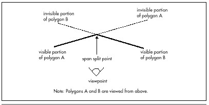
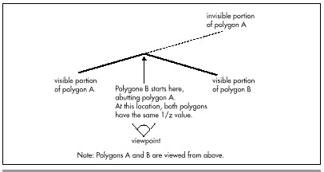

## Chapter 67 -- Sorted Spans in Action

### Implementing Independent Span Sorting for Rendering without Overdraw

In Chapter 66, we dove headlong into the intricacies of hidden surface
removal by way of z-sorted (actually, 1/z-sorted) spans. At the end of
that chapter, I noted that we were currently using 1/z-sorted spans in
Quake, but it was unclear whether we'd switch back to BSP order. Well,
some time after that writing, it's become clear: We're back to sorting
spans by BSP order.

In Robert A. Heinlein's wonderful story "The Man Who Sold the Moon," the
chief engineer of the Moon rocket project tries to figure out how to get
a payload of three astronauts to the Moon and back. He starts out with a
four-stage rocket design, but finds that it won't do the job, so he adds
a fifth stage. The fifth stage helps, but not quite enough, "Because,"
he explains, "I've had to add in too much dead weight, that's why." (The
dead weight is the control and safety equipment that goes with the fifth
stage.) He then tries adding yet another stage, only to find that the
sixth stage actually results in a net slowdown. In the end, he has to
give up on the three-person design and build a one-person spacecraft
instead.

1/z-sorted spans in Quake turned out pretty much the same way, as we'll
see in a moment. First, though, I'd like to note up front that this
chapter is very technical and builds heavily on material I covered
earlier in this section of the book; if you haven't already read
Chapters 59 through 66, you really should. Make no mistake about it,
this is commercial-quality stuff; in fact, the code in this chapter uses
the same sorting technique as the test version of Quake, QTEST1.ZIP,
that id Software placed on the Internet in early March 1996. This
material is the Real McCoy, true reports from the leading edge, and I
trust that you'll be patient if careful rereading and some occasional
catch-up reading of earlier chapters are required to absorb everything
contained herein. Besides, the ultimate reference for any design is
working code, which you'll find, in part, in Listing 67.1, and in its
entirety in the file DDJZSORT.ZIP on the CD-ROM.

### Quake and Sorted Spans

As you'll recall from Chapter 66, Quake uses sorted spans to get zero
overdraw while rendering the world, thereby both improving overall
performance and leveling frame rates by speeding up scenes that would
otherwise experience heavy overdraw. Our original design used spans
sorted by BSP order; because we traverse the world BSP tree from
front-to-back relative to the viewpoint, the order in which BSP nodes
are visited is a guaranteed front-to-back sorting order. We simply gave
each node an increasing BSP sequence number as it was visited, set each
polygon's sort key to the BSP sequence number of the node (BSP splitting
plane) it lay on, and used those sort keys when generating spans.

(In a change from earlier designs, polygons now are stored on nodes,
rather than leaves, which are the convex subspaces carved out by the BSP
tree. Visits to potentially visible leaves are used only to mark that
the polygons that touch those leaves are visible and need to be drawn,
and each marked-visible polygon is then drawn after everything in front
of its node has been drawn. This results in less BSP splitting of
polygons, which is A Good Thing, as explained below.)

This worked flawlessly for the world, but had a couple of downsides.
First, it didn't address the issue of sorting small, moving BSP models
such as doors; those models could be clipped into the world BSP tree's
leaves and assigned sort keys corresponding to the leaves into which
they fell, but there was still the question of how to sort multiple BSP
models in the same world leaf against each other. Second, strict BSP
order requires that polygons be split so that every polygon falls
entirely within a single leaf. This can be stretched by putting polygons
on nodes, allowing for larger polygons on average, but even then,
polygons still need to be split so that every polygon falls within the
bounding volume for the node on which it lies. The end result, in either
case, is more and smaller polygons than if BSP order weren't used—and
that, in turn, means lower performance, because more polygons must be
clipped, transformed, and projected, more sorting must be done, and more
spans must be drawn.

We figured that if only we could avoid those BSP splits, Quake would get
a lot faster. Accordingly, we switched from sorting on BSP order to
sorting on 1/z, and left our polygons unsplit. Things did get faster at
first, but not as much as we had expected, for two reasons.

First, as the world BSP tree is descended, we clip each node's bounding
box in turn to see if it's inside or outside each plane of the view
frustum. The clipping results can be remembered, and often allow the
avoidance of some or all clipping for the node's polygons. For example,
all polygons in a node that has a trivially accepted bounding box are
likewise guaranteed to be unclipped and in the frustum, since they all
lie within the node's volume and need no further clipping. This
efficient clipping mechanism vanished as soon as we stepped out of BSP
order, because a polygon was no longer necessarily confined to its
node's volume.

Second, sorting on 1/z isn't as cheap as sorting on BSP order, because
floating-point calculations and comparisons are involved, rather than
integer compares. So Quake got faster but, like Heinlein's fifth rocket
stage, there was clear evidence of diminishing returns.

That wasn't the bad part; after all, even a small speed increase is A
Good Thing. The real problem was that our initial 1/z sorting proved to
be unreliable. We first ran into problems when two forward-facing
polygons started at a common edge, because it was hard to tell which one
was really in front (as discussed below), and we had to do additional
floating-point calculations to resolve these cases. This fixed the
problems for a while, but then odd cases started popping up where just
the right combination of polygon alignments caused new sorting errors.
We tinkered with those too, adding more code and incurring additional
slowdowns in the process. Finally, we had everything working smoothly
again, although by this point Quake was back to pretty much the same
speed it had been with BSP sorting.

And then yet another crop of sorting errors popped up.

We could have fixed those errors too; we'll take a quick look at how to
deal with such cases shortly. However, like the sixth rocket stage, the
fixes would have made Quake *slower* than it had been with BSP sorting.
So we gave up and went back to BSP order, and now the code is simpler
and sorting works reliably. It's too bad our experiment didn't work out,
but it wasn't wasted time because in trying what we did we learned quite
a bit. In particular, we learned that the information provided by a
simple, reliable world ordering mechanism, such as a BSP tree, can do
more good than is immediately apparent, in terms of both performance and
solid code.

Nonetheless, sorting on 1/z can be a valuable tool, used in the right
context; drawing a Quake world just doesn't happen to be such a case. In
fact, sorting on 1/z is how we're now handling the sorting of multiple
BSP models that lie within the same world leaf in Quake. In this case,
we don't have the option of using BSP order (because we're drawing
multiple independent trees), so we've set restrictions on the BSP models
to avoid running into the types of 1/z sorting errors we encountered
drawing the Quake world. Next, we'll look at another application in
which sorting on 1/z is quite useful, one where objects move freely
through space. As is so often the case in 3-D, there is no one "right"
technique, but rather a great many different techniques, each one handy
in the right situations. Often, a combination of techniques is
beneficial; for example, the combination in Quake of BSP sorting for the
world and 1/z sorting for BSP models in the same world leaf.

For the remainder of this chapter, I'm going to look at the three main
types of 1/z span sorting, then discuss a sample 3-D app built around
1/z span sorting.

### Types of 1/z Span Sorting

As a quick refresher: With 1/z span sorting, all the polygons in a scene
are treated as sets of screenspace pixel spans, and 1/z (where z is
distance from the viewpoint in viewspace, as measured along the
viewplane normal) is used to sort the spans so that the nearest span
overlapping each pixel is drawn. As I discussed in Chapter 66, in the
sample program we're actually going to do all our sorting with polygon
edges, which represent spans in an implicit form.

There are three types of 1/z span sorting, each requiring a different
implementation. In order of increasing speed and decreasing complexity,
they are: intersecting, abutting, and independent. (These are names of
my own devising; I haven't come across any standard nomenclature in the
literature.)

#### Intersecting Span Sorting

Intersecting span sorting occurs when polygons can interpenetrate. Thus,
two spans may cross such that part of each span is visible, in which
case the spans have to be split and drawn appropriately, as shown in
Figure 67.1.



Intersecting is the slowest and most complicated type of span sorting,
because it is necessary to compare 1/z values at two points in order to
detect interpenetration, and additional work must be done to split the
spans as necessary. Thus, although intersecting span sorting certainly
works, it's not the first choice for performance.

#### Abutting Span Sorting

Abutting span sorting occurs when polygons that are not part of a
continuous surface can butt up against one another, but don't
interpenetrate, as shown in Figure 67.2. This is the sorting used in
Quake, where objects like doors often abut walls and floors, and turns
out to be more complicated than you might think. The problem is that
when an abutting polygon starts on a given scan line, as with polygon B
in Figure 67.2, it starts at exactly the same 1/z value as the polygon
it abuts, in this case, polygon A, so additional sorting is needed when
these ties happen. Of course, the two-point sorting used for
intersecting polygons would work, but we'd like to find something
faster.

As it turns out, the additional sorting for abutting polygons is
actually quite simple; whichever polygon has a greater 1/z gradient with
respect to screen x (that is, whichever polygon is heading fastest
toward the viewer along the scan line) is the front one. The hard part
is identifying *when* ties—that is, abutting polygons—occur; due to
floating-point imprecision, as well as fixed-point edge-stepping
imprecision that can move an edge slightly on the screen, calculations
of 1/z from the combination of screen coordinates and 1/z gradients (as
discussed last time) can be slightly off, so most tie cases will show up
as near matches, not exact matches. This imprecision makes it necessary
to perform two comparisons, one with an adjust-up by a small epsilon and
one with an adjust-down, creating a range in which near-matches are
considered matches. Fine-tuning this epsilon to catch all ties, without
falsely reporting close-but-not-abutting edges as ties, proved to be
troublesome in Quake, and the epsilon calculations and extra comparisons
slowed things down.



I do think that abutting 1/z span sorting could have been made reliable
enough for production use in Quake, were it not that we share edges
between adjacent polygons in Quake, so that the world is a large polygon
mesh. When a polygon ends and is followed by an adjacent polygon that
shares the edge that just ended, we simply assume that the adjacent
polygon sorts relative to other active polygons in the same place as the
one that ended (because the mesh is continuous and there's no
interpenetration), rather than doing a 1/z sort from scratch. This
speeds things up by saving a lot of sorting, but it means that if there
is a sorting error, a whole string of adjacent polygons can be sorted
incorrectly, pulled in by the one missorted polygon. Missorting is a
very real hazard when a polygon is very nearly perpendicular to the
screen, so that the 1/z calculations push the limits of numeric
precision, especially in single-precision floating point.

Many caching schemes are possible with abutting span sorting, because
any given pair of polygons, being noninterpenetrating, will sort in the
same order throughout a scene. However, in Quake at least, the benefits
of caching sort results were outweighed by the additional overhead of
maintaining the caching information, and every caching variant we tried
actually slowed Quake down.

#### Independent Span Sorting

Finally, we come to independent span sorting, the simplest and fastest
of the three, and the type the sample code in Listing 67.1 uses. Here,
polygons never intersect or touch any other polygons except adjacent
polygons with which they form a continuous mesh. This means that when a
polygon starts on a scan line, a single 1/z comparison between that
polygon and the polygons it overlaps on the screen is guaranteed to
produce correct sorting, with no extra calculations or tricky cases to
worry about.

Independent span sorting is ideal for scenes with lots of moving objects
that never actually touch each other, such as a space battle. Next,
we'll look at an implementation of independent 1/z span sorting.

### 1/z Span Sorting in Action

Listing 67.1 is a portion of a program that demonstrates independent 1/z
span sorting. This program is based on the sample 3-D clipping program
from Chapter 65; however, the earlier program did hidden surface removal
(HSR) by simply z-sorting whole objects and drawing them back-to-front,
while Listing 67.1 draws all polygons by way of a 1/z-sorted edge list.
Consequently, where the earlier program worked only so long as object
centers correctly described sorting order, Listing 67.1 works properly
for all combinations of non-intersecting and non-abutting polygons. In
particular, Listing 67.1 correctly handles concave polyhedra; a new
L-shaped object (the data for which is not included in Listing 67.1) has
been added to the sample program to illustrate this capability. The
ability to handle complex shapes makes Listing 67.1 vastly more useful
for real-world applications than the 3-D clipping demo from Chapter 65.

**Listing 67.1 L67\_1.C**

```c
// Part of Win32 program to demonstrate z-sorted spans. Whitespace
// removed for space reasons. Full source code, with whitespace,
// available from ftp.idsoftware.com/mikeab/ddjzsort.zip.

#define MAX_SPANS           10000
#define MAX_SURFS           1000
#define MAX_EDGES           5000

typedef struct surf_s {
    struct surf_s   *pnext, *pprev;
    int             color, visxstart, state;
    double          zinv00, zinvstepx, zinvstepy;
} surf_t;

typedef struct edge_s {
    int             x, xstep, leading;
    surf_t          *psurf;
    struct edge_s   *pnext, *pprev, *pnextremove;
} edge_t;

// Span, edge, and surface lists
span_t  spans[MAX_SPANS];
edge_t  edges[MAX_EDGES];
surf_t  surfs[MAX_SURFS];

// Bucket list of new edges to add on each scan line
edge_t  newedges[MAX_SCREEN_HEIGHT];

// Bucket list of edges to remove on each scan line
edge_t  *removeedges[MAX_SCREEN_HEIGHT];

// Head and tail for the active edge list
edge_t  edgehead, edgetail;

// Edge used as sentinel of new edge lists
edge_t  maxedge = {0x7FFFFFFF};

// Head/tail/sentinel/background surface of active surface stack
surf_t  surfstack;

// pointers to next available surface and edge
surf_t  *pavailsurf;
edge_t  *pavailedge;


// Returns true if polygon faces the viewpoint, assuming a clockwise
// winding of vertices as seen from the front.
int PolyFacesViewer(polygon_t *ppoly, plane_t *pplane)
{
    int     i;
    point_t viewvec;

    for (i=0 ; i<3 ; i++)
        viewvec.v[i] = ppoly->verts[0].v[i] - currentpos.v[i];
    // Use an epsilon here so we don't get polygons tilted so
    // sharply that the gradients are unusable or invalid
    if (DotProduct (&viewvec, &pplane->normal) < -0.01)
        return 1;
    return 0;
}


// Add the polygon's edges to the global edge table.
void AddPolygonEdges (plane_t *plane, polygon2D_t *screenpoly)
{
    double  distinv, deltax, deltay, slope;
    int     i, nextvert, numverts, temp, topy, bottomy, height;
    edge_t  *pedge;

    numverts = screenpoly->numverts;

    // Clamp the polygon's vertices just in case some very near
    // points have wandered out of range due to floating-point
    // imprecision
    for (i=0 ; i<numverts ; i++) {
        if (screenpoly->verts[i].x < -0.5)
            screenpoly->verts[i].x = -0.5;
        if (screenpoly->verts[i].x > ((double)DIBWidth - 0.5))
            screenpoly->verts[i].x = (double)DIBWidth - 0.5;
        if (screenpoly->verts[i].y < -0.5)
            screenpoly->verts[i].y = -0.5;
        if (screenpoly->verts[i].y > ((double)DIBHeight - 0.5))
            screenpoly->verts[i].y = (double)DIBHeight - 0.5;
    }

    // Add each edge in turn
    for (i=0 ; i<numverts ; i++) {
        nextvert = i + 1;
        if (nextvert >= numverts)
            nextvert = 0;
        topy = (int)ceil(screenpoly->verts[i].y);
        bottomy = (int)ceil(screenpoly->verts[nextvert].y);
        height = bottomy - topy;
        if (height == 0)
            continue;       // doesn't cross any scan lines
        if (height < 0) {
            // Leading edge
            temp = topy;
            topy = bottomy;
            bottomy = temp;
            pavailedge->leading = 1;
            deltax = screenpoly->verts[i].x -
                     screenpoly->verts[nextvert].x;
            deltay = screenpoly->verts[i].y -
                     screenpoly->verts[nextvert].y;
            slope = deltax / deltay;
            // Edge coordinates are in 16.16 fixed point
            pavailedge->xstep = (int)(slope * (float)0x10000);
            pavailedge->x = (int)((screenpoly->verts[nextvert].x +
                ((float)topy - screenpoly->verts[nextvert].y) *
                slope) * (float)0x10000);
        } else {
            // Trailing edge
            pavailedge->leading = 0;
            deltax = screenpoly->verts[nextvert].x -
                     screenpoly->verts[i].x;
            deltay = screenpoly->verts[nextvert].y -
                     screenpoly->verts[i].y;
            slope = deltax / deltay;
            // Edge coordinates are in 16.16 fixed point
            pavailedge->xstep = (int)(slope * (float)0x10000);
            pavailedge->x = (int)((screenpoly->verts[i].x +
                ((float)topy - screenpoly->verts[i].y) * slope) *
                (float)0x10000);
        }

        // Put the edge on the list to be added on top scan
        pedge = &newedges[topy];
        while (pedge->pnext->x < pavailedge->x)
            pedge = pedge->pnext;
        pavailedge->pnext = pedge->pnext;
        pedge->pnext = pavailedge;

        // Put the edge on the list to be removed after final scan
        pavailedge->pnextremove = removeedges[bottomy - 1];
        removeedges[bottomy - 1] = pavailedge;

        // Associate the edge with the surface we'll create for
        // this polygon
        pavailedge->psurf = pavailsurf;

        // Make sure we don't overflow the edge array
        if (pavailedge < &edges[MAX_EDGES])
            pavailedge++;
    }

    // Create the surface, so we'll know how to sort and draw from
    // the edges
    pavailsurf->state = 0;
    pavailsurf->color = currentcolor;

    // Set up the 1/z gradients from the polygon, calculating the
    // base value at screen coordinate 0,0 so we can use screen
    // coordinates directly when calculating 1/z from the gradients
    distinv = 1.0 / plane->distance;
    pavailsurf->zinvstepx = plane->normal.v[0] * distinv *
            maxscreenscaleinv * (fieldofview / 2.0);
    pavailsurf->zinvstepy = -plane->normal.v[1] * distinv *
            maxscreenscaleinv * (fieldofview / 2.0);
    pavailsurf->zinv00 = plane->normal.v[2] * distinv -
            xcenter * pavailsurf->zinvstepx -
            ycenter * pavailsurf->zinvstepy;

    // Make sure we don't overflow the surface array
    if (pavailsurf < &surfs[MAX_SURFS])
        pavailsurf++;
}


// Scan all the edges in the global edge table into spans.
void ScanEdges (void)
{
    int     x, y;
    double  fx, fy, zinv, zinv2;
    edge_t  *pedge, *pedge2, *ptemp;
    span_t  *pspan;
    surf_t  *psurf, *psurf2;

    pspan = spans;

    // Set up the active edge list as initially empty, containing
    // only the sentinels (which are also the background fill). Most
    // of these fields could be set up just once at start-up
    edgehead.pnext = &edgetail;
    edgehead.pprev = NULL;
    edgehead.x = -0xFFFF;           // left edge of screen
    edgehead.leading = 1;
    edgehead.psurf = &surfstack;
    edgetail.pnext = NULL;          // mark edge of list
    edgetail.pprev = &edgehead;
    edgetail.x = DIBWidth << 16;    // right edge of screen
    edgetail.leading = 0;
    edgetail.psurf = &surfstack;

    // The background surface is the entire stack initially, and
    // is infinitely far away, so everything sorts in front of it.
    // This could be set just once at start-up
    surfstack.pnext = surfstack.pprev = &surfstack;
    surfstack.color = 0;
    surfstack.zinv00 = -999999.0;
    surfstack.zinvstepx = surfstack.zinvstepy = 0.0;
    for (y=0 ; y<DIBHeight ; y++) {
        fy = (double)y;
        // Sort in any edges that start on this scan
        pedge = newedges[y].pnext;
        pedge2 = &edgehead;
        while (pedge != &maxedge) {
            while (pedge->x > pedge2->pnext->x)
                pedge2 = pedge2->pnext;
            ptemp = pedge->pnext;
            pedge->pnext = pedge2->pnext;
            pedge->pprev = pedge2;
            pedge2->pnext->pprev = pedge;
            pedge2->pnext = pedge;
            pedge2 = pedge;
            pedge = ptemp;
        }

        // Scan out the active edges into spans
        // Start out with the left background edge already inserted,
        // and the surface stack containing only the background
        surfstack.state = 1;
        surfstack.visxstart = 0;
        for (pedge=edgehead.pnext ; pedge ; pedge=pedge->pnext) {
            psurf = pedge->psurf;
            if (pedge->leading) {
                // It's a leading edge. Figure out where it is
                // relative to the current surfaces and insert in
                // the surface stack; if it's on top, emit the span
                // for the current top.
                // First, make sure the edges don't cross
                if (++psurf->state == 1) {
                    fx = (double)pedge->x * (1.0 / (double)0x10000);
                    // Calculate the surface's 1/z value at this pixel
                    zinv = psurf->zinv00 + psurf->zinvstepx * fx +
                            psurf->zinvstepy * fy;
                    // See if that makes it a new top surface
                    psurf2 = surfstack.pnext;
                    zinv2 = psurf2->zinv00 + psurf2->zinvstepx * fx +
                            psurf2->zinvstepy * fy;
                    if (zinv >= zinv2) {
                        // It's a new top surface
                        // emit the span for the current top
                        x = (pedge->x + 0xFFFF) >> 16;
                        pspan->count = x - psurf2->visxstart;
                        if (pspan->count > 0) {
                            pspan->y = y;
                            pspan->x = psurf2->visxstart;
                            pspan->color = psurf2->color;
                            // Make sure we don't overflow
                            // the span array
                            if (pspan < &spans[MAX_SPANS])
                                pspan++;
                        }
                        psurf->visxstart = x;
                        // Add the edge to the stack
                        psurf->pnext = psurf2;
                        psurf2->pprev = psurf;
                        surfstack.pnext = psurf;
                        psurf->pprev = &surfstack;
                    } else {
                        // Not a new top; sort into the surface stack.
                        // Guaranteed to terminate due to sentinel
                        // background surface
                        do {
                            psurf2 = psurf2->pnext;
                            zinv2 = psurf2->zinv00 +
                                    psurf2->zinvstepx * fx +
                                    psurf2->zinvstepy * fy;
                        } while (zinv < zinv2);
                        // Insert the surface into the stack
                        psurf->pnext = psurf2;
                        psurf->pprev = psurf2->pprev;
                        psurf2->pprev->pnext = psurf;
                        psurf2->pprev = psurf;
                    }
                }
            } else {
                // It's a trailing edge; if this was the top surface,
                // emit the span and remove it.
                // First, make sure the edges didn't cross
                if (—psurf->state == 0) {
                    if (surfstack.pnext == psurf) {
                        // It's on top, emit the span
                        x = ((pedge->x + 0xFFFF) >> 16);
                        pspan->count = x - psurf->visxstart;
                        if (pspan->count > 0) {
                            pspan->y = y;
                            pspan->x = psurf->visxstart;
                            pspan->color = psurf->color;
                            // Make sure we don't overflow
                            // the span array
                            if (pspan < &spans[MAX_SPANS])
                                pspan++;
                        }
                        psurf->pnext->visxstart = x;
                    }
                    // Remove the surface from the stack
                    psurf->pnext->pprev = psurf->pprev;
                    psurf->pprev->pnext = psurf->pnext;
                }
            }
        }

        // Remove edges that are done
        pedge = removeedges[y];
        while (pedge) {
            pedge->pprev->pnext = pedge->pnext;
            pedge->pnext->pprev = pedge->pprev;
            pedge = pedge->pnextremove;
        }

        // Step the remaining edges one scan line, and re-sort
        for (pedge=edgehead.pnext ; pedge != &edgetail ; ) {
            ptemp = pedge->pnext;
            // Step the edge
            pedge->x += pedge->xstep;
            // Move the edge back to the proper sorted location,
            // if necessary
            while (pedge->x < pedge->pprev->x) {
                pedge2 = pedge->pprev;
                pedge2->pnext = pedge->pnext;
                pedge->pnext->pprev = pedge2;
                pedge2->pprev->pnext = pedge;
                pedge->pprev = pedge2->pprev;
                pedge->pnext = pedge2;
                pedge2->pprev = pedge;
            }
            pedge = ptemp;
        }
    }
    pspan->x = -1;  // mark the end of the list
}

// Draw all the spans that were scanned out.
void DrawSpans (void)
{
    span_t  *pspan;
    for (pspan=spans ; pspan->x != -1 ; pspan++)
        memset (pDIB + (DIBPitch * pspan->y) + pspan->x,
                pspan->color,
                pspan->count);
}


// Clear the lists of edges to add and remove on each scan line.
void ClearEdgeLists(void)
{
    int i;
    for (i=0 ; i<DIBHeight ; i++) {
        newedges[i].pnext = &maxedge;
        removeedges[i] = NULL;
    }
}

// Render the current state of the world to the screen.
void UpdateWorld()
{
    HPALETTE        holdpal;
    HDC             hdcScreen, hdcDIBSection;
    HBITMAP         holdbitmap;
    polygon2D_t     screenpoly;
    polygon_t       *ppoly, tpoly0, tpoly1, tpoly2;
    convexobject_t  *pobject;
    int             i, j, k;
    plane_t         plane;
    point_t         tnormal;

    UpdateViewPos();
    SetUpFrustum();
    ClearEdgeLists();
    pavailsurf = surfs;
    pavailedge = edges;

    // Draw all visible faces in all objects
    pobject = objecthead.pnext;
    while (pobject != &objecthead) {
        ppoly = pobject->ppoly;
        for (i=0 ; i<pobject->numpolys ; i++) {
            // Move the polygon relative to the object center
            tpoly0.numverts = ppoly[i].numverts;
            for (j=0 ; j<tpoly0.numverts ; j++) {
                for (k=0 ; k<3 ; k++)
                    tpoly0.verts[j].v[k] = ppoly[i].verts[j].v[k] +
                            pobject->center.v[k];
            }
            if (PolyFacesViewer(&tpoly0, &ppoly[i].plane)) {
                if (ClipToFrustum(&tpoly0, &tpoly1)) {
                    currentcolor = ppoly[i].color;
                    TransformPolygon (&tpoly1, &tpoly2);
                    ProjectPolygon (&tpoly2, &screenpoly);

                    // Move the polygon's plane into viewspace
                    // First move it into worldspace (object relative)
                    tnormal = ppoly[i].plane.normal;
                    plane.distance = ppoly[i].plane.distance +
                        DotProduct (&pobject->center, &tnormal);

                    // Now transform it into viewspace
                    // Determine the distance from the viewpont
                    plane.distance -=
                          DotProduct (&currentpos, &tnormal);

                    // Rotate the normal into view orientation
                    plane.normal.v[0] =
                            DotProduct (&tnormal, &vright);
                    plane.normal.v[1] =
                            DotProduct (&tnormal, &vup);
                    plane.normal.v[2] =
                            DotProduct (&tnormal, &vpn);
                    AddPolygonEdges (&plane, &screenpoly);
                }
            }
        }
        pobject = pobject->pnext;
    }
    ScanEdges ();
    DrawSpans ();

    // We've drawn the frame; copy it to the screen
    hdcScreen = GetDC(hwndOutput);
    holdpal = SelectPalette(hdcScreen, hpalDIB, FALSE);
    RealizePalette(hdcScreen);
    hdcDIBSection = CreateCompatibleDC(hdcScreen);
    holdbitmap = SelectObject(hdcDIBSection, hDIBSection);
    BitBlt(hdcScreen, 0, 0, DIBWidth, DIBHeight, hdcDIBSection,
           0, 0, SRCCOPY);
    SelectPalette(hdcScreen, holdpal, FALSE);
    ReleaseDC(hwndOutput, hdcScreen);
    SelectObject(hdcDIBSection, holdbitmap);
    DeleteDC(hdcDIBSection);
}
```

By the same token, Listing 67.1 is quite a bit more complicated than the
earlier code. The earlier code's HSR consisted of a z-sort of objects,
followed by the drawing of the objects in back-to-front order, one
polygon at a time. Apart from the simple object sorter, all that was
needed was backface culling and a polygon rasterizer.

Listing 67.1 replaces this simple pipeline with a three-stage HSR
process. After backface culling, the edges of each of the polygons in
the scene are added to the global edge list, by way of
`AddPolygonEdges()`. After all edges have been added, the edges are
turned into spans by `ScanEdges()`, with each pixel on the screen
being covered by one and only one span (that is, there's no overdraw).
Once all the spans have been generated, they're drawn by
`DrawSpans()`, and rasterization is complete.

There's nothing tricky about `AddPolygonEdges()`, and `DrawSpans()`,
as implemented in Listing 67.1, is very straightforward as well. In an
implementation that supported texture mapping, however, all the spans
wouldn't be put on one global span list and drawn at once, as is done in
Listing 67.1, because that would result in drawing spans from all the
surfaces in no particular order. (A surface is a drawing object that's
originally described by a polygon, but in `ScanEdges()` there is no
polygon in the classic sense of a set of vertices bounding an area, but
rather just a set of edges and a surface that describes how to draw the
spans outlined by those edges.) That would mean constantly skipping from
one texture to another, which in turn would hurt processor cache
coherency a great deal, and would also incur considerable overhead in
setting up gradient and perspective calculations each time a surface was
drawn. In Quake, we have a linked list of spans hanging off each
surface, and draw all the spans for one surface before moving on to the
next surface.

The core of Listing 67.1, and the most complex aspect of 1/z-sorted
spans, is `ScanEdges()`, where the global edge list is converted into
a set of spans describing the nearest surface at each pixel. This
process is actually pretty simple, though, if you think of it as
follows:

For each scan line, there is a set of active edges, which are those
edges that intersect the scan line. A good part of `ScanEdges()` is
dedicated to adding any edges that first appear on the current scan line
(scan lines are processed from the top scan line on the screen to the
bottom), removing edges that reach their bottom on the current scan
line, and x-sorting the active edges so that the active edges for the
next scan can be processed from left to right. All this is per-scan-line
maintenance, and is basically just linked list insertion, deletion, and
sorting.

The heart of the action is the loop in `ScanEdges()` that processes
the edges on the current scan line from left to right, generating spans
as needed. The best way to think of this loop is as a surface event
processor, where each edge is an event with an associated surface. Each
leading edge is an event marking the start of its surface on that scan
line; if the surface is nearer than the current nearest surface, then a
span ends for the nearest surface, and a span starts for the new
surface. Each trailing edge is an event marking the end of its surface;
if its surface is currently nearest, then a span ends for that surface,
and a span starts for the next-nearest surface (the surface with the
next-largest 1/z at the coordinate where the edge intersects the scan
line). One handy aspect of this event-oriented processing is that
leading and trailing edges do not need to be explicitly paired, because
they are implicitly paired by pointing to the same surface. This saves
the memory and time that would otherwise be needed to track edge pairs.

One more element is required in order for `ScanEdges()` to work
efficiently. Each time a leading or trailing edge occurs, it must be
determined whether its surface is nearest (at a larger 1/z value than
any currently active surface). In addition, for leading edges, the
currently topmost surface must be known, and for trailing edges, it may
be necessary to know the currently next-to-topmost surface. The easiest
way to accomplish this is with a *surface stack*; that is, a linked list
of all currently active surfaces, starting with the nearest surface and
progressing toward the farthest surface, which, as described below, is
always the background surface. (The operation of this sort of edge
event-based stack was described and illustrated in Chapter 66.) Each
leading edge causes its surface to be 1/z-sorted into the surface stack,
with a span emitted if necessary. Each trailing edge causes its surface
to be removed from the surface stack, again with a span emitted if
necessary. As you can see from Listing 67.1, it takes a fair bit of code
to implement this, but all that's really going on is a surface stack
driven by edge events.

#### Implementation Notes

Finally, a few notes on Listing 67.1. First, you'll notice that although
we clip all polygons to the view frustum in worldspace, we nonetheless
later clamp them to valid screen coordinates before adding them to the
edge list. This catches any cases where arithmetic imprecision results
in clipped polygon vertices that are a bit outside the frustum. I've
only found such imprecision to be significant at very small z distances,
so clamping would probably be unnecessary if there were a near clip
plane, and might not even be needed in Listing 67.1, because of the
slight nudge inward that we give the frustum planes, as described in
Chapter 65. However, my experience has consistently been that relying on
worldspace or viewspace clipping to produce valid screen coordinates 100
percent of the time leads to sporadic and hard-to-debug errors.

There is no separate routine to clear the background in Listing 67.1.
Instead, a special background surface at an effectively infinite
distance is added, so whenever no polygons are active the background
color is drawn. If desired, it's a simple matter to flag the background
surface and draw the background specially. For example, the background
could be drawn as a starfield or a cloudy sky.

The edge-processing code in Listing 67.1 is fully capable of handling
concave polygons as easily as convex polygons, and can handle an
arbitrary number of vertices per polygon, as well. One change is needed
for the latter case: Storage for the maximum number of vertices per
polygon must be allocated in the polygon structures. In a fully polished
implementation, vertices would be linked together or pointed to, and
would be dynamically allocated from a vertex pool, so each polygon
wouldn't have to contain enough space for the maximum possible number of
vertices.

Each surface has a field named `state`, which is incremented when a
leading edge for that surface is encountered, and decremented when a
trailing edge is reached. A surface is activated by a leading edge only
if `state` increments to 1, and is deactivated by a trailing edge only
if `state` decrements to 0. This is another guard against arithmetic
problems, in this case quantization during the conversion of vertex
coordinates from floating point to fixed point. Due to this conversion,
it is possible, although rare, for a polygon that is viewed nearly
edge-on to have a trailing edge that occurs slightly *before* the
corresponding leading edge, and the span-generation code will behave
badly if it tries to emit a span for a surface that hasn't yet started.
It would help performance if this sort of fix-up could be eliminated by
careful arithmetic, but I haven't yet found a way to do so for
1/z-sorted spans.

Lastly, as discussed in Chapter 66, Listing 67.1 uses the gradients for
1/z with respect to changes in screen x and y to calculate 1/z for
active surfaces each time a leading edge needs to be sorted into the
surface stack. The natural origin for gradient calculations is the
center of the screen, which is (x,y) coordinate (0,0) in viewspace.
However, when the gradients are calculated in `AddPolygonEdges()`, the
origin value is calculated at the upper-left corner of the screen. This
is done so that screen x and y coordinates can be used directly to
calculate 1/z, with no need to adjust the coordinates to be relative to
the center of the screen. Also, the screen gradients grow more extreme
as a polygon is viewed closer to edge-on. In order to keep the gradient
calculations from becoming meaningless or generating errors, a small
epsilon is applied to backface culling, so that polygons that are very
nearly edge-on are culled. This calculation would be more accurate if it
were based directly on the viewing angle, rather than on the dot product
of a viewing ray to the polygon with the polygon normal, but that would
require a square root, and in my experience the epsilon used in Listing
67.1 works fine.
