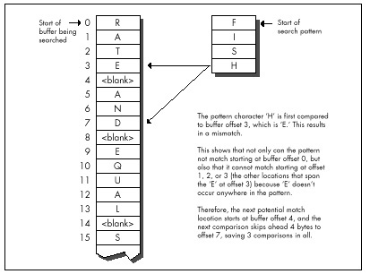
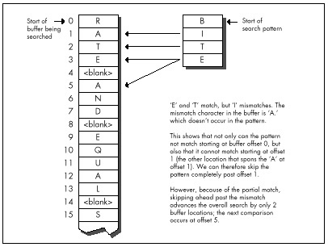
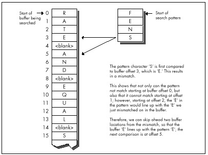

## Chapter 14 -- Boyer-Moore String Searching

### Optimizing a Pretty Optimum Search Algorithm

When you seem to be stumped, stop for a minute and *think.* All the
information you need may be right in front of your nose if you just look
at things a little differently. Here's a case in point:

When I was in college, I used to stay around campus for the summer. Oh,
I'd take a course or two, but mostly it was an excuse to hang out and
have fun. In that spirit, my girlfriend, Adrian (*not* my future wife,
partly for reasons that will soon become apparent), bussed in to spend a
week, sharing a less-than-elegant \$150 per month apartment with me and,
by necessity, my roommate.

Our apartment was pretty much standard issue for two male college
students; maybe even a cut above. The dishes were usually washed, there
was generally food in the refrigerator, and nothing larger than a small
dog had taken up permanent residence in the bathroom. However, there was
one sticking point (literally): the kitchen floor. This floor—standard
tile, with a nice pattern of black lines on an off-white background (or
so we thought)—had never been cleaned. By which I mean that I know for a
certainty that *we* had never cleaned it, but I suspect that it had in
fact not been cleaned since the Late Jurassic, or possibly earlier. Our
feet tended to stick to it; had the apartment suddenly turned
upside-down, I think we'd all have been hanging from the ceiling.

One day, my roommate and I returned from a pick-up basketball game.
Adrian, having been left to her own devices for a couple of hours, had
apparently kept herself busy. "Notice anything?" she asked, with an edge
to her voice that suggested we had damned well better.

"Uh, you cooked dinner?" I guessed. "Washed the dishes? Had your hair
done?" My roommate was equally without a clue.

She stamped her foot (really; the only time I've ever seen it happen),
and said, "No, you jerks! The kitchen floor! Look at the floor! I
cleaned it!"

The floor really did look amazing. It was actually all white; the black
lines had been grooves filled with dirt. We assured her that it looked
terrific, it just wasn't that obvious until you knew to look for it;
anyone would tell you that it wasn't the kind of thing that jumped out
at you, but it really was great, no kidding. We had almost smoothed
things over, when a friend walked in, looked around with a start, and
said, "Hey! Did you guys put in a new floor?"

As I said, sometimes everything you need to know is right in front of
your nose. Which brings us to Boyer-Moore string searching.

### String Searching Refresher

I've discussed string searching earlier in this book, in Chapters 5 and
9. You may want to refer back to these chapters for some background on
string searching in general. I'm also going to use some of the code from
that chapter as part of this chapter's test suite. For further
information, you may want to refer to the discussion of string searching
in the excellent *Algorithms in C,* by Robert Sedgewick
(Addison-Wesley), which served as the primary reference for this
chapter. (If you look at Sedgewick, be aware that in the Boyer-Moore
listing on page 288, there is a mistake: "j \> 0" in the `for` loop
should be "j \>= 0," unless I'm missing something.)

String searching is the simple matter of finding the first occurrence of
a particular sequence of bytes (the pattern) within another sequence of
bytes (the buffer). The obvious, brute-force approach is to try every
possible match location, starting at the beginning of the buffer and
advancing one position after each mismatch, until either a match is
found or the buffer is exhausted. There's even a nifty string
instruction, `REPZ CMPS`, that's perfect for comparing the pattern to
the contents of the buffer at each location. What could be simpler?

We have some important information that we're not yet using, though.
Typically, the buffer will contain a wide variety of bytes. Let's assume
that the buffer contains text, in which case there will be dozens of
different characters; and although the distribution of characters won't
usually be even, neither will any one character constitute half the
buffer, or anything close. A reasonable conclusion is that the first
character of the pattern will rarely match the first character of the
buffer location currently being checked. This allows us to use the
speedy `REPNZ SCASB` to whiz through the buffer, eliminating most
potential match locations with single repetitions of `SCASB`. Only
when that first character does (infrequently) match must we drop back to
the slower `REPZ CMPS` approach.

It's important to understand that we're assuming that the buffer is
typical text. That's what I meant at the outset, when I said that the
information you need may be under your nose.

> 
> Formally, you don't know a blessed thing about the search buffer, but
> experience, common sense, and your knowledge of the application give you
> a great deal of useful, if somewhat imprecise, information.

If the buffer contains the letter ‘A' repeated 1,000 times, followed by
the letter ‘B,' then the `REPNZ SCASB/REPZ CMPS` approach will be much
slower than the brute-force `REPZ CMPS` approach when searching for
the pattern "AB," because `REPNZ SCASB` would match at every buffer
location. You could construct a horrendous worst-case scenario for
almost any good optimization; the key is understanding the usual
conditions under which your code will work.

As discussed in Chapter 9, we also know that certain characters have
lower probabilities of matching than others. In a normal buffer, ‘T'
will match far more often than ‘X.' Therefore, if we use `REPNZ SCASB`
to scan for the least common letter in the search string, rather than
the first letter, we'll greatly decrease the number of times we have to
drop back to `REPZ CMPS`, and the search time will become very close
to the time it takes `REPNZ SCASB` to go from the start of the buffer
to the match location. If the distance to the first match is N bytes,
the least-common `REPNZ SCASB` approach will take about as long as N
repetitions of `REPNZ SCASB`.

At this point, we're pretty much searching at the speed of `REPNZ
SCASB`. On the x86, there simply is no faster way to test each
character in turn. In order to get any faster, we'd have to check fewer
characters—but we can't do that and still be sure of finding all
matches. Can we?

Actually, yes, we can.

### The Boyer-Moore Algorithm

All our *a priori* knowledge of string searching is stated above, but
there's another sort of knowledge—knowledge that's generated
dynamically. As we search through the buffer, we acquire information
each time we check for a match. One sort of information that we acquire
is based on partial matches; we can often skip ahead after partial
matches because (take a deep breath!) by partially matching, we have
already implicitly done a comparison of the partially matched buffer
characters with all possible pattern start locations that overlap those
partially-matched bytes.

If that makes your head hurt, it should—and don't worry. This line of
thinking, which is the basis of the Knuth-Morris-Pratt algorithm and
half the basis of the Boyer-Moore algorithm, is what gives Boyer-Moore
its reputation for inscrutability. That reputation is well deserved for
this aspect (which I will not discuss further in this book), but there's
another part of Boyer-Moore that's easily understood, easily
implemented, and highly effective.

Consider this: We're searching for the pattern "ABC," beginning the
search at the start (offset 0) of a buffer containing "ABZABC." We match
on ‘A,' we match on ‘B,' and we mismatch on ‘C'; the buffer contains a
‘Z' in this position. What have we learned? Why, we've learned not only
that the pattern doesn't match the buffer starting at offset 0, but also
that it can't possibly match starting at offset 1 or offset 2, either!
After all, there's a ‘Z' in the buffer at offset 2; since the pattern
doesn't contain a single ‘Z,' there's no way that the pattern can match
starting at *any* location from which it would span the ‘Z' at offset 2.
We can just skip straight from offset 0 to offset 3 and continue, saving
ourselves two comparisons.

Unfortunately, this approach only pays off big when a near-complete
partial match is found; if the comparison fails on the first pattern
character, as often happens, we can only skip ahead 1 byte, as usual.
Look at it differently, though: What if we compare the pattern starting
with the last (rightmost) byte, rather than the first (leftmost) byte?
In other words, what if we compare from high memory toward low, in the
direction in which string instructions go after the `STD` instruction?
After all, we're comparing one set of bytes (the pattern) to another set
of bytes (a portion of the buffer); it doesn't matter in the least in
what order we compare them, so long as all the bytes in one set are
compared to the corresponding bytes in the other set.

> 
> Why on earth would we want to start with the rightmost character?
> Because a mismatch on the rightmost character tells us a great deal more
> than a mismatch on the leftmost character.

We learn nothing new from a mismatch on the leftmost character, except
that the pattern can't match starting at that location. A mismatch on
the rightmost character, however, tells us about the possibilities of
the pattern matching starting at every buffer location from which the
pattern spans the mismatch location. If the mismatched character in the
buffer doesn't appear in the pattern, then we've just eliminated not one
potential match, but as many potential matches as there are characters
in the pattern; that's how many locations there are in the buffer that
*might* have matched, but have just been shown not to, because they
overlap the mismatched character that doesn't belong in the pattern. In
this case, we can skip ahead by the full pattern length in the buffer!
This is how we can outperform even `REPNZ SCASB; REPNZ SCASB` has to
check every byte in the buffer, but Boyer-Moore doesn't.

Figure 14.1 illustrates the operation of a Boyer-Moore search when the
rightcharacter of the search pattern (which is the first character
that's compared at each location because we're comparing backwards)
mismatches with a buffer character that appears nowhere in the pattern.
Figure 14.2 illustrates the operation of a partial match when the
mismatch occurs with a character that's not a pattern member. In this
case, we can only skip ahead past the mismatch location, resulting in an
advance of fewer bytes than the pattern length, and potentially as
little as the same single byte distance by which the standard search
approach advances.



What if the mismatch occurs with a buffer character that *does* occur in
the pattern? Then we can't skip past the mismatch location, but we can
skip to whatever location aligns the rightmost occurrence of that
character in the pattern with the mismatch location, as shown in Figure
14.3.

Basically, we exercise our right as members of a free society to compare
strings in whichever direction we choose, and we choose to do so right
to left, rather than the more intuitive left to right. Whenever we find
a mismatch, we see what we can learn from the buffer character that
failed to match the pattern. Imagine that we move the pattern to the
right across the mismatch location until we find a start location that
the mismatch does not eliminate as a possible match for the pattern. If
the mismatch character doesn't appear in the pattern, the pattern can
move clear past the mismatch location. Otherwise, the pattern moves
until a matching pattern byte lies atop the mismatch. That's all there
is to it!



### Boyer-Moore: The Good and the Bad

The worst case for this version of Boyer-Moore is that the pattern
mismatches on the leftmost character—the last character compared—every
time. Again, not very likely, but it is true that this version of
Boyer-Moore performs better as there are fewer and shorter partial
matches; ideally, the rightmost character would never match until the
full match location was reached. Longer patterns, which make for longer
skips, help Boyer-Moore, as does a long distance to the match location,
which helps diffuse the overhead of building the table of distances to
skip ahead on all the possible mismatch values.



The best case for Boyer-Moore is good indeed: About N/M comparisons are
required, where N is the buffer length and M is the pattern length. This
reflects the ability of Boyer-Moore to skip ahead by a full pattern
length on a complete mismatch.

How fast *is* Boyer-Moore? Listing 14.1 is a C implementation of
Boyer-Moore searching; Listing 14.2 is a test-bed program that searches
up to the first 32K of a file for a pattern. Table 14.1 (all times
measured with Turbo Profiler on a 20 MHz cached 386, searching a
modified version of the text of this chapter) shows that this
implementation is generally much slower than `REPNZ SCASB`, although
it does come close when searching for long patterns. Listing 14.1 is
designed primarily to make later assembly implemenmore comprehensible,
rather than faster; Sedge's implementation uses arrays rather than
pointers, is a great deal more compact and very clever, and may be
somewhat faster. Regardless, the far superior performance of `REPNZ
SCASB` clearly indicates that assembly language is in order at this
point.

|                                                                    | "g;"  | "Yogi" | "igoY" | "Adrian" | "Conclusion" | "You don't know what you know" |
|--------------------------------------------------------------------|-------|--------|--------|----------|--------------|--------------------------------|
| Searching approach                                                 | (16K) | (16K)  | (16K)  | (\<1K)   | (16K)        | (16K)                          |
| REPNZ SCASB on first char a (Listing 9.1)                          | 8.2   | 7.5    | 9.7    | 0.4      | 7.4          | 8.1                            |
| REPNZ SCASB on least common char (Listing 9.2)                     | 7.6   | 7.5    | 7.5    | 0.5      | 7.5          | 7.5                            |
| Boyer-Moore in C (Listing 14.1)                                    | 71.0  | 38.4   | 37.7   | 1.8      | 18.2         | 9.2                            |
| Standard Boyer-Moore in ASM (code not shown)                       | 38.5  | 21.0   | 20.5   | 0.8      | 9.4          | 4.8                            |
| Quick handling of first mismatch Boyer-Moore in ASM (Listing 14.3) | 14.1  | 8.9    | 7.7    | 0.4      | 4.0          | 2.0                            |
| \<=255 pattern length + sentinelBoyer-Moore in ASM (Listing 14.4)  | 8.1   | 5.2    | 4.6    | 0.3      | 2.6          | 1.2                            |

Table: Table 14.1 Comparison of searching techniques.

Search pattern (approximate distance searched before match is shown in
parentheses).\
 Times are in milliseconds; shorter is better.

The entry "Standard Boyer-Moore in ASM" in Table 14.1 refers to
straight-forward hand optimization of Listing 14.1, code that is not
included in this chapter for the perfectly good reason that it is slower
in most cases than `REPNZ SCASB`. I say this casually now, but not so
yesterday, when I had all but concluded that Boyer-Moore was simply
inferior on the x86, due to two architectural quirks: the string
instructions and slow branch. I had even coined a neat phrase for it:
Architecture is destiny. Has a nice ring, doesn't it?

**LISTING 14.1 L14-1.C**

```c
/* Searches a buffer for a specified pattern. In case of a mismatch,
   uses the value of the mismatched byte to skip across as many
   potential match locations as possible (partial Boyer-Moore).
   Returns start offset of first match searching forward, or NULL if
   no match is found.
   Tested with Borland C++ in C mode and the small model. */

#include <stdio.h>

unsigned char * FindString(unsigned char * BufferPtr,
   unsigned int BufferLength, unsigned char * PatternPtr,
   unsigned int PatternLength)
{
   unsigned char * WorkingPatternPtr, * WorkingBufferPtr;
   unsigned int CompCount, SkipTable[256], Skip, DistanceMatched;
   int i;

   /* Reject if the buffer is too small */
   if (BufferLength < PatternLength) return(NULL);

   /* Return an instant match if the pattern is 0-length */
   if (PatternLength == 0) return(BufferPtr);

   /* Create the table of distances by which to skip ahead on
      mismatches for every possible byte value */
   /* Initialize all skips to the pattern length; this is the skip
      distance for bytes that don't appear in the pattern */
   for (i = 0; i < 256; i++) SkipTable[i] = PatternLength;
   /*Set the skip values for the bytes that do appear in the pattern
     to the distance from the byte location to the end of the
     pattern. When there are multiple instances of the same byte,
     the rightmost instance's skip value is used. Note that the
     rightmost byte of the pattern isn't entered in the skip table;
     if we get that value for a mismatch, we know for sure that the
     right end of the pattern has already passed the mismatch
     location, so this is not a relevant byte for skipping purposes */
   for (i = 0; i < (PatternLength - 1); i++)
      SkipTable[PatternPtr[i]] = PatternLength - i - 1;

   /* Point to rightmost byte of the pattern */
   PatternPtr += PatternLength - 1;
   /* Point to last (rightmost) byte of the first potential pattern
      match location in the buffer */
   BufferPtr += PatternLength - 1;
   /* Count of number of potential pattern match locations in
      buffer */
   BufferLength -= PatternLength - 1;

   /* Search the buffer */
   while (1) {
      /* See if we have a match at this buffer location */
      WorkingPatternPtr = PatternPtr;
      WorkingBufferPtr = BufferPtr;
      CompCount = PatternLength;
      /* Compare the pattern and the buffer location, searching from
         high memory toward low (right to left) */
      while (*WorkingPatternPtr— == *WorkingBufferPtr—) {
         /* If we've matched the entire pattern, it's a match */
         if (-CompCount == 0)
           /* Return a pointer to the start of the match location */
            return(BufferPtr - PatternLength + 1);
      }
      /* It's a mismatch; let's see what we can learn from it */
      WorkingBufferPtr++;  /* point back to the mismatch location */
      /* # of bytes that did match */
      DistanceMatched = BufferPtr - WorkingBufferPtr;
      /*If, based on the mismatch character, we can't even skip ahead
            as far as where we started this particular comparison, then
            just advance by 1 to the next potential match; otherwise,
            skip ahead from the mismatch location by the skip distance
            for the mismatch character */
      if (SkipTable[*WorkingBufferPtr] <= DistanceMatched)
      Skip = 1;   /* skip doesn't do any good, advance by 1 */
      else
         /* Use skip value, accounting for distance covered by the
            partial match */
         Skip = SkipTable[*WorkingBufferPtr] - DistanceMatched;
      /* If skipping ahead would exhaust the buffer, we're done
         without a match */
      if (Skip >= BufferLength) return(NULL);
      /* Skip ahead and perform the next comparison */
      BufferLength -= Skip;
      BufferPtr += Skip;
   }
}
```

**LISTING 14.2 L14-2.C**

```c
/* Program to exercise buffer-search routines in Listings 14.1 & 14.3.
   (Must be modified to put copy of pattern as sentinel at end of the
   search buffer in order to be used with Listing 14.4.) */

#include <stdio.h>
#include <string.h>
#include <fcntl.h>

#define DISPLAY_LENGTH  40
#define BUFFER_SIZE     0x8000

extern unsigned char * FindString(unsigned char *, unsigned int,
   unsigned char *, unsigned int);
void main(void);

void main() {
   unsigned char TempBuffer[DISPLAY_LENGTH+1];
   unsigned char Filename[150], Pattern[150], *MatchPtr, *TestBuffer;
   int Handle;
   unsigned int WorkingLength;

   printf("File to search:");
   gets(Filename);
   printf("Pattern for which to search:");
   gets(Pattern);

   if ( (Handle = open(Filename, O_RDONLY | O_BINARY)) == -1 ) {
      printf("Can't open file: %s\n", Filename); exit(1);
   }
   /* Get memory in which to buffer the data */
   if ( (TestBuffer=(unsigned char *)malloc(BUFFER_SIZE+1)) == NULL) {
      printf("Can't get enough memory\n"); exit(1);
   }
   /* Process a BUFFER_SIZE chunk */
   if ( (int)(WorkingLength =
         read(Handle, TestBuffer, BUFFER_SIZE)) == -1 ) {
      printf("Error reading file %s\n", Filename); exit(1);
   }
   TestBuffer[WorkingLength] = 0; /* 0-terminate buffer for printf */
   /* Search for the pattern and report the results */
   if ((MatchPtr = FindString(TestBuffer, WorkingLength, Pattern,
         (unsigned int) strlen(Pattern))) == NULL) {
      /* Pattern wasn't found */
      printf("\"%s\" not found\n", Pattern);
   } else {
      /* Pattern was found. Zero-terminate TempBuffer; strncpy
         won't do it if DISPLAY_LENGTH characters are copied */
      TempBuffer[DISPLAY_LENGTH] = 0;
      printf("\"%s\" found. Next %d characters at match:\n\"%s\"\n",
            Pattern, DISPLAY_LENGTH,
            strncpy(TempBuffer, MatchPtr, DISPLAY_LENGTH));
   }
   exit(0);
}
```

Well, architecture carries a lot of weight, but it sure as heck isn't
destiny. I had simply fallen into the trap of figuring that the
algorithm was so clever that I didn't have to do any thinking myself.
The path leading to `REPNZ SCASB` from the original brute-force
approach of `REPZ CMPSB` at every location had been based on my
observation that the first character comparison at each buffer location
usually fails. Why not apply the same concept to Boyer-Moore? Listing
14.3 is just like the standard implementation—except that it's optimized
to handle a first-comparison mismatch as quickly as possible in the loop
at `QuickSearchLoop`, much as `REPNZ SCASB` optimizes
first-comparison mismatches for the brute-force approach. The results in
Table 14.1 speak for themselves; Listing 14.3 is more than twice as fast
as what I assure you was already a nice, tight assembly implementation
(and unrolling `QuickSearchLoop` could boost performance by up to 10
percent more). Listing 14.3 is also *four times* faster than `REPNZ
SCASB` in one case.

**LISTING 14.3 L14-3.ASM**

```nasm
; Searches a buffer for a specified pattern. In case of a mismatch,
; uses the value of the mismatched byte to skip across as many
; potential match locations as possible (partial Boyer-Moore).
; Returns start offset of first match searching forward, or NULL if
; no match is found.
; Tested with TASM.
; C near-callable as:
;       unsigned char * FindString(unsigned char * BufferPtr,
;          unsigned int BufferLength, unsigned char * PatternPtr,
;          unsigned int PatternLength);

parms   struc
        dw      2 dup(?)   ;pushed BP & return address
BufferPtr dw    ?          ;pointer to buffer to be searched
BufferLength dw ?          ;# of bytes in buffer to be searched
PatternPtr dw   ?          ;pointer to pattern for which to search
PatternLength dw ?         ;length of pattern for which to search
parms   ends

        .model small
        .code
        public _FindString
_FindString     proc    near
        cld
        push    bp         ;preserve caller's stack frame
        mov     bp,sp      ;point to our stack frame
        push    si         ;preserve caller's register variables
        push    di
        sub     sp,256*2   ;allocate space for SkipTable
; Create the table of distances by which to skip ahead on mismatches
; for every possible byte value. First, initialize all skips to the
; pattern length; this is the skip distance for bytes that don't
; appear in the pattern.
        mov     ax,[bp+PatternLength]
        and     ax,ax      ;return an instant match if the pattern is
        jz      InstantMatch ;0-length
        mov     di,ds
        mov     es,di      ;ES=DS=SS
        mov     di,sp      ;point to SkipBuffer
        mov     cx,256
        rep     stosw
        dec     ax                      ;from now on, we only need
        mov     [bp+PatternLength],ax   ; PatternLength - 1
; Point to last (rightmost) byte of first potential pattern match
; location in buffer.
        add     [bp+BufferPtr],ax
; Reject if buffer is too small, and set the count of the number of
; potential pattern match locations in the buffer.
        sub     [bp+BufferLength],ax
        jbe     NoMatch
; Set the skip values for the bytes that do appear in the pattern to
; the distance from the byte location to the end of the pattern.
; When there are multiple instances of the same byte, the rightmost
; instance's skip value is used. Note that the rightmost byte of the
; pattern isn't entered in the skip table; if we get that value for
; a mismatch, we know for sure that the right end of the pattern has
; already passed the mismatch location, so this is not a relevant byte
; for skipping purposes.
        mov     si,[bp+PatternPtr] ;point to start of pattern
        and     ax,ax              ;are there any skips to set?
        jz      SetSkipDone        ;no
        mov     di,sp              ;point to SkipBuffer
SetSkipLoop:
        sub     bx,bx      ;prepare for word addressing off byte value
        mov     bl,[si]    ;get the next pattern byte
        inc     si         ;advance the pattern pointer
        shl     bx,1       ;prepare for word lookup
        mov     [di+bx],ax ;set the skip value when this byte value is
                           ; the mismatch value in the buffer
        dec     ax
        jnz     SetSkipLoop
SetSkipDone:
        mov     dl,[si]            ;DL=rightmost pattern byte from now on
        dec     si                 ;point to next-to-rightmost byte of pattern
        mov     [bp+PatternPtr],si ; from now on
; Search the buffer.
        std                        ;for backward REPZ CMPSB
        mov     di,[bp+BufferPtr]  ;point to first search location
        mov     cx,[bp+BufferLength]   ;# of match locations to check
SearchLoop:
        mov     si,sp                  ;point SI to SkipTable
; Skip through until there's a match for the rightmost pattern byte.
QuickSearchLoop:
        mov     bl,[di]         ;rightmost buffer byte at this location
        cmp     dl,bl           ;does it match the rightmost pattern byte?
        jz      FullCompare     ;yes, so keep going
        sub     bh,bh           ;convert to a word
        add     bx,bx           ;prepare for look-up in SkipTable
        mov     ax,[si+bx]      ;get skip value from skip table for this
                                ; mismatch value
        add     di,ax           ;BufferPtr += Skip;
        sub     cx,ax           ;BufferLength -= Skip;
        ja      QuickSearchLoop ;continue if any buffer left
        jmp     short NoMatch
; Return a pointer to the start of the buffer (for 0-length pattern).
        align   2
InstantMatch:
        mov     ax,[bp+BufferPtr]
        jmp     short Done
; Compare the pattern and the buffer location, searching from high
; memory toward low (right to left).
        align   2
FullCompare:
        mov     [bp+BufferPtr],di       ;save the current state of
        mov     [bp+BufferLength],cx    ; the search
        mov     cx,[bp+PatternLength]   ;# of bytes yet to compare
        jcxz    Match                   ;done if only one character
        mov     si,[bp+PatternPtr]      ;point to next-to-rightmost bytes
        dec     di                      ; of buffer location and pattern
        repz    cmpsb                   ;compare the rest of the pattern
        jz      Match                   ;that's it; we've found a match
; It's a mismatch; let's see what we can learn from it.
        inc     di      ;compensate for 1-byte overrun of REPZ CMPSB;
                        ; point to mismatch location in buffer
; # of bytes that did match.
        mov     si,[bp+BufferPtr]
        sub     si,di
; If, based on the mismatch character, we can't even skip ahead as far
; as where we started this particular comparison, then just advance by
; 1 to the next potential match; otherwise, skip ahead from this
; comparison location by the skip distance for the mismatch character,
; less the distance covered by the partial match.
        sub     bx,bx     ;prepare for word addressing off byte value
        mov     bl,[di]   ;get the value of the mismatch byte in buffer
        add     bx,bx     ;prepare for word look-up
        add     bx,sp     ;SP points to SkipTable
        mov     cx,[bx]   ;get the skip value for this mismatch
        mov     ax,1      ;assume we'll just advance to the next
                          ; potential match location
        sub     cx,si     ;is the skip far enough to be worth taking?
        jna     MoveAhead ;no, go with the default advance of 1
        mov     ax,cx     ;yes; this is the distance to skip ahead from
                          ; the last potential match location checked
MoveAhead:
; Skip ahead and perform the next comparison, if there's any buffer
; left to check.
        mov     di,[bp+BufferPtr]
        add     di,ax                   ;BufferPtr += Skip;
        mov     cx,[bp+BufferLength]
        sub     cx,ax                   ;BufferLength -= Skip;
        ja      SearchLoop              ;continue if any buffer left
; Return a NULL pointer for no match.
        align   2
NoMatch:
        sub     ax,ax
        jmp     short Done
; Return start of match in buffer (BufferPtr - (PatternLength - 1)).
        align   2
Match:
        mov     ax,[bp+BufferPtr]
        sub     ax,[bp+PatternLength]
Done:
        cld              ;restore default direction flag
        add     sp,256*2 ;deallocate space for SkipTable
        pop     di       ;restore caller's register variables
        pop     si
        pop     bp       ;restore caller's stack frame
        ret
_FindString     endp
        end
```

Table 14.1 represents a limited and decidedly unscientific comparison of
searching techniques. Nonetheless, the overall trend is clear: For all
but the shortest patterns, well-implemented Boyer-Moore is generally as
good as or better than—sometimes *much* better than—brute-force
searching. (For short patterns, you might want to use `REPNZ SCASB`,
thereby getting the best of both worlds.)

Know your data and use your smarts. Don't stop thinking just because
you're implementing a big-name algorithm; you know more than it does.

### Further Optimization of Boyer-Moore

We can do substantially better yet than Listing 14.3 if we're willing to
accept tighter limits on the data. Limiting the length of the
searched-for pattern to a maximum of 255 bytes allows us to use the
`XLAT` instruction and generally tighten the critical loop. (Be aware,
however, that `XLAT` is a relatively expensive instruction on the 486
and Pentium.) Putting a copy of the searched-for string at the end of
the search buffer as a sentinel, so that the search never fails, frees
us from counting down the buffer length, and makes it easy to unroll the
critical loop. Listing 14.4, which implements these optimizations, is
about 60 percent faster than Listing 14.3.

**LISTING 14.4 L14-4.ASM**

```nasm
; Searches a buffer for a specified pattern. In case of a mismatch,
; uses the value of the mismatched byte to skip across as many
; potential match locations as possible (partial Boyer-Moore).
; Returns start offset of first match searching forward, or NULL if
; no match is found.
; Requires that the pattern be no longer than 255 bytes, and that
; there be a match for the pattern somewhere in the buffer (ie., a
; copy of the pattern should be placed as a sentinel at the end of
; the buffer if the pattern isn't already known to be in the buffer).
; Tested with TASM.
; C near-callable as:
; unsigned char * FindString(unsigned char * BufferPtr,
; unsigned int BufferLength, unsigned char * PatternPtr,
; unsigned int PatternLength);

parms   struc
        dw      2 dup(?)    ;pushed BP & return address
BufferPtr dw    ?           ;pointer to buffer to be searched
BufferLength dw ?           ;# of bytes in buffer to be searched
                            ; (not used, actually)
PatternPtr dw   ?           ;pointer to pattern for which to search
                            ; (pattern *MUST* exist in the buffer)
PatternLength dw ?          ;length of pattern for which to search (must
                            ; be <= 255)
parms   ends

        .model small
        .code
        public _FindString
_FindString     proc    near
        cld
        push    bp          ;preserve caller's stack frame
        mov     bp,sp       ;point to our stack frame
        push    si          ;preserve caller's register variables
        push    di
        sub     sp,256      ;allocate space for SkipTable
; Create the table of distances by which to skip ahead on mismatches
; for every possible byte value. First, initialize all skips to the
; pattern length; this is the skip distance for bytes that don't
; appear in the pattern.
        mov     di,ds
        mov     es,di        ;ES=DS=SS
        mov     di,sp        ;point to SkipBuffer
        mov     al,byte ptr [bp+PatternLength]
        and     al,al        ;return an instant match if the pattern is
        jz      InstantMatch ; 0-length
        mov     ah,al
        mov     cx,256/2
        rep     stosw
        mov     ax,[bp+PatternLength]
        dec     ax                       ;from now on, we only need
        mov     [bp+PatternLength],ax    ; PatternLength - 1
; Point to rightmost byte of first potential pattern match location
; in buffer.
        add     [bp+BufferPtr],ax
; Set the skip values for the bytes that do appear in the pattern to
; the distance from the byte location to the end of the pattern.
        mov     si,[bp+PatternPtr] ;point to start of pattern
        and     ax,ax       ;are there any skips to set?
        jz      SetSkipDone ;no
        mov     di,sp       ;point to SkipBuffer
        sub     bx,bx       ;prepare for word addressing off byte value
SetSkipLoop:
        mov     bl,[si]     ;get the next pattern byte
        inc     si          ;advance the pattern pointer
        mov     [di+bx],al  ;set the skip value when this byte value is
                            ;the mismatch value in the buffer
        dec     ax
        jnz     SetSkipLoop
SetSkipDone:
        mov     dl,[si]       ;DL=rightmost pattern byte from now on
        dec     si            ;point to next-to-rightmost byte of pattern
        mov     [bp+PatternPtr],si ; from now on
; Search the buffer.
        std                       ;for backward REPZ CMPSB
        mov     di,[bp+BufferPtr] ;point to the first search location
        mov     bx,sp             ;point to SkipTable for XLAT
SearchLoop:
        sub     ah,ah   ;used to convert AL to a word
; Skip through until there's a match for the first pattern byte.
QuickSearchLoop:
; See if we have a match at the first buffer location.
        REPT    8           ;unroll loop 8 times to reduce branching
        mov     al,[di]     ;next buffer byte
        cmp     dl,al       ;does it match the pattern?
        jz      FullCompare ;yes, so keep going
        xlat                ;no, look up the skip value for this mismatch
        add     di,ax       ;BufferPtr += Skip;
        ENDM
        jmp     QuickSearchLoop
; Return a pointer to the start of the buffer (for 0-length pattern).
        align   2
InstantMatch:
        mov     ax,[bp+BufferPtr]
        jmp     short Done
; Compare the pattern and the buffer location, searching from high
; memory toward low (right to left).
        align   2
FullCompare:
        mov     [bp+BufferPtr],di ;save the current buffer location
        mov     cx,[bp+PatternLength] ;# of bytes yet to compare
        jcxz    Match   ;done if there was only one character
        dec     di      ;point to next destination byte to compare (SI
                        ; points to next-to-rightmost source byte)
        repz    cmpsb   ;compare the rest of the pattern
        jz      Match   ;that's it; we've found a match
; It's a mismatch; let's see what we can learn from it.
        inc     di      ;compensate for 1-byte overrun of REPZ CMPSB;
                        ; point to mismatch location in buffer
; # of bytes that did match.
        mov     si,[bp+BufferPtr]
        sub     si,di
; If, based on the mismatch character, we can't even skip ahead as far
; as where we started this particular comparison, then just advance by
; 1 to the next potential match; otherwise, skip ahead from this
; comparison location by the skip distance for the mismatch character,
; less the distance covered by the partial match.
        mov     al,[di] ;get the value of the mismatch byte in buffer
        xlat               ;get the skip value for this mismatch
        mov     cx,1       ;assume we'll just advance to the next
                           ; potential match location
        sub     ax,si      ;is the skip far enough to be worth taking?
        jna     MoveAhead  ;no, go with the default advance of 1
        mov     cx,ax      ;yes, this is the distance to skip ahead from
                           ;the last potential match location checked
MoveAhead:
; Skip ahead and perform the next comparison.
        mov     di,[bp+BufferPtr]
        add     di,cx              ;BufferPtr += Skip;
        mov     si,[bp+PatternPtr] ;point to the next-to-rightmost
                                   ; pattern byte
        jmp     SearchLoop
; Return start of match in buffer (BufferPtr - (PatternLength - 1)).
        align   2
Match:
        mov     ax,[bp+BufferPtr]
        sub     ax,[bp+PatternLength]
Done:
        cld             ;restore default direction flag
        add     sp,256  ;deallocate space for SkipTable
        pop     di      ;restore caller's register variables
        pop     si
        pop     bp      ;restore caller's stack frame
        ret
_FindString     endp
        end
```

Note that Table 14.1 includes the time required to build the skip table
each time `FindString` is called. This time could be eliminated for
all but the first search when repeatedly searching for a particular
pattern, by building the skip table externally and passing a pointer to
it as a parameter.

### Know What You Know

Here we've turned up our nose at a repeated string instruction, we've
gone against the grain by comparing backward, and yet we've speeded up
our code quite a bit. All this without any restrictions or special
requirements (excluding Listing 14.4)—and without any new information.
Everything we needed was sitting there all along; we just needed to
think to look at it.

As Yogi Berra might put it, "You don't know what you know until you know
it."
