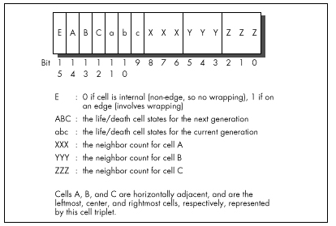

## Chapter 18 -- It's a plain Wonderful Life

### Optimization beyond the Pale

When I was in high school, my gym teacher had us run a race around the
soccer field, or rather, around a course marked with cones that roughly
outlined the shape of the field. I quickly settled into second place
behind Dwight Chamberlin. We cruised around the field, and when we came
to the far corner, Dwight cut across the corner, inside a cone placed
awkwardly far out from the others. I followed, and everyone else cut
inside the cone too—except the pear-shaped kid bringing up the rear, who
plodded his way around every single cone on his way to finishing about
half a lap behind. When the laggard finally crossed the finish line, the
coach named him the winner, to my considerable irritation. After all,
the object was to see who could run the fastest, wasn't it?

Actually, it wasn't. The object was to see who could run the fastest
according to the limitations placed upon the contest. This is a crucial
distinction, although usually taken for granted. Would it have been
legitimate if I had cut across the middle of the field? If I had ridden
a bike? If I had broken the world record for the 100 meters by dropping
100 meters from a plane? Competition has meaning only within a carefully
circumscribed arena.

Why am I telling you this? First, because it is a useful lesson for
programming.

> 
> All programming is performed within limitations, some of which can be
> bent or changed, but many of which cannot. You cannot change the maximum
> memory bandwidth of a VGA, or the maximum instruction execution rate of
> a 486. That is why the stunning 3D demos you see at SIGGRAPH have only
> passing relevance to everyday life on the desktop. A rule that Intel's
> chip designers cannot break is 8086 compatibility, much as I'm sure
> they'd like to, but of course the flip side is that although RISC chips
> are technically superior, they command but a small fraction of the
> market; raw performance is not the arena of competition. Similarly, you
> will often be unable to change the specifications for the software you
> implement.

### Breaking the Rules

The other reason for the anecdote has to do with the way my second
Optimization Challenge worked itself out. If you'll recall from the last
chapter, the challenge I made to the readers of *PC TECHNIQUES* was to
devise the fastest possible version of the Game of Life cellular
automata simulation game. I gave an example, laid out the rules, and
stood aside. Good thing, too. *Apres moi, le deluge....*

And when the dust had settled, I was left with the uneasy realization
that every submitted entry broke the rules. *Every single entry*. The
rules clearly stated that submitted code must produce *exactly the same
output* as my example implementation under all circumstances in order to
be eligible to win. I do not think that there can be any question about
what "exactly the same output" means. It means the same pixels, in the
same colors, at the same places on the screen at the same points in all
the Life simulations that the original code was capable of running.
Period. And not one of the entries met that standard. Some submitted
listings were more than 400 lines long. Some didn't display the
generation number at the right side of the screen, didn't draw the same
pixel colors, or didn't bother with magnification. Some had bugs. Some
didn't support all possible cellmap widths and heights up to 200x200,
requiring widths and heights that were specific multiples of a number of
cells that lent itself to a particular implementation.

This last mission is, in a way, a brilliant approach, as evidenced by
the fact that it yielded the two fastest submissions, but it is not
within the rules of the contest. Some of the rule-breaking was major,
some very minor, and some had nothing to do with the Life engine itself,
but the rules were clear; where was I to draw the line if not with exact
compliance? And I was fully prepared to draw that line rigorously,
disqualifying some mind-bending submissions in order to let lesser but
fully compliant entries win—until I realized that there *were* no fully
compliant entries.

Given which, I heaved a sigh of relief, threw away the rules, and picked
a winner in the true spirit of the contest: raw speed. Two winners, in
fact: Peter Klerings, a programmer for Turck GmbH in Munich, Germany,
whose entry just plain runs like a bat out of hell, and David Stafford
(who was also the winner of my first Optimization Challenge), of Borland
International, whose entry is slightly slower mainly because he didn't
optimize the drawing part of the program, in full accordance with the
contest rules, which specifically excluded drawing time from
consideration. Unfortunately, Peter's generation code and drawing code
are so tightly intertwined that it is impossible to separate them, and
hence not really possible to figure out whose generation engine is
faster. Anyway, at 180 to 200 generations per second, including drawing
time, for 200x200 cellmaps (and in the neighborhood of *1000* gps for
96x96 cellmaps, the size of my original implementation), they're the
fastest submissions I received. They're both more than an order of
magnitude faster than my final optimized C++ Life implementation shown
in Chapter 17, and more than 300 times faster than my original,
perfectly functional Life implementation. Not 300 percent—300 *times*.
Cell generations scud across the screen like clouds, and walkers shoot
out like bullets. Each is a worthy winner, and I feel confident that the
true objective of the challenge has been met: pure, breathtaking
*speed*.

Notwithstanding, *mea culpa*. The next time I lay a challenge, I will
define the rules with scrupulous care. Even so, this was much more than
just another cycle-counting contest. We're fortunate enough to be privy
to a startling demonstration of the power of the best optimizer anyone
has yet devised—you. (That's the general "you"; I realize that the
specific "you" may or may not be quite up to the optimizing level of the
specific "David Stafford" or "Peter Klerings.")

Onward to the code.

### Table-Driven Magic

David Stafford won my first Optimization Challenge by means of a huge
look-up table and an incredible state machine driven by that table. The
table didn't cause David's entry to exceed the line limit because
David's submission included code to generate the table on the fly as
part of the build process. David has done himself one better this time
with his QLIFE program; not only does his build process generate a 64K
table, but it also generates virtually all his code, consisting of
17,000-plus lines of assembly language spanning another 64K. What David
has done is write the equivalent of a bitblt compiler for the Game of
Life; one might in fact call it a Life compiler. What David's code
generates is still a general-purpose program; it takes arbitrary seed
values, and can run for an arbitrary number of generations, so it's not
as if David simply hardwired the instructions to draw each successive
screen. However, it's a general-purpose program that is exquisitely
tailored to the task it needs to perform.

All the pieces of QLIFE are shown in Listings 18.1 through 18.5, as
follows: Listing 18.1 is BUILD.BAT, the batch file used to build QLIFE;
Listing 18.2 is LCOMP.C, the program used to generate the assembler code
and data file QLIFE.ASM; Listing 18.3 is MAIN.C, the main program for
QLIFE; Listing 18.4 is VIDEO.C, the video-related functions, and Listing
18.5 is LIFE.H, the header file. The following sidebar contains David's
build instructions, exactly as he wrote them. I certainly won't have
room to discuss all the marvelous intricacies of David's code; I suggest
you look over these listings until you understand them thoroughly (it
took me a day to pick them apart) because there's a lot of neat stuff in
there, and it's an approach to performance programming that operates at
a more efficient, tightly integrated level than you may ever see again.
One hint: It helps a *lot* to build and run LCOMP.C, redirect its output
to QLIFE.ASM, and look at the assembly code in that file. This code is
the entirety of David's generation engine, and it's almost impossible to
visualize its operation without actually seeing it.

> How To Build Qlife
>
> QLIFE is written for Borland C++, but it shouldn't be too difficult to
> convert it to work with Microsoft C++. To build QLIFE, run the
> BUILD.BAT batch file with the size of the life grid on the command
> line (see below). The command-line options are:
>
> --------- -----------------------------------------------------------
> WIDTH 32  Sets the width of the life grid to 96 cells (divided by 3).
> HEIGHT 96 Sets the height of the life grid to 96 cells.              
> NOCOUNTER Turns off the generation counter (optional).               
> NODRAW    Turns off drawing of the cell map (optional).              
> GEN 1000  Calculates 1,000 generations (optional).                   
> --------- -----------------------------------------------------------
>
> These *must* be in uppercase. For example, the minimum you really need
> is "WIDTH 40 HEIGHT 120." I used "WIDTH 46 HEIGHT 138 NOCOUNTER NODRAW
> GEN 7000" during testing.
>
> If you have selected the GEN option, you will have to press a key to
> exit QLIFE when it is finished. This is so I could visually compare
> the result of N generations under QLIFE with N generations under
> Abrash's original life program. You should be aware that the program
> from the listing contains a small bug, which may make it appear that
> they do not generate identical results. The original program does not
> display a cell until it changes, so if a cell is alive on the first
> generation and never dies, then it will never be displayed. This bug
> is not present in QLIFE.
>
> You should have no trouble running QLIFE with cell grids up to
> 210x200.
>
> You *must* have a VGA and at least a 386 to run QLIFE. The 386
> features that it uses are not integral to the algorithm (they're a
> convenience for the code), so feel free to modify QLIFE to run on
> earlier CPUs if you wish. QLIFE works best if you have a large CPU
> cache (256K is recommended).
>
> —*David Stafford*

**LISTING 18.1 BUILD.BAT**

```bat
bcc -v -D%1=%2;%2=%3;%3=%4;%4=%5;%5=%6;%6=%7;%7=%8;%8 lcomp.c
lcomp > qlife.asm
tasmx /mx /kh30000 qlife
bcc -v -D%1=%2;%2=%3;%3=%4;%4=%5;%5=%6;%6=%7;%7=%8;%8 qlife.obj main.c video.c
```

**LISTING 18.2 LCOMP.C**

```c
// LCOMP.C
//
// Life compiler, ver 1.3
//
// David Stafford
//

#include <stdio.h>
#include <stdlib.h>
#include "life.h"

#define LIST_LIMIT (46 * 138)  // when we need to use es:

int Old, New, Edge, Label;
char Buf[ 20 ];

void Next1( void )
  {
  char *Seg = "";

  if( WIDTH * HEIGHT > LIST_LIMIT )  Seg = "es:";

  printf( "mov  bp,%s[si]\n", Seg );
  printf( "add  si,2\n" );
  printf( "mov  dh,[bp+1]\n" );
  printf( "and  dh,0FEh\n" );
  printf( "jmp  dx\n" );
  }

void Next2( void )
  {
  printf( "mov  bp,es:[si]\n" );
  printf( "add  si,2\n" );
  printf( "mov  dh,[bp+1]\n" );
  printf( "or   dh,1\n" );
  printf( "jmp  dx\n" );
  }

void BuildMaps( void )
  {
  unsigned short i, j, Size, x = 0, y, N1, N2, N3, C1, C2, C3;

  printf( "_DATA segment ‘DATA'\nalign 2\n" );
  printf( "public _CellMap\n" );
  printf( "_CellMap label word\n" );

  for( j = 0; j < HEIGHT; j++ )
    {
    for( i = 0; i < WIDTH; i++ )
      {
      if( i == 0 || i == WIDTH-1 || j == 0 || j == HEIGHT-1 )
        {
        printf( "dw 8000h\n" );
        }
      else
        {
        printf( "dw 0\n" );
        }
      }
    }

  printf( "ChangeCell dw 0\n" );
  printf( "_RowColMap label word\n" );

  for( j = 0; j < HEIGHT; j++ )
    {
    for( i = 0; i < WIDTH; i++ )
      {
      printf( "dw 0%02x%02xh\n", j, i * 3 );
      }
    }

  if( WIDTH * HEIGHT > LIST_LIMIT )
    {
    printf( "Change1 dw offset _CHANGE:_ChangeList1\n" );
    printf( "Change2 dw offset _CHANGE:_ChangeList2\n" );
    printf( "ends\n\n" );
    printf( "_CHANGE segment para public ‘FAR_DATA'\n" );
    }
  else
    {
    printf( "Change1 dw offset DGROUP:_ChangeList1\n" );
    printf( "Change2 dw offset DGROUP:_ChangeList2\n" );
    }

  Size = WIDTH * HEIGHT + 1;

  printf( "public _ChangeList1\n_ChangeList1 label word\n" );
  printf( "dw %d dup (offset DGROUP:ChangeCell)\n", Size );
  printf( "public _ChangeList2\n_ChangeList2 label word\n" );
  printf( "dw %d dup (offset DGROUP:ChangeCell)\n", Size );
  printf( "ends\n\n" );

  printf( "_LDMAP segment para public ‘FAR_DATA'\n" );

  do
    {
    // Current cell states
    C1 = (x & 0x0800) >> 11;
    C2 = (x & 0x0400) >> 10;
    C3 = (x & 0x0200) >> 9;

    // Neighbor counts
    N1 = (x & 0x01C0) >> 6;
    N2 = (x & 0x0038) >> 3;
    N3 = (x & 0x0007);

    y = x & 0x8FFF;  // Preserve all but the next generation states

    if(  C1 && ((N1 + C2 == 2) || (N1 + C2 == 3)) )
      {
      y |= 0x4000;
      }

    if( !C1 &&  (N1 + C2 == 3) )
      {
      y |= 0x4000;
      }

    if(  C2 && ((N2 + C1 + C3 == 2) || (N2 + C1 + C3 == 3)) )
      {
      y |= 0x2000;
      }

    if( !C2 &&  (N2 + C1 + C3 == 3) )
      {
      y |= 0x2000;
      }

    if(  C3 && ((N3 + C2 == 2) || (N3 + C2 == 3)) )
      {
      y |= 0x1000;
      }

    if( !C3 &&  (N3 + C2 == 3) )
      {
      y |= 0x1000;
      }

    printf( "db 0%02xh\n", y >> 8 );
    }
  while( ++x != 0 );

  printf( "ends\n\n" );
  }

void GetUpAndDown( void )
  {
  printf( "mov  ax,[bp+_RowColMap-_CellMap]\n" );
  printf( "or   ah,ah\n" );
  printf( "mov  dx,%d\n", DOWN );
  printf( "mov  cx,%d\n", WRAPUP );
  printf( "jz   short D%d\n", Label );
  printf( "cmp  ah,%d\n", HEIGHT - 1 );
  printf( "mov  cx,%d\n", UP );
  printf( "jb   short D%d\n", Label );
  printf( "mov  dx,%d\n", WRAPDOWN );
  printf( "D%d:\n", Label );
  }

void FirstPass( void )
  {
  char *Op;
  unsigned short UpDown = 0;

  printf( "org 0%02x00h\n", (Edge << 7) + (New << 4) + (Old << 1) );

  // reset cell
  printf( "xor  byte ptr [bp+1],0%02xh\n", (New ^ Old) << 1 );

  // get the screen address and update the display
  #ifndef NODRAW
  printf( "mov  al,160\n" );
  printf( "mov  bx,[bp+_RowColMap-_CellMap]\n" );
  printf( "mul  bh\n" );
  printf( "add  ax,ax\n" );
  printf( "mov  bh,0\n" );
  printf( "add  bx,ax\n" );    // bx = screen offset

  if( ((New ^ Old) & 6) == 6 )
    {
    printf( "mov  word ptr fs:[bx],0%02x%02xh\n",
            (New & 2) ? 15 : 0,
            (New & 4) ? 15 : 0 );

    if( (New ^ Old) & 1 )
      {
      printf( "mov  byte ptr fs:[bx+2],%s\n",
              (New & 1) ? "15" : "dl" );
      }
    }
  else
    {
    if( ((New ^ Old) & 3) == 3 )
      {
      printf( "mov  word ptr fs:[bx+1],0%02x%02xh\n",
              (New & 1) ? 15 : 0,
              (New & 2) ? 15 : 0 );
      }
    else
      {
      if( (New ^ Old) & 2 )
        {
        printf( "mov  byte ptr fs:[bx+1],%s\n",
                (New & 2) ? "15" : "dl" );
        }

      if( (New ^ Old) & 1 )
        {
        printf( "mov  byte ptr fs:[bx+2],%s\n",
                (New & 1) ? "15" : "dl" );
        }
      }

    if( (New ^ Old) & 4 )
      {
      printf( "mov  byte ptr fs:[bx],%s\n",
              (New & 4) ? "15" : "dl" );
      }
    }
  #endif

  if( (New ^ Old) & 4 )  UpDown += (New & 4) ? 0x48 : -0x48;
  if( (New ^ Old) & 2 )  UpDown += (New & 2) ? 0x49 : -0x49;
  if( (New ^ Old) & 1 )  UpDown += (New & 1) ? 0x09 : -0x09;

  if( Edge )
    {
    GetUpAndDown();  // ah = row, al = col, cx = up, dx = down

    if( (New ^ Old) & 4 )
      {
      printf( "mov  di,%d\n", WRAPLEFT );      // di = left
      printf( "cmp  al,0\n" );
      printf( "je   short L%d\n", Label );
      printf( "mov  di,%d\n", LEFT );
      printf( "L%d:\n", Label );

      if( New & 4 )  Op = "inc";
      else           Op = "dec";

      printf( "%s  word ptr [bp+di]\n", Op );
      printf( "add  di,cx\n" );
      printf( "%s  word ptr [bp+di]\n", Op );
      printf( "sub  di,cx\n" );
      printf( "add  di,dx\n" );
      printf( "%s  word ptr [bp+di]\n", Op );
      }

    if( (New ^ Old) & 1 )
      {
      printf( "mov  di,%d\n", WRAPRIGHT );      // di = right
      printf( "cmp  al,%d\n", (WIDTH - 1) * 3 );
      printf( "je   short R%d\n", Label );
      printf( "mov  di,%d\n", RIGHT );
      printf( "R%d:\n", Label );

      if( New & 1 )  Op = "add";
      else           Op = "sub";

      printf( "%s   word ptr [bp+di],40h\n", Op );
      printf( "add  di,cx\n" );
      printf( "%s   word ptr [bp+di],40h\n", Op );
      printf( "sub  di,cx\n" );
      printf( "add  di,dx\n" );
      printf( "%s   word ptr [bp+di],40h\n", Op );
      }

    printf( "mov  di,cx\n" );
    printf( "add  word ptr [bp+di],%d\n", UpDown );
    printf( "mov  di,dx\n" );
    printf( "add  word ptr [bp+di],%d\n", UpDown );

    printf( "mov  dl,0\n" );
    }
  else
    {
    if( (New ^ Old) & 4 )
      {
      if( New & 4 )  Op = "inc";
      else           Op = "dec";

      printf( "%s  byte ptr [bp+%d]\n", Op, LEFT );
      printf( "%s  byte ptr [bp+%d]\n", Op, UPPERLEFT );
      printf( "%s  byte ptr [bp+%d]\n", Op, LOWERLEFT );
      }

    if( (New ^ Old) & 1 )
      {
      if( New & 1 )  Op = "add";
      else           Op = "sub";

      printf( "%s  word ptr [bp+%d],40h\n", Op, RIGHT );
      printf( "%s  word ptr [bp+%d],40h\n", Op, UPPERRIGHT );
      printf( "%s  word ptr [bp+%d],40h\n", Op, LOWERRIGHT );
      }

    if( abs( UpDown ) > 1 )
      {
      printf( "add  word ptr [bp+%d],%d\n", UP, UpDown );
      printf( "add  word ptr [bp+%d],%d\n", DOWN, UpDown );
      }
    else
      {
      if( UpDown == 1 )  Op = "inc";
      else               Op = "dec";

      printf( "%s  byte ptr [bp+%d]\n", Op, UP   );
      printf( "%s  byte ptr [bp+%d]\n", Op, DOWN );
      }
    }

  Next1();
  }

void Test( char *Offset, char *Str )
  {
  printf( "mov  bx,[bp+%s]\n", Offset );
  printf( "cmp  bh,[bx]\n" );
  printf( "jnz  short FIX_%s%d\n", Str, Label );
  printf( "%s%d:\n", Str, Label );
  }

void Fix( char *Offset, char *Str, int JumpBack )
  {
  printf( "FIX_%s%d:\n", Str, Label );
  printf( "mov  bh,[bx]\n" );
  printf( "mov  [bp+%s],bx\n", Offset );

  if( *Offset != ‘0' )  printf( "lea  ax,[bp+%s]\n", Offset );
  else                  printf( "mov  ax,bp\n" );

  printf( "stosw\n" );

  if( JumpBack )  printf( "jmp  short %s%d\n", Str, Label );
  }

void SecondPass( void )
  {
  printf( "org 0%02x00h\n",
          (Edge << 7) + (New << 4) + (Old << 1) + 1 );

  if( Edge )
    {
    // finished with second pass
    if( New == 7 && Old == 0 )
      {
      printf( "cmp  bp,offset DGROUP:ChangeCell\n" );
      printf( "jne  short NotEnd\n" );
      printf( "mov  word ptr es:[di],offset DGROUP:ChangeCell\n" );
      printf( "pop  di si bp ds\n" );
      printf( "mov  ChangeCell,0\n" );
      printf( "retf\n" );
      printf( "NotEnd:\n" );
      }

    GetUpAndDown();  // ah = row, al = col, cx = up, dx = down

    printf( "push si\n" );
    printf( "mov  si,%d\n", WRAPLEFT );    // si = left
    printf( "cmp  al,0\n" );
    printf( "je   short L%d\n", Label );
    printf( "mov  si,%d\n", LEFT );
    printf( "L%d:\n", Label );

    Test( "si", "LEFT" );
    printf( "add  si,cx\n" );
    Test( "si", "UPPERLEFT" );
    printf( "sub  si,cx\n" );
    printf( "add  si,dx\n" );
    Test( "si", "LOWERLEFT" );

    printf( "mov  si,cx\n" );
    Test( "si", "UP" );
    printf( "mov  si,dx\n" );
    Test( "si", "DOWN" );

    printf( "cmp  byte ptr [bp+_RowColMap-_CellMap],%d\n",
            (WIDTH - 1) * 3 );

    printf( "mov  si,%d\n", WRAPRIGHT );    // si = right
    printf( "je   short R%d\n", Label );
    printf( "mov  si,%d\n", RIGHT );
    printf( "R%d:\n", Label );

    Test( "si", "RIGHT" );
    printf( "add  si,cx\n" );
    Test( "si", "UPPERRIGHT" );
    printf( "sub  si,cx\n" );
    printf( "add  si,dx\n" );
    Test( "si", "LOWERRIGHT" );
    }
  else
    {
    Test( itoa( LEFT, Buf, 10 ), "LEFT" );
    Test( itoa( UPPERLEFT, Buf, 10 ), "UPPERLEFT" );
    Test( itoa( LOWERLEFT, Buf, 10 ), "LOWERLEFT" );
    Test( itoa( UP, Buf, 10 ), "UP" );
    Test( itoa( DOWN, Buf, 10 ), "DOWN" );
    Test( itoa( RIGHT, Buf, 10 ), "RIGHT" );
    Test( itoa( UPPERRIGHT, Buf, 10 ), "UPPERRIGHT" );
    Test( itoa( LOWERRIGHT, Buf, 10 ), "LOWERRIGHT" );
    }

  if( New == Old )  Test( "0", "CENTER" );

  if( Edge )  printf( "pop  si\n" "mov  dl,0\n" );

  Next2();

  if( Edge )
    {
    Fix( "si", "LEFT",       1 );
    Fix( "si", "UPPERLEFT",  1 );
    Fix( "si", "LOWERLEFT",  1 );
    Fix( "si", "UP",         1 );
    Fix( "si", "DOWN",       1 );
    Fix( "si", "RIGHT",      1 );
    Fix( "si", "UPPERRIGHT", 1 );
    Fix( "si", "LOWERRIGHT", New == Old );
    }
  else
    {
    Fix( itoa( LEFT, Buf, 10 ),       "LEFT",       1 );
    Fix( itoa( UPPERLEFT, Buf, 10 ),  "UPPERLEFT",  1 );
    Fix( itoa( LOWERLEFT, Buf, 10 ),  "LOWERLEFT",  1 );
    Fix( itoa( UP, Buf, 10 ),         "UP",         1 );
    Fix( itoa( DOWN, Buf, 10 ),       "DOWN",       1 );
    Fix( itoa( RIGHT, Buf, 10 ),      "RIGHT",      1 );
    Fix( itoa( UPPERRIGHT, Buf, 10 ), "UPPERRIGHT", 1 );
    Fix( itoa( LOWERRIGHT, Buf, 10 ), "LOWERRIGHT", New == Old );
    }

  if( New == Old )  Fix( "0", "CENTER", 0 );

  if( Edge )  printf( "pop  si\n" "mov  dl,0\n" );

  Next2();
  }

void main( void )
  {
  char *Seg = "ds";

  BuildMaps();

  printf( "DGROUP group _DATA\n" );
  printf( "LIFE segment ‘CODE'\n" );
  printf( "assume cs:LIFE,ds:DGROUP,ss:DGROUP,es:NOTHING\n" );
  printf( ".386C\n" "public _NextGen\n\n" );

  for( Edge = 0; Edge <= 1; Edge++ )
    {
    for( New = 0; New < 8; New++ )
      {
      for( Old = 0; Old < 8; Old++ )
        {
        if( New != Old )  FirstPass();  Label++;
        SecondPass();                   Label++;
        }
      }
    }

  // finished with first pass
  printf( "org  0\n" );
  printf( "mov  si,Change1\n" );
  printf( "mov  di,Change2\n" );
  printf( "mov  Change1,di\n" );
  printf( "mov  Change2,si\n" );
  printf( "mov  ChangeCell,0F000h\n" );
  printf( "mov  ax,seg _LDMAP\n" );
  printf( "mov  ds,ax\n" );
  Next2();

  // entry point
  printf( "_NextGen: push ds bp si di\n" "cld\n" );

  if( WIDTH * HEIGHT > LIST_LIMIT )  Seg = "seg _CHANGE";

  printf( "mov  ax,%s\n", Seg );
  printf( "mov  es,ax\n" );

  #ifndef NODRAW
  printf( "mov  ax,0A000h\n" );
  printf( "mov  fs,ax\n" );
  #endif

  printf( "mov  si,Change1\n" );
  printf( "mov  dl,0\n" );
  Next1();

  printf( "LIFE ends\nend\n" );
  }
```

**LISTING 18.3 MAIN.C**

```c
// MAIN.C
//
// David Stafford
//

#include <stdlib.h>
#include <stdio.h>
#include <conio.h>
#include <time.h>
#include <bios.h>
#include "life.h"

// functions in VIDEO.C
void enter_display_mode( void );
void exit_display_mode( void );
void show_text( int x, int y, char *text );

void InitCellmap( void )
  {
  unsigned int i, j, t, x, y, init;

  for( init = (HEIGHT * WIDTH * 3) / 2; init; init— )
    {
    x = random( WIDTH * 3 );
    y = random( HEIGHT );

    CellMap[ (y * WIDTH) + x / 3 ] |= 0x1000 << (2 - (x % 3));
    }

  for( i = j = 0; i < WIDTH * HEIGHT; i++ )
    {
    if( CellMap[ i ] & 0x7000 )
      {
      ChangeList1[ j++ ] = (short)&CellMap[ i ];
      }
    }

  NextGen();   // Set cell states, prime the pump.
  }

void main( void )
  {
  unsigned long generation = 0;
  char gen_text[ 80 ];
  long start_time, end_time;
  unsigned int seed;

  printf( "Seed (0 for random seed): " );
  scanf( "%d", &seed );
  if( seed == 0 )  seed = (unsigned) time(NULL);
  srand( seed );

  #ifndef NODRAW
  enter_display_mode();
  show_text( 0, 10, "Generation:" );
  #endif

  InitCellmap();       // randomly initialize cell map

  _bios_timeofday( _TIME_GETCLOCK, &start_time );

  do
    {
    NextGen();
    generation++;

    #ifndef NOCOUNTER
    sprintf( gen_text, "%10lu", generation );
    show_text( 0, 12, gen_text );
    #endif
    }
  #ifdef GEN
  while( generation < GEN );
  #else
  while( !kbhit() );
  #endif

  _bios_timeofday( _TIME_GETCLOCK, &end_time );
  end_time -= start_time;

  #ifndef NODRAW
  getch();    // clear keypress
  exit_display_mode();
  #endif

  printf( "Total generations: %ld\nSeed: %u\n", generation, seed );
  printf( "%ld ticks\n", end_time );
  printf( "Time: %f generations/second\n",
          (double)generation / (double)end_time * 18.2 );
  }
```

**LISTING 18.4 VIDEO.C**

```c
/* VGA mode 13h functions for Game of Life.
   Tested with Borland C++. */
#include <stdio.h>
#include <conio.h>
#include <dos.h>

#define TEXT_X_OFFSET   28
#define SCREEN_WIDTH_IN_BYTES 320

#define SCREEN_SEGMENT  0xA000

/* Mode 13h mode-set function. */
void enter_display_mode()
{
   union REGS regset;

   regset.x.ax = 0x0013;
   int86(0x10, &regset, &regset);
}

/* Text mode mode-set function. */
void exit_display_mode()
{
   union REGS regset;

   regset.x.ax = 0x0003;
   int86(0x10, &regset, &regset);
}

/* Text display function. Offsets text to non-graphics area of
   screen. */
void show_text(int x, int y, char *text)
{
   gotoxy(TEXT_X_OFFSET + x, y);
   puts(text);
}
```

**LISTING 18.5 LIFE.H**

```c
void far NextGen( void );

extern unsigned short CellMap[];
extern unsigned short far ChangeList1[];

#define LEFT        (-2)
#define RIGHT       (+2)
#define UP          (WIDTH * LEFT)
#define DOWN        (WIDTH * RIGHT)
#define UPPERLEFT   (UP + LEFT)
#define UPPERRIGHT  (UP + RIGHT)
#define LOWERLEFT   (DOWN + LEFT)
#define LOWERRIGHT  (DOWN + RIGHT)
#define WRAPLEFT    (RIGHT * (WIDTH - 1))
#define WRAPRIGHT   (LEFT  * (WIDTH - 1))
#define WRAPUP      (DOWN  * (HEIGHT - 1))
#define WRAPDOWN    (UP    * (HEIGHT - 1))
```

### Keeping Track of Change with a Change List

In my earlier optimizations to the Game of Life, described in the last
chapter, I noted that most cells in a Life cellmap are dead, and in most
cases all the neighbors are dead as well. This observation enabled me to
get a major speed-up by scanning the cellmap for the few non-zero bytes
(cells that were either alive or have neighbors that are alive).
Although that was a big improvement, it still required my code to touch
every cell to check its state. David has improved on this by maintaining
a *change list;* that is, a list of pointers to cells that change in the
current generation. Only those cells and their neighbors need to be
checked or touched in any way in order to create the next generation,
saving a great many instructions and also a great many cache misses due
to the fact that cellmaps are too big to fit into the 486's internal
cache. During a given generation, David runs down the list of cells that
changed from the previous generation to make the changes for this
generation, and in the process generates the change list for the next
generation.

That's the overall approach, but this being David Stafford, it's not
that simple, of course. I'll let him tell you how his implementation
works in his own words. (I've edited David's text a bit, and added my
own comments in square brackets, so blame me for any errors.)

"Each three cells in the life grid are packed into two bytes, as shown
in Figure 18.1. So, it is convenient if the width of the cell array is
an even multiple of three. There's nothing in the algorithm that
prevents it from supporting any arbitrary size, but the code is a bit
simpler this way. So if you want a 200x200 grid, I recommend just using
a 201x200 grid, and be happy with the extra free column. Otherwise the
edge wrapping code gets more complex.

"Since every cell has from zero to eight neighbors, you may be wondering
how I can manage to keep track of them with only three bits. Each cell
really has only a maximum of seven neighbors since we only need to keep
track of neighbors *outside* of the current cell word. That is, if cell
‘B' changes state then we don't need to reflect this in the neighbor
counts of cells ‘A' and ‘C.' Updating is made a little faster. [In other
words, when David picks up a word representing three cells, each of the
three cells has at least one of the other cells in that word as a
neighbor, and the state of that neighbor is stored right in that word,
as shown in Figure 18.1. Therefore, the neighbor count for a given cell
never needs to reflect more than seven neighbors, because at least one
of the eight neighbors' states is already encoded in the word.]



"The basic idea is to maintain a ‘change list.' This is an array of
pointers into the cell array. Each change list element points to a word
which changes in the next generation. This way we don't have to waste
time scanning every cell since most of them do not change. Two passes
are made through the change list. The first pass updates the cell
display on the screen, sets the life/death status of each cell for this
new generation, and updates the neighbor counts for the adjacent cells.
There are some efficiencies gained by using cell triplets rather than
individual cells since we usually don't need to set all eight neighbors.
[Again, the neighbor counts for cells in the same word are implied by
the states of those cells.] The second pass sets the next-generation
states for the cells and their neighbors, and in the process builds the
change list for the next generation.

"Processing each word is a little complex but very fast. A 64K block of
code exists with routines on each 256-byte boundary. Generally speaking,
the entry point corresponds to the high byte of the cell word. This byte
contains the life/death values and a bit to indicate if this is an edge
condition. During the first pass we take the cell triplet word, AND it
with 0XFE00, and jump to that address. During the second pass we take
the cell triplet word, AND it with 0xFE00, OR it with 0x0100, and jump
to that address. [Therefore, there are 128 possible jump targets on the
first pass, and 128 more on the second, all on 256-byte boundaries and
all keyed off the high 7 bits of the cell triplet state; because bit 8
of the jump index is 0 on the first pass and 1 on the second, there is
no conflict. The lower bit isn't needed for other purposes because only
the edge flag bit and the six life/death state bits matter for jumping
into David's state machine. The other nine bits, the bits used for the
neighbor counts, are used only in the next step.]

"Determining which changes must be made to a cell triplet is easy and
surprisingly quick. There's no counting! Instead, I use a 64K lookup
table indexed by the cell triplet itself. The value of the lookup table
entry is equal to what the high byte should be in the next generation.
If this value is equal to the current high byte, then no changes are
necessary to the cell. Otherwise it is placed in the change list. Look
at the code in the `Test()` and `Fix()` functions to see how this is
done." [This step is as important as it is obscure. David has a 64K
table organized so that if you use a word describing a cell triplet as a
lookup index, the byte you will read will be the state of the high byte
for the next generation. In other words, David's table is constructed so
that the edge flag bit, the life/death states, and the three neighbor
count fields form an index to a byte describing the next generation
state for that triplet. In practice, only the next generation field of
the cell changes. Then, if another change to a nearby cell tries to
nudge that cell into changing again, David's code sees that the desired
state is already set, and does not add that cell to the change list
again.]

Segment usage in David's assembly code is summarized in Listing 18.6.

**LISTING 18.6 QLIFE Assembly Segment Usage**

    CS : 64K code (table of routines on 256 byte boundaries)
    DS : DGROUP (1st pass) / 64K cell life/death classification table (second pass)
    ES : Change list
    SS : DGROUP; the life cell grid and row/column table
    FS : Video segment
    GS : Unused

#### A Layperson's Overview of QLIFE

Most likely, you're scratching your head right now in bemusement. I
don't blame you; I felt the same way myself at first. It's actually
pretty simple, though, once you have the hang of it. Basically, David
runs down the change list, visiting every cell that's due to change in
this generation, setting it to the new state, drawing it in the new
state, and adjusting the counts of all its neighbors. David has a
separate assembly routine for every possible change of state for a cell
triplet, and he jumps to the proper routine by taking the cell triplet
word, masking off the lower 9 bits, and jumping to the address where the
appropriate code to perform that particular change of state resides. He
does this for every entry in the change list. When this is completed,
the current generation has been drawn and updated.

Now David runs down the change list again to generate the change list
for the next generation. In this case, for every changed cell triplet,
David looks at that triplet and all affected neighbors to see which will
change in the next generation. He tests for this condition by using each
potentially changed cell triplet word as an index into the
aforementioned lookup table of new states. If the current state matches
the appropriate state for the next generation, then there's nothing to
do and the cell is not added to the change list. If the states don't
match, then the cell is added to the change list, and the appropriate
state for the next generation is set in the cell triplet. David checks
the minimum possible number of cells for change by branching to code
that checks only the relevant cells around each cell triplet in the
current change list; that branching is accomplished by taking the cell
triplet word, masking off the lower 9 bits, setting bit 8 to a 1-bit,
and branching to the routine at that address. As with everything in this
amazing program, this represents the least possible work to accomplish
the desired result—just three instructions:

```nasm
mov dh,[bp+1]
or dh,1
jmp dx
```

These suffice to select the proper, minimum-work code to process the
next cell triplet that has changed, and all potentially affected
neighbors. For all the size of David's code, it has an astonishing
economy of effort, as execution glides through the change list without a
wasted instruction.

Alas, I don't have the room to discuss Peter Klerings' equally
remarkable Life implementation here. I'll close this chapter with a
quote from Terje Mathisen, one of the finest optimizers it has ever been
my pleasure to meet, who, after looking over David's and Peter's
entries, said, "This has been an eye-opening experience for me. I
honestly thought I had the fastest possible approach." TANSTATFC.

There Ain't No Such Thing As the Fastest Code.
