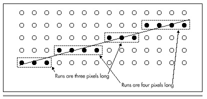
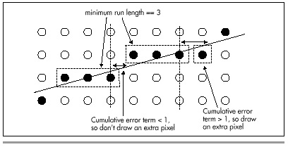

## Chapter 36 -- The Good, the Bad, and the Run-Sliced

### Faster Bresenham Lines with Run-Length Slice Line Drawing

Years ago, I worked at a company that asked me to write blazingly fast
line-drawing code for an AutoCAD driver. I implemented the basic
Bresenham's line-drawing algorithm; streamlined it as much as possible;
special-cased horizontal, diagonal, and vertical lines; broke out
separate, optimized routines for lines in each octant; and massively
unrolled the loops. When I was done, I had line drawing down to a mere
five or six instructions per pixel, and I handed the code over to the
AutoCAD driver person, content in the knowledge that I had pushed the
theoretical limits of the Bresenham's algorithm on the 80x86
architecture, and that this was as fast as line drawing could get on a
PC. That feeling lasted for about a week, until Dave Miller, who these
days is a Windows display-driver whiz at Engenious Solutions, casually
mentioned Bresenham's faster run-length slice line-drawing algorithm.

Remember Bill Murray's safety tip in *Ghostbusters*? It goes something
like this. Harold Ramis tells the Ghostbusters not to cross the beams of
the antighost guns. "Why?" Murray asks.

"It would be bad," Ramis says.

Murray says, "I'm fuzzy on the whole good/bad thing. What exactly do you
mean by ‘bad'?" It turns out that what Ramis means by bad is basically
the destruction of the universe.

"Important safety tip," Murray comments dryly.

I learned two important safety tips from my line-drawing experience;
neither involves the possible destruction of the universe, so far as I
know, but they are nonetheless worth keeping in mind. First, never,
never, never think you've written the fastest possible code. Odds are,
you haven't. Run your code past another good programmer, and he or she
will probably say, "But why don't you do this?" and you'll realize that
you could indeed do that, and your code would then be faster. Or relax
and come back to your code later, and you may well see another, faster
approach. There are a million ways to implement code for any task, and
you can almost always find a faster way if you need to.

Second, when performance matters, never have your code perform the same
calculation more than once. This sounds obvious, but it's astonishing
how often it's ignored. For example, consider this snippet of code:

```cpp
for (i=0; i<RunLength; i++)
{
   *WorkingScreenPtr = Color;
   if (XDelta > 0)
   {
      WorkingScreenPtr++;
   }
   else
   {
      WorkingScreenPtr--;
   }
}
```

Here, the programmer knows which way the line is going before the main
loop begins—but nonetheless performs that test every time through the
loop, when calculating the address of the next pixel. Far better to
perform the test only once, outside the loop, as shown here:

```cpp
if (XDelta > 0)
{
   for (i=0; i<RunLength; i++)
   {
      *WorkingScreenPtr++ = Color;
   }
}
else
{
   for (i=0; i<RunLength; i++)
   {
      *WorkingScreenPtr-- = Color;
   }
}
```

Think of it this way: A program is a state machine. It takes a set of
inputs and produces a corresponding set of outputs by passing through a
set of states. Your primary job as a programmer is to implement the
desired state machine. Your additional job as a performance programmer
is to minimize the lengths of the paths through the state machine. This
means performing as many tests and calculations as possible outside the
loops, so that the loops themselves can do as little work—that is, pass
through as few states—as possible.

Which brings us full circle to Bresenham's run-length slice line-drawing
algorithm, which just happens to be an excellent example of a minimized
state machine. In case you're fuzzy on the good/bad performance thing,
that's "good"—as in *fast*.

### Run-Length Slice Fundamentals

First off, I have a confession to make: I'm not sure that the algorithm
I'll discuss is actually, precisely Bresenham's run-length slice
algorithm. It's been a long time since I read about this algorithm; in
the intervening years, I've misplaced Bresenham's article, and have been
unable to unearth it. As a result, I had to derive the algorithm from
scratch, which was admittedly more fun than reading about it, and also
ensured that I understood it inside and out. The upshot is that what I
discuss may or may not be Bresenham's run-length slice algorithm—but it
surely is fast.

The place to begin understanding the run-length slice algorithm is the
standard Bresenham's line-drawing algorithm. (I discussed the standard
Bresenham's line-drawing algorithm at length in the previous chapter.)
The basis of the standard approach is stepping one pixel at a time along
the major axis (the longer dimension of the line), while maintaining an
integer error term that indicates at each major-axis step how close the
line is to advancing halfway to the next pixel along the minor axis.
Figure 36.1 illustrates standard Bresenham's line drawing. The key point
here is that a calculation and a test are performed once for each step
along the major axis.


The run-length slice algorithm rotates matters 90 degrees, with
salubrious results. The basis of the run-length slice algorithm is
stepping one pixel at a time along the minor axis (the shorter
dimension), while maintaining an integer error term indicating how close
the line is to advancing an extra pixel along the major axis, as
illustrated by Figure 36.2.

Consider this: When you're called upon to draw a line with an
X-dimension of 35 and a Y-dimension of 10, you have a great deal of
information available, some of which is ignored by standard Bresenham's.
In particular, because the slope is between 1/3 and 1/4, you know that
every single run—a *run* being a set of pixels at the same minor-axis
coordinate—must be either three or four pixels long. No other length is
possible, as shown in Figure 36.3 (apart from the first and last runs,
which are special cases that I'll discuss shortly). Therefore, for this
line, there's no need to perform an error-term calculation and test for
each pixel. Instead, we can just perform one test per run, to see
whether the run is three or four pixels long, thereby eliminating about
70 percent of the calculations in drawing this line.

Take a moment to let the idea behind run-length slice drawing soak in.
Periodic decisions must be made to control pixel placement. The key to
speed is to make those decisions as infrequently and as quickly as
possible. Of course, it will work to make a decision at each
pixel—that's standard Bresenham's. However, most of those per-pixel
decisions are redundant, and in fact we have enough information before
we begin drawing to know which are the redundant decisions. Run-length
slice drawing is exactly equivalent to standard Bresenham's, but it
pares the decision-making process down to a minimum. It's somewhat
analogous to the difference between finding the greatest common divisor
of two numbers using Euclid's algorithm and finding it by trying every
possible divisor. Both approaches produce the desired result, but that
which takes maximum advantage of the available information and minimizes
redundant work is preferable.




### Run-Length Slice Implementation

We know that for any line, a given run will always be one of two
possible lengths. How, though, do we know which length to select?
Surprisingly, this is easy to determine. For the following discussion,
assume that we have a slope of 1/3.5, so that X is the major axis;
however, the discussion also applies to Y-major lines, with X and Y
reversed.

The minimum possible length for any run in an X-major line is
`int(XDelta/YDelta)`, where `XDelta` is the X-dimension of the line
and `YDelta` is the Y-dimension. The maximum possible length is
`int(XDelta/YDelta)+ 1`. The trick, then, is knowing which of these
two lengths to select for each run. To see how we can make this
selection, refer to Figure 36.4. For each one-pixel step along the minor
axis (Y, in this case), we advance at least three pixels. The full
advance distance along X (the major axis) is actually three-plus pixels,
because there is also a fractional portion to the advance along X for a
single-pixel Y step. This fractional advance is the key to deciding when
to add an extra pixel to a run. The fraction indicates what portion of
an extra pixel we advance along X (the major axis) during each run. If
we keep a running sum of the fractional parts, we have a measure of how
close we are to needing an extra pixel; when the fractional sum reaches
1, it's time to add an extra pixel to the current run. Then, we can
subtract 1 from the running sum (because we just advanced one pixel),
and continue on.



Practically speaking, however, we can't work with fractions because
floating-point arithmetic is slow and fixed-point arithmetic is
imprecise. Therefore, we take a cue from standard Bresenham's and scale
all the error-term calculations up so that we can work with integers.
The fractional X (major axis) advance per one-pixel Y (minor axis)
advance is the fractional portion of `XDelta/YDelta`. This value is
exactly equivalent `to (XDelta % YDelta)/YDelta`. We'll scale this up
by multiplying it by `YDelta*2`, so that the amount by which we
adjust the error term up for each one-pixel minor-axis advance is
`(XDelta % YDelta)*2`.

We'll similarly scale up the one pixel by which we adjust the error term
down after it turns over, so our downward error-term adjustment is
`YDelta*2`. Therefore, before drawing each run, we'll add `(XDelta %
YDelta)*2` to the error term. If the error term runs over (reaches one
full pixel), we'll lengthen the run by 1, and subtract `YDelta*2`
from the error term. (All values are multiplied by 2 so that the initial
error term, which involves a 0.5 term, can be scaled up to an integer,
as discussed next.)

This is not a complicated process; it involves only integer addition and
subtraction and a single test, and it lends itself to many and varied
optimizations. For example, you could break out hardwired optimizations
for drawing each possible pair of run lengths. For the aforementioned
line with a slope of 1/3.5, for example, you could have one routine
hardwired to blast in a run of three pixels as quickly as possible, and
another hardwired to blast in a run of four pixels. These routines would
ideally have no looping, but rather just a series of instructions
customized to draw the desired number of pixels at maximum speed. Each
routine would know that the only possibilities for the length of the
next run would be three and four, so they could increment the error
term, then jump directly to the appropriate one of the two routines
depending on whether the error term turned over. Properly implemented,
it should be possible to reduce the average per-run overhead of line
drawing to less than one branch, with only two additions and two tests
(the number of runs must also be counted down), plus a subtraction half
the time. On a 486, this amounts to something on the order of 150
nanoseconds of overhead per pixel, exclusive of the time required to
actually write the pixel to display memory.

That's good.

### Run-Length Slice Details

A couple of run-length slice implementation details yet remain. First is
the matter of how error-term turnover is detected. This is done in much
the same way as it is with standard Bresenham's: The error term is
maintained as a negative valve and advances for each step; when the
error term reaches 0, it's time to add an extra pixel to the current
run. This means that we only have to test for carry after advancing the
error term to determine whether or not to add an extra pixel to each
run. (Actually, the code in this chapter tests for the error term being
greater than zero, but the assembly code in the next chapter will use
the very efficient carry approach.)

The second and more difficult detail is balancing the runs so that
they're centered around the ideal line, and therefore draw the same
pixels that standard Bresenham's would draw. If we just drew full-length
runs from the start, we'd end up with an unbalanced line, as shown in
Figure 36.5. Instead, we have to split the initial pixel plus one full
run as evenly as possible between the first and last runs of the line,
and adjust the initial error term appropriately for the initial
half-run.

The initial error term is advanced by one-half of the normal per-step
fractional advance, because the initial step is only one-half pixel
along the minor axis. This half-step gets us exactly halfway between the
initial pixel and the next pixel along the minor axis. All the
error-term adjustments are scaled up by two times precisely so that we
can scale up this halved error term for the initial run by two times,
and thereby make it an integer.

The other trick here is that if an odd number of pixels are allocated
between the first and last partial runs, we'll end up with an odd pixel,
since we are unable to draw a half-pixel. This odd pixel is accounted
for by adding half a pixel to the error term.

That's all there is to run-length slice line drawing; the partial first
and last runs are the only tricky part. Listing 36.1 is a run-length
slice implementation in C. This is not an optimized implementation, nor
is it meant to be; this listing is provided so that you can see how the
run-length slice algorithm works. In the next chapter, I'll move on to
an optimized version, but for now, Listing 36.1 will make it much easier
to grasp the principles of run-length slice drawing, and to understand
the optimized code I'll present in the next chapter.


**LISTING 36.1 L36-1.C**

```c
/* Run-length slice line drawing implementation for mode 0x13, the VGA's
320x200 256-color mode. Not optimized! Tested with Borland C++ in
the small model. */

#include <dos.h>

#define SCREEN_WIDTH    320
#define SCREEN_SEGMENT  0xA000

void DrawHorizontalRun(char far **ScreenPtr, int XAdvance, int RunLength,
                 int Color);
void DrawVerticalRun(char far **ScreenPtr, int XAdvance, int RunLength,
                  int Color);
/* Draws a line between the specified endpoints in color Color. */
void LineDraw(int XStart, int YStart, int XEnd, int YEnd, int Color)
{
   int Temp, AdjUp, AdjDown, ErrorTerm, XAdvance, XDelta, YDelta;
   int WholeStep, InitialPixelCount, FinalPixelCount, i, RunLength;
   char far *ScreenPtr;

   /* We'll always draw top to bottom, to reduce the number of cases we have to
   handle, and to make lines between the same endpoints draw the same pixels */
   if (YStart > YEnd) {
      Temp = YStart;
      YStart = YEnd;
      YEnd = Temp;
      Temp = XStart;
      XStart = XEnd;
      XEnd = Temp;
   }
   /* Point to the bitmap address first pixel to draw */
   ScreenPtr = MK_FP(SCREEN_SEGMENT, YStart * SCREEN_WIDTH + XStart);

   /* Figure out whether we're going left or right, and how far we're
      going horizontally */
   if ((XDelta = XEnd - XStart) < 0)
   {
      XAdvance = -1;
      XDelta = -XDelta;
   }
   else
   {
      XAdvance = 1;
   }
   /* Figure out how far we're going vertically */
   YDelta = YEnd - YStart;

   /* Special-case horizontal, vertical, and diagonal lines, for speed
      and to avoid nasty boundary conditions and division by 0 */
   if (XDelta == 0)
   {
      /* Vertical line */
      for (i=0; i<=YDelta; i++)
      {
         *ScreenPtr = Color;
         ScreenPtr += SCREEN_WIDTH;
      }
      return;
   }
   if (YDelta == 0)
   {
      /* Horizontal line */
      for (i=0; i<=XDelta; i++)
      {
         *ScreenPtr = Color;
         ScreenPtr += XAdvance;
      }
      return;
   }
   if (XDelta == YDelta)
   {
      /* Diagonal line */
      for (i=0; i<=XDelta; i++)
      {
         *ScreenPtr = Color;
         ScreenPtr += XAdvance + SCREEN_WIDTH;
      }
      return;
   }

   /* Determine whether the line is X or Y major, and handle accordingly */
   if (XDelta >= YDelta)
   {
      /* X major line */
      /* Minimum # of pixels in a run in this line */
      WholeStep = XDelta / YDelta;

      /* Error term adjust each time Y steps by 1; used to tell when one
         extra pixel should be drawn as part of a run, to account for
         fractional steps along the X axis per 1-pixel steps along Y */
      AdjUp = (XDelta % YDelta) * 2;

      /* Error term adjust when the error term turns over, used to factor
         out the X step made at that time */
      AdjDown = YDelta * 2;

      /* Initial error term; reflects an initial step of 0.5 along the Y
         axis */
      ErrorTerm = (XDelta % YDelta) - (YDelta * 2);

      /* The initial and last runs are partial, because Y advances only 0.5
         for these runs, rather than 1. Divide one full run, plus the
         initial pixel, between the initial and last runs */
      InitialPixelCount = (WholeStep / 2) + 1;
      FinalPixelCount = InitialPixelCount;

      /* If the basic run length is even and there's no fractional
         advance, we have one pixel that could go to either the initial
         or last partial run, which we'll arbitrarily allocate to the
         last run */
      if ((AdjUp == 0) && ((WholeStep & 0x01) == 0))
      {
         InitialPixelCount--;
      }
      /* If there're an odd number of pixels per run, we have 1 pixel that can't
         be allocated to either the initial or last partial run, so we'll add 0.5
         to error term so this pixel will be handled by the normal full-run loop */
         if ((WholeStep & 0x01) != 0)
      {
         ErrorTerm += YDelta;
      }
      /* Draw the first, partial run of pixels */
      DrawHorizontalRun(&ScreenPtr, XAdvance, InitialPixelCount, Color);
      /* Draw all full runs */
      for (i=0; i<(YDelta-1); i++)
      {
         RunLength = WholeStep;  /* run is at least this long */
         /* Advance the error term and add an extra pixel if the error
            term so indicates */
         if ((ErrorTerm += AdjUp) > 0)
         {
            RunLength++;
            ErrorTerm -= AdjDown;   /* reset the error term */
         }
         /* Draw this scan line's run */
         DrawHorizontalRun(&ScreenPtr, XAdvance, RunLength, Color);
      }
      /* Draw the final run of pixels */
      DrawHorizontalRun(&ScreenPtr, XAdvance, FinalPixelCount, Color);
      return;
   }
   else
   {
      /* Y major line */

      /* Minimum # of pixels in a run in this line */
      WholeStep = YDelta / XDelta;

      /* Error term adjust each time X steps by 1; used to tell when 1 extra
         pixel should be drawn as part of a run, to account for
         fractional steps along the Y axis per 1-pixel steps along X */
      AdjUp = (YDelta % XDelta) * 2;

      /* Error term adjust when the error term turns over, used to factor
         out the Y step made at that time */
      AdjDown = XDelta * 2;

      /* Initial error term; reflects initial step of 0.5 along the X axis */
      ErrorTerm = (YDelta % XDelta) - (XDelta * 2);

      /* The initial and last runs are partial, because X advances only 0.5
         for these runs, rather than 1. Divide one full run, plus the
         initial pixel, between the initial and last runs */
      InitialPixelCount = (WholeStep / 2) + 1;
      FinalPixelCount = InitialPixelCount;

      /* If the basic run length is even and there's no fractional advance, we
         have 1 pixel that could go to either the initial or last partial run,
         which we'll arbitrarily allocate to the last run */
      if ((AdjUp == 0) && ((WholeStep & 0x01) == 0))
      {
         InitialPixelCount--;
      }
      /* If there are an odd number of pixels per run, we have one pixel
         that can't be allocated to either the initial or last partial
         run, so we'll add 0.5 to the error term so this pixel will be
         handled by the normal full-run loop */
      if ((WholeStep & 0x01) != 0)
      {
         ErrorTerm += XDelta;
      }
      /* Draw the first, partial run of pixels */
      DrawVerticalRun(&ScreenPtr, XAdvance, InitialPixelCount, Color);

      /* Draw all full runs */
      for (i=0; i<(XDelta-1); i++)
      {
         RunLength = WholeStep;  /* run is at least this long */
         /* Advance the error term and add an extra pixel if the error
            term so indicates */
         if ((ErrorTerm += AdjUp) > 0)
         {
            RunLength++;
            ErrorTerm -= AdjDown;   /* reset the error term */
         }
         /* Draw this scan line's run */
         DrawVerticalRun(&ScreenPtr, XAdvance, RunLength, Color);
      }
      /* Draw the final run of pixels */
      DrawVerticalRun(&ScreenPtr, XAdvance, FinalPixelCount, Color);
      return;
   }
}
/* Draws a horizontal run of pixels, then advances the bitmap pointer to
   the first pixel of the next run. */
void DrawHorizontalRun(char far **ScreenPtr, int XAdvance,
   int RunLength, int Color)
{
   int i;
   char far *WorkingScreenPtr = *ScreenPtr;

   for (i=0; i<RunLength; i++)
   {
      *WorkingScreenPtr = Color;
      WorkingScreenPtr += XAdvance;
   }
   /* Advance to the next scan line */
   WorkingScreenPtr += SCREEN_WIDTH;
   *ScreenPtr = WorkingScreenPtr;
}
/* Draws a vertical run of pixels, then advances the bitmap pointer to
   the first pixel of the next run. */
void DrawVerticalRun(char far **ScreenPtr, int XAdvance,
   int RunLength, int Color)
{
   int i;
   char far *WorkingScreenPtr = *ScreenPtr;

   for (i=0; i<RunLength; i++)
   {
      *WorkingScreenPtr = Color;
      WorkingScreenPtr += SCREEN_WIDTH;
   }
   /* Advance to the next column */
   WorkingScreenPtr += XAdvance;
   *ScreenPtr = WorkingScreenPtr;
}
```

Notwithstanding that it's not optimized, Listing 36.1 is reasonably
fast. If you run Listing 36.2 (a sample line-drawing program that you
can use to test-drive Listing 36.1), you may be as surprised as I was at
how quickly the screen fills with vectors, considering that Listing 36.1
is entirely in C and has some redundant divides. Or perhaps you won't be
surprised—in which case I suggest you *not* miss the next chapter.

**LISTING 36.2 L36-2.C**

```c
/* Sample line-drawing program. Uses the optimized
line-drawing functions coded in LListing L36.1.C.
Tested with Borland C++ in the small model. */

#include <dos.h>

#define GRAPHICS_MODE   0x13
#define TEXT_MODE       0x03
#define BIOS_VIDEO_INT  0x10
#define X_MAX           320      /* working screen width */
#define Y_MAX           200      /* working screen height */

extern void LineDraw(int XStart, int YStart, int XEnd, int YEnd, int Color);

/* Subroutine to draw a rectangle full of vectors, of the specified
 * length and color, around the specified rectangle center.  */
void VectorsUp(XCenter, YCenter, XLength, YLength, Color)
int XCenter, YCenter;   /* center of rectangle to fill */
int XLength, YLength;   /* distance from center to edge of rectangle */
int Color;              /* color to draw lines in */
{
   int WorkingX, WorkingY;

   /* lines from center to top of rectangle */
   WorkingX = XCenter - XLength;
   WorkingY = YCenter - YLength;
   for ( ; WorkingX < ( XCenter + XLength ); WorkingX++ )
   {
      LineDraw(XCenter, YCenter, WorkingX, WorkingY, Color);
   }
   /* lines from center to right of rectangle */
   WorkingX = XCenter + XLength - 1;
   WorkingY = YCenter - YLength;
   for ( ; WorkingY < ( YCenter + YLength ); WorkingY++ )
   {
      LineDraw(XCenter, YCenter, WorkingX, WorkingY, Color);
   }
   /* lines from center to bottom of rectangle */
   WorkingX = XCenter + XLength - 1;
   WorkingY = YCenter + YLength - 1;
   for ( ; WorkingX >= ( XCenter - XLength ); WorkingX-- )
   {
      LineDraw(XCenter, YCenter, WorkingX, WorkingY, Color);
   }
   /* lines from center to left of rectangle */
   WorkingX = XCenter - XLength;
   WorkingY = YCenter + YLength - 1;
   for ( ; WorkingY >= ( YCenter - YLength ); WorkingY-- )
   {
      LineDraw(XCenter, YCenter, WorkingX, WorkingY, Color);
   }
}
/* Sample program to draw four rectangles full of lines.  */
int main()
{
   union REGS regs;

   /* Set graphics mode */
   regs.x.ax = GRAPHICS_MODE;
   int86(BIOS_VIDEO_INT, &regs, &regs);

   /* Draw each of four rectangles full of vectors */
   VectorsUp(X_MAX / 4, Y_MAX / 4, X_MAX / 4, Y_MAX / 4, 1);
   VectorsUp(X_MAX * 3 / 4, Y_MAX / 4, X_MAX / 4, Y_MAX / 4, 2);
   VectorsUp(X_MAX / 4, Y_MAX * 3 / 4, X_MAX / 4, Y_MAX / 4, 3);
   VectorsUp(X_MAX * 3 / 4, Y_MAX * 3 / 4, X_MAX / 4, Y_MAX / 4, 4);

   /* Wait for a key to be pressed */
   getch();

   /* Return back to text mode */
   regs.x.ax = TEXT_MODE;
   int86(BIOS_VIDEO_INT, &regs, &regs);
}
```
